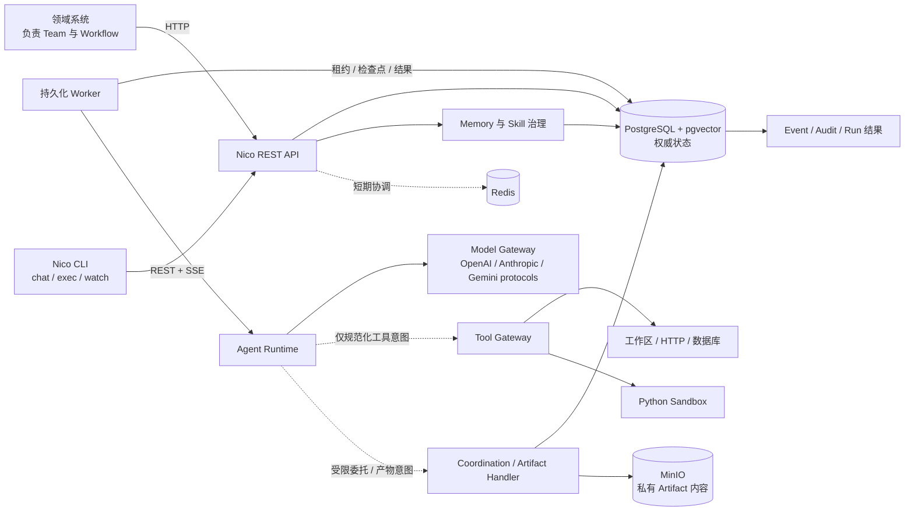

<div align="center">
  
  <h1>Nico Agent</h1>
  <p><strong>面向可靠执行与受控成长的自托管 Agent Runtime。</strong></p>
  <p>让 Agent 的运行可恢复、工具访问受治理、状态可审计，Memory 与 Skill 的发布经过验证。</p>
  <p>
    <a href="#quick-start">快速开始</a> ·
    <a href="docs/getting-started.md">使用文档</a> ·
    <a href="SECURITY.md">安全说明</a>
  </p>
  <a href="https://github.com/Phlosy/Nico-agent/actions/workflows/ci.yml">
    
  </a>
</div>

> [!WARNING]
> **项目状态：Experimental Alpha。** API 和数据库结构可能发生不兼容变更。Nico 尚未提供 API Key、JWT 或其他正式调用方认证，不具备生产就绪条件。请仅在本机或受信网络中运行，切勿将控制面直接暴露到公网。

## Nico 是什么？

Nico Agent 是一个自托管的 Agent Runtime 与服务平台。领域系统通过 HTTP API 发布不可变的 Agent 定义、创建 Task 和 Run、交由持久化 Worker 执行，并查询结果、事件以及管理可复用的 Memory 和 Skill 版本。

Nico 关注单个 Agent 以及动态协作的多个 Agent 如何可靠执行，包括权限、持久化状态、Runtime 隔离、受控工具、父子 Run、故障恢复、审计和受审核的成长。Nico 不规定固定的 Team、角色层级、业务 Workflow、交易规则或科研流程。量化、科研、内容生产和企业系统负责定义业务组织与流程，并调用相应的 Nico Agent。

当前 Alpha 已实现 Nico Native Direct、可恢复 ReAct、Plan/Reflection、动态多 Agent 委托、私有共享 Artifact、模型调用事实、SSE、AgentVersion、Task/Run、ToolCall、Event/Audit，以及 Memory 和 Skill 生命周期。Nico Native 可独立运行，不依赖 Hermes。

## 为什么需要 Nico？

Agent 应用通常从一个进程内循环开始。当它作为长期运行的服务使用时，会出现另一组问题：

| 实际问题 | Nico 当前的处理方式 |
| --- | --- |
| Agent 配置变化难以追踪 | 使用不可变 AgentVersion，并通过发布和回滚指针切换版本 |
| Worker 故障后长任务丢失状态 | 使用 PostgreSQL 持久化 Run、租约、检查点、重试和恢复条件 |
| Runtime 原生工具绕过权限与审计 | 统一通过 Tool Gateway 完成授权、Schema、限额、幂等和 ToolCall 记录 |
| 一次错误运行污染长期记忆 | Run 只能生成 Candidate，通过验证和独立审批前不可使用 |
| Skill 变更缺少安全发布与回滚 | 使用不可变 SkillVersion、版本比较、灰度解析、推广、禁用和指针回滚 |
| 多租户数据可能发生串扰 | 使用 TenantContext、同租户复合约束和 PostgreSQL `FORCE ROW LEVEL SECURITY` |
| 不同业务重复建设 Agent 基础设施 | 提供领域无关的 HTTP 控制面与 Runtime Provider 边界 |
| 固定的多 Agent 组织方式难以复用 | Team 和 Workflow 由上层领域系统定义，不进入 Nico 核心 |

### 项目定位

Nico 并不替代 LangChain、AutoGen、CrewAI 或其他应用编排框架。这些项目可以在应用内定义 Prompt、图、对话或固定业务协作；Nico 提供领域无关的动态委托、父子 Run、消息与共享产物，并处理持久化执行、工具治理、租户隔离、审计，以及 Memory/Skill 受控发布。

Nico 当前没有这些框架的内置适配器。领域应用可以通过 HTTP 调用 Nico；未来也可以新增 Runtime Adapter 接入其他执行引擎，同时避免执行引擎直接访问受控工具或权威业务状态。

## 核心能力

- **不可变 AgentVersion** — 发布后冻结角色、职责、边界、模型设置、工具策略、预算和 Runtime 配置，并保留历史版本用于回滚。
- **Nico Native Runtime** — 新 AgentVersion 默认使用内置 `nico_native` Direct 模式，通过统一模型网关完成流式推理，无需依赖 Hermes。
- **规划、反思与恢复** — 支持有界 Plan DAG、不可覆盖的 Plan revision、步骤验证、Reflection/Replan、Completion Evaluation 和带完整性校验的恢复检查点。
- **动态多 Agent 协作** — Parent 可按策略委托多个 Child Run；平台持久化父子关系、消息、预算预留、权限收缩、挂起/唤醒、重试请求和整树取消，但不固化 Team 或 Workflow。
- **模型调用事实** — 按 Run 保存可审计的 ContextSnapshot、ModelCall、usage、cost、请求 ID、检查点和可续传 SSE 事件。
- **可恢复的 Task 与 Run** — 持久化 Task、Run、RunStep、RuntimeSession、检查点、结果、取消、超时、重试和规范化轨迹。
- **受控 Tool Gateway** — 默认拒绝工具调用，按精确版本执行 Tenant ∩ AgentVersion 策略、Schema 校验、幂等、超时、重试、输出限制、Secret 解析和审计。
- **Run 工作区与共享 Artifact** — 工作区按 Tenant/Run 隔离；Artifact 内容寻址后写入私有 MinIO，元数据留在 PostgreSQL，只能按显式 Child→Parent 链接受控读取。
- **受治理的 Memory** — 从终态 Run 事实生成 Memory Candidate，经过验证和独立审批后才能发布；支持按授权作用域检索、失效、过期和 tombstone。
- **版本化 Skill 生命周期** — 比较不可变 SkillVersion 修订，完成验证、审批、Project/Agent 灰度、推广、弃用、禁用和回滚。
- **每次 Run 冻结知识上下文** — 按 Tenant ∩ AgentVersion 策略选择已发布 Memory/Skill，以精确版本与 Hash 注入为不可信数据，并追踪它们是否进入 Context、ModelCall 和后续成长来源。
- **Tenant 与 Project 隔离** — 组合应用层 TenantContext、同租户约束、数据库角色和 PostgreSQL RLS。
- **事件与审计** — 持久化追加式 Run Event、ToolCall、审计操作、请求关联 ID、结构化日志和依赖健康状态。

## 快速体验

启动服务后，运行不需要外部模型凭据的端到端示例：

```bash
scripts/demo.sh
```

脚本会创建或复用 Demo Tenant、Project、Agent 和已发布的 AgentVersion，然后创建新的 Task/Run，并等待 PostgreSQL 支持的 Worker 和 Mock Runtime 完成执行：

```text
Nico Demo completed
-------------------
Status:    completed
Runtime:   mock 1.0
Result:
{
  "message": "Nico completed a recoverable, auditable demo Run.",
  "runtime": "mock",
  "summary": "AgentVersion -> Task -> Run -> Worker -> Result"
}
Artifact:  not produced by this Mock Runtime demo
```

脚本会输出真实的 Run ID、执行结果、事件数量、Tenant ID 和查询地址。可复用的资源 ID 保存在已被 Git 忽略的 `.nico/demo-state.json` 中。

当前 Console 展示实时基础设施状态，并提供只读 Run Inspector。输入 Tenant ID 与 Run ID 后，可按“状态与结果 → 步骤与模型用量 → Plan → Child tree → 消息与 Artifact → 预算与审计”的顺序查看已脱敏事实；Console 不提供写操作，也不显示隐藏推理或 Secret。

<a id="quick-start"></a>

## 快速开始

### 环境要求

- Docker Engine 和 Docker Compose 2.24.4 或更高版本
- Python 3.11 或更高版本，以及 `bash` 和 `curl`
- Linux 环境下需要访问 Docker；`sandbox-runner` 会挂载 `/var/run/docker.sock`

### 一条命令安装服务与 CLI

```bash
curl -fsSL https://github.com/Phlosy/Nico-agent/releases/latest/download/install.sh | bash
```

安装固定版本（例如 `v0.2.0`）：

```bash
curl -fsSL https://github.com/Phlosy/Nico-agent/releases/download/v0.2.0/install.sh \
  | bash -s -- --version v0.2.0
```

安装器会校验 Release bundle、生成私有部署配置、安装 `nico` 与
`nico-service`、启动默认的 Nico Native 栈，并创建可复用的本地 CLI
Profile、Tenant 和 Project。它不会在安装过程中索取模型密钥；首次版本 Tag
成功发布后，上述稳定地址才会存在。

检查服务和查看日志：

```bash
nico-service doctor
nico-service status
nico-service logs
```

服务入口：

- Console：<http://localhost:18080>
- Swagger UI：<http://localhost:18000/docs>
- OpenAPI：<http://localhost:18000/openapi.json>

安装器最后只输出一个后续命令：

```bash
nico setup
```

该向导会在本机隐藏读取 API Key、真实执行一次 Provider completion 验证、显示
即将创建的 endpoint/AgentVersion 预览，并在确认后原子发布可聊天路由。完整
安装、固定版本、Hermes、升级和移除说明见
[安装与部署](docs/installation.md)。

### 发布前在本地运行同一安装链路

无需先创建 GitHub Release。`make release` 会在本机构建三个版本化镜像、
真实 CLI wheel、安装器、bundle 和 `SHA256SUMS`；`make install` 使用同一个
`install.sh` 安装并启动它们：

```bash
make release
make install
```

也可以只运行 `make install`。如果当前版本的完整资产或本地镜像不存在，它会
先自动执行 `make release`；都存在时则直接复用。这个目标不会创建 Git Tag、
不会上传 GitHub，也不会从 GHCR 拉取镜像。为了不接管正在运行的源码开发栈，
本地安装使用独立的 `nico-agent-local-release` Compose 项目；API 和 Web 默认在
<http://localhost:28000> 与 <http://localhost:28080>。只验证安装而不启动服务：

```bash
make install INSTALL_ARGS="--no-start --non-interactive"
```

本地验证 Hermes 安装链路：

```bash
OPENROUTER_API_KEY='<secret>' \
  make install RUNTIME=hermes PROVIDER=openrouter
```

停止本地 Release 服务并移除 `~/.nico` 与对应命令链接（保留 Docker 数据卷）：

```bash
make uninstall
```

### 从源码启动（贡献者）

```bash
cp .env.example .env
scripts/dev.sh --detach
```

API 启动前会自动执行 Alembic 数据库迁移。获得第一个持久化 Run 结果：

```bash
scripts/demo.sh
```

停止源码部署并保留数据：

```bash
scripts/cleanup.sh
```

完整首次运行流程参见[快速入门](docs/getting-started.md)，常见问题参见[故障排查](docs/troubleshooting.md)。

### Nico CLI 与持续对话

Release 安装器已经同时安装 CLI。源码开发时可以单独安装当前仓库版本：

```bash
python3 -m venv .venv
.venv/bin/pip install ./backend
.venv/bin/nico health
```

配置 `scripts/demo.sh` 输出的 Tenant ID 后，可以查询真实的服务端资源和 Run：

```bash
nico config set local --api-url http://localhost:18000 --tenant-id <tenant-id>
nico config use local
nico doctor
nico agent list
nico run get <run-id>
```

CLI 也可以新建持久化 Conversation、提交消息并实时观看 Worker 的执行事件：

```bash
nico chat --project <project-id> --agent <agent-id> "分析这份任务并给出结论"
nico chat --continue "继续验证上一轮结论"
nico exec "生成一次性研究报告" --project <project-id> --agent <agent-id>
nico exec "生成日报" --project <project-id> --agent <agent-id> --detach --json
nico run watch <run-id>
nico conversation list
nico conversation history <conversation-id>
nico chat --resume <conversation-id> --read-only
```

首次 Native 配置和后续 Provider 管理使用同一套流程：

```bash
nico setup
nico provider add openai
nico provider configure openai
nico provider test openai
nico provider list
nico provider list --models openai --limit 20
```

当前内置 OpenAI、Anthropic、Google Gemini、OpenRouter、xAI、DeepSeek、阿里云
百炼/Qwen、Moonshot/Kimi、智谱 GLM 和 MiniMax 预设。交互模式允许隐藏输入仅存
于本机 Native Worker 的新 Key，也可输入 `env:NICO_MODEL_SECRET_*` 或
`secret:*` 引用。自动化模式必须显式提供引用、模型、Project、Agent/Starter
以及 `--yes`，不存在接受明文 Key 的命令行选项。

交互模式还可以把本地文件按字节暂存到下一轮、压缩较早历史并下载该会话引用的产物：

```text
/attach ./research-notes.md
请结合附件继续分析
/compact
/artifacts
/download <artifact-id> ./result.md
```

Nico CLI 是远程薄客户端：chat 和 exec 都由服务端原子创建 ConversationTurn、Task 和 Run，独立 Worker 执行，CLI 仅通过 REST/SSE 显示持久化事实。关闭终端不会删除会话或 detached Run；`--resume`、`--continue` 和 `run watch` 可重新连接。chat 执行期间按 `Ctrl+C` 会请求服务端取消当前 Run；watch 中按 `Ctrl+C` 只停止本地观察。

当前已提供 health、doctor、profile、Project/Agent/Task/Run 查询、持久化 chat、`nico exec`、`nico run watch`、Rich 执行视图、终端 coin-cat、受控附件、Conversation summary、有界上下文压缩，以及敏感工具的持久化人工审批。完整说明见 [Nico CLI](docs/cli.md)。

## 工作原理



PostgreSQL 是业务状态、Run 队列、委托、消息、预算和 Artifact 元数据的权威来源。Redis 不能成为 Run 状态的唯一来源；当前用于健康检查和模型请求分布式限流，并为短期通知与未来事件扇出预留。MinIO 只保存私有 Artifact 字节，不向 Runtime 暴露凭据或对象键。

Runtime 负责执行 Agent 并返回规范化事件和结果。它不能导入工具 Executor、持有 Nico 数据库 Session，或绕过 Tool Gateway。完整设计参见[架构说明](docs/architecture.md)。

## 支持状态

以下状态表示实现和验证程度，不代表整个项目已经生产就绪：

- **Stable** — 确定性合同已通过单元、集成和 Compose 端到端测试。
- **Beta** — 已实现并经过测试，但公开合同仍可能变化。
- **Experimental** — 已实现基础边界，但运行环境或验收仍存在缺口。
- **Planned** — 已记录方向，目前没有可用实现。
- **Not Supported** — 明确不属于 Nico 核心职责。

| 能力 | 状态 | 当前证据或限制 |
| --- | --- | --- |
| Nico Native Direct | Beta | Hermetic OpenAI-compatible 流式 E2E 已通过；真实运营模型端点验收仍需操作者凭据 |
| Nico Native ReAct | Beta | 多轮 Tool Gateway、checkpoint、Worker SIGKILL 恢复和副作用重放保护已通过 hermetic E2E；真实运营模型工具调用仍待凭据验收 |
| Nico Native Plan/Reflection | Beta | Plan revision、步骤验证、Reflection/Replan、确定性 Completion 和独立计费 judge 已通过 hermetic E2E |
| 动态多 Agent 协作 | Beta | 两个并行 Child、预算/权限收缩、Parent 挂起唤醒、Worker SIGKILL 恢复、消息和聚合已通过 Compose E2E |
| Model Gateway | Beta | OpenAI-compatible、Anthropic Messages 与 Google Gemini 适配器已覆盖 IP 固定、HTTPS/allowlist、Secret 引用、流式解析、发现、重试、分布式限流和脱敏 |
| Mock Runtime | Stable | 已覆盖无需凭据的成功、失败、取消、恢复合同与 Compose Run E2E |
| Hermes Runtime | Experimental | 协议 v2 Adapter、禁用时失败关闭、0.18.2 版本检查、恢复/取消/MCP/脱敏及可选 Compose profile 已验证；未执行带凭据推理 |
| PostgreSQL RLS | Beta | 已实现 `FORCE RLS`、复合约束、运行角色和跨租户测试 |
| Nico CLI | Beta | chat、exec/detach/watch、resume/continue/history、summary/context snapshot、attach/download/compact、敏感工具审批与恢复、Rich/coin-cat、JSON/no-color 和 SIGINT 语义已通过真实服务测试 |
| Python Sandbox | Beta | 已通过真实一次性 Docker 隔离测试；Runner 仍持有 Docker Socket |
| HTTP Read | Beta | 已实现 GET/HEAD、白名单、DNS/IP、重定向、大小控制和 SSRF 测试 |
| Database Read | Beta | 已实现参数化 SELECT/WITH、最小权限角色检查和行数、时间、输出限制 |
| Memory Publication | Beta | 已通过 Candidate → Evaluation → 独立 Approval → 发布与检索 E2E |
| Skill Promotion | Beta | 已通过不可变修订、灰度、推广、禁用和回滚 E2E |
| Runtime Knowledge | Beta | 已通过已发布 Memory/Skill 召回、版本冻结、候选排除、效果追踪与成长来源 E2E |
| Worker 横向扩展 | Experimental | 已有租约和有界并发机制，但尚未完成多副本部署验收 |
| 正式 API 身份认证 | Planned | 尚无 API Key、JWT、OAuth 或 mTLS 调用方身份 |
| 共享 Artifact 最小生命周期/API | Beta | 内容寻址、私有 MinIO、Hash/size 校验、Run 列表/下载、Child→Parent 授权和 sibling 拒绝已通过 |
| SSE Event Stream | Beta | 支持 Tenant 隔离与 `Last-Event-ID` 断线续传；当前使用数据库轮询 |
| Kubernetes 部署 | Planned | 没有 Manifest、Helm Chart 或 NetworkPolicy |
| Team/Workflow 引擎 | Not Supported | 由调用 Nico 的领域系统负责 |

## 支持的 Runtime 与工具

### Runtime

| Runtime | 用途 | 主要限制 |
| --- | --- | --- |
| `nico_native` `0.2.0` | 内置 Direct、可恢复 ReAct、Plan/Reflection 与动态多 Agent 协作，默认正式 Runtime | 模型质量与外部运营端点仍需由部署方验收 |
| `mock` `1.0` | 确定性的本地、Demo 和测试执行 | 当 `NICO_ENVIRONMENT=production` 时禁用 |
| `hermes` `0.18.2` | 可选 CLI Adapter；协议 v2 Direct、历史 session resume、取消与 Nico MCP | 默认镜像不安装或注册；使用 `hermes` profile 构建固定版本镜像，仍需单独配置模型 Provider 凭据 |

### 可选 Hermes Adapter

Release 安装使用同一个入口选择 Hermes，并确保 Native Worker 不会同时运行：

```bash
curl -fsSL https://github.com/Phlosy/Nico-agent/releases/latest/download/install.sh \
  | bash -s -- --runtime hermes --provider openrouter
```

Provider Key 从已有环境变量或隐藏提示读取，不作为命令参数。已有
AgentVersion 仍需明确选择 `runtime_provider=hermes`。源码部署默认只启动
Native-first Worker；贡献者可以手工切换：

```bash
docker compose stop worker
docker compose --profile hermes up --detach --build worker-hermes
```

`worker-hermes` 使用独立的 [Dockerfile.hermes](backend/Dockerfile.hermes)，固定安装 `hermes-agent[mcp]==0.18.2`。版本缺失或不匹配、Adapter 未启用时，Run 会以明确错误失败，绝不会回退到 `nico_native`。Hermes 仍是实验性兼容 Adapter，不是 Nico Native 的运行依赖。

### 内置工具

| 工具 | 能力 | 主要安全限制 |
| --- | --- | --- |
| `file.read@1.0.0` | 读取 Run 工作区文件 | 拒绝路径穿越、链接、特殊文件和配额违规 |
| `file.write@1.0.0` | 原子写入工作区文件 | 限制单文件大小和工作区总量 |
| `report.write@1.0.0` | 写入 Markdown 或规范化 JSON 报告 | 仅允许指定格式和 Run 工作区路径 |
| `http.read@1.0.0` | 执行 HTTP GET/HEAD | 域名白名单、SSRF 检查、重定向和响应大小限制 |
| `database.read@1.0.0` | 执行参数化只读查询 | 使用独立最小权限数据源；仅允许单条 SELECT/WITH，并限制行数、时间和输出 |
| `python.execute@1.0.0` | 执行受限 Python | 一次性非 root 容器、无网络、只读根目录，并限制 CPU、内存、PID、时间和输出 |

工具默认拒绝。有效权限是 Tenant 策略与不可变 AgentVersion 策略的交集。Secret 通过逻辑引用在 Tool Gateway 内解析，不会进入 Prompt、Event、轨迹或 API 输出。详细说明参见[Tool Gateway 与 Sandbox](docs/tool-gateway.md)。

## 安全边界

- 本地 `X-Tenant-ID`/`X-Actor-ID` 上下文不是身份认证。
- 控制面必须只运行在本机或受信网络中。
- PostgreSQL RLS 只能提供纵深防御，不能验证调用方身份。
- Runtime 只能通过 Tool Gateway 请求工具。
- Python 在受限的一次性容器中执行，但 Sandbox Runner 因挂载 Docker Socket，仍是宿主机敏感组件。
- 工具 Secret 使用引用，并在执行时解析和递归脱敏。
- Memory 和 Skill 发布需要验证，以及绑定相同内容 Hash 的独立 Approval。

在个人电脑以外部署前，请先阅读[安全与部署边界](docs/security.md)。安全漏洞必须按照 [SECURITY.md](SECURITY.md) 使用私密渠道报告，切勿在公开 Issue 中披露。

## CI 与版本发布

GitHub Actions 将测试与发布分开，普通合并不会意外创建 Release：

| Git 事件 | 自动执行 |
| --- | --- |
| 面向 `main` 的 Pull Request | 后端与前端测试、构建、安装/发布合同测试、Workflow 和 Markdown 检查 |
| Push 或 merge 到 `main` | 执行同一套 `Test` CI，不发布镜像或 Release |
| Push `v*` Tag | 复用 `Test` CI，校验 Tag 与 Python 包版本一致，构建多架构 GHCR 镜像并发布安装器、校验和及 Release bundle |

创建正式版本时，先确保对应提交已进入 `main`，并让 Tag 与
`backend/pyproject.toml` 中的版本一致：

```bash
git tag v0.2.0
git push origin v0.2.0
```

首次 Release 完成后，还应确认三个 GHCR Package 允许匿名拉取，再公开推荐
一键安装命令。工作流定义见 [Test](.github/workflows/ci.yml) 和
[Release](.github/workflows/release.yml)，发布细节见[安装与部署](docs/installation.md)。

## 文档

- [安装与部署](docs/installation.md)
- [快速入门](docs/getting-started.md)
- [配置说明](docs/configuration.md)
- [REST API](docs/api.md)
- [架构说明](docs/architecture.md)
- [Runtime 与 Worker](docs/runtime.md)
- [Tool Gateway 与 Sandbox](docs/tool-gateway.md)
- [Memory 与 Skill](docs/memory-and-skill.md)
- [领域模型](docs/domain-model.md)
- [安全边界](docs/security.md)
- [故障排查](docs/troubleshooting.md)
- [产品路线图](docs/roadmap.md)

## 路线图

已经实现的基础能力：

- [x] 不可变 AgentVersion 与持久化 Task/Run 执行
- [x] 受控工具、隔离 Python、Event/Audit 和租户 RLS
- [x] 受治理的 Memory 与版本化 Skill 生命周期
- [x] Nico Native Direct、模型调用事实与可续传 SSE
- [x] 可恢复 ReAct、Plan/Reflection 与动态多 Agent 委托
- [x] 私有内容寻址 Artifact 与 Child→Parent 受控共享
- [x] 本地 Compose、状态页、只读 Run Inspector 和无需凭据的 Demo
- [x] GitHub Release 一键安装、服务管理 CLI 与 Tag-only Release CI

规划方向，不承诺具体交付日期：

- [ ] API Key/JWT 身份认证与授权
- [ ] 多 Worker 副本验收与生产可观测性
- [ ] 带正式身份认证和写操作的完整 Artifact/Run/Audit 管理工作台
- [ ] 更多 Runtime Adapter 和策略管理
- [ ] Kubernetes 部署、备份恢复与生产加固
- [ ] Python 和 TypeScript SDK

Team 组织方式和业务 Workflow 始终由领域系统负责。当前缺口参见[产品路线图](docs/roadmap.md)。

## 获取帮助

- **Bug：** 使用 [Bug 报告表单](https://github.com/Phlosy/Nico-agent/issues/new?template=bug_report.yml)。
- **使用问题：** 提交已脱敏的 [GitHub Issue](https://github.com/Phlosy/Nico-agent/issues)；当前未启用 GitHub Discussions。
- **功能建议：** 使用[功能建议表单](https://github.com/Phlosy/Nico-agent/issues/new?template=feature_request.yml)。
- **安全漏洞：** 按照 [SECURITY.md](SECURITY.md) 使用私密渠道报告。

请勿在公开报告中包含凭据、租户数据、私有 Prompt 或安全漏洞利用细节。

## 许可证

本仓库目前没有 `LICENSE` 文件。代码仅作为 **source-available 实验性预览**供公开查看，当前并未授予复制、修改、再分发或商业部署许可。

项目所有者需要先选择并添加许可证，Nico 才能被描述为采用 OSI 认可许可证的开源软件。
