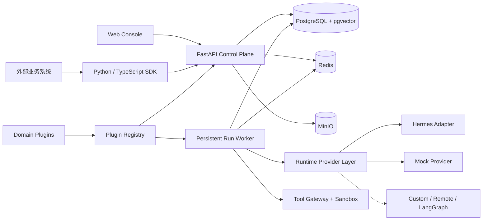
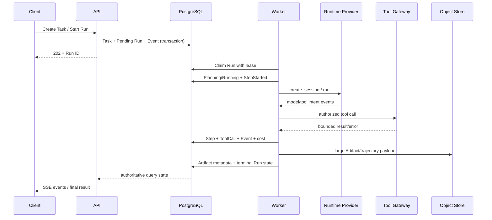

# 总体架构

## 架构目标

平台以“持久化资源 + 结构化任务 + 可恢复执行 + 受控成长”为核心。业务系统只通过 REST/SSE/SDK 提交任务和读取结果；Runtime、工具和插件不能绕过应用服务直接修改权威状态。

## 系统上下文



## 部署单元

| 单元 | 职责 | 不负责 |
| --- | --- | --- |
| `api` | 认证、租户边界、CRUD、状态转换、审批、OpenAPI、SSE | 模型循环、长任务、沙箱执行 |
| `worker` | 领取持久化 Run、心跳、恢复、调用 Runtime/Tool、记录轨迹 | 直接暴露公网 API、绕过状态机 |
| `web` | 管理 Agent/Team/Task/Run/Memory/Skill/Plugin/Artifact | 保存权威业务状态 |
| PostgreSQL/pgvector | 领域状态、事件、审计、队列租约、向量索引 | 大对象正文 |
| Redis | SSE 事件扇出、短期缓存和协调信号 | Run 的唯一事实来源 |
| MinIO | Artifact 和大型轨迹对象，按内容 Hash 寻址 | 领域状态机 |

第一版采用模块化单体控制面而不是微服务。API 与 Worker 是不同进程，共享同一领域包和数据库事务约束，未来可按负载拆分。

## 代码拓扑目标

```text
backend/
  src/nico_agent/
    api/              # FastAPI routers and dependencies
    application/      # use cases, commands, queries
    domain/           # entities, enums, transitions, policies
    infrastructure/   # SQLAlchemy, MinIO, Redis, auth
    runtime/          # provider protocol and adapters
    tools/            # registry, permission, execution gateway
    memory/           # retrieval and promotion services
    plugins/          # discovery, validation, registry
    worker/           # persistent run executor
  migrations/
  tests/
frontend/
sdks/python/
sdks/typescript/
plugins/quant-team/
docs/
scripts/
```

依赖方向固定为：`api/infrastructure/runtime/tools/plugins -> application -> domain`。领域层不得导入 FastAPI、SQLAlchemy、Hermes 或任何量化插件。

## 核心执行路径



Worker 通过数据库租约领取 Run。心跳过期后其他 Worker 可以恢复；每个副作用使用 Run/Step/ToolCall 幂等键。Redis 只负责低延迟事件扇出，断线客户端可依据 Event 序号从 PostgreSQL 补读。

## 多租户边界

- 所有租户资源携带不可变 `tenant_id`；跨租户外键必须包含租户一致性约束。
- Repository 和 application use case 强制接收 `TenantContext`，禁止无租户查询。
- PostgreSQL RLS 作为纵深防御；Worker 使用同样的租户会话变量。
- API 运行角色启用并强制 RLS；迁移 Owner 与运行角色分离。全局 Worker claimer 只能读取/租赁最小 Run 队列头，领取后必须在租户限定事务中加载任务正文和写入轨迹。
- Artifact 使用租户前缀和服务端生成对象键；SDK 不接触数据库或 MinIO 凭证。
- Agent 私有、Team、Project 和 Tenant 共享记忆分别授权，不因向量相似度跨域召回。

## Runtime Provider 边界

统一异步协议：

```python
class AgentRuntimeProvider(Protocol):
    async def create_session(self, request): ...
    async def run(self, request): ...
    async def pause(self, run_id): ...
    async def resume(self, run_id): ...
    async def cancel(self, run_id): ...
    async def get_status(self, run_id): ...
    async def stream_events(self, run_id): ...
    async def export_trajectory(self, run_id): ...
```

Provider 返回规范化事件，不直接写领域表。`HermesRuntimeProvider` 位于 Adapter 层，负责把 Hermes 会话、工具事件和轨迹转换为平台协议。缺失的原生 pause/resume 能力必须通过平台检查点或显式 `NOT_SUPPORTED` 能力协商处理，禁止伪造成功。

## Tool 与沙箱边界

- ToolDefinition 描述 Schema、权限、超时、重试、隔离和版本；ToolCall 是不可变执行记录。
- Agent 的工具白名单与 Plugin 权限取交集，高风险工具另需 Approval。
- Secret 只在 Tool Gateway 执行时解析，不进入 Prompt、Event 或普通日志。
- 文件工具使用租户/Run 工作区根目录和规范化路径检查。
- Python 在无网络、只读基础镜像、限时/限 CPU/内存/输出的容器中运行。
- HTTP 工具只允许 GET/HEAD，执行 DNS/IP/重定向复核和域名白名单。

## Memory 与 Skill 成长路径

```text
Run trajectory
  -> Reflection
  -> MemoryCandidate / SkillCandidate
  -> deterministic validation + evaluator
  -> Approval
  -> immutable published version
  -> scoped canary use
  -> rollback by active-version pointer
```

发布不会覆盖旧版本。来源 Run、Step、模型、工具、插件、代码版本和评估结果全部保留。收益或单次任务成功不能直接作为发布依据。

## Plugin 边界

Plugin Manifest 注册 Role、Tool、Skill、Workflow、Evaluator、Knowledge、Schema 和 Permission。第一版只加载管理员安装的受信 Python 包或仓库内插件；未受信代码不能在 API 进程内执行。量化插件只存在于 `plugins/quant-team`，核心包不得出现交易指标、策略或实盘下单概念。

## 可观测性

- Event 是追加式、租户内单调排序的事实日志，不采用完整 Event Sourcing。
- 业务表保存当前状态；Event/Audit 保存发生了什么、由谁触发和状态转换依据。
- 每次 Run 固定代码、AgentVersion、Plugin、SkillVersion、模型参数和 ToolDefinition 版本。
- 结构化日志带 `tenant_id/task_id/run_id/step_id/tool_call_id`；指标不包含 Prompt 和 Secret。

## 相关决策

- [ADR-0001：模块化单体与独立 Worker](decisions/ADR-0001-modular-monolith-and-worker.md)
- [ADR-0002：PostgreSQL 权威状态与持久化执行](decisions/ADR-0002-authoritative-storage-and-execution.md)
- [ADR-0003：Runtime Provider 隔离](decisions/ADR-0003-runtime-provider-boundary.md)
- [ADR-0004：Manifest 优先的受信插件](decisions/ADR-0004-trusted-plugin-model.md)
- [ADR-0005：候选驱动的受控成长](decisions/ADR-0005-controlled-growth.md)
- [ADR-0006：共享库多租户隔离](decisions/ADR-0006-multitenancy-isolation.md)
