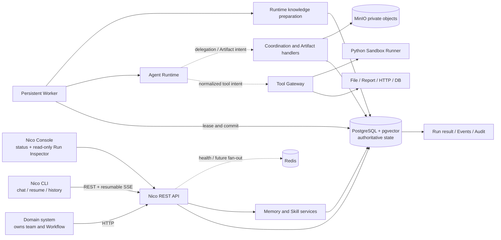
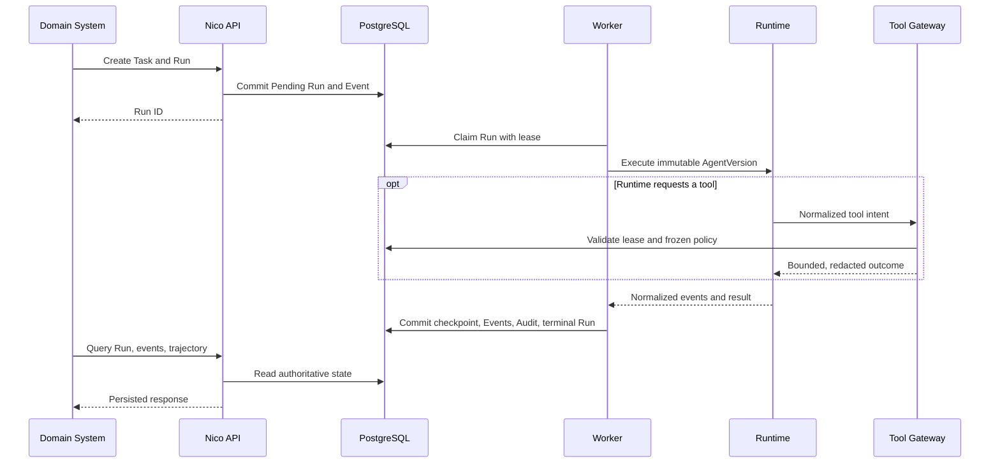

# Architecture

Nico Agent is a self-hosted Runtime, control plane, and persistent Worker for reliable single-Agent and dynamic multi-Agent execution. Domain systems own fixed team structure and business Workflow; they call Nico through HTTP APIs.

This document describes the current implementation. Planned capabilities are called out explicitly.

## System boundary



The solid paths are implemented. PostgreSQL remains authoritative for coordination and Artifact metadata; MinIO stores private object bytes, and resumable SSE reads persisted Run events. Redis is not authoritative state.

## Responsibilities

| Component | Current responsibility | Does not do |
| --- | --- | --- |
| FastAPI API | health, Tenant settings, Agent/Task/Run, Runtime/coordination/Artifact queries, Memory/Skill governance, Event/Audit | execute model loops or authenticate production users |
| Nico CLI | profiles, resource queries, durable Conversation/Turn chat, resumable Run Event display, approval decisions and cancellation requests | execute Agent loops, access databases, or own final state |
| Worker | claim Runs, manage leases/checkpoints, call Runtime, route tool/delegation/Artifact intents, commit facts | expose public endpoints or own authoritative queue state |
| Runtime Provider | execute an AgentVersion and emit normalized events/results | access controlled tools except through Tool Gateway |
| Tool Gateway | authorize exact tool versions, validate Schema, require sensitive-tool approval, resolve Secret references, enforce idempotency/limits, persist ToolCall/Audit | let Runtime or CLI bypass policy |
| Sandbox Runner | execute one-shot restricted Python containers | receive model/provider/database credentials |
| PostgreSQL/pgvector | authoritative domain state, Run leases, coordination, Artifact metadata, events, audit, vectors | large-object serving |
| Redis | provisioned for short-lived coordination and future event fan-out | authoritative Run or domain state |
| MinIO | private content-addressed Artifact bytes | authorization or authoritative metadata |
| Console | live dependency status and a read-only, redacted Run Inspector | mutate Runs or administer business resources |

## Persistent execution



Run claims use PostgreSQL row locking with `SKIP LOCKED`. The Worker periodically renews a lease. Terminal writes validate the Worker owner, lease token, and expiry so stale workers cannot overwrite a cancellation or a newer owner.

For medium/high tools, the Gateway commits a Pending ToolCall, ToolApprovalRequest and pre-action checkpoint before releasing execution. Run enters `waiting_for_approval`, the persisted `ApprovalRequested` Event reaches CLI over SSE, and the CLI writes only a revisioned decision through the API. Worker releases its lease while waiting and reclaims the Run after approve/reject/expiry. The same stable ToolCall key is reused, so approval recovery cannot duplicate the side effect. Requests survive CLI disconnects and Worker restarts; timeout and cancellation are database-authoritative terminal decisions.

The code contains bounded in-process Worker concurrency and expired-lease recovery primitives. Goal J exercises two concurrent loops and replacement-Worker recovery; multi-container production scaling remains unverified.

## Persistent conversations

`nico chat` is a thin REST/SSE client. A new Conversation freezes the selected
Project, Agent and exact AgentVersion. Every user message commits a
ConversationTurn, Task and first Pending Run atomically; the independent Worker
then follows the same claim/runtime/tool/persistence path as every other Run.
ConversationTurn is a durable projection for user-facing history, while Run and
RuntimeSession retain execution authority. Closing or reconnecting the CLI does
not alter those records.

SSE replays persisted Run Events and resumes from `Last-Event-ID`; the CLI drops
duplicate sequences and reads the final Turn after the stream closes. Ctrl+C
during execution calls the existing revisioned Run-tree cancellation service.
ContextSnapshot links the Conversation/Turn and freezes selected Turn IDs,
summary hash, bounded Artifact references, token budget and trimming facts. The
selector keeps the current input, adds recent completed Turns newest-first, and
uses the durable Conversation summary for covered history. Recovery reuses the
selection frozen in RuntimeSession instead of reading changed live history.

## Runtime boundary

`AgentRuntimeProviderV2` defines execution mode, explicit capabilities, normalized events, terminal/suspended outcomes, narrow Runtime services, and trajectory export. The old v1 `run()` path remains only as a compatibility shim during the published deprecation window. The Worker owns persistence and passes only narrow capability handlers to providers.

Implemented adapters:

- **Nico Native Runtime** — the default for new AgentVersions. Direct performs one OpenAI-compatible streaming ModelCall; ReAct runs a bounded model/tool/observation loop with idempotent recovery; Plan-and-Execute persists bounded Plan revisions, step validation, Reflection/Replan and deterministic/model Completion Evaluation. None of these modes depends on Hermes.
- **Mock Runtime** — deterministic, credential-free execution used by the local Demo and end-to-end tests.
- **Hermes Runtime** — an opt-in protocol-v2 CLI adapter for Hermes `0.18.2`, including fail-closed version checks, cancellation, compatible historical session resume, per-Run state, redacted trajectory export, and Nico MCP tool discovery. It does not advertise Native planning or delegation capabilities.

Provider resolution is explicit and persisted. Existing `RuntimeSession.provider_name`, provider version, and protocol version remain authoritative during recovery; an unavailable or incompatible provider fails closed and is never replaced with Native. Legacy AgentVersions remain readable, and each legacy resolution emits Event/Audit telemetry with its removal window.

The default Worker image and default Compose topology do not bundle, register, mount, or require Hermes. A separate `hermes` profile builds the pinned adapter image for explicitly configured Hermes AgentVersions. Nico Native's hermetic Direct, crash-recovered ReAct, revisioned planning, dynamic multi-Agent, and governed knowledge paths pass repository acceptance; credentialed external-model acceptance remains a separately disclosed requirement.

## Dynamic coordination and shared Artifacts

Nico Native may request `delegate_agent` through a narrow Coordination handler. The service atomically reserves a bounded child budget, intersects Tenant ∩ Parent snapshot ∩ Child AgentVersion ∩ delegation restrictions, creates the Child Task/Run and ancestry records, and queues an assignment message. Parent execution persists a checkpoint, enters `waiting_for_subagent`, clears its lease, and is woken transactionally after every direct Child becomes terminal. A database reconciler repairs missed notifications; tree cancellation is idempotent and cascades through descendants.

Child results use structured `AgentMessage` envelopes. Large evidence is stored through `store_artifact`: bytes pass a configured size cap, upload under a temporary key, are promoted to a SHA-256 object key, and become available only after PostgreSQL metadata commits. Sharing is an explicit `SharedArtifactLink` from a Child to its direct Parent. Sibling and cross-tenant reads fail closed, and API responses never expose MinIO credentials or object keys.

## Tool boundary

Tools register an exact `name@version`, JSON input/output Schema, permission, risk level, timeout, retry policy, isolation mode, and implementation hash.

At first claim, Nico freezes the intersection of the Tenant tool policy and immutable AgentVersion tool policy. Every call revalidates the Run lease. Terminal ToolCall records cannot be updated or deleted.

Built-in executors currently cover Run workspace reads/writes, Markdown/JSON reports, restricted HTTP reads, restricted database reads, and isolated Python execution. See [tool-gateway.md](tool-gateway.md).

## Tenant isolation

Nico carries `TenantContext` into application transactions. PostgreSQL runtime roles use `FORCE ROW LEVEL SECURITY`, and tenant-owned relationships use composite constraints to prevent cross-tenant references. The global Worker claimer can only lease minimal queue metadata before switching back to a tenant-scoped transaction.

This is data-plane isolation, not caller authentication. The local Tenant header is user-controlled and must not be exposed to untrusted callers.

## Controlled growth

```text
terminal Run facts
  -> Memory Candidate / SkillVersion Draft
  -> deterministic Evaluation
  -> independent Approval
  -> immutable publication
  -> scoped retrieval or stable/canary resolution
  -> invalidation, disable, or pointer rollback
```

Memory retrieval filters tenant, lifecycle state, expiry, and authorized Tenant/Project/Agent scope before pgvector ranking. Team scope is disabled because Team/Membership is not part of Nico core.

At first Run claim, runtime preparation freezes the intersection of Tenant and AgentVersion Memory/Skill policies. Active Memory and published stable/canary Skill versions enter ContextSeed as untrusted data with exact IDs, versions and content hashes. Recovery reuses the same selection; a later publication, invalidation or rollback applies only to a later Run. `RuntimeKnowledgeUsage` links those references to ContextSnapshot, ModelCall and terminal outcome facts so controlled growth can evaluate later effects without granting automatic publication.

See [memory-and-skill.md](memory-and-skill.md) for lifecycle details.

## Deliberate non-goals and current gaps

- Nico does not define Team, Role, Membership, or business Workflow.
- Plugin discovery/loading is not implemented.
- Full Artifact preview/edit/public-share/retention workflows are not implemented; only the Runtime-required private lifecycle is available.
- Python SDK and TypeScript SDK are not implemented.
- Formal control-plane authentication and production authorization are not implemented.
- Kubernetes manifests, backup/restore automation, and a production observability stack are not provided.

## Architecture decisions

- [ADR-0001: modular monolith and Worker](decisions/ADR-0001-modular-monolith-and-worker.md)
- [ADR-0002: authoritative storage and execution](decisions/ADR-0002-authoritative-storage-and-execution.md)
- [ADR-0003: Runtime Provider boundary](decisions/ADR-0003-runtime-provider-boundary.md)
- [ADR-0005: controlled growth](decisions/ADR-0005-controlled-growth.md)
- [ADR-0006: multitenancy isolation](decisions/ADR-0006-multitenancy-isolation.md)
- [ADR-0008: Runtime leases and Hermes process boundary](decisions/ADR-0008-runtime-leases-and-hermes-process-boundary.md)
- [ADR-0009: Tool Gateway and Sandbox boundary](decisions/ADR-0009-tool-gateway-and-sandbox-boundary.md)
- [ADR-0010: scoped Memory and versioned Skill growth](decisions/ADR-0010-scoped-memory-and-versioned-skill-growth.md)
