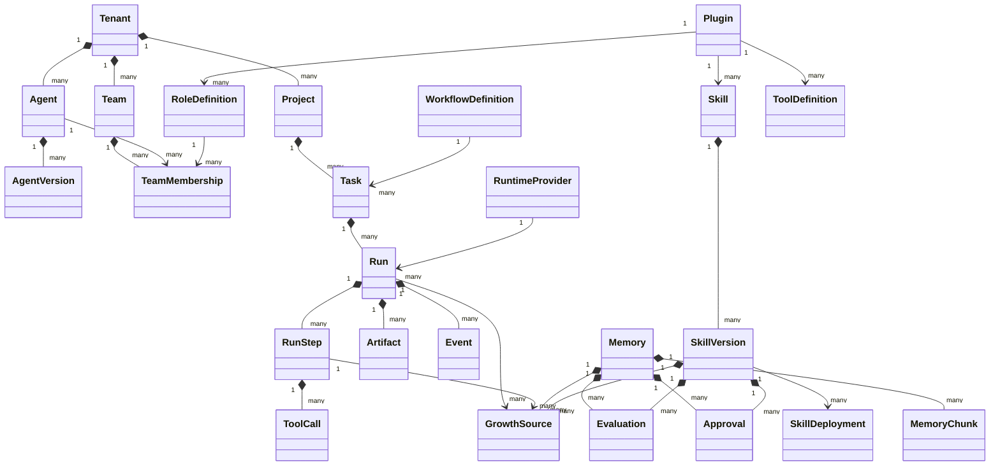

# 领域模型

## 聚合关系

## 通用规则

- 除全局平台目录外，所有实体含不可变 `tenant_id`、`id`、`created_at`。
- 可变资源使用乐观锁 `revision`；发布型资源使用不可变版本行和可变 active pointer。
- 删除默认采用归档或失效；审计、Event、Run 轨迹、已引用版本和 ToolCall 不允许物理删除。
- 所有状态使用枚举和显式转换函数；转换与 Event 在同一事务提交。
- JSON 配置必须通过版本化 Pydantic/JSON Schema 校验，不能把任意 JSON 当作无约束领域模型。

## Goal C–F 实现边界

Goal C 已实际落库并开放 API 的对象是 Tenant、Project、Agent、AgentVersion、Task、Run、RunStep、Event 和 AuditRecord；Goal D/E 增加 RuntimeSession、ToolDefinition 和 ToolCall。Goal F 的 F2 已落库 Memory、Skill、SkillVersion、GrowthSource、Evaluation、Approval 与 SkillDeployment，但检索、应用服务和 API 尚未实现。其余目录对象仍是后续 Goal 的设计基线，不能据此认为已经实现。

- 租户业务表均含 `tenant_id`；对象关系使用包含 `tenant_id` 的复合外键，数据库运行角色启用 `FORCE RLS`。
- AgentVersion 包含角色、职责边界、目标、模型/工具/记忆/技能策略、插件引用、预算、运行配置与内容 Hash；发布和回滚只切换不可变版本状态与 Agent 指针。
- Task 是目标，Run 是一次尝试。Run 固定 AgentVersion；Failed/TimedOut Run 可重试并创建递增 `attempt` 和 `retry_of_run_id` 的新行，Cancelled 同时终止 Task，不可重试。
- Run 的 lease、heartbeat、checkpoint、cost、result/error 已由 Goal D Worker 使用；租约 token 和过期时间是提交结果的必要条件。
- Event 与 AuditRecord 都是追加式记录并共享 correlation ID；Run Event 可以按 sequence 回放。
- RuntimeSession 已落库并与 Run 一一对应，固定 Provider/version/protocol/capabilities，保存外部 session ID、检查点、使用量、连续事件序号和终态轨迹；同样启用 `FORCE RLS`。
- Goal F 新表全部使用运行角色 `FORCE RLS` 和 tenant-aware 复合外键；GrowthSource 只能引用 terminal Run/RunStep/ToolCall，Evaluation/Approval 与 subject content hash 绑定，发布与灰度由数据库触发器再次校验。

## 核心对象目录

| 对象 | 数据职责与关键字段 | 状态/生命周期 | 可变与删除策略 | 审计要求 |
| --- | --- | --- | --- | --- |
| Tenant | `id,name,slug,settings,limits` | Active/Suspended/Archived | slug、id 不可变；仅归档 | 创建、限额、停用 |
| Project | `tenant_id,name,description,metadata` | Active/Archived | 可改描述；归档后只读 | 创建、更新、归档 |
| Agent | 身份资源；`name,display_name,description,status,current_version_id` | Draft/Ready/Running/Paused/Archived/Error | 身份字段可改；配置通过版本；默认归档 | 全部状态与版本切换 |
| AgentVersion | `agent_id,version,role,mandate,boundaries,long_term_goal,current_goal,model_config,tool_policy,memory_policy,skill_policy,plugin_refs,budgets,run_config,content_hash` | Draft/Published/Superseded | 发布后不可变；不可删除已引用版本 | 创建、发布、回滚 |
| Team | `name,description,supervisor_membership_id,workflow_policy` | Draft/Ready/Archived | 成员通过 Membership；归档 | 创建、主管变更、归档 |
| TeamMembership | `team_id,agent_id,role_definition_id,permissions,joined_at,left_at` | Active/Inactive | 角色和权限版本化变更；保留历史 | 添加、移除、授权 |
| RoleDefinition | `plugin_id,name,mandate,capabilities,default_tools,output_schema,version` | Draft/Enabled/Disabled | 启用版本不可变 | 注册、启停、版本 |
| Task | 目标；`project_id,team_id,assignee_agent_id,parent_task_id,title,input,acceptance,status,priority,workflow_id` | 任务状态机 | 运行后输入冻结；取消/归档不删除 | 创建、分配、状态转换 |
| Run | 一次执行；`task_id,attempt,agent_version_id,runtime_provider_id,status,budgets,lease,checkpoint,cost,result,error,versions` | Run 状态机 | 终态不可改；重试创建新 Run | 全状态、租约、取消、错误 |
| RunStep | `run_id,sequence,kind,status,input,output,error,started_at,ended_at` | Pending/Running/Waiting/Completed/Failed/Cancelled | 完成后不可变 | 开始、完成、失败 |
| ToolDefinition | `plugin_id,name,description,input_schema,output_schema,permission,timeout,retry,isolation,version` | Draft/Enabled/Disabled | 启用版本不可变 | 注册、启停、版本 |
| ToolCall | `run_step_id,tool_version_id,idempotency_key,caller,args,result,error,retries,usage,timestamps` | Pending/Running/Succeeded/Failed/TimedOut/Cancelled | 执行后不可变 | 每次尝试及资源使用 |
| Memory | `memory_key,scope/type,content,confidence,status,version,expires_at,supersedes_id,content_hash`；embedding 位于版本化 chunk | Candidate/Active/Invalidated/Expired/Deleted | 更新创建新版本；删除为 tombstone；Candidate 不召回 | 完整来源、评价、审批、召回、失效 |
| Skill | 稳定身份；`name,description,current_version_id,success_stats` | Candidate/Testing/Approved/Published/Deprecated/Disabled | active pointer 可回滚 | 状态与版本切换 |
| SkillVersion | `skill_id,version,conditions,preconditions,input_schema,steps,tools,output_schema,validation,failure_modes,source_runs,content_hash` | Draft/Testing/Published/Rejected | 发布后不可变 | 生成、测试、批准、回滚 |
| Artifact | `run_id,step_id,type,name,uri,content_hash,size,mime,metadata` | Available/Quarantined/Expired/Deleted | 对象不可覆盖；按策略到期 | 创建、读取授权、删除 |
| Evaluation | `run_id,evaluator_id,subject_type,subject_id,score,verdict,details,evidence,version` | Pending/Completed/Failed | 完成后不可变 | 输入、评价器版本、输出 |
| WorkflowDefinition | `plugin_id,name,version,nodes,transitions,guards,input/output_schema` | Draft/Enabled/Deprecated/Disabled | 启用版本不可变 | 注册、校验、启停 |
| Plugin | `name,version,api_version,manifest,package_hash,status,compatibility` | Discovered/Validated/Enabled/Disabled/Failed | 安装版本不可变 | 发现、校验、启停、失败 |
| Event | `sequence,type,aggregate_type/id,actor,payload,correlation_id,causation_id,created_at` | 追加式 | 永不更新/删除 | 自身即追溯记录 |
| Approval | `subject_type/id,action,status,requester,reviewer,reason,expires_at` | Requested/Approved/Rejected/Cancelled/Expired | 决议后不可变 | 请求与决议 |
| RuntimeProvider | `name,type,version,capabilities,config_ref,status,health` | Configured/Available/Degraded/Disabled | Secret 仅存引用；版本化配置 | 配置、健康、启停 |

## 补充执行对象

- **RuntimeSession**：平台 Run 与 Provider 会话之间的映射、检查点和 Provider 外部 ID。
- **ModelCall**：模型、参数、输入/输出 Hash、Token、费用、延迟和错误；敏感正文按租户策略加密或存 Artifact。
- **PluginRegistration**：某 PluginVersion 实际注册的 Role/Tool/Skill/Workflow/Evaluator/Schema 清单。
- **AuditRecord**：面向安全与管理操作的追加式记录，和领域 Event 分开查询但共享 correlation ID。
- **GrowthSource**：把 Memory/SkillVersion 与同租户 terminal Run、RunStep、ToolCall、trajectory/AgentVersion/生成器快照闭合关联，保存来源 Hash。
- **MemoryChunk**：已落库的确定性切片文本、位置、Memory/Chunk Hash、chunker 与 embedding profile 和 `vector(384)`；仅 Active 未过期 Memory 可创建，行不可更新/删除。
- **SkillDeployment**：将 Published SkillVersion 以确定性比例灰度到 project/agent scope；退役和回滚保留历史。

## 删除与归档语义

- Agent、Team、Project、Plugin 等已被 Run/Event 引用的资源只能归档或写入 tombstone，API 的 `DELETE` 返回删除结果但不破坏引用链。
- 只有从未发布、没有任何引用的 Draft 资源可以物理删除；删除仍写入 AuditRecord。
- Event、AuditRecord、Run、RunStep、ToolCall、Evaluation 和已发布版本不可由普通租户 API 物理删除。
- Memory 的“删除”默认创建可审计 tombstone 并从召回索引移除；保留期限届满后由合规清理任务处理正文和 Artifact。

## 不变量

1. Run 引用的 AgentVersion、SkillVersion、ToolDefinition、Plugin 和 Workflow 版本在 Run 内固定。
2. Task 重试不能覆盖失败 Run；必须递增 attempt 并建立 `retry_of_run_id`。
3. ToolCall 必须属于 RunStep，且调用工具必须同时通过 Agent、Role、Plugin 与租户策略。
4. Memory/Skill 自动生成只能进入 Candidate；批准和发布必须留下 Approval/Evaluation。
5. Event sequence 在租户内单调递增，状态转换和对应 Event 原子提交。
6. Artifact URI 不接受客户端指定任意路径，Hash 与对象内容必须一致。
7. Runtime Provider 不能直接推进 Task、发布 Skill 或批准 Memory。
