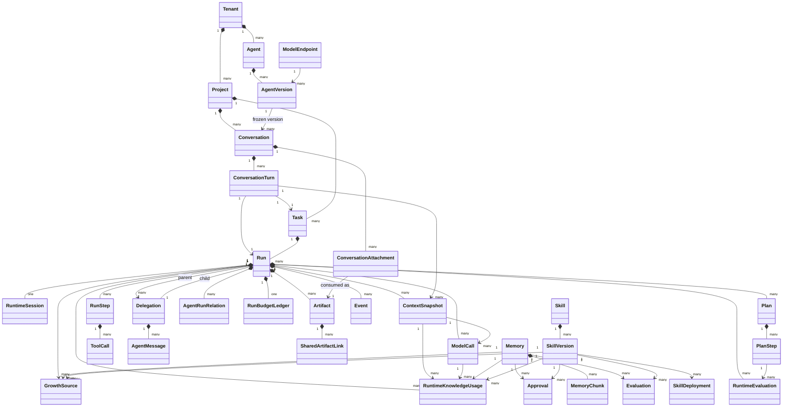

# Domain model

Nico persists execution and growth state in PostgreSQL. This page describes the
implemented model; it deliberately omits fixed Team, Workflow, and Plugin concepts.

## Implemented relationships

Team membership, fixed business Workflow, and Plugin loading are not implemented in Nico core. Domain systems own those concerns. Nico does implement the domain-neutral coordination and Artifact primitives needed by a Runtime to create Child Runs and exchange bounded evidence.

## Core execution objects

| Object | Responsibility | Important rule |
| --- | --- | --- |
| Tenant | Isolation boundary, limits, and tool policy | Tenant ID is immutable |
| Project | Groups Tasks inside one Tenant | Archived Projects are read-only |
| Agent | Stable Agent identity and current-version pointer | Behavior changes through AgentVersion |
| AgentVersion | Frozen prompt, policy, budgets, model, and Runtime configuration | Published versions are immutable |
| Conversation | Durable user-facing dialog across multiple Turns/Runs | Creation freezes one AgentVersion; version switches require a new Conversation |
| ConversationTurn | One user input plus its Task/current Run and projected output/usage/error | Turn, Task and first Run are created atomically; retry appends a Run attempt and atomically moves the pointer |
| ConversationAttachment | Short-lived private bytes staged for the next Turn | Tenant/Conversation scoped, bounded, expiring and consumed once into a Run-owned Artifact |
| Task | A requested objective | Input is frozen once execution starts |
| Run | One execution attempt for a Task | Retry creates a new attempt; terminal state is immutable |
| RuntimeSession | Provider identity, protocol, resolution source, compatibility metadata, external session, checkpoint, usage, and trajectory | One per Run; its Provider/version/protocol are authoritative and never silently rewritten |
| ModelEndpoint | Tenant-owned immutable endpoint semantics plus operational credential/rate-limit state | Referenced semantics require a new revision |
| ContextSnapshot | Reconstructable, hashed model context for one Run, optionally linked to a ConversationTurn | Immutable and same-Run/same-Conversation constrained |
| ModelCall | Streaming model request/result, usage, cost and provider request ID | Terminal records are immutable and bound to the same Run/context |
| RunStep | Ordered execution progress within a Run | Terminal steps cannot be rewritten |
| Plan | One immutable-semantic planning revision for a Run | Replan appends a revision; old revisions remain readable |
| PlanStep | Version-bound step definition and execution projection | Definition and terminal state cannot be overwritten |
| RuntimeEvaluation | Append-only step validation, Reflection or Completion fact | Separate from Memory/Skill Evaluation and bound to output Hash/evidence |
| Delegation | Immutable Parent→Child objective, policy, permission and budget grant | Lifecycle is append-only/terminal-immutable; duplicate and cycle guards apply |
| AgentRunRelation | Closure rows for Run ancestry | Same-tenant, acyclic and depth-bounded |
| AgentMessage | Assignment/result/retry/cancel envelope between Runs | Large content is referenced through Artifact IDs |
| RunBudgetLedger | Direct consumption plus reserved/consumed Child budget | Row locks prevent concurrent over-reservation |
| Artifact | PostgreSQL metadata for a private content-addressed MinIO object | Available rows require verified SHA-256, size and object key |
| SharedArtifactLink | Explicit Artifact grant between related Runs | Initial release only permits Child→direct-Parent sharing |
| ToolDefinition | Versioned tool Schema and safety metadata | Calls require an exact registered version |
| ToolCall | Authorized execution attempt and redacted result | Terminal records cannot be updated or deleted |
| ToolApprovalRequest | Durable human decision for one pending sensitive ToolCall | Starts requested and has exactly one immutable terminal decision |
| RuntimeKnowledgeUsage | Frozen Memory/Skill identity and observed Context/ModelCall/outcome linkage | Source identity is immutable; terminal effect facts cannot be rewritten |
| Event | Ordered domain history | Append-only |
| AuditRecord | Security and administrative history | Append-only and correlated with Events |

Task is the requested goal; Run is an attempt to achieve it. A retry never
overwrites a failed or timed-out Run. Worker leases, heartbeat, checkpoint,
result, and error state live on persisted Run and RuntimeSession records, so
PostgreSQL remains authoritative when a Worker disappears.

Conversation is not a RuntimeSession. A Conversation spans many user turns; each
turn creates a platform Task and a first Run, while RuntimeSession remains scoped
to exactly one Run/provider execution. ConversationTurn stores a queryable user
view of status, assistant output, artifact references, usage and error, projected
from the authoritative Run by database trigger so a CLI disconnect cannot lose
the result. Full history is durable. Compaction stores a versioned summary and
coverage Hash without deleting Turns; Runtime preparation freezes summary,
recent Turn IDs, Artifact references and trimming facts in ContextSnapshot.

## Memory and Skill objects

| Object | Responsibility | Important rule |
| --- | --- | --- |
| Memory | Versioned candidate or published knowledge | Candidates cannot be recalled before approval/publication |
| MemoryChunk | Deterministic indexed slice and embedding profile | Only active, unexpired Memory is searchable |
| Skill | Stable Skill identity and current-version pointer | The pointer can be promoted or rolled back |
| SkillVersion | Immutable conditions, steps, tools, validation, and failure modes | Publication requires current evidence and approval |
| GrowthSource | Closed provenance from terminal Run/RunStep/ToolCall state | Source records cannot be updated |
| Evaluation | Versioned validator result bound to subject content | A stale evaluation cannot approve changed content |
| Approval | Independent publication decision | Self-review and stale decisions are rejected |
| SkillDeployment | Project/Agent-scoped canary or active deployment | Historical deployments remain auditable |

Memory changes create new versions or an auditable tombstone. Skill changes
create immutable SkillVersion rows, while controlled deployment records handle
canary selection, promotion, retirement, and rollback. Runtime providers can
propose candidates, but cannot validate, approve, or publish them.

RuntimeSession freezes the effective Memory/Skill policy and its private content-bearing selection at first claim. ContextSnapshot exposes exact version/hash references, while RuntimeKnowledgeUsage records whether each reference reached a Context and ModelCall and how the Run ended. Recovery never re-resolves live knowledge for an existing Run.

RuntimeSession also records how the Provider was selected. New AgentVersions resolve from the explicit `runtime_provider`; historical `run_config`/`model_config` fallbacks set `legacy_resolver_used` and append deprecation telemetry. `provider_compatibility` is a frozen descriptor snapshot used to explain and audit recovery decisions. Historical rows may keep these additive fields null, and migration or recovery never rewrites their existing Provider identity.

## Isolation and consistency

- Tenant-owned tables include `tenant_id` and use tenant-aware composite foreign
  keys.
- The application sets Tenant context for each transaction; PostgreSQL
  `FORCE ROW LEVEL SECURITY` supplies a second isolation boundary.
- State transitions and their Event/Audit records commit in one transaction.
- Published AgentVersion and SkillVersion rows, Plan semantics, RuntimeEvaluation,
  Event, AuditRecord, terminal Run/RunStep/PlanStep/ToolCall/ToolApprovalRequest/Delegation/Artifact,
  and GrowthSource provenance are immutable.
- JSON policy and configuration payloads are validated by Pydantic and JSON
  Schema before use.
- Memory retrieval filters Tenant, scope, status, expiry, and tombstones in SQL
  before pgvector ranking.

## State transitions

The exact Task, Run, RunStep, Memory, Skill, Evaluation, Approval, and deployment
transitions are documented in [State machines](state-machines.md). HTTP request
and response Schemas remain authoritative in the live
[Swagger UI](http://localhost:18000/docs).
