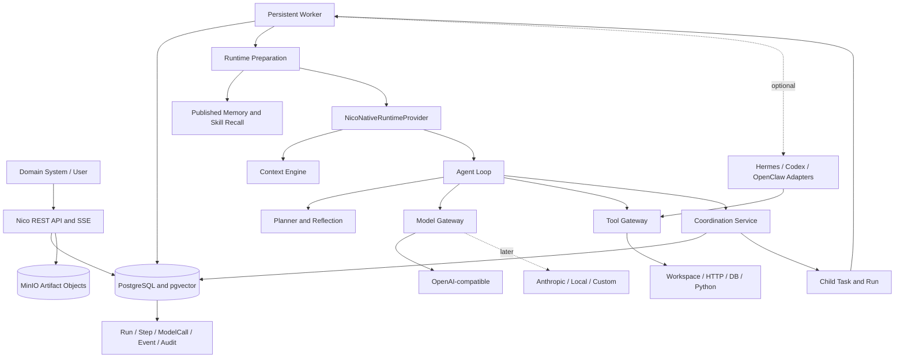
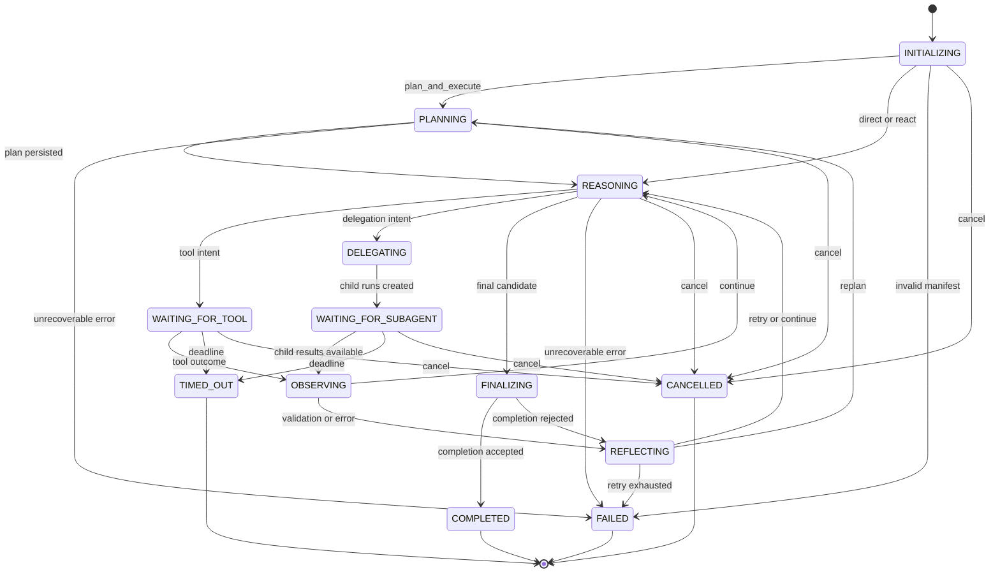
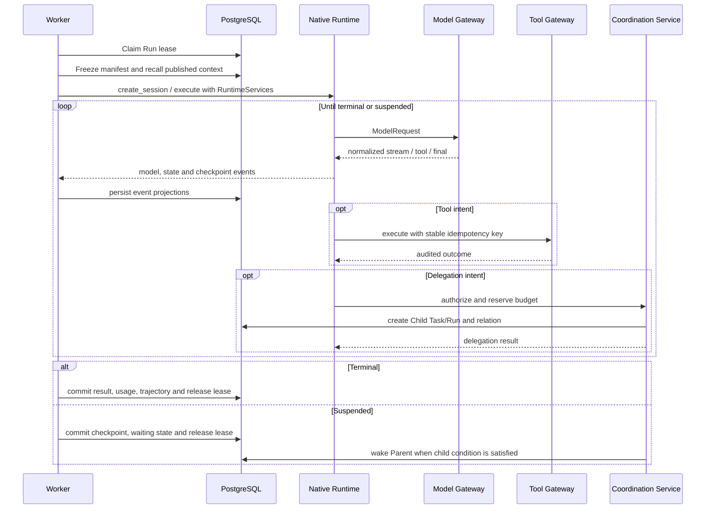

# Nico Native Agent Runtime Architecture Migration - Plan

## Goal Capsule

- **目标：** 把 Nico 从“持久化控制面 + 外部 Runtime Adapter”纠偏为可独立完成真实 Agent 任务的自托管 Agent Runtime 与服务平台，并保留现有控制、治理、恢复和审计能力。
- **最高约束：** `nico_native` 是新建 AgentVersion 的默认正式 Runtime；Hermes、Codex、OpenClaw 只能是可选 Adapter；Mock 只服务测试和无凭据演示。
- **实施方式：** 按 Goal G 至 Goal L 顺序交付六个可独立运行、测试、验收和接续的阶段，不在一次上下文或一次变更中完成全部迁移。
- **权威事实来源：** PostgreSQL 继续保存 Run、执行事实、预算、检查点、消息和审计；Redis 只用于通知与短期协调；MinIO 保存 Artifact 内容，元数据仍由 PostgreSQL 管理。
- **兼容原则：** 保留现有 `AgentRuntimeProvider` 生命周期思想、Worker 租约、Tool Gateway、Memory/Skill 生命周期和 Hermes 进程边界，通过协议 v2 和新增领域事实扩展，不推倒重写。
- **停止条件：** 每个 Goal 只有在代码、迁移、自动化测试、Compose 验收、文档、证据和 Handoff 都完成后才能结束；需要真实模型的 Goal G 验收缺少凭据或兼容端点时不得标记 Verified。
- **阶段尾责任：** 每个 Goal 更新架构与运行文档，保存 `artifacts/goals/goal-<letter>/<timestamp>/` 验收证据，并形成下一阶段可直接消费的 Handoff。

---

## Product Contract

### Summary

Nico Agent 的修正后定义是：一个自托管、可恢复、可审计、支持动态多 Agent 协作和受控成长的通用 Agent Runtime 与服务平台。

平台同时拥有原生智能执行与服务治理两条核心能力。原生 Runtime 直接调用模型、构建上下文、规划、使用工具、观察、反思、委托和完成任务；控制与治理层负责多租户资源、持久化执行、权限、预算、检查点、Memory、Skill、Artifact、Event 和 Audit。

固定业务 Team、角色组织图和领域 Workflow 仍由量化、科研或其他上层系统定义。Nico 核心只提供领域无关的动态委托、父子 Run、消息、预算、共享产物和协调策略，不能写死研究员、交易员或项目经理等角色。

### Problem Frame

当前实现的控制与治理基础并非失败，但产品定位和默认执行链不完整：

- `backend/src/nico_agent/runtime/contracts.py` 已定义可替换 Provider 生命周期，但 `run()` 默认被当作一次执行到终态的黑盒，缺少挂起、唤醒、结构化上下文、计划和协调服务。
- `backend/src/nico_agent/runtime/service.py` 从 `run_config.runtime_provider` 取 Provider，并在未配置时回退 `model_config.runtime_provider`，最终默认 `mock`；仓库没有 `nico_native` Provider。
- `backend/src/nico_agent/worker.py` 在非生产环境注册 Mock，并无条件注册 Hermes；默认 Worker 镜像又没有安装 Hermes，因此“真实智能执行”在现有 Compose 中不可用。
- `RuntimeSession` 只有通用 JSON checkpoint、usage 和 trajectory，不能表达 Agent Loop 游标、上下文版本、模型调用、Plan、Delegation、消息和父子预算。
- `RunStep.kind` 是无约束字符串，现有 Runtime 事件只把 `step.started/completed` 映射成 Step，无法可靠区分 reasoning、model、tool、reflection、delegation 和 aggregation。
- `MemoryRetriever` 和 `SkillLifecycleService` 已能安全读取已发布内容，但 `RuntimeExecutionService.prepare_claim()` 没有在执行前召回它们，`RuntimeSessionRequest` 也没有上下文种子。
- Tool Gateway 已是正确的唯一工具边界，且具备租约、策略交集、Schema、Secret 引用、幂等、重试、超时、脱敏、ToolCall、Event 和 Audit；Native Runtime 应复用它而非另建工具体系。
- Task 已有 `parent_task_id`，但没有 Delegation、AgentRunRelation、AgentMessage、SharedArtifact、CoordinationPolicy 或原子父子预算，因此不能实现可追踪的动态多 Agent 协作。

### Requirements

#### Native execution

- R1. Nico 必须在不安装 Hermes、Codex 或 OpenClaw 的情况下，通过 `nico_native` 独立完成真实模型任务。
- R2. 新建 AgentVersion 默认使用 `nico_native`，旧版未声明 Provider 的 AgentVersion 保持 legacy 解析规则，避免升级后静默改变历史行为。
- R3. Native Runtime 必须支持 `direct`、`react` 和 `plan_and_execute` 三种模式，并允许以后增加其他认知架构而不修改控制面领域模型。
- R4. 每轮 Agent Loop 必须产生可持久化的状态、模型调用、步骤、用量、事件和检查点，并能从最近已提交边界恢复。
- R5. Model Gateway 必须统一流式输出、Tool Calling、结构化输出、用量、成本、超时、重试、限流、能力描述和错误归一化。
- R6. Phase 1 先实现 OpenAI-compatible Chat Completions Provider；OpenAI Responses、Anthropic 和本地/自定义协议通过同一 Model Provider 接口后续增加。
- R7. 模型凭据只能以 Secret 引用进入 Worker，在 Model Gateway 请求边界解析，不得进入 AgentVersion、Prompt、Event、轨迹或 API 响应。

#### Context, planning, and completion

- R8. Context Engine 必须从 Agent、Task、Run、Plan、Step、Tool、Memory、Skill、Artifact、子 Agent 结果、用户补充和恢复信息构建确定性上下文。
- R9. 每个模型请求必须关联上下文版本、Hash、来源引用、裁剪和压缩记录，并执行 Token 上限和 Secret 排除。
- R10. `plan_and_execute` 必须持久化 Plan 与 PlanStep，支持步骤验证、Reflection、Replan 和 Completion Evaluation。
- R11. 未发布 Memory Candidate 和 SkillVersion Draft 不得进入正式上下文，已发布内容的来源与版本必须随 ContextSnapshot 固定。

#### Multi-Agent runtime

- R12. Parent Agent 必须能动态创建 SubTask、选择已发布 AgentVersion 或受限临时执行画像，并以串行或并行方式创建 Child Run。
- R13. Delegation、父子 Run 关系、消息、结果、取消、重试、聚合和冲突记录必须结构化、持久化、租户隔离且可审计。
- R14. 平台必须限制子 Agent 数、嵌套深度、总 Token、总成本、总工具调用、总时间和再次委托，并检测祖先循环与重复任务。
- R15. Child Run 的工具、Memory、Skill、Artifact 和 Secret 权限只能继承并收缩，任何委托不得扩大 Tenant、Parent Run 或 Child AgentVersion 的有效权限。
- R16. 动态多 Agent 协作属于 Nico Runtime 核心；固定 Team、成员组织和领域 Workflow 不进入核心运行时。

#### Control, governance, and compatibility

- R17. PostgreSQL、Worker 租约、TenantContext、FORCE RLS、Event/Audit、Tool Gateway 和受控 Memory/Skill 发布继续作为权威治理边界。
- R18. Runtime Provider 协议 v2 必须同时支持长时执行到终态和持久化挂起后唤醒，且 Provider 仍不得接收 ORM Session 或直接写业务表。
- R19. Hermes 必须迁移成显式启用的可选 Adapter，并通过兼容桥输出与 Native Runtime 相同的状态、事件、Tool Intent、用量和轨迹合同。
- R20. Artifact 必须至少支持内容寻址元数据、MinIO 对象、Run/Step/Message 引用和受限共享；复杂上传工作台和跨项目分发不阻塞 Multi-Agent MVP。
- R21. API 必须增加模型端点、模型调用、上下文、计划、Delegation、Child Run、消息、Artifact 和 SSE 事件查询，同时继续隐藏 Secret 和内部租约凭据。
- R22. Worker 必须从“调用外部 Provider 到终态”演进为“准备冻结执行清单、运行或恢复 Provider、处理挂起/唤醒、持久化规范事件并协调父子 Run”。
- R23. 现有 API、数据库记录和显式选择 `mock`/`hermes` 的 AgentVersion 在协议迁移期间必须保持可读和可执行，并提供明确弃用窗口。
- R24. README、架构、Runtime、领域模型、状态机、配置和部署文档必须同步改为 Native Runtime 优先，不能继续把 Nico 描述成只负责外部执行引擎的控制面。

### Actors

- A1. **领域系统或用户：** 定义 AgentVersion、创建 Task/Run、查看过程和消费结果。
- A2. **Nico Worker：** 领取 Run、冻结执行清单、维护租约、驱动 Runtime、持久化事件并处理恢复。
- A3. **NicoNativeRuntimeProvider：** 执行 Agent Loop，调用 Model Gateway，产生 Tool/Coordination Intent 和规范事件。
- A4. **Model Gateway：** 将统一模型 DTO 映射到具体 Provider，执行流、重试、限流、用量和错误归一化。
- A5. **Tool Gateway：** 执行所有受控工具调用并保存 ToolCall/Audit。
- A6. **Coordination Service：** 验证委托、收缩权限、预留预算、创建 Child Task/Run、投递消息和唤醒 Parent Run。
- A7. **外部 Runtime Adapter：** 在显式选择时执行 Hermes 等外部 Runtime，并遵守 Nico 统一边界。

### Key Flows

- F1. Native direct execution
  - **Trigger:** 新建 Run 选择 `nico_native` 和 `direct`。
  - **Steps:** Worker 冻结模型和权限快照，构建 ContextSeed，Native Runtime 发起 ModelCall，流式事件被持久化，最终结果和 usage 提交到 Run。
  - **Outcome:** 无外部 Agent Runtime 依赖的可审计真实模型结果。
  - **Covered by:** R1-R9、R17-R18、R21-R22。
- F2. Recoverable ReAct loop
  - **Trigger:** 模型返回结构化 Tool Call。
  - **Steps:** Native Runtime 保存调用前 checkpoint，经 Tool Gateway 执行，保存 ToolCall 和观察结果，再次调用模型；Worker 中断后从已提交 checkpoint 恢复。
  - **Outcome:** 工具副作用不绕过治理，已完成 ToolCall 不因恢复而重复执行。
  - **Covered by:** R3-R5、R9、R17-R18、R22。
- F3. Dynamic delegation
  - **Trigger:** Parent Agent 产生 Delegation Intent。
  - **Steps:** Coordination Service 检查循环、重复、深度、权限和预算，原子创建 Child Task/Run；Parent 挂起；Child 完成后写入结果消息并唤醒 Parent；Parent 聚合输出。
  - **Outcome:** 至少两个 Child Run 可并行执行且全过程可取消、恢复和追踪。
  - **Covered by:** R12-R16、R18、R20-R22。
- F4. Controlled growth reuse
  - **Trigger:** 新 Run 与已发布 Memory/Skill 匹配。
  - **Steps:** Runtime Preparation 仅召回已发布版本，Context Engine 固定来源和 Hash，Run 完成后仍只生成 Candidate，经现有评价与审批发布后才供后续 Run 使用。
  - **Outcome:** Agent 越用越熟悉业务，但错误运行不能直接污染长期能力。
  - **Covered by:** R8-R11、R17。

### Acceptance Examples

- AE1. **Given** Worker 镜像中没有 Hermes，且 Tenant 配置了有效 OpenAI-compatible endpoint 和 Secret 引用，**when** 创建默认 AgentVersion、Task 和 Run，**then** Run 由 `nico_native` 完成，ModelCall、流式 Event、结果、Token、成本和轨迹均可查询。
- AE2. **Given** ReAct Run 已成功执行一次 `file.write`，Worker 在工具完成后、下一轮模型调用前退出，**when** 新 Worker 接管，**then** 原 ToolCall 按 idempotency key 复用，Run 从持久化观察继续且文件不被重复写入。
- AE3. **Given** PlanStep 的执行验证失败，**when** Reflection 判定可恢复，**then** 系统保存 Reflection，增加 Plan 修订并从新 PlanStep 继续，不覆盖旧版本计划事实。
- AE4. **Given** Parent Run 剩余预算允许两个 Child Run，**when** 两个委托并行创建，**then** 预算先原子预留，Child 权限均不超过 Parent，Child 完成后 Parent 被唤醒并聚合结果。
- AE5. **Given** 第三个委托会超过 child count、depth 或 token limit，**when** Coordination Service 验证请求，**then** 委托失败并记录稳定错误和 Audit，Parent 可选择降级处理而不是扩大预算。
- AE6. **Given** 一个 Memory Candidate 和一个已发布 Memory 都与任务高度相关，**when** 构建 ContextSnapshot，**then** 只包含已发布 Memory 的版本、来源和内容，Candidate 不出现在模型输入中。
- AE7. **Given** 旧 AgentVersion 明确使用 Hermes，**when** 平台升级到协议 v2 且启用了 Hermes profile，**then** 旧 Run 仍由 Hermes Adapter 执行；未启用时返回明确的 Provider unavailable 错误，不回退到 Native Runtime。

### Success Criteria

- 默认 Compose 不安装、不启动也不要求 Hermes，即可通过配置的 OpenAI-compatible endpoint 完成真实 Run。
- 任何模型、工具、委托或消息外部作用前后都有可恢复边界；Worker 重启不丢失已提交事实。
- Native 与 Hermes 共享 Provider contract suite，且所有受控工具路径都经过同一 Tool Gateway。
- 两个 Child Run 可并行、预算可核对、父 Run 可挂起和唤醒、整棵 Run 树可取消和追踪。
- 已发布 Memory/Skill 能被后续 Run 引用，候选内容在审批前无法进入 ContextSnapshot。
- 所有新增租户表启用复合租户外键、最小数据库角色和 FORCE RLS 测试。

### Scope Boundaries

本计划包含 Native Runtime、动态委托和通用协作原语，但不在 Nico 核心中实现固定 Team、TeamMembership、量化岗位、科研岗位或领域 Workflow DSL。上层系统可以把自己的组织与 Workflow 映射到 AgentVersion、Task、CoordinationPolicy 和 Skill。

Phase 4 只实现运行所需的最小 Artifact 生命周期：内容寻址、上传/读取服务、Run/Step/Message 引用、租户和项目范围、共享授权。复杂预览、编辑器、公开分享、跨租户分发和长期归档策略另行规划。

Phase 1 只实现 OpenAI-compatible Chat Completions 协议。OpenAI Responses、Anthropic 原生 Messages、本地推理优化、模型路由和跨 Provider failover 保留接口但不得伪装为已实现。

正式 API 身份认证仍是生产阻塞项。Native Runtime 可以在当前受信网络部署边界内实现和验收，但不得因为加入模型凭据而把控制面宣称为公网生产就绪。

---

## Planning Contract

### Current-State Assessment

| 当前模块 | 结论 | 证据与处理 |
| --- | --- | --- |
| `backend/src/nico_agent/runtime/contracts.py` | 保留思想、升级协议 | 生命周期、能力协商和不可变 DTO 正确；增加执行挂起、ContextSeed、协调服务和模型/计划事件。 |
| `backend/src/nico_agent/runtime/service.py` | 重点修改 | 已正确隔离 ORM 与 Provider；扩展准备、事件投影、非终态 outcome、上下文召回和父子唤醒。 |
| `backend/src/nico_agent/runtime/executor.py` | 重点修改 | 租约、心跳、事件转发可保留；增加 RuntimeServices、挂起提交、恢复和子 Run 等待。 |
| `backend/src/nico_agent/runtime/mock.py` | 保留为测试 | 扩展协议 v2 场景，生产继续禁用，不再作为新 AgentVersion 默认值。 |
| `backend/src/nico_agent/runtime/hermes.py` | 保留为可选 Adapter | 进程隔离、版本检查、脱敏和 Nico MCP 边界正确；移出默认注册并增加 v2 兼容桥。 |
| `backend/src/nico_agent/worker.py` | 修改启动装配 | 注册 `nico_native` 和 Model Gateway；Hermes 通过显式 feature flag/profile 注册。 |
| `backend/src/nico_agent/tools/` 与 `backend/src/nico_agent/mcp/` | 基本保留 | 继续作为唯一工具执行边界；增加父子权限快照和 RuntimeStep 类型映射。 |
| `backend/src/nico_agent/memory/`、`backend/src/nico_agent/skills/`、`backend/src/nico_agent/growth/` | 保留生命周期、增加执行接入 | 检索、来源、发布、灰度和回滚正确；接入 Runtime Preparation 与 ContextSnapshot。 |
| `backend/src/nico_agent/domain/models.py` 与迁移 | 增量扩展 | 新增模型、上下文、计划、预算、委托、消息和 Artifact 表；不删除现有表。 |
| `backend/src/nico_agent/domain/states.py` | 扩展 | 保留粗粒度 Task/Run 状态，新增等待子 Agent；另建 RuntimeLoopState、ModelCall、Delegation 和 Message 状态机。 |
| API | 增量扩展 | 现有控制面和 Growth API 保持；增加模型、运行细节、计划、协调、Artifact 和 SSE 只读/命令端点。 |
| README 与现有架构文档 | 后续修正 | 当前“Runtime 负责执行但实现仅 Mock/Hermes”以及“Multi-Agent 不属于核心”的描述需在能力落地后按事实改写。 |

### Target Architecture



模块化单体与独立 Worker 拓扑保持不变。`NicoNativeRuntimeProvider` 是 Worker 内的正式 Provider，不是另一个必须部署的外部 Agent 服务；Model Provider 可以是远程 API 或以后接入的本地推理服务。

### Native Runtime Modules

| 模块 | 职责 | 不得承担 |
| --- | --- | --- |
| `models/contracts.py` | 统一模型请求、消息、流事件、Tool Call、结构化输出、usage、错误和能力 DTO | HTTP、持久化或 Agent Loop 决策 |
| `models/gateway.py` | Provider 选择、能力检查、限流、重试、超时、流归一化、usage/cost 汇总 | 拼装 Agent Prompt 或执行工具 |
| `models/providers/openai_compatible.py` | 映射 Chat Completions 请求、SSE chunk、Tool Call 和错误 | Nico 领域状态和 Secret 存储 |
| `backend/src/nico_agent/runtime/native/provider.py` | 实现 Runtime Provider v2，会话、控制、事件和轨迹 | ORM、直接文件/HTTP/DB 访问 |
| `backend/src/nico_agent/runtime/native/loop.py` | 驱动 direct/react/plan_and_execute 状态转换和预算检查 | Provider 专有 HTTP 逻辑 |
| `backend/src/nico_agent/runtime/native/context.py` | 构建可重建 ContextSnapshot、裁剪、压缩和 Hash | 召回未发布成长内容 |
| `backend/src/nico_agent/runtime/native/planner.py` | 生成、验证、更新 Plan/PlanStep Intent | 直接写计划表 |
| `backend/src/nico_agent/runtime/native/reflection.py` | 根据错误、观察和验证结果决定继续、重试、replan 或结束 | 自动发布 Memory/Skill |
| `backend/src/nico_agent/runtime/native/completion.py` | 按 Task acceptance 和输出 Schema 评估完成度 | 绕过用户审批或伪造成功 |
| `backend/src/nico_agent/runtime/native/checkpoint.py` | 版本化 checkpoint 编解码、完整性检查和迁移 | 将 Secret 或大对象正文放入 checkpoint |
| `backend/src/nico_agent/coordination/service.py` | 授权 Delegation/Message、预算预留、Child Run、唤醒和取消 | 固定 Team/Workflow 业务逻辑 |
| `backend/src/nico_agent/artifacts/service.py` | MinIO 内容、PostgreSQL 元数据、引用和共享授权 | 允许 Runtime 直接获得对象存储凭据 |

### Agent Loop State Machine

`RunStatus` 继续表示控制面粗状态；新增 `RuntimeLoopState` 表示 Native Runtime 内部状态。`RuntimeSession.loop_state` 和每次状态转换的 Event 是恢复依据，不能只存在于 Python 对象中。



`WAITING_FOR_APPROVAL` 保留为可选扩展状态，用于将来高风险工具审批；本计划不让模型自行批准高风险操作。内部 `OBSERVING`、`REFLECTING`、`DELEGATING` 和 `FINALIZING` 映射到粗粒度 `RunStatus.RUNNING`。协议 v2 增加 `RuntimeSessionStatus.SUSPENDED`，而 `WAITING_FOR_SUBAGENT` 新增为粗粒度 Run 状态以释放 Parent Worker 租约。Child 条件满足后，事务将 Parent 从 `waiting_for_subagent` 改回无租约的 `running`，现有 claim 函数再按恢复路径领取；等待状态本身永不被普通 Worker 领取。

`direct` 模式不执行 Tool 或 Delegation；模型若返回这些 action，Runtime 以 `MODE_CAPABILITY_VIOLATION` 失败并提示改用 `react` 或 `plan_and_execute`，不在运行中静默升级模式。文档中的 `REASONING` 和 reasoning Step 只保存可公开审计的行动摘要、输入引用和决定结果，不请求或持久化模型隐藏思维链。

### Checkpoint and Recovery Contract

Checkpoint 使用显式 `schema_version`，至少保存：执行模式、loop state、iteration、ContextSnapshot ID/Hash、Plan ID/revision、已完成 Step、最后 ModelCall、待处理 action、Tool idempotency keys、Delegation/Message cursor、budget consumed/reserved、结果草稿和 provider event sequence。

外部作用采用双边界：调用前保存“准备执行”checkpoint，调用后先持久化权威 ModelCall/ToolCall/Delegation 事实，再保存“已观察”checkpoint。恢复时按稳定 call/delegation id 查询权威事实；已成功工具调用不得重放，流式模型调用若在终态 usage chunk 前中断则标记 `interrupted`，允许以新的 ModelCall 重试并记录 replay relation。

Checkpoint 只保存恢复所需的紧凑状态和引用。完整模型输入、计划历史、消息和 Artifact 存在各自表；超出限制的内容放入 Artifact，不把无限增长的轨迹复制到 `runs.checkpoint`。

### Model Gateway Design

Model Gateway 暴露 Provider-neutral 的 `ModelRequest`、`ModelResponse`、`ModelStreamEvent`、`ModelToolCall`、`ModelUsage` 和 `ModelError`。具体 `ModelProvider` 负责 `describe_capabilities()`、`complete()` 和 `stream()`，Gateway 负责策略、重试、限流、超时、cost calculator、事件和安全边界。

Phase 1 的 OpenAI-compatible Provider 使用 Chat Completions 作为最小兼容面。官方协议把工具结束原因表示为 `tool_calls`，并明确要求应用验证模型生成的 JSON 参数；因此所有参数仍要经过 Runtime DTO 和 Tool Gateway Schema，而不能信任模型输出。流式 usage 只在请求 `include_usage` 后的末尾 chunk 可得，且中断时可能缺失，因此 ModelCall 必须允许 `usage_status=partial`，不能伪造精确成本。参考 [OpenAI Chat Completions API](https://developers.openai.com/api/reference/resources/chat) 与 [OpenAI Responses API](https://developers.openai.com/api/reference/resources/responses/methods/create)。

Anthropic Provider 后续把 `tool_use`/`tool_result` round trip 映射到相同 DTO，而不是让 Agent Loop 感知 Anthropic content block。参考 [Anthropic tool use](https://platform.claude.com/docs/en/agents-and-tools/tool-use/overview)。

Tenant 级 `ModelEndpoint` 保存 endpoint、协议、启用状态、允许模型、能力缓存、限流和 `credential_ref`，不保存 Secret 值。首次被已发布 AgentVersion 引用后，协议、base URL、TLS 策略和允许模型不可原地修改；改变执行语义必须创建新的 endpoint revision。启用状态、限流和 credential reference 可以带 revision 地更新，以支持停用和密钥轮换。AgentVersion 保存精确 endpoint revision、model、生成参数和所需能力；RuntimeSession 冻结非 Secret 的解析快照及 credential reference。Secret Resolver 只在发起 HTTP 请求时解析引用，并对 headers、异常、Event 和调试日志递归脱敏。

自定义 endpoint 是独立的服务端请求伪造边界：默认只允许 HTTPS，禁止关闭证书验证，并在首次请求和每次重定向前重新解析 DNS，拒绝 loopback、link-local、metadata、私有地址和地址切换；只有运维配置的可信网络 allowlist 能放开私有目标，Tenant/AgentVersion 本身无权放宽这一策略。

ModelCall 与 ContextSnapshot 的完整脱敏正文只进入各自受 RLS、大小和保留期控制的表，普通 Event 只保存 call/snapshot ID、Hash、状态和有界摘要，避免把敏感业务上下文复制到多处。默认保留可重建的来源引用和脱敏 payload；启用更长原文保留必须经过部署级 retention 配置，后续正式认证完成前 API 仍只返回脱敏内容。

重试只覆盖连接失败、明确可重试的 429/5xx 和流开始前错误，并使用有界指数退避与 jitter。流已经产生内容或 Tool Call 后不得透明重试；它必须结束当前 ModelCall，再由 Agent Loop 根据 checkpoint 决定显式重试。

Rate Limit 使用 Redis 原子令牌桶按 Tenant、endpoint revision 和 model 协调多个 Worker，数据库 Budget Ledger 继续负责不可超卖的成本事实。Redis 对配置为 hard limit 的 endpoint 不可用时请求失败关闭，对 advisory limit 则允许 Provider 自身 429 接管并记录 degraded Event。价格不从网络动态覆盖历史记录；ModelCall 固定执行时的 pricing revision，未知价格只保存 Token usage 和 `cost_status=unknown`。

### Context Engine Design

Context Engine 接收不可变 `ContextSeed`，不直接持有数据库 Session。Runtime Preparation 负责在租户事务中解析 AgentVersion、Task、已发布 Memory/Skill、Artifact 元数据和 Child 结果，Native Runtime 再按每轮状态构建 `ContextSnapshot`。

上下文按以下优先级装配和裁剪：

1. Agent 身份、mandate、boundaries、安全策略和 Task acceptance 永不被摘要替代。
2. 当前 Plan、pending Step、最新错误、恢复指令和预算必须保留。
3. 当前 Tool outcome、Child result 和用户补充按引用保留，超长正文先确定性截断并保留 Artifact/ToolCall 引用。
4. 已解析 Skill instructions 和已发布 Memory 按策略、相关度、置信度、时效和 Token 配额选择。
5. 最近消息和 Step 原文保留；较旧历史使用带来源范围的摘要。

每个 `ContextSnapshot` 保存 `schema_version`、递增版本、source refs、redacted rendered messages、token estimate、裁剪/压缩记录、parent snapshot、content hash 和创建原因。Phase 1 只使用确定性裁剪；任何模型摘要从 Phase 3 起都必须成为可计费、可审计 ModelCall，不能隐藏在 Context Engine 内。

Tool output、Memory、Artifact、Child message 和用户上传内容一律按不可信数据片段注入，并带来源边界和“不得覆盖系统约束”的标记。上下文层级固定为平台安全约束、AgentVersion、Task、Plan、观察数据；任何观察数据中的指令都不能改变 Tool、Model、Memory 或 Artifact 权限，真正的授权仍只在 Gateway 和 Coordination Service 执行。

### Multi-Agent Domain Model

| 对象 | 设计职责与主要字段 | 生命周期与约束 |
| --- | --- | --- |
| `SubTask` | 复用现有 `Task` 行及 `parent_task_id`；由 Delegation 赋予 child objective、acceptance 和 context envelope | 不新建重复 Task 表；Child Task 仍走现有 Task 状态机 |
| `Delegation` | parent run/step、child task、目标 AgentVersion 或临时画像、目标、context refs、execution mode、budget grant、policy snapshot、idempotency key、task fingerprint、状态、结果摘要 | proposed → accepted → running → completed/failed/cancelled/rejected；终态不可改写 |
| `AgentRunRelation` | ancestor/parent/child run、delegation、depth、relation type、创建顺序 | 一个 Child Run 只有一个直接 Parent；闭包查询用于循环检测和整树取消 |
| `AgentMessage` | sender/receiver run、type、content、Task/Run/Step/Artifact refs、visibility、status、correlation ID | queued → delivered → acknowledged；cancel/system_notice 可直接 delivered；追加式审计 |
| `Artifact` | tenant/project、content hash、object key、media type、size、producer run/step、classification、retention、状态 | pending → available → quarantined/deleted；对象 key 不接受 Runtime 自报路径 |
| `SharedArtifactLink` | Artifact、owner run、grantee run、visibility、purpose、expires_at | 权限只能在同 Tenant 且不超过 Parent 可见范围 |
| `CoordinationPolicy` | max children/depth/parallelism、总预算、child budget caps、工具/Memory/Skill/Artifact 收缩规则、delegation timeout、failure strategy | AgentVersion 中版本化，RuntimeSession 冻结；它是值对象而非固定 Team 组织模型 |
| `RunBudgetLedger` | run limits、consumed、reserved、deadline、revision | 行锁下原子预留、核销、释放；Parent 和 Child 均有账本 |

Runtime 动态“创建 Child Agent”默认创建受限的 `AgentExecutionProfile` 快照，来源必须是 Parent 画像的收缩或一个已发布 AgentVersion。为兼容现有 Run 的非空 `agent_id`/`agent_version_id` 外键，Child Run 始终引用该来源 AgentVersion，临时角色、目标和收缩策略只冻结在 Delegation/execution manifest 中；临时身份由 Delegation 和 Child Run ID 表示。Runtime 不得自动发布新的持久化 Agent/AgentVersion；若领域系统希望保留新角色，应通过控制面创建 Draft 并走正常发布流程。

### Agent Messaging Contract

消息类型首批固定为 `task_assignment`、`progress`、`question`、`answer`、`result`、`critique`、`retry_request`、`cancel` 和 `system_notice`。消息 content 使用带 `schema_version` 的 JSON envelope，Artifact 和其他大内容只通过 ID 引用。

receiver 可以是单个 Child Run、Parent Run 或 delegation scope，不支持无约束全租户群聊。visibility 首批支持 `sender_receiver`、`delegation_tree` 和 `parent_only`；禁止 Child 通过消息扩大对兄弟 Run 或其他 Project 的可见性。

每个消息具有稳定 `message_id` 和 sender-scoped idempotency key。Parent 恢复时从 checkpoint 的 message cursor 之后读取已交付消息，不能依赖进程内队列；Redis 只用于“有新消息”的唤醒通知，消息正文和 delivery 状态仍在 PostgreSQL。

### Parent-Child Budget and Permission Rules

Parent 创建 Delegation 时先在 `RunBudgetLedger` 行锁下预留 child grant。账本分别记录 `direct_consumed`、`child_consumed` 和 `child_reserved`，并对 token、cost、tool calls 与 wall deadline 执行不变量 `direct_consumed + child_consumed + child_reserved <= limit`。有效 grant 必须同时满足 Parent 剩余预算、CoordinationPolicy 上限和目标 AgentVersion 上限；Child 完成后把实际消费从 reserved 原子转入 child consumed，并释放未使用预留，失败或取消也要核销已消费部分。

时间预算使用绝对 deadline，Child deadline 为 Parent deadline、Delegation deadline 和 Child 配置 deadline 的最早值。深度从 `AgentRunRelation` 计算，child count 包括失败和取消的已创建委托，避免通过反复失败绕过限制。

有效工具和模型策略计算为 `Tenant ∩ Parent Runtime snapshot ∩ Child AgentVersion ∩ Delegation restriction`。Memory/Skill/Artifact scope 采用相同交集规则。Child 只能使用 Parent 已允许的 endpoint/model capability，不能借目标 AgentVersion 切换到更宽松的模型 endpoint。Secret 值从不继承或转发，只有仍在交集中的逻辑 Secret reference 可由 Child Tool/Model 请求边界重新解析。

循环检测同时检查祖先 AgentVersion/Run 链和 delegation task fingerprint。重复请求以 `(parent_run_id, idempotency_key)` 唯一；同一 Parent 下高度相似的目标 fingerprint 超过策略阈值时返回 `DUPLICATE_DELEGATION`，由 Parent 明确选择复用结果或修改目标。需要同时修改父子账本或唤醒多层祖先时，事务按 root-to-leaf Run ID 顺序加锁；Child 终态、预算核销、result message 和 Parent wake condition 在同一事务提交，防止并行 Child 完成产生死锁、双重唤醒或预算漂移。

### Runtime Provider Protocol v2

生命周期边界保留，但 `run()` 演进为可以返回终态或挂起态的 `execute()`，并通过受限服务集合支持 Tool 和 Coordination。以下是合同形状，不是要求照抄的实现代码：

```python
class AgentRuntimeProvider(Protocol):
    @property
    def descriptor(self) -> RuntimeProviderDescriptor: ...

    async def create_session(self, request: RuntimeSessionRequest) -> RuntimeSessionHandle: ...

    async def execute(
        self,
        external_session_id: str,
        request: RuntimeSessionRequest,
        services: RuntimeServices,
    ) -> RuntimeOutcome: ...

    async def pause(self, external_session_id: str) -> RuntimeSessionHandle: ...
    async def resume(self, external_session_id: str) -> RuntimeSessionHandle: ...
    async def cancel(self, external_session_id: str) -> RuntimeSessionHandle: ...
    async def get_status(self, external_session_id: str) -> RuntimeSessionHandle: ...
    def stream_events(self, external_session_id: str, *, after_sequence: int = 0) -> AsyncIterator[RuntimeEvent]: ...
    async def export_trajectory(self, external_session_id: str) -> RuntimeTrajectory: ...
```

`RuntimeSessionRequest` 增加 `execution_mode`、`execution_manifest`、`context_seed`、`model_endpoint_snapshot`、`coordination_policy_snapshot` 和版本化 checkpoint。`RuntimeServices` 首批只暴露 `tool_handler`、`coordination_handler` 和 `artifact_handler` Protocol，不暴露数据库或 Secret Resolver。

`RuntimeOutcome` 增加 `disposition=terminal|suspended`、`wake_condition` 和 `checkpoint`。挂起结果不会结束 Task/Run；Worker 原子保存 RuntimeSession、释放 Parent 租约并将 Run 置为 `waiting_for_subagent`。Child 结果齐备后 Coordination Service 把 Parent 转回可领取的恢复状态。

现有 v1 `run()` 保留一个弃用周期。Compatibility Provider 把 v1 terminal result 转为 v2 terminal outcome；Mock 与 Hermes 先通过桥工作，再分别原生实现 v2 contract suite。Provider protocol version 保存到 RuntimeSession，恢复时必须使用兼容实现，禁止在同一 Run 中静默更换 Provider 或协议。

### Key Technical Decisions

- KTD1. 保留“模块化单体控制面 + 独立 Worker + PostgreSQL 权威状态”，不因 Native Runtime 引入新的强制 Agent 服务进程；这延续 `ADR-0001`、`ADR-0002` 和现有事务/租约实现。
- KTD2. `nico_native` 成为新 AgentVersion 的默认正式 Runtime，Hermes 降为显式可选 Adapter。（session-settled: user-directed — chosen over a Hermes-backed control plane: Nico must retain real Agent capability when Hermes is absent）
- KTD3. Nico 核心实现动态 Delegation 和通信原语，但不实现固定 Team 组织与领域 Workflow。（session-settled: user-directed — chosen over core Team/Workflow entities: team structures differ across quantitative, research, and other domain systems）
- KTD4. 第一版 Model Gateway 实现 OpenAI-compatible Chat Completions，其他协议按同一 DTO 增量接入。（session-settled: user-approved — chosen over implementing all model providers in Phase 1: it produces the smallest independently runnable native inference slice）
- KTD5. Provider 继续与 ORM 隔离；Native Runtime 通过规范事件投影 ModelCall/Context/Plan，并通过受限 handler 请求工具、协调和 Artifact 操作。
- KTD6. RuntimeSession 保存紧凑可恢复游标，各类完整事实进入专用追加式表；不把所有 Agent 状态塞进单个 JSON checkpoint。
- KTD7. Parent 等待 Child 时持久化挂起并释放 Worker 租约，Child 终态事务负责唤醒 Parent；不让 Worker slot 在长时间子任务期间空等。
- KTD8. Child 权限只做集合交集，预算先预留后核销，Secret 只传引用不传值；Prompt 指令不能替代数据库授权。
- KTD9. `SubTask` 复用现有 Task/parent_task_id，避免第二套任务生命周期；Delegation 保存委托特有事实。
- KTD10. Phase 4 交付运行所需最小 SharedArtifact，复杂 Artifact 工作台延后。（session-settled: user-approved — chosen over blocking Multi-Agent on a complete object-management product: child result exchange only requires bounded content-addressed sharing）
- KTD11. 旧 AgentVersion 的缺省 `mock` 语义通过 nullable legacy provider 字段和 resolver 保持；只有新建版本默认 `nico_native`，避免历史 Run 行为漂移。
- KTD12. 所有模型摘要或评估调用都必须记录为 ModelCall 并计入预算；Context Engine 不允许存在不可见的“免费模型调用”。
- KTD13. Completion Evaluation 先执行确定性 acceptance/output-schema 检查，再选择可计费模型 judge；生成答案的同一次 ModelCall 不能单独证明自己完成任务。
- KTD14. Runtime completion/plan 评价写入独立 `runtime_evaluations`，不扩展现有只服务 Memory/Skill 发布门禁的 Evaluation subject union，避免两套生命周期互相耦合。

### Database Changes

| 阶段 | 新增或扩展 | 关键约束 |
| --- | --- | --- |
| Goal G | 带 stable key/version 的 `model_endpoints` 修订行、`model_calls`、`context_snapshots`；扩展 `agent_versions` 的 provider/mode 配置、`runtime_sessions` 的 loop/context/model snapshot | Tenant RLS；已引用 endpoint revision 的执行语义不可变；Secret 仅存 ref；ModelCall request/response 脱敏、Hash、usage、cost、provider request ID 和终态不可变 |
| Goal H | 扩展 `run_steps` 的 `step_type`、iteration、parent step、model/context refs；版本化 checkpoint；增加 replay relation | Step type 受约束；ToolCall 继续指向 Step；恢复查询有唯一 idempotency 边界 |
| Goal I | `plans`、`plan_steps`、`runtime_evaluations` | Plan 修订不可覆盖；PlanStep 状态和依赖有约束；Completion Evaluation 绑定 Run/PlanStep、输出 Hash 和 evidence refs |
| Goal J | `delegations`、`agent_run_relations`、`agent_messages`、`run_budget_ledgers`、`artifacts`、`shared_artifact_links`；扩展 Run waiting state | 同租户复合外键；父子唯一；预算非负与 revision；消息/委托终态不可改写；Artifact hash/size 校验 |
| Goal K | ContextSnapshot 增加 Memory/Skill source refs 和 effect metadata；GrowthSource 可引用消费 Run | 只有 active/published 版本可引用；来源版本与 Hash 固定 |
| Goal L | Provider compatibility metadata 和 legacy resolver telemetry | 不重写历史 RuntimeSession provider/version；显式弃用事件 |

所有迁移遵循现有 Alembic、复合租户外键、`nico_runtime` 最小权限和 FORCE RLS 模式。大表新增列先 nullable/backfill/validate，再收紧约束；禁止在同一迁移中把历史缺省 Provider 静默改为 `nico_native`。

### API Changes

| 能力 | 首批端点方向 | 安全与兼容 |
| --- | --- | --- |
| Model Endpoint | `POST/GET/PATCH /api/v1/model-endpoints`、capability probe | 只接受 `credential_ref`，永不回显解析后的 Secret；生产默认关闭写命令，执行语义字段使用新 revision 而非原地 PATCH |
| ModelCall | `GET /api/v1/runs/{run_id}/model-calls` 与单条元数据 | 默认返回 redacted payload/Hash/usage；无正式 auth 前不提供未脱敏原文 |
| Runtime Context | `GET /api/v1/runs/{run_id}/contexts` | 返回来源、Hash、裁剪信息和脱敏消息 |
| Plan | `GET /api/v1/runs/{run_id}/plans` 与 PlanStep | 只读历史修订；外部修改计划另设有 revision 的命令端点 |
| Coordination | `GET /runs/{id}/delegations`、`GET /runs/{id}/children`、消息查询和 cancel/retry 命令 | 所有命令需 revision/idempotency key；不暴露内部 budget lock/lease token |
| Artifact | 创建上传意图、完成、读取元数据、受控下载和 Run 引用 | MinIO 凭据不外泄；短时签名 URL 受 classification 与 scope 限制 |
| Events | `GET /runs/{id}/events/stream` SSE | PostgreSQL Event 是事实，Redis 只通知；支持 `Last-Event-ID` 恢复 |
| Compatibility | 现有 Agent/Task/Run/Runtime/Trajectory/Tool/Memory/Skill API | 保持字段兼容，新增字段提供默认值；破坏性变更只进入新 API 版本 |

### Worker Execution Changes



`RuntimeExecutionService.prepare_claim()` 分拆成执行清单构建、ContextSeed 解析和 Provider session 恢复三个清晰步骤。事件投影器按 `model.call.*`、`context.*`、`plan.*`、`delegation.*`、`message.*` 和现有 runtime/tool 事件写专用事实表；Provider sequence 仍保持连续和幂等。

RunStep 不再使用模型 iteration 直接充当数据库 `sequence`。Provider 发出稳定 `step_key`、`step_type` 和 parent key，由 RuntimeExecutionService 与 Tool Gateway 共用的数据库 Step allocator 在 Run 行锁下分配全局单调 sequence 并返回或投影 Step ID；ModelCall、ToolCall、Reflection 和 Delegation 都引用该 Step，避免多轮和并行 action 争用现有 `uq_run_steps_sequence`。

Heartbeat、lease owner/token 检查和迟到结果拒绝保持。挂起提交是新的非终态事务：它必须保存 checkpoint、清除租约、设置 waiting 状态并记录 wake condition；不能调用现有 `complete_claim()` 把 Task 错误地推进到 review/failed。

### Hermes Migration

1. 保留 `backend/src/nico_agent/runtime/hermes.py` 的 subprocess、版本探测、进程组取消、每 Run home、脱敏导出和只启用 Nico MCP 的安全边界。
2. 增加 `NICO_HERMES_ENABLED=false`，默认 Worker 不注册 Hermes；Compose 将 Hermes 状态卷和自定义镜像放入可选 `hermes` profile。
3. 先使用 v1-to-v2 compatibility wrapper 将 Hermes terminal result 映射为 `RuntimeOutcome(terminal)`；Hermes 不声明 planning、delegation 或 native model capabilities。
4. Hermes 工具仍只能通过 Nico MCP/Tool Gateway；不得因为 Native Runtime 有新 handler 而重新启用 Hermes terminal/web/file/browser 原生工具。
5. 显式使用 Hermes 的历史 AgentVersion 和 RuntimeSession 保持 provider/version；未启用 Adapter 时失败为 `RUNTIME_PROVIDER_DISABLED`，绝不回退到 `nico_native`。
6. Goal L 建立 Native、Mock、Hermes 的 capability matrix 和 contract suite，比较状态、取消、事件、ToolCall、trajectory、错误与脱敏，不要求不同 Runtime 产生相同自然语言内容。
7. `hermes_command`、`hermes_cwd` 和 `hermes_state_root` 进入兼容配置区并标记 optional；默认部署文档只展示 Native Runtime。

### System-Wide Impact

- **数据生命周期：** 模型输入和输出可能包含敏感业务数据，ModelCall/ContextSnapshot 必须支持 redaction、大小上限和后续保留策略；Artifact 用于大内容，不能无限增长 JSONB。
- **并发：** Parent/Child budget reservation、wake-up 和 cancel tree 都需要行锁与幂等；Redis 丢消息不能导致 Parent 永久睡眠，需数据库周期性 reconciliation。
- **取消：** 取消 Parent 必须标记整棵非终态 Child Run 和 Delegation，并调用各 Provider cancel；迟到 Child 结果只能审计，不能唤醒已取消 Parent。
- **成本：** ModelCall、Reflection、Completion Evaluation 和模型摘要都计入同一树形预算；流中断导致 usage partial 时成本必须标记估计或未知。
- **安全：** 模型 endpoint 允许自定义 URL，必须应用 HTTPS/allowlist、DNS/IP 和重定向策略，不能复用宽松 HTTP tool 配置；Runtime/Artifact handler 不暴露底层凭据。
- **可观测性：** 新增 model latency、first-token latency、tokens、estimated cost、loop iterations、checkpoint age、delegation depth、waiting duration、wake lag 和 budget rejection 指标。
- **API：** SSE 需要背压、断线续传和租户过滤；当前 `X-Tenant-ID` 不是身份认证，因此生产部署继续限制在受信网络。
- **测试：** Provider 协议、Model Provider 协议、事件投影、迁移、RLS、恢复、预算竞争和整树取消都需要单元、真实 PostgreSQL 集成与 Compose E2E 三层覆盖。

### Threat Model

| 攻击路径 | 影响 | 必须实现的控制 |
| --- | --- | --- |
| 恶意自定义模型 endpoint 探测内网或窃取 Authorization | SSRF、云 metadata 泄露、模型凭据外送 | 部署级 allowlist、每跳 DNS/IP 检查、HTTPS/TLS 强制、Tenant 不可降级、canary endpoint 测试 |
| Tool/HTTP/Artifact/Child result 中的间接 Prompt Injection 诱导模型越权 | 文件、网络、数据库或 Secret 被滥用 | 不可信上下文分层、Tool/Coordination 权限交集、无 Prompt 授权、危险 action 默认拒绝、注入回归 corpus |
| 构造 Message/SharedArtifact 引用读取兄弟 Run 或其他 Tenant 内容 | 横向数据泄露 | 同租户复合外键、Project/Run visibility、RLS、下载授权复核、跨租户与 sibling 负向测试 |
| 模型输出或 Artifact 在 Console 中按 HTML/Markdown 原样渲染 | 存储型 XSS、恶意链接或内容执行 | 默认纯文本、Markdown allowlist sanitizer、禁止 raw HTML、Artifact 不自动执行、CSP 与前端恶意 payload 测试 |
| 未认证控制面被用于修改 endpoint 或触发高成本 Run | 凭据滥用和费用 DoS | 继续限制受信网络；生产默认禁用模型 endpoint 写 API，除非显式 trusted-control-plane gate；正式 auth 仍是生产就绪前置条件 |

Artifact 首次可用状态不代表可信。上传完成后先验证 Hash、size、media type 和 object key，默认标记为 untrusted；模型或 Child 只能读取授权内容，任何执行都必须经显式 Tool/Sandbox 路径，不能按文件扩展名自动执行。

### Risks and Compatibility

| 风险 | 影响 | 缓解与验收 |
| --- | --- | --- |
| OpenAI-compatible 实现差异 | Tool Call、SSE、usage 字段不一致 | capability probe、严格 parser、fixture matrix、未知字段容忍、缺失 usage 标记 partial |
| 流式 Event 量过大 | PostgreSQL Event 和 JSONB 膨胀 | 按时间/字节合并 delta，完整大输出放 Artifact，保留首尾和 Hash |
| checkpoint 与外部作用竞态 | 重复工具或委托 | 调用前后 checkpoint、稳定 idempotency key、权威事实查询、故障注入测试 |
| 父子预算并发超卖 | Token/成本超过上限 | 行锁原子预留、revision、核销/释放、并行竞争集成测试 |
| Parent 永久等待 | Redis 通知丢失或 Child 异常 | PostgreSQL wake condition、child terminal hook、定期 reconciliation、超时策略 |
| Prompt/轨迹泄露 Secret | 安全事故 | Secret ref、请求边界解析、递归脱敏、canary secret 测试、API redacted-only |
| 历史默认值改变 | 旧 Demo/Run 意外调用真实模型 | legacy nullable provider resolver、新版本默认 Native、显式迁移和弃用事件 |
| Hermes 协议漂移 | 可选 Adapter 失效 | 固定兼容版本、fake CLI contract、本地参考检查、profile 隔离 |
| 模型行为非确定 | E2E 偶发 | 协议测试用确定性 fake server；真实验收验证结构事实而非固定自然语言 |
| 无正式 API auth | 模型配置和数据可能被未授权读取 | 保持受信网络限制；端点不回显 Secret；生产就绪声明继续阻塞 |
| 一次性引入过多表 | 迁移和审查风险 | 每 Goal 独立迁移、expand/backfill/validate、降级与旧数据回归 |

### Code Disposition

#### Retain

- `backend/src/nico_agent/database.py` 的 TenantContext、最小 claimer 和事务边界。
- `backend/src/nico_agent/domain/models.py` 中 Tenant、Project、Agent/AgentVersion、Task/Run、RuntimeSession、RunStep、Tool、Memory、Skill、Event、Audit 的既有事实与历史数据。
- `backend/src/nico_agent/runtime/registry.py` 的显式注册和 capability negotiation 思路。
- `backend/src/nico_agent/runtime/executor.py` 的 claim、heartbeat、迟到提交保护和事件转发骨架。
- `backend/src/nico_agent/tools/`、`backend/src/nico_agent/mcp/`、`backend/src/nico_agent/sandbox/` 的唯一工具边界和隔离实现。
- `backend/src/nico_agent/memory/`、`backend/src/nico_agent/skills/`、`backend/src/nico_agent/growth/` 的候选、来源、评价、审批、发布、灰度和回滚。
- `backend/src/nico_agent/runtime/hermes.py` 的可选进程 Adapter 安全边界。

#### Modify

- `backend/src/nico_agent/runtime/contracts.py` 升级 protocol v2、事件、ContextSeed、RuntimeServices 和 suspended outcome。
- `backend/src/nico_agent/runtime/service.py` 增加 manifest、上下文准备、事件投影、挂起/唤醒和树形 usage。
- `backend/src/nico_agent/runtime/executor.py` 支持 Native Runtime services、挂起执行和协调恢复。
- `backend/src/nico_agent/worker.py` 装配 Model Gateway、Native Provider、Coordination/Artifact handler，并条件注册 Hermes。
- `backend/src/nico_agent/domain/states.py` 增加 RuntimeLoop、ModelCall、Plan、Delegation、Message、Artifact 与 waiting-for-subagent 状态。
- `backend/src/nico_agent/api_schemas.py`、`backend/src/nico_agent/domain_api.py`、`backend/src/nico_agent/api.py` 增加配置和运行查询，保持现有响应兼容。
- `docker-compose.yml`、`backend/src/nico_agent/config.py` 和 `backend/Dockerfile` 增加模型 endpoint 安全配置，移除默认 Hermes 运行依赖。
- README 与 `docs/architecture.md`、`docs/runtime.md`、`docs/domain-model.md`、`docs/state-machines.md`、`docs/configuration.md` 按实际完成阶段修正。

#### Deprecate or Remove After Compatibility Window

- `_provider_name()` 对 `model_config.runtime_provider` 的隐式读取和最终默认 `mock`。
- Worker 无条件注册 Hermes 以及默认 Compose 的 Hermes 状态初始化。
- 把 `RuntimeResult` 只理解为终态的调用路径；v1 `run()` 在 Goal L 后仅保留 Adapter shim。
- 无 schema/version 的任意 checkpoint 作为 Native Runtime 恢复格式。
- 用自由字符串 `RunStep.kind` 作为所有认知步骤语义的做法；旧值继续可读，新写入使用受约束 `step_type`。
- README 中“Nico 不负责多 Agent Runtime”或“真实执行由外部 Runtime 完成”的定位描述。

### Sequencing


每个 Goal 先冻结合同与迁移，再实现服务，再完成单元/集成/Compose 验收。不得提前把后续 Goal 的未验证表或 API 标记为 Stable。

---

## Implementation Units

| Unit | 标题 | 主要文件 | 依赖 |
| --- | --- | --- | --- |
| U1 | Goal G：协议 v2 与模型持久化基线 | `backend/src/nico_agent/runtime/contracts.py`、domain models、migration 0010 | 无 |
| U2 | Goal G：Model Gateway 与 OpenAI-compatible Provider | `backend/src/nico_agent/models/`、config、tests | U1 |
| U3 | Goal G：Nico Native Direct、SSE 与真实推理验收 | `backend/src/nico_agent/runtime/native/`、Worker、API、Compose | U1-U2 |
| U4 | Goal H：ReAct 和 Tool Gateway 多轮循环 | native loop/context、tool bridge | U3 |
| U5 | Goal H：Checkpoint、故障恢复与重放保护 | checkpoint、runtime service/executor | U4 |
| U6 | Goal I：Plan、Reflection 与 Completion Evaluation | planner/reflection/completion、plans migration/API | U5 |
| U7 | Goal J：协调持久化、预算与权限收缩 | coordination models/service、migration | U6 |
| U8 | Goal J：Child Run、消息、挂起/唤醒与整树取消 | worker/runtime/coordination API | U7 |
| U9 | Goal J：SharedArtifact、并行聚合和 Multi-Agent E2E | artifacts、MinIO、aggregation | U8 |
| U10 | Goal K：Memory/Skill 执行前召回与效果追踪 | runtime preparation、context、growth | U9 |
| U11 | Goal L：Hermes 可选 Adapter 与 Provider parity | Hermes/registry/Compose profile | U10 |
| U12 | Goal L：兼容收口、文档、Console 和全量验收 | docs、README、frontend、scripts | U11 |

### U1. Goal G protocol v2 and model persistence baseline

- **Goal:** 建立不依赖具体模型 Provider 的 v2 执行合同、ModelCall/ContextSnapshot 持久化和 legacy Provider 解析规则。
- **Requirements:** R2、R4-R5、R7、R17-R18、R23。
- **Dependencies:** 无；以当前 Goal F 数据库 head 和 Provider v1 为基线。
- **Files:** 修改 `backend/src/nico_agent/runtime/contracts.py`、`backend/src/nico_agent/domain/models.py`、`backend/src/nico_agent/domain/states.py`、`backend/src/nico_agent/api_schemas.py`、`backend/src/nico_agent/runtime/service.py`；新增 `backend/migrations/versions/20260718_0010_native_model_runtime.py`、`backend/tests/unit/test_runtime_contract_v2.py`、`backend/tests/integration/test_native_runtime_persistence.py`。
- **Approach:** 先用 additive DTO 和 nullable 列保持 v1；新增 `RuntimeOutcome`、ContextSeed 和事件类型；迁移建立 model endpoint/call/context 表、RLS 和触发器；新 AgentVersion API 写入默认 `nico_native`，旧 null 值走 legacy resolver。
- **Patterns:** 复用 `RuntimeSessionRequest` frozen DTO、RuntimeSession 一对一关系、Goal E/F 的复合租户键、RLS helper 和终态不可变 trigger。
- **Test Scenarios:** legacy AgentVersion 缺省仍解析 mock；新版本解析 native；跨租户 ModelCall/ContextSnapshot 不可见；terminal ModelCall 不可修改；v1 Provider 通过 compatibility wrapper 返回 terminal outcome。
- **Verification:** migration upgrade/downgrade 在空库和 Goal F 数据快照均成功；现有 Runtime/Control/Growth API 回归通过；数据库直接验证 RLS、约束和旧行未被改写。

### U2. Goal G Model Gateway and OpenAI-compatible provider

- **Goal:** 实现独立 Model Gateway、OpenAI-compatible streaming Provider、Secret 引用、usage/cost 和稳定错误。
- **Requirements:** R1、R5-R7、R17。
- **Dependencies:** U1。
- **Files:** 新增 `backend/src/nico_agent/models/contracts.py`、`backend/src/nico_agent/models/gateway.py`、`backend/src/nico_agent/models/registry.py`、`backend/src/nico_agent/models/providers/openai_compatible.py`、`backend/src/nico_agent/models/errors.py`；修改 `backend/src/nico_agent/config.py`、`backend/pyproject.toml`；新增模型 Provider 单元与 fake HTTP/SSE 集成测试。
- **Approach:** 使用现有 `httpx`，不引入 Provider SDK；严格解析 SSE 和 Tool Call 增量；Gateway 执行 capability gate、timeout、retry、rate limit 和 redaction；fixture 覆盖常见 OpenAI-compatible 差异。
- **Patterns:** 复用 HTTP tool 的 DNS/IP/大小安全思想，但模型 endpoint 使用独立 allowlist/HTTPS 策略；复用 Tool Secret Resolver 的逻辑引用和递归脱敏。
- **Test Scenarios:** 文本流、结构化输出、分片 Tool Call JSON、末尾 usage、无 usage 中断、429 retry、流开始后断开不透明重试、错误 body Secret 脱敏、自定义 endpoint 被策略拒绝、两个 Worker 的 Redis hard limit、Redis degraded 模式、unknown pricing。
- **Verification:** fake server contract 全通过；ModelCall 保存 provider request ID、partial/exact usage 和稳定错误；日志和 Event 中的 canary Secret 搜索结果为零。

### U3. Goal G Nico Native Direct, SSE, and live inference acceptance

- **Goal:** 交付默认 `nico_native` Direct 模式，使默认 Worker 无 Hermes 也能完成真实推理。
- **Requirements:** R1-R9、R17-R18、R21-R24；F1；AE1。
- **Dependencies:** U1-U2。
- **Files:** 新增 `backend/src/nico_agent/runtime/native/provider.py`、`backend/src/nico_agent/runtime/native/loop.py`、`backend/src/nico_agent/runtime/native/context.py`、`backend/src/nico_agent/runtime/native/checkpoint.py`、`backend/src/nico_agent/model_api.py`；修改 `backend/src/nico_agent/runtime/__init__.py`、`backend/src/nico_agent/worker.py`、`backend/src/nico_agent/runtime/executor.py`、`backend/src/nico_agent/runtime/service.py`、`backend/src/nico_agent/api.py`、`backend/src/nico_agent/domain_api.py`、`docker-compose.yml`、`.env.example`；新增 `scripts/verify-goal-g.sh` 和测试。
- **Approach:** Direct loop 构建一个 ContextSnapshot，发起一轮或有界少量 ModelCall，合并 output delta，评估基本输出 Schema 后终结；事件 delta 按时间/字节合并；SSE 从持久化 Event 续传。
- **Patterns:** Provider 不写 ORM，只发规范事件；Worker 事件投影复用现有 contiguous sequence；PostgreSQL 事实 + Redis 通知遵循 ADR-0002。
- **Test Scenarios:** default native success/failure/timeout/cancel；Direct 收到 Tool/Delegation action 时稳定拒绝；Worker lease lost；SSE `Last-Event-ID` 恢复；没有 Hermes binary；模型 endpoint disabled；AgentVersion capability mismatch；上下文 Hash 重建一致。
- **Verification:** hermetic fake 模型 Compose E2E 必须通过；另用操作者提供的 `NICO_TEST_MODEL_ENDPOINT`、model 和 credential ref 完成一次真实模型 Run，证据包含 Run、RuntimeSession、ModelCall、ContextSnapshot、Event、trajectory、usage 和零 Secret 泄露。缺少真实端点时 Goal G 只能标记 Code Complete，不能标记 Verified。

### U4. Goal H ReAct and Tool Gateway multi-turn loop

- **Goal:** 让 Native Runtime 解析 Tool Call，经现有 Tool Gateway 执行，并把观察结果回填下一轮模型上下文。
- **Requirements:** R3-R5、R8-R9、R17-R18；F2。
- **Dependencies:** U3。
- **Files:** 修改 `backend/src/nico_agent/runtime/native/loop.py`、`backend/src/nico_agent/runtime/native/context.py`、`backend/src/nico_agent/runtime/contracts.py`、`backend/src/nico_agent/runtime/tools.py`、`backend/src/nico_agent/runtime/service.py`、`backend/src/nico_agent/tools/gateway.py`；新增 `backend/tests/unit/test_native_react_loop.py`、`backend/tests/integration/test_native_tool_loop.py`。
- **Approach:** 每次模型响应只能产生 final、tool calls 或稳定错误之一；工具可按策略并行但结果按 call ID 稳定排序进入观察；执行前检查 max iterations、token、tool count 和 deadline。
- **Patterns:** RuntimeToolIntent/Outcome、ToolDefinition 精确版本、Gateway idempotency 和 RunStep/ToolCall/Event/Audit 事实全部复用。
- **Test Scenarios:** file read/write、HTTP、Python 后继续推理；无权限工具失败；参数 JSON 无效；部分工具失败；max rounds；tool budget；超长结果压缩并保留 ToolCall 引用。
- **Verification:** 真实模型 credentialed E2E 完成文件、HTTP 和 Python 至少三类工具中的两类，且每次调用都有 matching RunStep/ToolCall/ModelCall/Event/Audit。

### U5. Goal H checkpoint, crash recovery, and replay protection

- **Goal:** 在模型与工具轮次之间提供版本化 checkpoint、Worker 崩溃恢复和副作用重放保护。
- **Requirements:** R4、R9、R17-R18、R22；F2；AE2。
- **Dependencies:** U4。
- **Files:** 修改 `backend/src/nico_agent/runtime/native/checkpoint.py`、`backend/src/nico_agent/runtime/native/provider.py`、`backend/src/nico_agent/runtime/executor.py`、`backend/src/nico_agent/runtime/service.py`；新增 `backend/migrations/versions/20260718_0011_react_checkpoint.py`、fault-injection tests 和 `scripts/verify-goal-h.sh`。
- **Approach:** 建立 pre-action/post-observation checkpoint；恢复时验证 schema/provider/context/plan Hash；查询稳定 ModelCall/ToolCall ID；不兼容 checkpoint 失败关闭并保留诊断。
- **Patterns:** 延续 expired lease takeover、lease token、stale result rejection 和 Mock checkpoint 集成测试模式。
- **Test Scenarios:** 工具前崩溃、工具后 checkpoint 前崩溃、模型流中断、事件已写但 checkpoint 未写、旧 Worker 迟到、checkpoint Hash 损坏、取消后恢复禁止。
- **Verification:** 杀死真实 Compose Worker 后新 Worker 完成 Run；已成功 file.write/Python ToolCall 数量不增加；事件 sequence 连续；旧 lease 结果提交失败。

### U6. Goal I Plan, Reflection, and Completion Evaluation

- **Goal:** 交付 `plan_and_execute`，持久化 Plan 修订、执行验证、Reflection、Replan 和完成评估。
- **Requirements:** R3-R4、R8-R10、R21-R22；AE3。
- **Dependencies:** U5。
- **Files:** 新增 `backend/src/nico_agent/runtime/native/planner.py`、`backend/src/nico_agent/runtime/native/reflection.py`、`backend/src/nico_agent/runtime/native/completion.py`、`backend/src/nico_agent/plan_api.py`；修改 `backend/src/nico_agent/domain/models.py`、`backend/src/nico_agent/domain/states.py`、`backend/src/nico_agent/api_schemas.py`、`backend/src/nico_agent/api.py`；新增 `backend/migrations/versions/20260718_0012_planning_reflection.py`、相关 unit/integration/E2E 和 `scripts/verify-goal-i.sh`。
- **Approach:** Planner 使用结构化输出生成有界 DAG/顺序步骤；每次更新创建新 revision；Reflection 只返回受约束 decision；Completion Evaluation 先执行确定性 acceptance/output-schema checks，再按策略使用独立且计费的模型 judge，并绑定结果 Hash 和 evidence refs。
- **Patterns:** 版本化 AgentVersion/SkillVersion 的不可变修订、现有 Evaluation 的 content-hash binding 和 Event/Audit 原子记录。
- **Test Scenarios:** 正常三步计划、非法循环依赖、步骤失败后 replan、reflection retry 耗尽、completion rejected 后修正、模型返回无效结构、计划预算不足。
- **Verification:** 复杂任务 E2E 至少产生两个 Plan revisions，旧修订可读，失败步骤和 Reflection 可追踪，最终结果含结果与执行摘要，所有额外模型调用计入 budget。

### U7. Goal J coordination persistence, budgets, and permission narrowing

- **Goal:** 建立 Delegation、Run relation、Message、Budget Ledger 和 CoordinationPolicy 的租户安全事实与应用服务。
- **Requirements:** R12-R18、R20-R22；F3；AE4-AE5。
- **Dependencies:** U6。
- **Files:** 新增 `backend/src/nico_agent/coordination/contracts.py`、`backend/src/nico_agent/coordination/service.py`、`backend/src/nico_agent/coordination/policy.py`；修改 `backend/src/nico_agent/domain/models.py`、`backend/src/nico_agent/domain/states.py`、`backend/src/nico_agent/api_schemas.py`；新增 `backend/migrations/versions/20260718_0013_multi_agent_coordination.py` 和数据库集成测试。
- **Approach:** Coordination handler 在单租户事务中验证 ancestor/fingerprint、交集权限并锁定 Parent ledger 预留预算，再创建 Child Task/Run/Relation/assignment message。
- **Patterns:** 复用 TenantContext、复合外键、Tool policy `_restrict_value` 思路、revision conflict、Task parent ID 和 PostgreSQL row lock。
- **Test Scenarios:** 两个并发预留不超卖、深度/数量/重复/循环拒绝、权限收缩、Secret ref 过滤、跨租户关系失败、终态 Delegation 不可改写。
- **Verification:** 真实 PostgreSQL 并发测试证明 ledger 不为负且 `direct_consumed + child_consumed + child_reserved` 不超 limit；全部新表 FORCE RLS；稳定 rejection Event/Audit 可查询。

### U8. Goal J child runs, messaging, suspension/wakeup, and tree cancellation

- **Goal:** Native Runtime 可以创建 Child Run、持久化消息、挂起 Parent、在 Child 终态后恢复并处理重试/取消。
- **Requirements:** R12-R16、R18、R21-R22；F3；AE4-AE5。
- **Dependencies:** U7。
- **Files:** 修改 `backend/src/nico_agent/runtime/native/loop.py`、`backend/src/nico_agent/runtime/native/provider.py`、`backend/src/nico_agent/runtime/contracts.py`、`backend/src/nico_agent/runtime/executor.py`、`backend/src/nico_agent/runtime/service.py`、`backend/src/nico_agent/database.py`；新增 `backend/src/nico_agent/coordination_api.py`、`backend/tests/unit/test_coordination_runtime.py`、`backend/tests/integration/test_multi_agent_worker.py`。U7 的 migration 0013 同时建立 waiting/wakeup 状态与 claim 约束，U8 不再新增重复迁移。
- **Approach:** Parent 接收 delegation result 后返回 suspended outcome；Child completion transaction 发送 result message、核销预算并满足 wake condition；reconciler 修复丢失唤醒；cancel tree 使用可重复命令。
- **Patterns:** 复用 Run lease、terminal immutability、API revision command 和事件 sequence；Redis 只做通知。
- **Test Scenarios:** child success/failure/timeout/cancel、Parent 在等待时重启、通知丢失后 reconciliation、Parent cancel 两个 Child、迟到 Child 不唤醒、retry_request 创建新 attempt。
- **Verification:** Parent Worker slot 在 waiting 状态释放；两个 Child 可被不同 Worker 领取；整棵树 API、Event、Message 和 budget ledger 一致。

### U9. Goal J SharedArtifact, parallel aggregation, and Multi-Agent E2E

- **Goal:** 提供 Child 结果的大对象交换、并行聚合和冲突处理最小闭环。
- **Requirements:** R12-R16、R20-R22；F3；AE4。
- **Dependencies:** U8。
- **Files:** 新增 `backend/src/nico_agent/artifacts/contracts.py`、`backend/src/nico_agent/artifacts/service.py`、`backend/src/nico_agent/artifacts/minio.py`、`backend/src/nico_agent/artifact_api.py`、`backend/src/nico_agent/runtime/native/aggregation.py`、`backend/migrations/versions/20260718_0014_shared_artifacts.py`；修改 `backend/src/nico_agent/config.py`、`backend/src/nico_agent/runtime/native/context.py`；新增 `scripts/verify-goal-j.sh`。
- **Approach:** 内容先上传临时 object，再以 Hash/size 完成元数据；SharedArtifactLink 授权 Child/Parent；Parent aggregation 使用结构化 child result refs，冲突策略首批支持 fail-fast、best-effort 和 model-judge-with-budget。
- **Patterns:** MinIO 私有 bucket、PostgreSQL 权威元数据、GrowthSource 引用式证据、模型 judge 记录为 ModelCall。
- **Test Scenarios:** 两 Child 并行不同任务、Artifact share、Hash 不匹配、越权 sibling 读取、一个 Child 失败的 best-effort、冲突 judge 超预算、Parent 恢复后复用 Child 结果。
- **Verification:** 一个主 Agent 创建至少两个并行 Child，读取二者结果/Artifact 并生成最终输出；全链路可追踪、取消、恢复，MinIO 无匿名访问和孤儿临时对象。

### U10. Goal K Memory and Skill runtime integration and effect tracking

- **Goal:** 把现有已发布 Memory/Skill 接入执行前 ContextSeed，并把消费结果关联到后续成长评价。
- **Requirements:** R8-R11、R17、R21-R22；F4；AE6。
- **Dependencies:** U9。
- **Files:** 修改 `backend/src/nico_agent/runtime/service.py`、`backend/src/nico_agent/memory/service.py`、`backend/src/nico_agent/skills/service.py`、`backend/src/nico_agent/runtime/native/context.py`、`backend/src/nico_agent/growth/read_service.py`；新增 `backend/src/nico_agent/runtime/preparation.py`、`backend/migrations/versions/20260718_0015_memory_skill_runtime_integration.py`、`scripts/verify-goal-k.sh` 和集成/E2E。
- **Approach:** 依据 AgentVersion memory/skill policy 解析 Tenant/Project/Agent 范围、top-k 和 token caps；ContextSnapshot 固定具体版本/Hash/来源；Run 完成后记录哪些内容被使用及结果，但仍只生成 Candidate。
- **Patterns:** 复用 Memory scope-before-vector-ranking、Skill stable/canary resolution、content hash、独立审批和 rollback。
- **Test Scenarios:** active/published 注入、candidate/draft 排除、expired/disabled 排除、canary 稳定解析、Child scope 收缩、上下文 token 超限、发布后下一次 Run 才可见、rollback 后解析旧版本。
- **Verification:** 对照 E2E 显示一个已发布 Memory 和 Skill 出现在 ContextSnapshot refs 并影响后续 Run；未发布候选搜索命中但不进入上下文；效果记录可追溯到 Run/ModelCall。

### U11. Goal L Hermes optional adapter and provider parity

- **Goal:** 完成 Hermes v2 compatibility、显式启用和 Native/Mock/Hermes 能力对照。
- **Requirements:** R18-R19、R23-R24；AE7。
- **Dependencies:** U10。
- **Files:** 修改 `backend/src/nico_agent/runtime/hermes.py`、`backend/src/nico_agent/runtime/registry.py`、`backend/src/nico_agent/runtime/__init__.py`、`backend/src/nico_agent/worker.py`、`backend/src/nico_agent/config.py`、`backend/Dockerfile`、`docker-compose.yml`；扩展 Hermes fake CLI、MCP boundary 和 provider contract tests。
- **Approach:** 先 compatibility wrapper，后使 Hermes 直接返回 v2 terminal outcome；descriptor 诚实声明不支持 Native planning/delegation；Adapter 未启用时 resolver 失败关闭。
- **Patterns:** 复用现有固定 0.18.2、per-Run home、process group cancel、redacted export 和仅 Nico MCP toolset。
- **Test Scenarios:** disabled、missing binary、version mismatch、success/failure/cancel/resume、MCP ToolCall、Secret redaction、旧 RuntimeSession 恢复、禁止 Provider fallback。
- **Verification:** 默认 Compose providers 不含 Hermes；启用 profile 后 fake/local Hermes contract 通过；Native/Mock/Hermes capability matrix 与实际行为一致。

### U12. Goal L compatibility closure, documentation, Console, and full acceptance

- **Goal:** 收口弃用、文档、可视化和全量回归，使项目对使用者准确说明 Native Runtime 和可选 Adapter。
- **Requirements:** R21、R23-R24。
- **Dependencies:** U11。
- **Files:** 修改 `README.md`、`docs/architecture.md`、`docs/runtime.md`、`docs/domain-model.md`、`docs/state-machines.md`、`docs/configuration.md`、`docs/getting-started.md`、`docs/security.md`、`docs/troubleshooting.md`、`docs/roadmap.md`、`frontend/src/App.tsx`、`frontend/src/App.test.tsx`、`frontend/src/styles.css` 和所有 verify/e2e scripts；按现有 frontend 结构决定是否拆出 `frontend/src/features/runs/`。
- **Approach:** 只展示已验收能力；Console 新增只读 Run Inspector，信息顺序固定为状态/结果、步骤与模型用量、Plan、Child tree、Message/Artifact、Budget/Audit。所有区域覆盖 loading、empty、error、partial usage、redacted 和 cancelled 状态，支持键盘导航与屏幕阅读标签，不显示隐藏推理或 Secret；发布 legacy provider deprecation 时间表。
- **Patterns:** 延续现有开源 README、支持状态表、用户导向文档和 Goal evidence manifest。
- **Test Scenarios:** 旧 Demo mock、默认 Native quick start、Hermes optional guide、API schema compatibility、Run Inspector 深链接、键盘顺序、Console empty/loading/error/partial/redacted/cancelled states、恶意 Markdown/HTML 作为纯文本或经 sanitizer 渲染、恢复/多 Agent/growth 全路径。
- **Verification:** `scripts/test.sh`、`scripts/test-integration.sh`、`scripts/e2e.sh` 与 Goal G-L verifier 全通过；文档链接/Markdown/secret scan 通过；默认 Compose 无 Hermes；真实模型 acceptance 证据仍可复现。

---

## Verification Contract

| Gate | Command or method | Applies to | Observable done signal |
| --- | --- | --- | --- |
| Python lint | `.venv/bin/ruff check backend` | U1-U12 | 零 lint error |
| Backend unit | `.venv/bin/pytest -q backend/tests/unit` | U1-U12 | Provider、loop、policy、parser、state tests 全通过 |
| Frontend | `npm --prefix frontend test` 与 `npm --prefix frontend run build` | U12 | Vitest 与 production build 通过 |
| Existing full checks | `scripts/test.sh` | 每个 Goal | 当前控制面、Tool、Memory/Skill 无回归 |
| Real dependencies | `scripts/test-integration.sh` | 每个涉及迁移/DB Goal | PostgreSQL/Redis/MinIO、RLS、并发和迁移通过 |
| Compose smoke | `scripts/e2e.sh` | 每个 Goal | 默认栈健康且基础 Run 完成 |
| Goal-specific | `scripts/verify-goal-g.sh` 至 `scripts/verify-goal-l.sh` | 对应 Goal | 生成 timestamped evidence、manifest 和 PASS summary |
| Live model | credential reference + operator endpoint，禁止把 key 放入命令行或日志 | Goal G、H、I、J、K | 真实 ModelCall、usage、trajectory、zero-secret-leak evidence |
| Recovery fault injection | kill Worker/container at named pre/post effect barriers | Goal H、J | 新 Worker 恢复，无重复副作用或丢失 Child 结果 |
| Security | canary Secret scan、cross-tenant tests、endpoint SSRF tests | U2-U12 | Secret 无 Event/API/log 命中，跨租户/内网 endpoint 请求被拒绝 |
| Migration | 空库 upgrade、Goal F snapshot upgrade、downgrade/restore rehearsal | U1、U6-U9 | 历史行可读、显式 Provider 未改变、约束和 RLS 生效 |
| Documentation | Markdown link/lint、OpenAPI diff、Compose config | U12 | 无坏链、无虚假支持声明、无开发会话/私密路径/Secret 内容 |

真实模型验收只断言结构事实、能力和安全边界，不断言固定自然语言。若 Provider 不返回精确 usage，证据必须明确 `partial` 或 `estimated`，不能填充伪造值。

---

## Definition of Done

### Global

- Goal G-L 按顺序全部 Verified，每个阶段都有独立 migration、tests、Compose acceptance、evidence manifest、文档和 Handoff。
- 默认新 AgentVersion 使用 `nico_native`；默认 Compose 无 Hermes 也能运行；显式 Hermes 仍能通过可选 profile 工作。
- Direct、ReAct、Plan/Reflection、两个并行 Child、Memory/Skill 注入和恢复场景都有真实或协议适当的验收证据。
- 所有模型、工具、消息、委托、预算、Artifact 和成长来源都能从 Run 树追溯，且 Secret、租约 token、对象存储凭据不出现在公开接口。
- 现有 Tenant/Agent/Task/Run/Tool/Memory/Skill API 与历史数据通过兼容回归；没有静默切换历史 Provider。
- 新表和新关系全部通过同租户复合约束、最小角色、FORCE RLS、终态不可变和跨租户负向测试。
- README 与用户文档按实际能力描述 Nico 的独立 Native Runtime，不把计划中尚未完成的 Provider、Artifact 或 Multi-Agent 功能标记为可用。
- 所有失败尝试、临时 shim、未使用 schema、调试 endpoint、测试 Secret、孤儿 MinIO 对象和废弃实验代码在 Goal 收口时清理，不留在最终差异中。

### Per Goal

- **Goal G:** 无 Hermes 的真实 native direct Run 完成，ModelCall/Context/Event/usage/trajectory 闭合。
- **Goal H:** Native ReAct 使用 Tool Gateway 多轮执行，Worker 故障后恢复且不重复已成功副作用。
- **Goal I:** 持久化 Plan 修订、Reflection、Replan 和 Completion Evaluation 完成复杂任务。
- **Goal J:** Parent 创建至少两个并行 Child，预算与权限收缩成立，消息/Artifact/聚合/取消/恢复闭合。
- **Goal K:** 已发布 Memory/Skill 进入 ContextSnapshot，未发布候选被排除，消费效果可追踪。
- **Goal L:** Hermes 是默认关闭的兼容 Adapter，Provider parity、legacy resolver、Console、文档和全量回归收口。

---

## Appendix

### Required Output Coverage

| 用户要求的设计输出 | 文档位置 |
| --- | --- |
| 1. 修正后的产品定义 | Product Contract / Summary |
| 2. 当前架构误解 | Product Contract / Problem Frame |
| 3. 目标架构图 | Planning Contract / Target Architecture |
| 4. Native Runtime 模块划分 | Native Runtime Modules |
| 5. Agent Loop 状态机 | Agent Loop State Machine |
| 6. Model Gateway 设计 | Model Gateway Design |
| 7. Context Engine 设计 | Context Engine Design |
| 8. Multi-Agent 领域模型 | Multi-Agent Domain Model |
| 9. Agent 间通信模型 | Agent Messaging Contract |
| 10. 父子预算和权限继承 | Parent-Child Budget and Permission Rules |
| 11. Runtime Provider 新接口 | Runtime Provider Protocol v2 |
| 12. Hermes Adapter 迁移 | Hermes Migration |
| 13. 数据库模型变更 | Database Changes |
| 14. API 变更 | API Changes |
| 15. Worker 流程变更 | Worker Execution Changes |
| 16. 分阶段实施计划 | Sequencing 与 Implementation Units |
| 17. 每阶段验收 | Acceptance Examples、Verification Contract、Definition of Done |
| 18. 风险和兼容性 | Risks and Compatibility |
| 19. 代码保留、修改或废弃 | Current-State Assessment 与 Code Disposition |
| 20. Goal 模式任务清单 | U1-U12 与 Goal G-L Definition of Done |

### Code and Decision Sources

- `backend/src/nico_agent/runtime/contracts.py`：Provider v1、RuntimeSessionRequest、Event、Result 和 Tool handler 边界。
- `backend/src/nico_agent/runtime/service.py`：Provider 解析、RuntimeSession、checkpoint、事件投影、终态提交和 legacy default。
- `backend/src/nico_agent/runtime/executor.py` 与 `backend/src/nico_agent/worker.py`：租约、心跳、Provider 装配、MCP Tool Gateway 和默认 Hermes 注册。
- `backend/src/nico_agent/runtime/hermes.py`：Hermes 0.18.2 subprocess、per-Run home、Nico MCP、取消和脱敏导出。
- `backend/src/nico_agent/tools/` 与 `backend/src/nico_agent/mcp/`：唯一工具边界、策略交集、Schema、Secret、幂等、沙箱和审计。
- `backend/src/nico_agent/memory/service.py`、`backend/src/nico_agent/skills/service.py` 与 `backend/src/nico_agent/growth/`：已发布内容检索、来源、评价、审批、灰度和回滚。
- `backend/src/nico_agent/domain/models.py`、`backend/src/nico_agent/domain/states.py` 与 `backend/migrations/versions/`：现有表、状态机、复合租户约束、RLS 和不可变 trigger。
- `docs/decisions/ADR-0001-modular-monolith-and-worker.md`、`ADR-0002-authoritative-storage-and-execution.md`、`ADR-0003-runtime-provider-boundary.md`、`ADR-0008-runtime-leases-and-hermes-process-boundary.md`、`ADR-0009-tool-gateway-and-sandbox-boundary.md`、`ADR-0010-scoped-memory-and-versioned-skill-growth.md`：继续有效的架构约束。
- [OpenAI Chat Completions API](https://developers.openai.com/api/reference/resources/chat)：流、Tool Call、finish reason、usage 和中断语义。
- [OpenAI Responses API](https://developers.openai.com/api/reference/resources/responses/methods/create)：后续 OpenAI-native Provider 的流和 function call 参考。
- [Anthropic tool use](https://platform.claude.com/docs/en/agents-and-tools/tool-use/overview)：后续 Anthropic `tool_use`/`tool_result` 映射参考。
