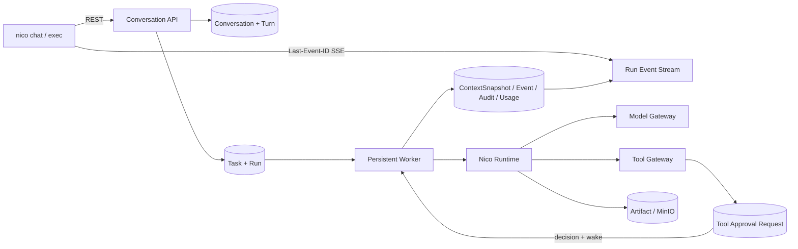

# Nico CLI 一等入口实施计划

- 状态：执行中（Goal A–E 已验证，Goal F 待执行）
- 日期：2026-07-19 UTC
- 范围：`nico chat`、`nico exec` 及其必需的服务端 Conversation 能力

## 1. 目标与硬边界

Nico CLI 是 Nico 平台的正式客户端，而不是在本地复制 Runtime 的演示程序。最终调用链固定为：

```text
用户终端
  -> nico CLI（输入、展示、配置、HTTP/SSE）
  -> Nico API（Conversation/Turn/Task/Run 权威写入）
  -> PostgreSQL 队列事实
  -> Worker（唯一 Agent Loop 执行方）
  -> Runtime / Model Gateway / Tool Gateway
  -> Event / Artifact / Usage / Audit 持久化
  -> REST + SSE 返回 CLI
```

以下约束不可通过后续实现改变：

- CLI 不导入或执行 Runtime Provider、Agent Loop、Tool Executor 或数据库 Session。
- CLI 断开只影响观看连接，不改变 Conversation、Task、Run 或审批状态。
- Conversation 是跨 Run 的平台对象；RuntimeSession 仍只描述一个 Run 的执行器会话。
- 一个用户 Turn 创建一个 Task 和初始 Run；重试复用 Task，产生新的 Run attempt，并由 Turn 指向最新 Run。历史 attempt 由 `Run.retry_of_run_id` 保留。
- AgentVersion 在 Conversation 创建时冻结。改变 AgentVersion 必须新建 Conversation。
- 所有历史事实保存在 PostgreSQL；模型上下文只选取 summary、近期 Turn、受控 Artifact 引用及已治理的 Memory/Skill。
- Goal A 只冻结方案与验收基线，不添加 CLI 或 Conversation 业务实现。

## 2. 仓库现状审计

| 检查项 | 当前实现 | 可复用部分 | 缺口或限制 |
| --- | --- | --- | --- |
| Python 命令入口 | `nico-api`、`nico-worker`、`nico-sandbox-runner` | 现有 Python 包与 `project.scripts` | 没有 `nico` 用户命令，没有命令树或本地 profile |
| Task | PostgreSQL 模型、状态机、创建/读取/转换 API | Tenant/Project/Agent 约束、revision、Event/Audit | 无列表 API；没有 Conversation/Turn 外键 |
| Run | attempt、retry、取消、租约、checkpoint、结果、usage | Worker 队列和完整运行事实 | 无通用 Run 列表；未与用户 Turn 关联 |
| RuntimeSession | 每个 Run 唯一，记录 Provider、loop、checkpoint、usage | 恢复和 Runtime 事实 | 语义和生命周期都不能替代 Conversation |
| Worker | PostgreSQL claim、租约、心跳、恢复、并发执行 | 服务端 Agent Loop 已完整存在 | 工具审批尚无挂起/唤醒实现 |
| ContextSnapshot | 已按 Run 保存 rendered messages、Memory/Skill refs、token estimate、hash | 应演进同一张表，不新建同名旁路模型 | 无 conversation/turn、selected turns、summary hash、artifact refs、token budget |
| SSE | `GET /api/v1/runs/{run_id}/events/stream`，支持 `Last-Event-ID` | CLI 可直接消费并断点续看 | 当前数据库轮询；尚无 CLI SSE parser/renderer |
| Artifact | Run 级上传、列表、下载；PostgreSQL 元数据 + 私有 MinIO | 下载与 Run 产物展示可直接复用 | `/attach` 发生在 Run 前，现有上传必须先有 Run；需要受控暂存 |
| Approval | Growth Approval 用于 Memory/Skill 发布；Run 状态已有 `waiting_for_approval` | 状态枚举、审计模式、Worker suspension 基础 | 没有 ToolApprovalRequest、工具风险策略、审批 API 或审批唤醒条件 |
| AgentMessage | Parent/Child Run 间的委托消息 | 多 Agent 协调链 | 不是用户对话，禁止复用为 ConversationTurn |
| API 身份 | 开发环境 `X-Tenant-ID`/`X-Actor-ID` 上下文 | Goal B profile 可承载这些 header | 尚无正式 API Key/JWT；CLI 不得把开发 header 描述为认证 |
| 终端品牌 | README 有透明背景蓝金白像素猫 PNG | 提取配色、白色中线、猫脸与像素轮廓语言 | 终端不能直接复用 PNG，需要字符化 inspired-by 版本 |
| CLI 测试 | 无 | 后端 pytest、Compose、证据脚本可沿用 | 需建立参数、配置、client、SSE、renderer、E2E 测试层 |

### 2.1 结论

当前执行底座已经足够强，CLI 不应另建执行器。真正的阻塞路径是：Conversation/Turn 权威模型、原子创建 Turn→Task→Run 的应用服务、Run 前附件暂存、上下文选择、工具审批，以及稳定 CLI client。SSE、Run 取消/重试、Artifact 下载、Plan/Step/Tool/Usage/Audit 查询均应直接复用。

## 3. 目标架构



### 3.1 服务端模块边界

建议新增 `nico_agent.conversations` 应用模块，包含 contracts、service、read service 和 API router。它负责 Conversation/Turn 事务编排，但不执行 Runtime。已有 `ControlPlaneService`、ArtifactService 和 ModelRuntimeService 继续拥有各自领域能力。

创建 Turn 必须在单个租户事务中完成：

1. 锁定 Conversation 并验证 active、AgentVersion 未改变及客户端幂等键；
2. 分配单调 `sequence`；
3. 创建 ConversationTurn；
4. 创建 assigned Task，输入中只保存服务端可解析的 Conversation 引用和当前用户输入；
5. 创建 pending Run，冻结 Conversation 的 AgentVersion；
6. 将受控暂存附件物化为该 Run 的 Artifact 引用；
7. 更新 Turn 的 task/run、Conversation.last_turn_id；
8. 同事务写入 Event/Audit，提交后由既有 Worker claim。

API 不同步调用 Worker，也不等待模型完成。`POST .../turns` 返回 `202 Accepted` 以及 conversation、turn、task、run 标识。

### 3.2 CLI 包边界

建议新增 `backend/src/nico_agent/cli/`：

```text
cli/
  app.py            # Typer 命令树和 nico 入口
  config.py         # platformdirs + TOML profile + env override
  client.py         # httpx REST client、错误映射、请求 ID
  sse.py            # 小型增量 SSE parser、Last-Event-ID 重连
  models.py         # CLI 所需的稳定 Pydantic DTO
  output.py         # human/json/no-color 输出策略
  renderers.py      # Rich event/plan/tool/artifact/usage 展示
  logo.py           # coin-cat 固定字符画和降级
  chat.py           # prompt_toolkit 滚动式 REPL
  slash.py          # slash command 解析和补全
```

CLI 依赖方向只能是 `cli -> HTTP contract`，不能是 `cli -> control_plane/runtime/tools implementation`。即使 CLI 与服务端位于同一个 Python distribution，也要通过 HTTP 经过相同租户与审计边界。

### 3.3 输出模式

- 默认 human：Rich 滚动输出，适合交互终端。
- `--json`：stdout 每次只输出一个稳定 JSON 文档；诊断写 stderr；禁用 Logo、spinner 和 ANSI。
- 非 TTY：自动禁用动态 spinner，保留逐行状态；`NO_COLOR` 或 `--no-color` 禁用颜色。
- 错误：统一包含稳定 code、message、request ID；调试模式才显示经过脱敏的细节。

## 4. 数据模型演进

### 4.1 Conversation

新增租户隔离实体：`id`、`tenant_id`、`project_id`、`agent_id`、`agent_version_id`、`title`、`status(active|archived)`、`summary`、`summary_through_sequence`、`summary_model_call_id`、`last_turn_id`、`created_by`、timestamps、revision。

数据库约束必须保证 Project、Agent、AgentVersion 同租户，且 AgentVersion 属于指定 Agent。Conversation 的 `agent_version_id` 创建后不可变。

### 4.2 ConversationTurn

新增：`id`、`tenant_id`、`conversation_id`、`sequence`、`user_input`、`task_id`、`run_id`（当前/最新 attempt）、`status`、`assistant_output`、`artifact_refs`、`usage`、`error`、`idempotency_key`、timestamps、revision。

建议状态：`accepted -> queued -> running -> waiting_for_approval -> completed|failed|cancelled`。状态由 Run 投影服务更新；Conversation API 不发明第二套执行结果。`(tenant_id, conversation_id, sequence)` 与 `(tenant_id, conversation_id, idempotency_key)` 唯一。

### 4.3 ContextSnapshot 增量扩展

保留已有 Run 级 ContextSnapshot，新增可空 `conversation_id`、`conversation_turn_id`，以及 `selected_turn_ids`、`conversation_summary_hash`、`artifact_refs`、`token_budget`。现有 `rendered_messages`、`memory_refs`、`skill_refs`、`token_estimate`、`truncation` 和 `content_hash` 继续作为模型实际输入事实。

这样旧 Run 保持合法，Conversation Run 则拥有更强的可审计字段，不建立重名表，也不改写历史快照。

### 4.4 ConversationAttachment

由于已有 Artifact 强制绑定 Run，而 `/attach` 可发生在提交 Turn 前，新增短生命周期 `ConversationAttachment`：绑定 tenant/conversation、记录私有对象键、SHA-256、大小、类型、状态、上传者、过期时间和一次性消费信息。CLI 读取本地字节后上传，服务端从不访问 CLI 本地路径。

提交 Turn 时，服务端在同一事务内创建 Run-owned Artifact 元数据，复用内容寻址对象，记录 attachment provenance，并把引用写入 Turn。未消费暂存件按 TTL 清理。不得允许任意服务端路径或目录挂载。

### 4.5 ToolApprovalRequest

新增独立于 Growth Approval 的实体，因为二者主体、动作和恢复语义不同：`id`、tenant、run、tool_call、risk level、status(requested|approved|rejected|expired|cancelled)、allowed_scope(once|run)、requester、decided_by、decision、reason、timestamps、revision。

Tool Gateway 命中人工审批策略时必须先持久化 ToolCall 与审批请求，再令 Run/RuntimeSession 进入 suspended/waiting 状态并释放租约。决定 API 原子写入审批 Event/Audit 并把可继续的 Run 置回 claimable 状态。CLI 只是展示并提交决定。

## 5. API 演进

### 5.1 Conversation 与 Turn

| 方法 | 路径 | 语义 |
| --- | --- | --- |
| POST | `/api/v1/conversations` | 解析并冻结 Project/Agent/AgentVersion，创建 Conversation |
| GET | `/api/v1/conversations` | 按 project/agent/status/cursor 分页；支持最近会话 |
| GET | `/api/v1/conversations/{id}` | 会话元数据、最后 Turn 和汇总信息 |
| PATCH | `/api/v1/conversations/{id}` | 第一版只允许 title/status，带 revision |
| GET | `/api/v1/conversations/{id}/turns` | sequence 游标分页，不默认返回完整 ContextSnapshot |
| POST | `/api/v1/conversations/{id}/turns` | 原子创建 Turn/Task/Run，返回 202 |
| GET | `/api/v1/conversation-turns/{id}` | 当前 Run 投影、输出、usage、错误 |
| POST | `/api/v1/conversation-turns/{id}/cancel` | 复用权威 Run tree cancel |
| POST | `/api/v1/conversation-turns/{id}/retry` | 复用 Task/Run retry，更新 Turn.current run |
| POST | `/api/v1/conversations/{id}/compact` | 显式触发受审计 summary（Goal E） |

所有 create/retry/upload 写操作都接受 idempotency key。列表采用有界 limit 和 cursor，不能一次返回整个对话。

### 5.2 附件与审批

| 方法 | 路径 | 语义 |
| --- | --- | --- |
| POST | `/api/v1/conversations/{id}/attachments` | 二进制流式上传到受控暂存区 |
| GET | `/api/v1/conversations/{id}/attachments` | 列出未消费/已物化附件 |
| DELETE | `/api/v1/conversations/{id}/attachments/{attachment_id}` | 删除未消费暂存件 |
| GET | `/api/v1/tool-approval-requests/{id}` | 重连后读取权威审批状态 |
| POST | `/api/v1/tool-approval-requests/{id}/decision` | allow once/run 或 reject，带 revision |

### 5.3 直接复用的现有 API

- Run SSE、Run/Runtime/Trajectory、Plan、Step、ToolCall、ModelCall、ContextSnapshot、Artifact、Child tree、Message、Budget 和 Audit 查询。
- Run cancel/retry。
- Project、Agent、AgentVersion、Model Endpoint、Tool Definition、Memory、Skill 查询。

Goal B 可以为 CLI 可发现性补 Task/Run 列表和过滤，但不得创建仅供 CLI 使用的私有执行端点。

## 6. 对话上下文选择

每个 Conversation Turn 的上下文预算按以下优先级构建：

1. 平台与不可变 AgentVersion 指令；
2. 当前用户输入；
3. 已发布且授权的 Memory/Skill 引用；
4. 最近若干完整 Turn；
5. Conversation summary；
6. 显式附件的有界摘要与引用。

选择器先为不可裁剪项保留预算，再从最近 Turn 向前装入；更早已完成 Turn 由 summary 覆盖。Artifact 正文不默认展开，只有安全的有界摘要或工具读取结果进入消息。每次选择都写入现有 ContextSnapshot；summary 生成单独写入 ModelCall，并保存 `summary_through_sequence` 与输入 hash。恢复同一 Run 必须复用冻结快照，不能重新召回导致输入漂移。

## 7. CLI 命令面

最终命令树保留任务书要求的顶层命令；Goal B 只开放已有 API 能诚实支持的子命令，其余帮助文本标注 `NOT_IMPLEMENTED` 或暂不注册，不能返回 mock 数据。

```text
nico
├── chat
├── exec
├── run
├── conversation
├── agent
├── task
├── project
├── model
├── tool
├── artifact
├── memory
├── skill
├── audit
├── config
├── local
├── health
├── doctor
└── version
```

核心接口：

```text
nico chat [MESSAGE] --project ... --agent ... [--version ...]
          [--resume ID | --continue] [--read-only]
nico exec PROMPT --project ... --agent ... [--input FILE]
          [--output FILE] [--json] [--detach]
nico run watch RUN_ID [--after EVENT_ID]
```

`chat` 使用普通滚动式 prompt_toolkit 输入，不做全屏 TUI。Ctrl+C 在 Run 活跃时请求服务端取消，空闲时只清除当前输入；Ctrl+D 退出客户端；Alt+Enter 插入换行。断线重连使用最后收到的 SSE sequence。

Slash commands 分批落地但名称先冻结：

- 会话：`/help`、`/new`、`/continue`、`/resume`、`/history`、`/conversations`、`/title`、`/exit`；
- 状态：`/status`、`/agent`、`/version`、`/runtime`、`/usage`、`/context`；
- 检查：`/plan`、`/steps`、`/tools`、`/children`、`/messages`、`/artifacts`、`/audit`、`/inspect`；
- 控制：`/cancel`、`/retry`、`/compact`；
- 文件：`/attach`、`/download`。

Goal D 实现不依赖 summary/附件的第一批命令；`/compact`、`/attach` 和附件引用属于 Goal E。只读模式拒绝创建 Turn、取消、重试、改标题、compact 和上传。

## 8. 终端 coin-cat 决策

完整候选和颜色降级见 [CLI 使用与视觉设计](../cli.md)。最终选择候选 A“像素圆章”：固定 19 列、9 行的 Unicode 块字符猫币，Rich 分别施加 muted blue、soft gold、warm white 和 dark outline。它直接提取 README 猫的灰蓝阴影、金色毛面、白色中线/口鼻和像素轮廓，但属于终端友好的 inspired-by 重设计。

终端宽度不足、非 UTF-8、`TERM=dumb` 或 `--no-color` 时使用同一轮廓的 5 行 ASCII 紧凑版；JSON 模式完全不渲染 Logo。

## 9. 分 Goal 路线

| Goal | 交付物 | 关键验收 | 明确不做 |
| --- | --- | --- | --- |
| CLI-A | 审计、总体方案、3 个 Logo 候选、ADR、进度、handoff、证据 | 文档校验、基线回归、无业务代码 | 不添加 `nico` 命令或表 |
| CLI-B | `nico` 入口、profile/config、HTTP client、统一输出、health/doctor/version/config 和基础资源命令 | 参数/config/client 单测；真实 API smoke；JSON/无色降级 | 不实现 chat/Conversation |
| CLI-C | Conversation/Turn/ContextSnapshot 迁移和 API；最小 chat、SSE、resume/continue/history、取消 | 单元 + DB/RLS + API 集成 + 双轮 chat E2E | 不做 summary/附件/完整视觉 |
| CLI-D | exec、run watch、核心 slash commands、Rich renderer、header、coin-cat | detach/watch E2E；TTY/非 TTY/JSON snapshots | 不做上下文压缩和审批 |
| CLI-E | summary、context selection、snapshot 增量字段、受控附件、compact | token 裁剪、summary ModelCall、上传/物化/RLS E2E | 不做本地目录直连 |
| CLI-F | ToolApprovalRequest、策略、挂起/唤醒、CLI 决策、重连审计 | allow once/run/reject、断线重连、Worker 恢复 E2E | 未通过服务端持久化的本地假审批 |

每个阶段必须只把自己能验证的矩阵项升级为 Implemented/Verified，并在独立时间戳证据目录保存日志、响应、渲染和错误样例。

## 10. 测试与证据策略

- 单元：状态机、参数、TOML/env 优先级、错误映射、SSE 分片、slash parser、renderer、上下文预算和审批转换。
- 集成：真实 PostgreSQL/RLS/MinIO/Redis，覆盖 Conversation 创建、Turn 原子链、恢复、附件、summary、审批唤醒。
- E2E：Compose 中使用现有 mock 或 hermetic fake-model；真实 CLI 子进程完成两轮对话、detach/watch、Artifact/usage 查看。
- 视觉：保存彩色 ANSI、无色、窄终端和 JSON 输出；验证没有控制码进入 JSON。
- 兼容：每阶段运行已有全量后端/前端回归和 Alembic 往返；旧 Task/Run API 与非 Conversation Run 必须继续工作。

## 11. 风险与迁移顺序

| 风险 | 控制措施 |
| --- | --- |
| Conversation 服务复制 ControlPlane 规则 | 提取可复用事务内 primitives，公开 API 仍由原 service 主导 |
| Turn/Run 状态双写漂移 | Run 是执行权威；Turn 是有审计的用户视图投影，终态更新幂等 |
| 旧 ContextSnapshot 迁移受损 | 新字段可空、默认空集合；旧 Run 不回填虚假 Conversation |
| SSE 重连重复展示 | sequence 去重并发送 Last-Event-ID；最终状态用 REST 校准 |
| 上传占满存储 | 大小限制、hash、私有对象、TTL、清理和租户配额 |
| CLI 本地配置泄露凭据 | 0600 文件、凭据环境引用、doctor 只显示脱敏来源 |
| 正式认证尚缺失 | 文档明确受信网络边界；profile 不把 tenant header 称作认证 |
| 工具审批错误唤醒 | revision、唯一 pending request、事务内 decision/event/wake、重复决定幂等 |

迁移按 Conversation → Turn → ContextSnapshot nullable 扩展 → Attachment → Approval 分阶段追加。任何与该计划不一致的仓库现实都先通过新 ADR 更新，再修改实现。

## 12. Goal A 验收定义

- 已检查 README、CLI、Task、Run、RuntimeSession、Worker、Artifact、Approval、SSE 和测试基础。
- 差距、目标数据流、模型/API 演进、兼容路径和 Goal A–F 范围已冻结。
- 至少三个 coin-cat 候选已记录并选择一个最终主版本。
- 关键决策均有 Accepted ADR。
- progress、feature matrix 与 handoff 已更新，未实现项明确标记 `NOT_IMPLEMENTED`。
- 文档、链接、格式、Git diff 和既有测试通过，证据归档在 `artifacts/goals/cli-goal-a/<timestamp>/`。
