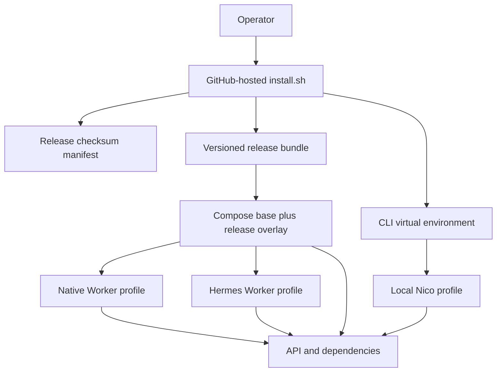
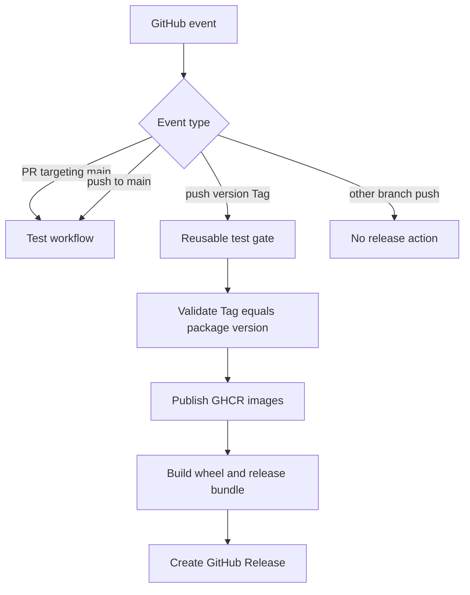

# One-command Installation and Tag Releases - Plan

## Goal Capsule

- **Objective:** Replace the repository-oriented first-run flow with a GitHub-hosted installer that installs the Nico service stack and CLI together, starts exactly one selected Runtime worker, and leaves a usable local profile.
- **Authority:** The user-confirmed GitHub installer, service/CLI joint installation, main-branch test gate, and tag-only Release gate override inferred implementation preferences.
- **Execution profile:** Packaging and deployment work should use shell-level contract tests first where practical, followed by the repository's backend and frontend test gate and a Compose configuration smoke check.
- **Stop conditions:** Stop before publishing a real GitHub Release, pushing images, changing repository/package visibility, or creating a Tag; those are externally mutating release operations outside local implementation.
- **Tail ownership:** Local implementation, tests, documentation, and workflow validation are in scope. Tag creation and the first live Release remain operator actions.

---

## Product Contract

### Summary

Nico will provide a GitHub-hosted one-command installer that downloads an immutable release bundle, verifies it, installs the CLI, configures and starts the Compose service stack, bootstraps the local profile, and supports Native or Hermes worker selection. GitHub Actions will test changes targeting or entering `main`, while only version Tags create release assets and publish versioned container images.

### Problem Frame

The current first-run path exposes repository mechanics to operators: copying environment files, building every application image locally, creating a Python virtual environment, installing the backend package, running the demo, extracting a Tenant ID, configuring a CLI profile, and manually replacing the default Worker for Hermes. These are valid contributor workflows but form a fragile installation contract for ordinary users.

The repository also advertises a CI badge but has no workflow files. Without a branch test gate and deterministic Tag release pipeline, the proposed GitHub installer URL cannot point at a reproducible, tested artifact.

### Requirements

#### Installation experience

- R1. A public GitHub URL installs the Nico service stack and local CLI from one script without requiring a repository clone.
- R2. The installer supports `native` and `hermes` Runtime choices and ensures only the selected production-facing Worker runs.
- R3. A successful default installation starts the stack, waits for readiness, bootstraps reusable local resources, configures the `local` CLI profile, and prints immediately usable commands and identifiers.
- R4. Re-running the installer is idempotent: existing secrets and persistent Docker volumes are preserved while versioned deployment files, images, and the CLI are updated.
- R5. The installer supports an explicit version, installation directory, non-interactive mode, and a no-start mode suitable for automation.
- R6. Downloaded release content is verified against a SHA-256 manifest before extraction or installation.
- R7. Provider credentials are never accepted as visible command-line arguments; Hermes credentials are read from existing environment variables or hidden interactive input and written to a private deployment environment file.

#### Release artifacts

- R8. Each version Tag produces a release bundle containing the Compose definition, release overlay, environment template, bootstrap helpers, CLI wheel, version metadata, and operator documentation.
- R9. Each version Tag publishes immutable, multi-architecture backend, Hermes Worker, and web images to GHCR under the Tag version.
- R10. A Release is created only after the Tag matches the Python package version, repository tests pass, images publish successfully, and release checksums are generated.

#### Continuous integration

- R11. Pull requests targeting `main` and pushes to `main` run the existing backend lint/unit and frontend test/build gate plus installer/release contract tests.
- R12. Normal branch pushes and merges do not create GitHub Releases or publish release images.
- R13. The Tag release workflow reuses the same test contract instead of maintaining a divergent release-only test list.

#### Documentation and compatibility

- R14. Contributor source-build commands remain available and keep their current behavior.
- R15. User-facing documentation distinguishes the one-command release install from source/development installation and documents upgrade, status, logs, shutdown, Runtime selection, and uninstall boundaries.

### Acceptance Examples

- AE1. Given a clean supported Linux, macOS, or WSL shell with Docker Compose v2 and Python 3.11+, when the latest installer runs with the Native default, then it verifies the bundle, installs `nico`, starts the Native stack, creates a reusable demo profile, and `nico doctor` succeeds.
- AE2. Given an existing installation with customized secrets and volumes, when the installer upgrades to a newer version, then those secrets and volumes remain intact while the current release pointer, CLI, and image Tags advance.
- AE3. Given `--runtime hermes`, when the installer starts services, then the Native Worker is stopped or inactive, the Hermes Worker is active, and configured Provider secrets are available only inside its environment.
- AE4. Given a merge commit pushed to `main`, when GitHub Actions evaluates triggers, then the Test workflow runs and no Release workflow starts.
- AE5. Given a matching `vX.Y.Z` Tag, when GitHub Actions completes, then tests run before images and assets publish and the GitHub Release contains the installer, bundle, version file, and checksums.
- AE6. Given a Tag that differs from the package version, when the Release workflow validates metadata, then it fails before image or Release publication.

### Scope Boundaries

- The first release targets Docker Compose on Linux, macOS, and WSL; native Windows PowerShell installation and Kubernetes/Helm remain out of scope.
- The installer may detect missing Docker but will not silently install or reconfigure the Docker daemon with elevated privileges.
- The release remains an Alpha/local or trusted-network deployment; this work does not add production authentication, backup automation, a secret manager, image signing, or public-network hardening.
- The installer bootstraps the existing deterministic Demo resources. It does not invent new model-endpoint or AgentVersion administration APIs.

#### Deferred to Follow-Up Work

- Publish the CLI as a separate minimal-dependency package or standalone binary instead of installing the current combined Python distribution.
- Add signed provenance/attestations and SBOM verification beyond SHA-256 release checksums.
- Add native PowerShell installation and a package-manager distribution channel.

---

## Planning Contract

### Key Technical Decisions

- KTD1. Use a GitHub Release `latest/download/install.sh` URL as the stable public entry point and immutable Tag URLs for pinned installations. (session-settled: user-approved — chosen over `raw.githubusercontent.com/main`: Release assets keep the installer and bundle tied to a tested version.)
- KTD2. Install service deployment files and the HTTP CLI together through one orchestrator while keeping them as separate runtime components. (session-settled: user-approved — chosen over combining the CLI and server into one process or container: they have different lifecycle, privilege, and remote-use requirements.)
- KTD3. Run tests on pull requests to and pushes into `main`, and trigger release publication only from version Tags. (session-settled: user-directed — chosen over releasing on every merge to `main`: ordinary integration must not mutate release or package state.)
- KTD4. Publish three versioned GHCR images: the shared backend image, the Hermes-enabled Worker image, and the web image. The release overlay selects these images with `--no-build`; contributor Compose continues to retain local build definitions.
- KTD5. Package a constant-name release archive and `version.txt` so the stable latest installer can resolve an immutable Tag, download a fixed asset name, and verify it using the same Release's checksum manifest.
- KTD6. Keep deployment secrets in one mode-`0600` environment file outside versioned release directories, and point each release at it. Upgrades replace an atomic `current` pointer rather than overwriting operator configuration.
- KTD7. Use Compose profiles in a release-only overlay to make the Native and Hermes Workers mutually exclusive without breaking the existing contributor and E2E Compose defaults.
- KTD8. Implement a small installed service-management command beside `nico` for start, stop, status, logs, doctor, and uninstall-safe lifecycle operations; `nico` itself remains a remote HTTP client.
- KTD9. Reuse the repository's `scripts/test.sh` as the authoritative Test workflow and add focused shell contract tests for installer parsing, environment preservation, release bundle contents, Runtime selection, and version validation.

### High-Level Technical Design





### Output Structure

```text
.github/workflows/
  ci.yml
  release.yml
deploy/
  docker-compose.release.yml
scripts/
  install.sh
  nico-service.sh
  package-release.sh
  test-install.sh
docs/
  installation.md
```

### Assumptions

- The repository and GHCR packages will be publicly readable before the first public installer announcement.
- Version Tags use the `vX.Y.Z` form and initially match `backend/pyproject.toml` plus `nico_agent.__version__`.
- GitHub-hosted runners can build the three current Dockerfiles for `linux/amd64` and `linux/arm64`; a build failure blocks rather than degrading to a partial Release.
- The existing Demo bootstrap remains the first-run proof until a dedicated setup API and production authentication model exist.

### Risks and Mitigations

- **Remote-script trust:** A curl-pipe entry point executes before it can verify itself. Documentation will provide a download-inspect-run alternative, while the script verifies all secondary assets.
- **Compose drift:** Base and release behavior can diverge. The release overlay stays narrow and contract tests render both Native and Hermes configurations.
- **GHCR visibility:** A successful push can still leave packages private. The first live release checklist must verify anonymous pulls before advertising the installer.
- **Partial upgrades:** CLI installation or service startup can fail after files download. Releases are extracted into version directories and the `current` pointer changes only after validation; existing config and volumes remain recoverable.
- **Secret leakage:** Shell traces, arguments, logs, and generated artifacts can expose credentials. Credential flags are forbidden, private files use restrictive permissions, and tests scan installer output and bundles for sentinel secrets.

### Sources and Research

- Existing contributor orchestration: `scripts/dev.sh`, `scripts/lib.sh`, `scripts/demo.sh`, `scripts/test.sh`, and `docker-compose.yml`.
- Existing CLI installation and remote-client contract: `docs/cli.md` and `backend/pyproject.toml`.
- Existing Hermes profile and fail-closed boundary: `docs/runtime.md`, `backend/Dockerfile.hermes`, and `backend/src/nico_agent/runtime/hermes.py`.
- Hermes one-command precedent: <https://github.com/NousResearch/hermes-agent/blob/main/scripts/install.sh>.
- GitHub workflow trigger contract: <https://docs.github.com/en/actions/reference/workflows-and-actions/events-that-trigger-workflows>.
- GitHub reusable workflows and token permissions: <https://docs.github.com/en/actions/how-tos/reuse-automations/reuse-workflows> and <https://docs.github.com/en/actions/tutorials/authenticate-with-github_token>.
- GitHub container publication guidance: <https://docs.github.com/en/actions/tutorials/publish-packages/publish-docker-images>.

---

## Implementation Units

### U1. Release-aware Compose deployment

- **Goal:** Make application images selectable by immutable release references and make Native/Hermes workers mutually exclusive for installed deployments without changing source-development defaults.
- **Requirements:** R2, R4, R7, R9, R14; KTD4, KTD7.
- **Dependencies:** None.
- **Files:** `docker-compose.yml`, `deploy/docker-compose.release.yml`, `.env.example`, `scripts/test-install.sh`.
- **Approach:** Add overridable image references to locally built services, explicitly pass supported Hermes Provider secrets, and use the release overlay to attach a Native profile and pull policy. Preserve the base Compose service names and existing Goal/E2E behavior.
- **Patterns to follow:** Existing profile usage for `worker-hermes` and `goal-*`; existing exact environment-variable mapping rather than broad environment inheritance.
- **Test scenarios:**
  - Render the source Compose default and confirm the normal Worker remains available without a profile.
  - Render the release overlay with the Native profile and confirm only the Native Worker is selected.
  - Render the release overlay with the Hermes profile and confirm the Hermes Worker and state initializer are selected while the Native Worker is inactive.
  - Supply sentinel image Tags and Provider variables and confirm interpolation reaches only the intended services without exposing values in generated tracked files.
- **Verification:** Both contributor and release Compose configurations render successfully, existing Compose checks remain compatible, and worker selection is deterministic.

### U2. Installer and local service lifecycle

- **Goal:** Deliver the one-command installer, versioned layout, private configuration handling, CLI installation, service lifecycle helper, readiness wait, Demo bootstrap, and automatic local profile configuration.
- **Requirements:** R1-R7, R14; AE1-AE3; KTD1, KTD2, KTD5, KTD6, KTD8.
- **Dependencies:** U1.
- **Files:** `scripts/install.sh`, `scripts/nico-service.sh`, `scripts/test-install.sh`.
- **Approach:** Keep parsing and filesystem helpers sourceable for contract tests. Resolve latest or pinned Release assets, verify checksums, extract into a new version directory, preserve the shared environment file, install the bundled wheel into a managed virtual environment, install command wrappers on `PATH`, switch the current release atomically, start the chosen profile, run the existing Demo bootstrap, and configure the CLI from its persisted identifiers.
- **Execution note:** Start with failing shell contract cases for argument validation, environment preservation, checksum rejection, and Runtime command selection before implementing the installer helpers.
- **Patterns to follow:** `scripts/lib.sh` logging/readiness helpers, `scripts/demo.sh` reusable-state behavior, Hermes installer separation of code/data/command locations.
- **Test scenarios:**
  - Default and explicit supported options parse to stable values; invalid Runtime, malformed version, conflicting modes, and missing non-interactive inputs fail before download.
  - A first install creates private random secrets; a second install changes image/version entries without changing existing secrets or unrelated operator values.
  - A checksum mismatch aborts before extraction and leaves the current release pointer unchanged.
  - Native and Hermes service commands activate only their selected profile and stop the alternate Worker during a switch.
  - A custom installation directory produces wrappers that continue to resolve the correct deployment root.
  - Provider tokens supplied through environment or hidden input never appear in stdout, command arguments recorded by fakes, or release files.
- **Verification:** Focused installer tests pass, `bash -n` accepts all scripts, and a local dry-run/fake-command harness proves the intended download-to-profile flow without external mutations.

### U3. Deterministic release packaging

- **Goal:** Build a self-contained, constant-name release bundle and validate all version relationships before publication.
- **Requirements:** R6, R8, R10; AE5, AE6; KTD5.
- **Dependencies:** U1, U2.
- **Files:** `scripts/package-release.sh`, `scripts/test-install.sh`, `.gitignore`.
- **Approach:** Validate the Tag against package metadata, accept an already-built wheel, assemble only the deployment/runtime files needed by the installer, generate `version.txt` and a checksum manifest, and keep generated release output ignored locally.
- **Execution note:** Prove invalid-Tag rejection and expected archive contents with a fake wheel before wiring the successful package path.
- **Patterns to follow:** Existing strict shell scripts using `set -euo pipefail`, shared logging conventions, and explicit file allowlists.
- **Test scenarios:**
  - A matching semantic version produces the expected archive names and allowlisted members.
  - A mismatched or malformed Tag fails without leaving a publishable bundle.
  - Missing wheel or required deployment input fails with a clear non-zero result.
  - The checksum manifest verifies every public release asset and changes when an asset changes.
- **Verification:** The contract test extracts the bundle, compares its member set, verifies checksums, and confirms no `.env`, Git metadata, caches, evidence, or credentials are included.

### U4. Main branch test workflow

- **Goal:** Run the repository's real local quality gate on pull requests to and pushes into `main`, while exposing the same gate for the Release workflow.
- **Requirements:** R11-R13; AE4; KTD3, KTD9.
- **Dependencies:** U2, U3.
- **Files:** `.github/workflows/ci.yml`, `scripts/test.sh`, `docs/testing.md`.
- **Approach:** Define a reusable workflow with read-only permissions, pinned Python/Node setup, dependency caching, the existing test script, and installer/release contract tests. Limit push branches to `main`; keep pull-request validation for proposed changes.
- **Test scenarios:**
  - Static workflow validation confirms `push.branches` and `pull_request.branches` contain `main`, `workflow_call` is enabled, and no package/content write permission is granted.
  - The job invokes the existing backend/frontend gate and the new installer contract gate.
  - A local run of the same scripts succeeds from a clean dependency install.
- **Verification:** Workflow syntax is parseable, its trigger/permission contract is asserted locally, and the referenced local commands pass.

### U5. Tag-only image and GitHub Release workflow

- **Goal:** Publish tested multi-architecture images and verified Release assets only for valid version Tags.
- **Requirements:** R8-R13; AE5, AE6; KTD3-KTD5.
- **Dependencies:** U3, U4.
- **Files:** `.github/workflows/release.yml`, `scripts/test-install.sh`, `docs/installation.md`.
- **Approach:** Trigger only on `v*` Tag pushes, call the reusable test workflow first, validate version metadata before write-capable jobs, grant `packages: write` only to image publication and `contents: write` only to Release publication, build all image variants for AMD64/ARM64, package the wheel and deployment bundle, and create or update the matching Release idempotently.
- **Test scenarios:**
  - Static validation confirms no branch trigger or manual release path can publish and all publishing jobs depend on tests/version validation.
  - A mismatched Tag fails in the read-only validation stage before registry login.
  - Image definitions point to the expected Dockerfiles, architectures, GHCR names, and immutable Tag.
  - Release creation uploads the installer, bundle, version metadata, and checksum manifest and supports safe workflow reruns.
- **Verification:** Workflow syntax and trigger/permission assertions pass, packaging succeeds locally with a real wheel, and no live Tag, image, or Release is created during local verification.

### U6. Installation and operations documentation

- **Goal:** Make the GitHub installer the primary user path while retaining explicit contributor instructions and honest Alpha/security boundaries.
- **Requirements:** R1, R5, R7, R14, R15.
- **Dependencies:** U2-U5.
- **Files:** `README.md`, `docs/installation.md`, `docs/cli.md`, `docs/configuration.md`, `docs/runtime.md`, `docs/testing.md`.
- **Approach:** Lead with latest and pinned GitHub commands, document inspect-before-run, prerequisites, Native/Hermes selection, Provider-secret handling, lifecycle helper commands, upgrades and removal, and describe the Test/Release trigger contract. Keep source build and existing Hermes limitations visible.
- **Patterns to follow:** Existing concise README quick start, security warnings in `docs/security.md`, and current CLI/Profile examples.
- **Test scenarios:**
  - Documentation links reference files and commands that exist.
  - The docs checker passes and generated installation snippets match installer options and workflow asset names.
  - No documentation claims production hardening, credentialed Hermes model validation, automatic Docker installation, or release publication before those are true.
- **Verification:** Documentation checks pass and a reader can follow latest install, pinned install, source development, Runtime switch, update, status/log, and removal paths without consulting repository internals.

---

## Verification Contract

| Gate | Scope | Done signal |
| --- | --- | --- |
| `bash -n scripts/install.sh scripts/nico-service.sh scripts/package-release.sh scripts/test-install.sh` | U2-U3 | All release shell entry points parse successfully. |
| `scripts/test-install.sh` | U1-U5 | Installer, packaging, Compose, workflow trigger, permission, and secret-preservation contracts pass. |
| `scripts/check-docs.py` | U6 | Repository Markdown links and hygiene remain valid. |
| `scripts/test.sh` | U1-U6 | Ruff, backend unit tests, frontend component tests, TypeScript, and production build pass. |
| Real wheel plus release package smoke | U3, U5 | A wheel and bundle are created, checksums verify, and archive contents match the allowlist. |
| Native/Hermes Compose render smoke | U1-U2 | Both installed profiles render with immutable images and without concurrent alternative workers. |
| Secret sentinel scan | U1-U6 | Test credentials do not appear in stdout, tracked files, bundle members, or checksum inputs. |

---

## Definition of Done

- The stable latest and immutable version GitHub installer URLs documented by the project correspond to assets produced by the Tag workflow.
- A fresh installation can install both the services and CLI, start Native by default, bootstrap local resources, configure a CLI profile, and report readiness.
- An upgrade preserves deployment secrets and Docker volumes and can switch safely between Native and Hermes worker profiles.
- Pull requests targeting `main` and pushes to `main` execute tests without release permissions or release side effects.
- Only a valid matching version Tag can reach image publication and GitHub Release creation, and it must pass the shared test gate first.
- Release artifacts are allowlisted, checksummed, version-consistent, and free from local configuration, caches, evidence, or secrets.
- Contributor source workflows and existing E2E entry points remain functional.
- User, CLI, Runtime, configuration, testing, and operational documentation describe the implemented behavior and limitations.
- Abandoned experimental code and generated release outputs are absent from the final diff.
