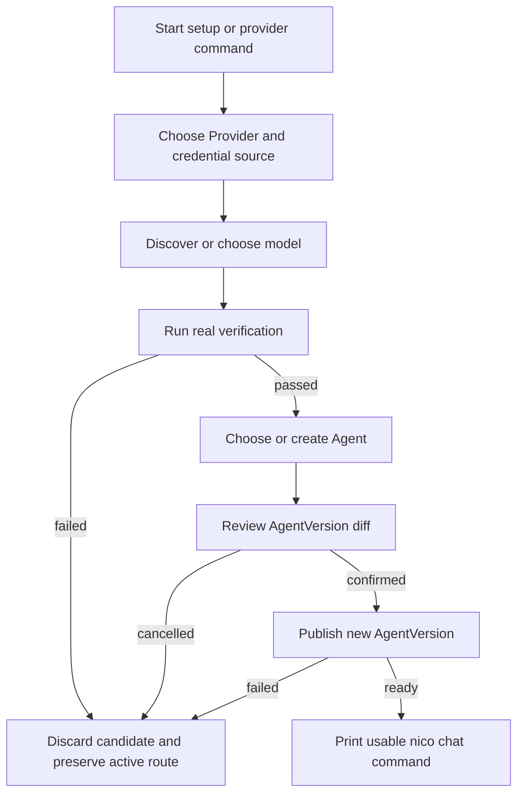
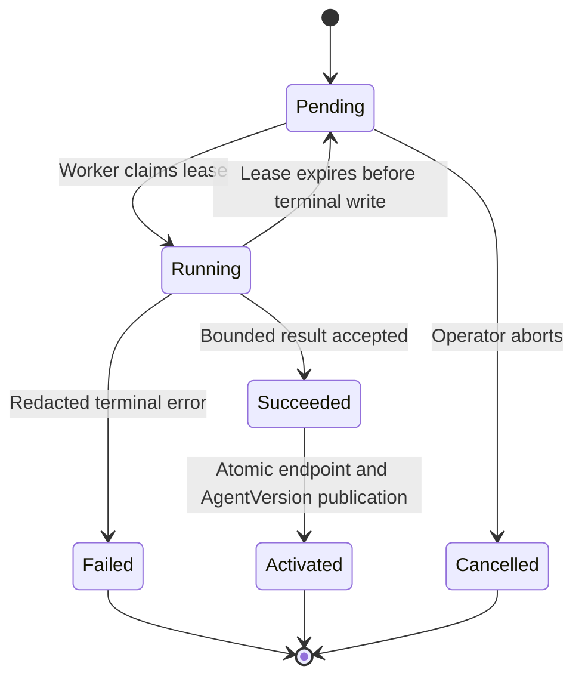

# Interactive Provider Onboarding - Plan

## Goal Capsule

- **Objective:** Let a local Nico operator configure a mainstream model Provider, verify it with a real model call, bind it to an Agent, and start `nico chat` through one guided CLI flow.
- **Product authority:** The user-confirmed transactional wizard, local-first deployment model, Provider and protocol coverage, immutable AgentVersion binding, and rollback behavior define the product contract.
- **Open blockers:** None. Stop implementation if a change would require storing raw Provider secrets in the database, bypassing the Worker for verification, mutating a referenced endpoint or published AgentVersion, or weakening existing tenant isolation.
- **Execution profile:** Deep, cross-cutting code work spanning migrations, Native model adapters, Worker jobs, local service lifecycle, CLI interaction, release packaging, and CI.
- **Tail ownership:** The implementing workflow owns code, migrations, tests, documentation, release-contract updates, and review fixes through the Definition of Done; it must not publish a release tag or contact paid Provider APIs automatically.

---

## Product Contract

### Summary

Nico will add a transactional, interactive Provider onboarding flow shared by first-run setup and ongoing Provider management. The flow finishes only when credentials and a model have been verified, an Agent has a newly published compatible version, and the operator receives an immediately usable `nico chat` command.

### Problem Frame

Nico already has a CLI chat experience, tenant-scoped model endpoints, environment-backed credential references, and immutable AgentVersion publication. These capabilities are disconnected from the operator's setup journey: the CLI cannot create or test Provider configurations, the deployment exposes only a narrow secret surface, and a user must understand internal API and service details before a real model can answer.

The current Native Runtime only speaks the OpenAI-compatible protocol. That does not provide first-class access to Anthropic Messages or Google Gemini, and it does not give users a maintained catalog of common Provider defaults or a safe way to test changes before activation.

### Key Decisions

- **Ready-to-chat completion.** The wizard includes credential input, model selection, a real connectivity test, Agent binding, publication, and a final chat command. (session-settled: user-directed — chosen over stopping after credential storage: installation is successful only when the user can converse with a real model.)
- **Local-first deployment control.** The first version may update Nico's private local deployment configuration and coordinate a Worker restart. (session-settled: user-directed — chosen over a centralized remote credential service: the immediate target is the one-machine service-and-CLI installation.)
- **Broad first-party preset coverage.** Nico ships presets for OpenAI, Anthropic, Google Gemini, OpenRouter, xAI, DeepSeek, Alibaba Cloud Bailian/Qwen, Moonshot/Kimi, Zhipu GLM, and MiniMax. (session-settled: user-directed — chosen over a small initial Provider set: common international and Chinese Provider choices should work without manual endpoint research.)
- **Three protocol families.** Provider onboarding supports OpenAI-compatible, Anthropic Messages, and Google Gemini request protocols. (session-settled: user-directed — chosen over treating every Provider as OpenAI-compatible: first-class presets must reflect materially different upstream APIs.)
- **Hybrid model selection.** Nico combines curated recommended models, live discovery where supported, preset fallback, and manual model ID entry. (session-settled: user-directed — chosen over either a static-only or discovery-only catalog: users need current choices without making setup depend on optional discovery APIs.)
- **Shared dual entry point.** `nico setup` invokes the same guided flow automatically when no usable model route exists, while `nico provider add`, `configure`, `test`, and `list` expose repeatable management. (session-settled: user-directed — chosen over separate first-run and maintenance experiences: setup behavior must not drift from later Provider management.)
- **Immutable Agent binding.** Selecting an existing Agent clones its current published AgentVersion, preserves its behavior and policies, changes only the Runtime/model route, shows the change, and publishes the new version after confirmation. (session-settled: user-directed — chosen over mutating a published version or applying a global Provider default: model changes remain explicit and auditable.)
- **API-key-first authentication.** The first version accepts hidden API Key input, an existing environment variable, or an existing Secret reference. (session-settled: user-directed — chosen over OAuth and subscription-account login: key-based authentication covers the target Providers without adding browser and token-refresh lifecycles.)
- **Transactional activation.** Failed verification or publication leaves the previous Provider route active and removes temporary configuration created by the attempt. (session-settled: user-directed — chosen over retaining partial setup state: a failed onboarding attempt must not break existing chats or leave ambiguous credentials and endpoints.)
- **Data-driven core catalog.** Provider presets are maintained as product-owned data and use the transactional flow built on Nico's existing model endpoint and AgentVersion concepts. (session-settled: user-directed — chosen over a local credential broker or third-party Provider marketplace: the first version stays small enough to ship while preserving an extension path.)

### Actors

- A1. **Local operator:** Installs Nico, supplies or references credentials, chooses a model and Agent, reviews changes, and starts chat.
- A2. **Nico CLI:** Guides the operator, masks secrets, explains validation results, and coordinates the setup transaction.
- A3. **Nico control plane:** Owns tenant-scoped Provider metadata, AgentVersion creation and publication, audit behavior, and authoritative state.
- A4. **Nico Worker:** Resolves credentials, uses the selected protocol adapter, performs verification and later Runs, and reports stable failures without exposing secrets.

### Requirements

**Entry points and guidance**

- R1. `nico setup` must detect that the active profile lacks a usable real-model route and offer the Provider wizard before declaring setup complete.
- R2. `nico provider add`, `nico provider configure`, `nico provider test`, and `nico provider list` must reuse the same Provider definitions, validation rules, and status vocabulary as first-run setup.
- R3. Interactive prompts must explain the selected Provider, credential source, model, target Agent, and consequences before activation, while non-interactive use must fail with actionable instructions instead of waiting for input.

**Provider and model catalog**

- R4. The built-in catalog must include OpenAI, Anthropic, Google Gemini, OpenRouter, xAI, DeepSeek, Alibaba Cloud Bailian/Qwen, Moonshot/Kimi, Zhipu GLM, and MiniMax with recognizable display names and safe defaults.
- R5. Each preset must identify its supported protocol family, service location, authentication expectation, model-selection capabilities, and documentation link without embedding credentials.
- R6. Native model execution must support OpenAI-compatible, Anthropic Messages, and Google Gemini protocol families through a common Nico capability contract.
- R7. Model selection must prefer live discovery when the Provider supports it, fall back to curated recommendations when discovery is unavailable or fails, and always permit a manually entered model ID.
- R8. A discovery failure must be presented separately from a credential or completion failure so the operator can continue with a preset or manual model.

**Credentials and local service integration**

- R9. The wizard must accept a hidden API Key, an existing environment variable, or an existing Nico Secret reference and must never accept a secret as a visible command-line argument.
- R10. Raw credentials must not be stored in Nico database records, AgentVersions, events, audit payloads, command history, normal output, or logs; persisted model endpoints hold only logical credential references.
- R11. A locally entered key must be written only to the installation's private secret configuration with owner-only access and made available only to services that require it.
- R12. If a credential change requires a Worker restart, the CLI must coordinate readiness checks and must not report success until the Worker can use the new configuration.

**Verification and activation**

- R13. Provider verification must make a bounded real completion through the same protocol adapter and Worker environment used by subsequent Nico Runs; a metadata or health request alone is insufficient.
- R14. Verification must distinguish authentication, model availability, protocol compatibility, network, rate-limit, and upstream service failures using actionable redacted messages.
- R15. Provider and model activation must occur only after successful verification; testing a candidate must not replace an existing working route.
- R16. Repeating setup with the same Provider configuration must reconcile the existing connection instead of creating indistinguishable duplicate endpoints.
- R17. `nico provider list` must show configured connections, selected or available models, usability state, and last successful verification without revealing credential values.

**Agent binding and chat handoff**

- R18. The wizard must let the operator choose the target Project and an existing Agent, then clone the Agent's current published version while preserving its role, instructions, goals, tools, memory, skills, plugins, coordination policy, budgets, and execution mode.
- R19. The cloned version must change only the fields necessary to select the Native Runtime, verified model endpoint, model ID, and compatible model configuration.
- R20. Before publication, the CLI must show a human-readable diff between the current and proposed AgentVersion and require confirmation in interactive mode.
- R21. If no suitable Agent exists, the wizard must create a minimal Starter Agent and published version in the selected Project without adding optional tools or permissions.
- R22. Successful onboarding must print the selected Provider, model, Agent, published version, and a copyable `nico chat` command containing the required Project and Agent identifiers.
- R23. Adding or changing a Provider route must affect only the selected or newly created AgentVersion; other Agents and existing Conversations retain their frozen versions.

**Failure safety**

- R24. A failed verification, rejected confirmation, failed publication, or failed readiness check must leave the previously published AgentVersion and Provider route usable.
- R25. Rollback must remove temporary secrets, candidate endpoint state, and unpublished version state created solely by the failed attempt, while preserving pre-existing operator configuration.
- R26. When applying a local secret would restart a Worker that owns non-terminal Runs, onboarding must stop before mutation and tell the operator to retry after those Runs finish or are explicitly cancelled.

### Key Flows



- F1. **First-run setup**
  - **Trigger:** A1 runs `nico setup` for a healthy local installation with no verified real-model Agent route.
  - **Actors:** A1, A2, A3, A4
  - **Steps:** The CLI selects a Provider and credential source, discovers or accepts a model, verifies a real completion, creates or selects an Agent, previews the version change, publishes it, and prints the chat command.
  - **Outcome:** The installation has one verified, published route that can immediately answer through `nico chat`.
  - **Covered by:** R1, R3-R15, R18-R22
- F2. **Ongoing Provider management**
  - **Trigger:** A1 adds, reconfigures, lists, or retests a Provider after initial setup.
  - **Actors:** A1, A2, A3, A4
  - **Steps:** The CLI reuses the catalog and validation flow, stages changes without replacing the active route, verifies them, and binds them only to the selected Agent after confirmation.
  - **Outcome:** Provider maintenance is repeatable and scoped to the intended AgentVersion.
  - **Covered by:** R2, R7-R17, R18-R20, R23
- F3. **Failed or unsafe activation**
  - **Trigger:** Verification, readiness, publication, or the active-Run safety check fails, or A1 declines the preview.
  - **Actors:** A1, A2, A3, A4
  - **Steps:** Nico stops activation, reports a redacted actionable reason, cleans attempt-owned temporary state, and rechecks the previous route when one exists.
  - **Outcome:** Existing chats remain usable and no ambiguous partial configuration becomes active.
  - **Covered by:** R14-R15, R24-R26

### Acceptance Examples

- AE1. **Covers R1, R4-R7, R9-R15, R21-R22.** Given a fresh local Nico installation with no real-model Agent, when the operator completes `nico setup` with a valid preset credential and model, then Nico verifies a real completion, publishes a Starter AgentVersion, and the printed `nico chat` command receives a real response.
- AE2. **Covers R18-R20, R22-R23.** Given an Agent with a published version and established conversations, when the operator binds a verified Provider, then the CLI previews only the Runtime/model changes, publishes a cloned version after confirmation, and existing conversations remain frozen to their original version.
- AE3. **Covers R7-R8.** Given a Provider whose model-list operation is unavailable, when discovery fails, then the CLI explains that discovery alone failed and still allows a recommended or manually entered model ID to be verified.
- AE4. **Covers R10, R13-R15, R24-R25.** Given a working Agent and an invalid replacement key, when real verification returns an authentication error, then output is redacted, the old Agent route remains current, and no attempt-owned secret, active endpoint, or draft version remains.
- AE5. **Covers R12, R24, R26.** Given a non-terminal Run on the local Worker, when applying a new secret would require restarting that Worker, then the CLI performs no mutation and reports how to retry safely.
- AE6. **Covers R6, R13-R14.** Given valid credentials for each supported protocol family, when the operator tests one OpenAI-compatible Provider, Anthropic, and Google Gemini, then each verification uses its declared protocol and yields the same high-level ready or actionable-failure experience.
- AE7. **Covers R2, R16-R17.** Given an already configured Provider, when the operator runs setup or add again with the same logical connection, then Nico updates or retests that connection without creating an indistinguishable duplicate and `nico provider list` shows its latest safe status.
- AE8. **Covers R3, R9-R10.** Given a non-interactive shell, when a required selection or secret is missing, then the command exits with machine-readable guidance and never prompts, echoes, or places a key in process arguments.

### Success Criteria

- A new local installation can progress from no Provider configuration to a real `nico chat` response without editing Compose files, environment files, or API payloads manually.
- All ten named Provider presets are selectable, and at least one representative integration from each of the three protocol families passes the same contract test suite.
- Failure-path tests prove that existing Agent routes and conversations remain usable and that attempt-owned secret material is absent from persisted metadata and captured output.
- CLI help and documentation make first-run setup, later Provider management, supported authentication sources, and recovery behavior discoverable without reading internal architecture documents.

### Scope Boundaries

**Included in the first version**

- Interactive local onboarding for the Nico Native Runtime and its model gateway.
- Product-owned presets plus custom model IDs within the three supported protocol families.
- API Key, environment-variable, and existing Secret-reference authentication.
- Safe Worker configuration coordination for the one-machine installation profile.

**Deferred for later**

- OAuth, device-code, browser login, subscription-account reuse, and automatic token refresh.
- Centralized server-side secret storage for remote multi-user deployments.
- Automatic Provider fallback, multi-model load balancing, cost-based routing, and policy-driven model selection.
- Third-party Provider packs or a Provider plugin marketplace.
- Multiple credential accounts for the same Provider when they require account-aware routing rather than separately named connections.

**Outside this feature's identity**

- Replacing Hermes' own model configuration flow; Hermes is a UX reference, while this contract configures Nico Native model execution.
- Silently changing every Agent or migrating existing Conversations when a Provider is added.

### Dependencies and Assumptions

- The installed local profile can securely update its private service environment and invoke the existing service lifecycle command without requiring the user to find deployment files.
- Model endpoint writes remain an explicit deployment policy, and local onboarding can detect and explain when that policy prevents configuration.
- Provider model discovery is optional and inconsistent; curated recommendations and manual model IDs are therefore permanent fallback paths rather than temporary compatibility workarounds.
- Upstream Provider APIs and model names change over time, so preset metadata must be independently updateable and validated without changing the interaction contract.
- Existing model endpoint isolation, logical credential references, immutable AgentVersions, and Conversation version freezing remain authoritative platform behavior.

### Outstanding Questions

#### Resolve Before Planning

- None.

#### Deferred to Planning

- Define the initial recommended-model entries and capability declarations from current official Provider documentation.
- Choose bounded verification prompt, timeout, retry, and token limits that minimize cost while proving a real completion.
- Define how staged local secrets and Worker readiness are coordinated atomically across first install, credential rotation, and rollback.
- Decide the stable machine-readable error and exit-code vocabulary for discovery, verification, policy, restart-safety, and publication failures.

### Sources and Research

- Existing CLI commands and remote-client boundary: `backend/src/nico_agent/cli/app.py`, `backend/src/nico_agent/cli/client.py`, and `docs/cli.md`.
- Existing model endpoint, credential reference, and write-policy behavior: `backend/src/nico_agent/model_api.py`, `backend/src/nico_agent/model_api_schemas.py`, and `.env.example`.
- Existing immutable AgentVersion creation and publication behavior: `backend/src/nico_agent/api_schemas.py`, `backend/src/nico_agent/domain_api.py`, and `backend/src/nico_agent/control_plane.py`.
- Existing Native model gateway and OpenAI-compatible adapter: `backend/src/nico_agent/worker.py` and `backend/src/nico_agent/models/providers/openai_compatible.py`.
- Existing local service and secret surface: `docker-compose.yml`, `deploy/docker-compose.release.yml`, `scripts/install.sh`, and `scripts/nico-service.sh`.
- OpenClaw onboarding and wizard references: <https://docs.openclaw.ai/start/wizard> and <https://docs.openclaw.ai/reference/wizard>.
- Hermes CLI and setup references: <https://github.com/nousresearch/hermes-agent/blob/main/website/docs/reference/cli-commands.md> and <https://hermes-agent.nousresearch.com/docs/getting-started/quickstart>.

---

## Planning Contract

Product Contract preservation note: the Product Contract above is unchanged from the requirements-only artifact; its R/A/F/AE IDs and session-settled decisions remain authoritative.

### Key Technical Decisions

- KTD1. **Keep the Provider catalog server-owned and versioned.** `nico` fetches one authoritative catalog from the control plane rather than embedding Provider defaults in the CLI. The response carries a contract schema version plus the catalog content revision. Each preset declares a stable key, protocol, regional base URL choices, authentication scheme, discovery strategy, recommended text models, capability defaults, non-secret option schema, documentation URL, and catalog revision. An incompatible remote CLI fails with an upgrade instruction instead of guessing at unknown fields. This extends the existing thin-CLI boundary and lets a server upgrade refresh presets independently of the installed CLI. (session-settled: user-approved — chosen over a CLI-owned catalog: the confirmed scope keeps the CLI thin and API-backed.)
- KTD2. **Use three explicit wire-protocol adapters behind the existing `ModelProvider` contract.** Retain `openai_compatible`, add `anthropic_messages` and `google_gemini`, and add a separate optional discovery contract rather than making discovery mandatory for every adapter. This preserves provider-neutral Runtime code while allowing Anthropic's top-level system field and version header and Gemini's model-addressed streaming endpoint to be represented correctly. (session-settled: user-directed — chosen over treating every Provider as OpenAI-compatible: upstream protocols differ materially.)
- KTD3. **Run discovery and verification as durable Worker-owned probes.** A tenant-scoped `ProviderProbe` queue supports `discover_models` and `verify_completion`; the Native Worker claims probes with leases and uses the same adapter registry, environment, DNS/SSRF policy, and HTTP limits used by Runs. Probe execution has its own default concurrency of one and cannot consume the configured Run execution slots. The API and CLI never call a model company directly. Candidate hashes use one versioned canonical JSON encoding with normalized URLs, sorted object keys, and explicit absent/default values so create, verify, preview, and activation compare the same bytes. A probe persists only candidate metadata, bounded discovered model metadata, usage/request identifiers, timing, and redacted error categories. (session-settled: user-approved — chosen over direct CLI probes: only Worker execution proves the installed service can use the credential.)
- KTD4. **Use one bounded completion contract for verification.** Verification sends a fixed benign prompt, requests at most 16 output tokens, uses no tools or structured output, applies a 45-second overall timeout, and disables automatic model-call retry. Any non-empty text completion is success; exact wording is not required. Discovery and completion have separate probe records and error categories, so discovery failure remains non-fatal while completion failure blocks activation.
- KTD5. **Treat every configuration attempt as a candidate until atomic activation.** Successful verification produces an expiring, single-consumption activation capability bound to the candidate configuration hash, tenant, model, credential reference, and catalog revision. Before confirmation, the control plane computes a canonical activation preview containing the proposed endpoint/AgentVersion projection, the exact changed fields, expected revisions, and a preview hash. Final activation locks the logical connection and target Agent, recomputes and compares that preview, creates or reuses the correct endpoint revision, clones or creates the AgentVersion, publishes it, updates the Agent pointer, consumes the capability, and writes audit/event records in one database transaction. Any exception rolls the entire database mutation back. (session-settled: user-directed — chosen over partially active endpoint and version state: failed setup must preserve the working route.)
- KTD6. **Reconcile logical connections by Provider stable key.** Version 1 supports one default logical connection per Provider per tenant. Repeating `setup`, `add`, or `configure` reuses an identical verified endpoint or creates the next immutable revision under the same stable key; it never patches referenced endpoint semantics. `provider test` creates a fresh probe for an existing revision without changing Agent bindings. Multiple account-aware connections remain deferred.
- KTD7. **Store Provider identity and verification provenance on immutable endpoint revisions.** Extend `ModelEndpoint` with `provider_key`, `catalog_revision`, schema-validated `provider_options`, `verified_probe_id`, and `verified_at`. Expand the protocol constraint to the three supported families and extend the immutable-endpoint trigger to cover the new semantic fields. Legacy endpoint rows migrate to `provider_key=custom`, keep their current behavior, and do not become implicitly verified. Downgrade is supported only while no feature-created probe or non-legacy endpoint revision exists; otherwise it fails before destructive DDL and directs the operator to restore legacy Agent routes and remove feature state under the documented rollback procedure.
- KTD8. **Make only new local key entry a recoverable service transaction.** The installer creates a separate owner-only model-secret environment file and records an absolute `service_command` in the local CLI profile. Before sending a secret, the CLI resolves and attests that command as an owner-controlled regular file under the expected installation root with no symbolic-link traversal or group/other write permission. It invokes the command without a shell and passes secrets, maintenance capabilities, and local-control request payloads only over stdin. Each rotation gets a new `NICO_MODEL_SECRET_*` reference, so rollback deletes only attempt-owned data and never needs to copy an old secret. Selecting an existing environment or Secret reference skips maintenance and Worker recreation and probes the current Worker environment; an unavailable reference fails with provisioning/restart guidance. (session-settled: user-approved — chosen over storing keys in the CLI profile or database: the confirmed scope keeps secrets local to the installation.)
- KTD9. **Hold a deployment-wide maintenance lease across local secret onboarding.** Before the secret file changes, a local-only control command atomically refuses when any non-terminal Run exists and activates a PostgreSQL-backed maintenance lease. A database-level Run insertion guard covers direct creation, retry, Conversation, and child/subagent paths, while the Run claim function uses the same advisory-lock protocol; both fail closed under an active lease. Provider probes remain claimable. The lease has a non-secret attempt ID for API correlation and a separate bearer token used only by stdin-bound local-control renew/release operations; activation may submit the attempt ID over HTTP but never the bearer token. The CLI renews the lease through prompts, Worker recreation, verification, and activation, then commits or rolls back the secret transaction before releasing it. This closes the check-then-restart race. (session-settled: user-approved — chosen over a one-time active-Run check: the confirmed scope requires no new Run to appear during Worker replacement.)
- KTD10. **Recreate only the Native Worker and prove its generation is healthy.** The Worker publishes a container health signal only after its adapter registry and probe loop are initialized. Its supervisor treats an unexpected exit of any Run or probe execution task as fatal, withdraws readiness, and exits non-zero so Compose cannot keep reporting a partially dead Worker as healthy. Secret staging forces recreation of the `worker` service, waits for that new container to become healthy, and leaves API, Web, PostgreSQL, Redis, MinIO, and Sandbox Runner running. Verification then proves the credential and protocol. The flow refuses Hermes mode because this feature configures Nico Native.
- KTD11. **Make the interactive wizard and automation use one application service.** `nico setup` and the four `nico provider` commands call a shared CLI onboarding coordinator backed exclusively by `NicoApiClient` and the narrow local `ServiceBridge`. TTY mode uses hidden prompts and a human-readable AgentVersion diff; its model step shows the curated recommendation first, renders discovered model IDs in deterministic pages of 20 with next/back controls, and always offers exact manual entry. `provider list` remains compact by default, while `provider list --models <provider> --limit <n>` exposes a bounded model view using the repository's existing `--limit` convention. Non-TTY/JSON mode requires every selection, including the exact model ID, as an option or structured input and never prompts. (session-settled: user-directed — chosen over separate setup and maintenance implementations: both entry points must remain behaviorally identical.)
- KTD12. **Reject raw key upload for remote profiles.** A profile without a trusted local `service_command` may reference an already provisioned `env:NICO_MODEL_SECRET_*` value but cannot submit a raw API key. This is an intentional human-authorization boundary until a remote secret manager and caller authentication model exist. (session-settled: user-approved — chosen over adding a remote credential endpoint: centralized secret storage is deferred.)
- KTD13. **Keep model recommendations useful but non-authoritative.** The catalog ships a dated recommendation snapshot, live discovery is preferred when supported, and manual model IDs always remain available. Catalog validation checks syntax, duplicate keys, HTTPS defaults, protocol compatibility, and documentation URLs; it does not promise a Provider's model alias will remain available forever.
- KTD14. **Use stable error categories and compact process exit classes.** API and probe records use specific redacted codes; the CLI maps them to `0` success, `2` invalid or incomplete input, `3` Nico API/local-service unavailability, `4` policy or safety precondition failure, `5` discovery/verification failure, `6` activation conflict, and `1` unexpected failure. All upstream model IDs, display names, error details, and request identifiers are length-bounded and stripped of terminal control characters before persistence or rendering. `--json` emits the same error code and safe details as interactive mode.
- KTD15. **Test wire behavior with local fakes in standard CI.** Standard CI covers all presets, the three protocol adapters, the complete onboarding state machine, secret leakage checks, and rollback through local fake Provider servers. Paid live-Provider smoke tests are opt-in and manual, require explicit credentials, and are never a release prerequisite. (session-settled: user-approved — chosen over paid live calls in normal CI: tests must be deterministic and must not consume operator accounts.)
- KTD16. **Preserve the agent-native boundary.** Catalog reads, probes, connection status, and activation are API resources that other trusted clients can automate. Raw credential entry, local service restart, and maintenance-lease ownership remain operator-only and are not exposed as Runtime tools; a running Agent cannot retrieve or rotate its own Provider secret.
- KTD17. **Define setup readiness from authoritative verified routing.** `nico setup` is already complete only when at least one current published AgentVersion selects `nico_native`, an enabled endpoint revision with successful verification provenance, and a model allowed by that revision. Legacy endpoints without verification provenance, draft/superseded versions, disabled endpoints, and Hermes-only routes do not suppress the wizard. If no Project exists, setup stops with the existing Project-creation API guidance; Provider onboarding does not silently create a Project outside the Product Contract.

### Provider Catalog Baseline

The initial `2026-07-20` catalog snapshot uses these defaults. Implementers must verify every model ID against the linked official source while coding and may replace a retired recommendation with the current stable general-purpose equivalent without changing the Product Contract.

| Provider key | Protocol | Default service location | Discovery | Initial recommendation | Provider-specific options |
|---|---|---|---|---|---|
| `openai` | `openai_compatible` | `https://api.openai.com/v1` | `GET /models` | `gpt-5.6-terra` | None |
| `anthropic` | `anthropic_messages` | `https://api.anthropic.com` | `GET /v1/models` with pagination | `claude-sonnet-5` | API version fixed by adapter and catalog revision |
| `google-gemini` | `google_gemini` | `https://generativelanguage.googleapis.com/v1beta` | `GET /models` with pagination and supported-action filtering | `gemini-3.5-flash` | None |
| `openrouter` | `openai_compatible` | `https://openrouter.ai/api/v1` | `GET /models` | `openrouter/auto` | Optional non-secret application title and site URL remain out of the first wizard |
| `xai` | `openai_compatible` | `https://api.x.ai/v1` | `GET /models`; richer language-model metadata is optional | `grok-4.3` | None |
| `deepseek` | `openai_compatible` | `https://api.deepseek.com` | `GET /models` | `deepseek-v4-flash` | Do not ship legacy aliases scheduled for retirement |
| `alibaba-bailian` | `openai_compatible` | Region-selected DashScope compatible-mode URL | Curated/manual fallback | `qwen3.7-plus` | Region is required; workspace ID is optional and non-secret |
| `moonshot-kimi` | `openai_compatible` | `https://api.moonshot.cn/v1` | Curated/manual fallback | `kimi-k3` | None |
| `zhipu-glm` | `openai_compatible` | `https://open.bigmodel.cn/api/paas/v4` | Curated/manual fallback | `glm-5.2` | Coding-plan endpoints are not auto-selected |
| `minimax` | `openai_compatible` | Region-selected `https://api.minimax.io/v1` or `https://api.minimaxi.com/v1` | `GET /models` | `MiniMax-M2.7` | Region is required; Anthropic compatibility is not the v1 default |

### Probe and Activation State



- `discover_models` success stores at most 1,000 normalized text-capable model records and a continuation/truncation flag; it never stores the upstream response body.
- `verify_completion` success stores response presence, usage, Provider request ID, latency, adapter protocol, and completion time; it never stores generated text.
- Probe leases follow the existing Run lease pattern but use their own claim function and worker identity. A probe retries only when its lease expires before terminal persistence; it does not retry a completed upstream error automatically. Database triggers make terminal probe fields immutable except for the one activation transition, which must match the verified candidate hash and set activation provenance once.
- A successful verification is activatable for 15 minutes, exactly once, and only when the activation request's candidate hash matches. Expiration is derived from the immutable success timestamp and does not mutate a succeeded probe into another status.

### Local Secret Transaction

```mermaid
sequenceDiagram
  participant CLI as Nico CLI
  participant Service as nico-service
  participant Control as Local control command
  participant Worker as Native Worker
  participant API as Control plane API

  CLI->>Service: Begin attempt; secret on stdin
  Service->>Control: Acquire maintenance lease
  Control-->>Service: Refuse if any Run is non-terminal
  Service->>Service: Atomically stage unique secret reference
  Service->>Worker: Recreate only Native Worker
  Worker-->>Service: New generation healthy
  CLI->>API: Discover and verify through ProviderProbe
  Worker->>API: Claim probe and persist redacted result
  CLI->>API: Activate verified candidate and AgentVersion
  alt activation succeeds
    CLI->>Service: Commit secret transaction
  else failure or cancellation
    CLI->>Service: Roll back attempt-owned secret and recreate Worker
  end
  Service->>Control: Release maintenance lease
```

The local bridge writes `config/model-secrets.env` with mode `0600` through same-directory temporary-file replacement and `fsync`. `docker-compose.yml` injects only this file into the Native Worker through `env_file`; it is separate from infrastructure settings. Transaction journals contain the attempt UUID, environment-variable name, state, and timestamps, never the secret value. Before any new Provider command starts, a stale uncommitted journal is rolled back to a clean pre-attempt state; the wizard never resumes after the credential or confirmation boundary. Local users with Docker daemon access can inspect container environments and are therefore inside the trusted deployment boundary; the feature does not claim to protect Provider keys from a Docker-privileged actor.

### Error Contract

| Category | Stable API/CLI code | Retry guidance | Secret-safe detail |
|---|---|---|---|
| Discovery unsupported/unavailable | `PROVIDER_DISCOVERY_UNAVAILABLE` | Continue with recommendation or manual ID | Provider and high-level cause only |
| Authentication rejected | `PROVIDER_AUTH_FAILED` | Replace or reprovision credential | No upstream body or key fragment |
| Model missing/inaccessible | `PROVIDER_MODEL_UNAVAILABLE` | Choose another model | Requested model ID may be shown |
| Wire contract mismatch | `PROVIDER_PROTOCOL_ERROR` | Check preset/base URL or upgrade Nico | Protocol and bounded parser reason |
| DNS/network/timeout | `PROVIDER_NETWORK_ERROR` / `PROVIDER_TIMEOUT` | Retry after connectivity check | Hostname is allowed; resolved private addresses are not |
| Rate limit | `PROVIDER_RATE_LIMITED` | Retry after Provider limit resets | Retry hint when supplied, no raw headers |
| Other upstream rejection | `PROVIDER_UPSTREAM_ERROR` | Consult request ID and Provider status | HTTP class and Provider request ID |
| Endpoint writes disabled | `PROVIDER_WRITES_DISABLED` | Enable deployment policy explicitly | Policy name only |
| Active Run or maintenance conflict | `PROVIDER_RESTART_BLOCKED` | Finish/cancel Runs or wait for other setup | Safe Run count and lease age, no other-tenant identifiers |
| Run creation during Provider maintenance | `RUNTIME_MAINTENANCE` | Retry after the active setup transaction finishes | Safe lease age only, no owner token or tenant identifiers |
| Local bridge unavailable/untrusted | `PROVIDER_LOCAL_CONTROL_UNAVAILABLE` | Use a local installed profile or preprovisioned Secret ref | Expected service path and validation failure |
| Stale Agent/config revision | `PROVIDER_ACTIVATION_CONFLICT` | Refresh preview and confirm again | Current revision and resource type |

### Resolved Planning Questions

- **Catalog entries and capabilities:** Resolved by KTD1, KTD2, KTD13, and the dated Provider Catalog Baseline. Capabilities are conservative per preset and are further filtered by live discovery when metadata supports it.
- **Bounded verification:** Resolved by KTD3 and KTD4. Verification is a single non-retried, no-tool completion with 16 output tokens and a 45-second deadline.
- **Staged secrets and Worker readiness:** Resolved by KTD8-KTD10 and the Local Secret Transaction. The maintenance lease spans the entire attempt and the new Worker generation must become healthy before probes start.
- **Errors and exit codes:** Resolved by KTD14 and the Error Contract.

### Sequencing and Dependency Rules

1. Land the persistence migration, catalog contracts, and protocol adapters before any API or CLI surface depends on them.
2. Add the probe queue and Worker execution before activation, because activation may consume only a succeeded verification.
3. Add the maintenance gate before secret staging, because no code path may mutate the secret file without the restart-safety invariant.
4. Add atomic activation before the CLI wizard, then keep the wizard as orchestration over stable API and service contracts.
5. Update installer/release packaging and end-to-end coverage only after local profile metadata, secret-file injection, and service bridge commands are stable.

### System-Wide Impact

- **Persistence and tenancy:** One migration expands `model_endpoints`, adds tenant-scoped probe rows with RLS, adds a deployment-scoped maintenance lease guarded from ordinary tenant reads, and updates the Run claim function. The migration must preserve existing endpoints, AgentVersions, Runs, and the downgrade path.
- **Run lifecycle:** Run creation and claiming fail closed while maintenance is active. Every Run-producing API maps the database guard to the stable `RUNTIME_MAINTENANCE` domain conflict instead of leaking a database exception. Provider probes continue so setup can complete. No current Run state transition changes, and existing lease recovery remains authoritative after normal Worker process loss.
- **Model execution:** All Native model traffic continues through `ModelGateway`; three adapters must emit the same stream event contract. Provider-specific headers and bodies are confined to adapters, and endpoint snapshots retain only non-secret configuration.
- **Secrets:** The database, API, CLI config, events, audit rows, probe results, test snapshots, and logs never contain raw keys. Only the owner-readable model-secret file and Worker process environment contain values.
- **CLI/API parity:** Every non-secret wizard action has an API operation and JSON representation. Local secret application is deliberately outside the public API and behind the installed service command.
- **Compatibility:** Catalog responses expose an explicit schema version. CLI clients accept known schema versions, ignore only documented additive fields, and fail safely when a server requires a newer contract.
- **Deployment:** Only the Native Worker consumes `model-secrets.env`; API and Web do not. Worker health becomes observable to Compose. Release packaging must include the changed service script and documentation without changing the one-script installation entry point.
- **Existing conversations:** Activation publishes a new AgentVersion pointer for future conversations and Runs. Existing Conversations and Runs retain their frozen AgentVersion and endpoint snapshot.
- **Setup detection:** The readiness projection joins current published AgentVersion, enabled verified endpoint revision, and allowed model. It is API-owned so CLI versions do not independently infer whether setup is complete.

### Risks and Mitigations

| Risk | Mitigation and proof |
|---|---|
| Provider APIs or model aliases change after release | Dated catalog revision, live discovery, manual IDs, documentation links, and schema tests; recommendations are replaceable data rather than CLI code. |
| Secret or maintenance capability appears in argv, logs, HTTP errors, fixtures, or persistence | Stdin-only bridge and local-control payloads, trusted-command attestation, unique env references, recursive redaction, no response-body persistence, captured-output scans, process-argument tests, and database assertions using a canary key. |
| Untrusted Provider metadata injects terminal control sequences | Bound and sanitize all model IDs, display names, request IDs, and error text before persistence and before Rich/plain/JSON rendering; include ANSI, bidi, carriage-return, and newline fixtures. |
| Run starts between safety check and Worker recreation | Deployment-wide maintenance lease checked by both Run creation and claim paths under a common database lock. |
| CLI exits or is interrupted mid-attempt | Context-managed cleanup, renewable lease, attempt journal, idempotent commit/rollback, and mandatory stale-attempt rollback before the next Provider command; no partial wizard resume. |
| Activation races with Agent or connection edits, or the displayed diff differs from publication | Server-generated preview hash, expected revisions, row/advisory locks, candidate-hash binding, in-transaction preview recomputation, single-use activation, and full transaction rollback. |
| Probe traffic starves ordinary Agent Runs | A separate probe poll loop and concurrency budget defaulting to one; Run worker concurrency is never borrowed by probes. |
| Adapter accepts an unsafe endpoint | Reuse the OpenAI adapter's DNS pinning, HTTPS, redirect, proxy, size, and private-host policies through shared HTTP safety helpers and protocol-specific tests. |
| Discovery returns too much or misleading metadata | Response byte limits, item caps, text-generation capability filtering, explicit truncation, curated fallback, and final completion verification. |
| Maintenance lease exposes cross-tenant state | Local control reports only aggregate blocking counts; ordinary tenant APIs cannot read or mutate the deployment-wide row. |
| Migration blocks existing endpoint use or an old binary reads new protocol state | Backfill `provider_key=custom`, retain `openai_compatible` behavior, validate upgrade/downgrade on real PostgreSQL, and avoid declaring legacy endpoints verified. Refuse schema downgrade once feature data exists; the rollback runbook first restores legacy Agent routes and verifies no feature references remain. |
| SECURITY DEFINER queue or maintenance functions bypass tenant controls | Pin `search_path`, fully qualify objects, parameterize values, validate caller inputs, grant execute only to the intended runtime roles, revoke `PUBLIC`, and test cross-tenant and wrong-role calls. |
| Standard CI becomes flaky or costly | Use deterministic fake Provider servers and local dependencies; keep paid Provider smoke tests manual and non-blocking. |

### Research Grounding

- The CLI must remain an HTTP/SSE client and must not import Worker or ORM internals: `docs/decisions/ADR-0011-first-class-thin-cli-and-terminal-stack.md`.
- Referenced endpoint semantics must create a revision rather than mutate in place: `backend/migrations/versions/20260718_0010_native_model_runtime.py`.
- Existing Runtime leasing and immutable AgentVersion publication patterns: `backend/src/nico_agent/database.py`, `backend/src/nico_agent/runtime/service.py`, and `backend/src/nico_agent/control_plane.py`.
- OpenAI Chat Completions and model listing: <https://developers.openai.com/api/reference/resources/chat/subresources/completions/methods/create> and <https://developers.openai.com/api/reference/resources/models/methods/list>.
- Anthropic Messages, model listing, and version header: <https://platform.claude.com/docs/en/api/messages/create>, <https://platform.claude.com/docs/en/api/models/list>, and <https://platform.claude.com/docs/en/api/versioning>.
- Gemini streaming generation and model listing: <https://ai.google.dev/api/generate-content> and <https://ai.google.dev/api/models>.
- OpenRouter OpenAI-compatible API and model metadata: <https://openrouter.ai/docs/api/reference/overview> and <https://openrouter.ai/docs/guides/overview/models>.
- xAI Chat Completions and model listing: <https://docs.x.ai/developers/rest-api-reference/inference/chat> and <https://docs.x.ai/developers/rest-api-reference/inference/models>.
- DeepSeek Chat Completions and models: <https://api-docs.deepseek.com/api/create-chat-completion> and <https://api-docs.deepseek.com/api/list-models>.
- Alibaba Cloud Model Studio OpenAI compatibility and regional API keys: <https://help.aliyun.com/zh/model-studio/text-generation> and <https://help.aliyun.com/zh/model-studio/get-api-key>.
- Moonshot/Kimi Chat Completions: <https://platform.kimi.com/docs/api/chat>.
- Zhipu HTTP and Chat Completions: <https://docs.bigmodel.cn/cn/guide/develop/http/introduction> and <https://docs.bigmodel.cn/api-reference/%E6%A8%A1%E5%9E%8B-api/%E5%AF%B9%E8%AF%9D%E8%A1%A5%E5%85%A8>.
- MiniMax OpenAI-compatible Chat Completions and models: <https://platform.minimax.io/docs/api-reference/text-chat-openai> and <https://platform.minimax.io/docs/api-reference/models/openai/list-models>.

---

## Implementation Units

### U1. Provider catalog and persistence foundation

- **Goal:** Establish versioned Provider metadata and durable candidate/provenance state without changing the behavior of legacy endpoints.
- **Requirements:** R4-R5, R7-R8, R10, R16-R17; F1-F2; AE3, AE7.
- **Dependencies:** None.
- **Files:** `backend/src/nico_agent/provider_onboarding/__init__.py`, `backend/src/nico_agent/provider_onboarding/catalog.py`, `backend/src/nico_agent/provider_onboarding/contracts.py`, `backend/src/nico_agent/domain/models.py`, `backend/src/nico_agent/domain/states.py`, `backend/migrations/versions/20260720_0020_provider_onboarding.py`, `backend/tests/unit/test_provider_catalog.py`, `backend/tests/integration/test_provider_onboarding.py`.
- **Approach:** Define immutable Pydantic catalog records, an explicit response schema version, and the dated ten-Provider snapshot. Add `ProviderProbe` persistence and endpoint provenance fields, RLS policies, indexes for claim/list/idempotency, uniqueness for logical connections and attempts, protocol constraints, terminal immutability, and the expanded endpoint immutability trigger. Normalize and sanitize all Provider-controlled model metadata at the contract boundary. Backfill legacy endpoints as `custom` without verification provenance. Make downgrade preflight refuse any destructive step when probes or non-legacy endpoint revisions exist.
- **Test scenarios:** Validate every preset key, HTTPS URL, protocol, recommendation, region option, documentation URL, schema version, and content revision; reject duplicates, unsafe URLs, unknown options, secret-looking catalog data, unsupported protocol values, oversized model metadata, and terminal control characters. Prove a compatible CLI accepts documented additive fields and an incompatible schema produces an upgrade error. On PostgreSQL, upgrade from the current head with a referenced legacy endpoint and prove it still runs, cannot be semantically mutated, is isolated by tenant, and can coexist with a new revision. Prove an unused feature schema downgrades and re-upgrades without loss to pre-existing tables, while a used feature schema refuses downgrade before dropping data.
- **Verification:** Catalog unit tests pass; the migration round trip passes through `scripts/test-integration.sh`; querying as `nico_runtime` cannot see another tenant's probes or the deployment maintenance record.

### U2. Anthropic, Gemini, and model-discovery adapters

- **Goal:** Make all three protocol families produce the existing provider-neutral stream contract and support optional bounded discovery.
- **Requirements:** R5-R8, R13-R14; F1-F2; AE3, AE6.
- **Dependencies:** U1.
- **Files:** `backend/src/nico_agent/models/contracts.py`, `backend/src/nico_agent/models/errors.py`, `backend/src/nico_agent/models/gateway.py`, `backend/src/nico_agent/models/http_safety.py`, `backend/src/nico_agent/models/providers/openai_compatible.py`, `backend/src/nico_agent/models/providers/anthropic_messages.py`, `backend/src/nico_agent/models/providers/google_gemini.py`, `backend/src/nico_agent/models/providers/__init__.py`, `backend/src/nico_agent/worker.py`, `backend/tests/unit/test_model_gateway.py`, `backend/tests/unit/test_model_provider_adapters.py`.
- **Approach:** Extract the existing endpoint validation, DNS pinning, bounded response, TLS, redirect, proxy, and redaction machinery into a shared internal helper. Implement Anthropic message/system/tool/usage/SSE translation and Gemini content/system/tool/usage/SSE translation without leaking wire-specific shapes above the adapter. Add a separate `ModelDiscoveryProvider` contract and gateway method; OpenAI-compatible, Anthropic, and Gemini implementations normalize model IDs and capability hints with pagination and hard limits.
- **Test scenarios:** For each protocol, cover text streaming, split UTF-8/SSE lines, tool-call deltas, usage, request IDs, system prompts, malformed events, oversized bodies, timeouts, authentication/rate-limit/upstream classification, secret redaction, DNS rebinding, redirects, private-address denial, and allowed loopback fakes. Discovery covers pagination, truncation, duplicate IDs, capability filtering, unsupported discovery, and failure without affecting later manual verification.
- **Verification:** Adapter contract tests assert identical `ModelStreamEvent` semantics for three fake upstreams; no protocol adapter imports CLI, ORM, or control-plane modules; the existing OpenAI gateway suite remains green.

### U3. Durable Provider probe execution

- **Goal:** Execute discovery and real verification inside the Native Worker with durable leases, idempotency, redacted results, and bounded cost.
- **Requirements:** R7-R8, R10, R13-R17; F1-F3; AE3-AE4, AE6-AE7.
- **Dependencies:** U1-U2.
- **Files:** `backend/src/nico_agent/provider_onboarding/service.py`, `backend/src/nico_agent/provider_onboarding/api.py`, `backend/src/nico_agent/database.py`, `backend/src/nico_agent/config.py`, `backend/src/nico_agent/api.py`, `backend/src/nico_agent/worker.py`, `backend/src/nico_agent/testing/fake_model.py`, `backend/tests/unit/test_provider_probe.py`, `backend/tests/integration/test_provider_onboarding.py`, `backend/tests/integration/test_provider_probe_worker.py`.
- **Approach:** Add create/get/cancel probe endpoints, a minimal SECURITY DEFINER claim function with a pinned `search_path` and least-privilege grants, a `ProviderProbeWorker`, and a separately configured Worker loop parallel to Run execution. Probe concurrency defaults to one and does not reduce or share Run execution slots. Bind every probe to the versioned canonical candidate hash and idempotency key. Discovery emits capped normalized metadata. Verification uses KTD4 limits and writes only safe telemetry. Expired leases become reclaimable; succeeded/failed/cancelled probes are terminal and immutable except for single-use activation metadata.
- **Test scenarios:** Prove semantically identical candidates produce the same hash while URL, protocol, option, model, or credential-reference changes do not. Prove same-key submission is idempotent, two Workers cannot own one probe, probe concurrency is independently bounded while Run execution proceeds, expired leases recover, cancellation is terminal, completion is non-retried, discovery failure is distinguishable, and terminal rows reject mutation. Verify `PUBLIC` and unrelated roles cannot execute the claim function, every error category is redacted, and a canary secret is absent from API JSON, events, audit rows, logs, exception strings, and all probe columns. Feed ANSI, bidi, carriage-return, newline, oversized, and invalid-Unicode model metadata and prove persisted and rendered values are safe. Cross-tenant get/claim/activate attempts fail.
- **Verification:** Integration tests observe a real fake completion made from the Worker process, not the API/CLI process; probe results contain no generated text or raw upstream body; AE3, AE4, and AE6 pass against local fakes.

### U4. Deployment-wide maintenance gate and Worker readiness

- **Goal:** Prevent Run creation or claiming during secret application and make Worker replacement observable without exposing cross-tenant state.
- **Requirements:** R12, R24, R26; F3; AE5.
- **Dependencies:** U1.
- **Files:** `backend/src/nico_agent/local_control.py`, `backend/src/nico_agent/control_plane.py`, `backend/src/nico_agent/database.py`, `backend/src/nico_agent/worker.py`, `backend/migrations/versions/20260720_0020_provider_onboarding.py`, `docker-compose.yml`, `deploy/docker-compose.release.yml`, `backend/tests/unit/test_worker.py`, `backend/tests/integration/test_provider_maintenance.py`.
- **Approach:** Add a singleton maintenance lease and a common PostgreSQL advisory lock used by maintenance acquisition, a database-level guard on every Run insertion path, and Run claiming. Map guard rejections at every Run-producing service boundary to `DomainConflict("RUNTIME_MAINTENANCE", ...)`, preserving the existing HTTP conflict envelope. All SECURITY DEFINER helpers pin `search_path`, fully qualify objects, revoke `PUBLIC`, and grant only the minimum application role. The local control module runs only inside the installed API container, returns aggregate safe JSON, and supports acquire/renew/release by opaque attempt token. Add a Worker health marker after registry/probe initialization and a Compose healthcheck tied to the running process. Supervise both Run and probe task sets continuously; an unexpected task exit removes readiness and terminates the Worker non-zero so Compose restarts the whole generation.
- **Test scenarios:** Acquire fails without mutation for each non-terminal Run status, including pending, paused, approval, tool, and subagent waits. Direct task Runs, retries, Conversation Runs, and child/subagent Runs all hit the same database guard and return the same redacted `RUNTIME_MAINTENANCE` conflict rather than an integrity/database error. Concurrent Run insertion/claim cannot cross an acquired gate. Expired leases fail open only after TTL, token mismatch cannot renew/release, unauthorized roles cannot invoke helpers, ordinary tenant requests cannot inspect the global row, and probes remain claimable. A recreated Worker reports unhealthy before initialization and healthy afterward; forced failure of either a Run loop or the probe loop withdraws readiness, exits non-zero, and causes a generation restart.
- **Verification:** A concurrency integration test repeatedly races maintenance acquisition with Run creation and observes no accepted Run after acquisition; AE5 proves the secret file and Worker container are untouched when a Run blocks restart.

### U5. Local secret transaction and service bridge

- **Goal:** Stage, commit, recover, and roll back local Provider keys without exposing them or restarting unrelated services.
- **Requirements:** R9-R12, R24-R26; F1-F3; AE4-AE5, AE8.
- **Dependencies:** U4.
- **Files:** `scripts/lib.sh`, `scripts/nico-service.sh`, `scripts/install.sh`, `.env.example`, `docker-compose.yml`, `deploy/docker-compose.release.yml`, `backend/src/nico_agent/cli/config.py`, `backend/src/nico_agent/cli/service_bridge.py`, `backend/tests/unit/test_cli_config.py`, `backend/tests/unit/test_cli_service_bridge.py`, `scripts/test-install.sh`.
- **Approach:** Create `config/model-secrets.env`, add only that file to the Native Worker environment, explicitly reset the inherited `env_file` on `worker-hermes` and `worker-hermes-contract`, and extend the local profile with the absolute installed service command. Implement stdin-only service operations around a unique env name, attempt journal, maintenance lease, atomic file update, Worker-only force recreation, health wait, and idempotent commit/rollback. The Python bridge uses an argv array with `shell=False`, attests the canonical command path, owner, file type, directory chain, and mode before opening a secret channel, sends all sensitive or capability-bearing control fields on stdin, validates the JSON response contract, renews maintenance in the background, and runs rollback from a `finally` path unless committed. It performs mandatory stale-journal rollback before a new attempt. Existing reference flows bypass the bridge entirely.
- **Test scenarios:** Cover blank/multiline/NUL/oversized secrets, invalid env names, symlink and hard-link surprises, wrong owner, writable parent directories, concurrent attempts, interrupted writes, missing Docker, Hermes mode, unhealthy replacement Worker, lease-renewal loss, duplicate commit/rollback, stale journal rollback, and preservation of unrelated/pre-existing variables. Prove existing environment/Secret references do not acquire maintenance or restart a container and return actionable `credential unavailable` guidance when absent from the Worker. Inspect fake process argv/stdout/stderr and packaged files for a canary key and maintenance token. Assert API, Web, `worker-hermes`, and `worker-hermes-contract` never receive model-secret variables and only `worker` is recreated. Document and test that Docker-privileged local actors remain trusted.
- **Verification:** `scripts/test-install.sh` passes on Linux and macOS Bash 3.2-compatible syntax; model-secret and journal paths remain mode `0600` under a mode `0700` directory; failure injection at every stage restores the original Worker generation and removes the attempt-owned variable.

### U6. Atomic connection and AgentVersion activation

- **Goal:** Convert one successful verification into an immutable endpoint revision and published Agent route without partial database state.
- **Requirements:** R15-R25; F1-F3; AE1-AE2, AE4, AE7.
- **Dependencies:** U1, U3.
- **Files:** `backend/src/nico_agent/provider_onboarding/contracts.py`, `backend/src/nico_agent/provider_onboarding/service.py`, `backend/src/nico_agent/provider_onboarding/api.py`, `backend/src/nico_agent/agent_versions.py`, `backend/src/nico_agent/control_plane.py`, `backend/src/nico_agent/api_schemas.py`, `backend/src/nico_agent/model_api.py`, `backend/src/nico_agent/model_api_schemas.py`, `backend/tests/unit/test_agent_version_lifecycle.py`, `backend/tests/integration/test_provider_activation.py`, `backend/tests/integration/test_control_plane_api.py`, `backend/tests/integration/test_conversation_api.py`.
- **Approach:** Extract one session-scoped AgentVersion lifecycle component from the current control plane; both the existing control-plane methods and Provider activation call it inside their owning transaction, with no private cross-service calls or nested transactions. Add a server-side preview operation that builds the exact endpoint/AgentVersion projection and changed-field list from a verified probe. Activation recomputes the versioned candidate and preview hashes under lock, validates write policy, probe TTL/state, Provider options, model membership or explicit manual choice, expected Agent revision, and the active local maintenance attempt ID when supplied, then reconciles and publishes atomically. The attempt ID is correlation data rather than the renew/release bearer token, which never enters an HTTP request. Starter preview/activation uses the same component and the selected existing Project only for chat handoff.
- **Test scenarios:** Cover preview diff fidelity for every policy field, preview-hash changes, preview staleness, existing-Agent clone fidelity, Starter Agent defaults, identical-endpoint reuse, next-revision creation, stale Agent revision, expired/consumed/wrong-tenant/wrong-hash probe, canonicalization-version mismatch, disabled writes, invalid options, publication failure injection, duplicate activation idempotency, concurrent activations, existing Conversation version freezing, and other-Agent isolation. Assert the published projection exactly matches the confirmed preview and failed transactions leave no endpoint revision, draft version, pointer change, terminal-probe mutation, or activation audit record.
- **Verification:** AE1, AE2, AE4, and AE7 pass in PostgreSQL integration tests; endpoint and AgentVersion audit records share the activation correlation ID; the existing control-plane API suite remains green.

### U7. Thin API client and shared CLI onboarding coordinator

- **Goal:** Deliver `nico setup` and repeatable Provider commands with one safe interactive/non-interactive state machine.
- **Requirements:** R1-R3, R7-R9, R14, R16-R22, R24-R26; F1-F3; AE1-AE8.
- **Dependencies:** U3, U5-U6.
- **Files:** `backend/src/nico_agent/cli/app.py`, `backend/src/nico_agent/cli/client.py`, `backend/src/nico_agent/cli/provider.py`, `backend/src/nico_agent/cli/renderers.py`, `backend/src/nico_agent/cli/errors.py`, `backend/tests/unit/test_cli_app.py`, `backend/tests/unit/test_cli_client.py`, `backend/tests/unit/test_cli_provider.py`.
- **Approach:** Add schema-versioned catalog, setup-readiness, probe, preview, and activation client methods and a shared onboarding coordinator. `setup` trusts the server readiness projection and delegates to the coordinator only when no verified current Native route exists. `add` and `configure` gather candidate input; `test` probes an existing endpoint; `list` renders compact logical connection status, with `--models <provider> --limit <n>` for bounded model output. The coordinator first rolls back any stale local attempt, requires an existing Project, handles discovery fallback, recommendation-first 20-item model pages, exact manual model entry, hidden input, reference-only versus new-key service lifetimes, Project/Agent selection, server-generated version diff, confirmation, preview-hash-bound activation, rollback, and final copyable chat command. JSON mode accepts explicit Provider, credential reference, model, Project, Agent, expected revision, preview confirmation, and confirmation inputs and never accepts a raw key option.
- **Test scenarios:** Cover TTY happy paths, an already verified current route, legacy unverified endpoint, disabled endpoint, draft/superseded version, Hermes-only route, catalog schema mismatch, empty/one-page/multi-page/truncated discovery results, deterministic next/back navigation, bounded `provider list --models`, manual model fallback, invalid key, cancellation at every prompt, no Project with actionable guidance and no implicit creation, existing Agent and Starter Agent, reference-only no-restart behavior, non-TTY missing fields, JSON stability, `NO_COLOR`, timeout/poll interruption, stale local transaction rollback, refusal to resume partial state, stale or altered preview, service bridge absence, raw-key remote rejection, provider list redaction, `RUNTIME_MAINTENANCE` rendering, exit-code mapping, and signal-triggered cleanup. Assert the coordinator renders only the server preview, activation supplies its hash, and the coordinator only calls API client/service bridge interfaces without importing Runtime, SQLAlchemy, or Provider adapters.
- **Verification:** Typer runner tests prove command help and output contracts; a fake API/service bridge proves every failure path calls rollback once and never prints the canary secret; AE8 passes with stdin closed.

### U8. Installation, release, and operator documentation

- **Goal:** Make the guided flow available immediately after both local and GitHub release installation and document its safety/recovery model.
- **Requirements:** R1-R2, R9-R12, R17, R22, R24-R26; F1-F3.
- **Dependencies:** U5, U7.
- **Files:** `scripts/install.sh`, `scripts/package-release.sh`, `scripts/test-install.sh`, `Makefile`, `.env.example`, `README.md`, `docs/cli.md`, `docs/configuration.md`, `docs/installation.md`, `docs/security.md`, `docs/testing.md`, `docs/troubleshooting.md`.
- **Approach:** Keep installation non-blocking: bootstrap the local profile and print `nico setup` when no verified route exists rather than collecting Native Provider keys inside `install.sh`. Package the updated service helper and secret-file Compose contract in local and tagged release assets. Document preset coverage, regions, hidden/raw/reference credential paths, command examples, non-interactive usage, exit classes, active-Run refusal, stale-attempt recovery, manual live smoke tests, and uninstall behavior for model secrets.
- **Test scenarios:** Assert local `make release && make install` and packaged GitHub assets install the same CLI/service contract; same-version reinstall preserves committed secrets and removes no operator data; uninstall without purge removes program files but clearly reports retained secret/data directories, while purge removes them after explicit confirmation. Validate archive allowlists, checksums, profile metadata, help text, and documentation links.
- **Verification:** `make validate-release`, `make test-install`, documentation lint, and link checks pass; the install output gives one next command and does not claim ready-to-chat before Provider verification succeeds.

### U9. End-to-end onboarding and CI gate

- **Goal:** Prove the complete operator journey and rollback behavior under the same tests used by main-branch and tag release CI.
- **Requirements:** R1-R26; F1-F3; AE1-AE8.
- **Dependencies:** U1-U8.
- **Files:** `scripts/e2e-provider-onboarding.sh`, `backend/src/nico_agent/testing/fake_model.py`, `.github/workflows/ci.yml`, `.github/workflows/release.yml`, `docs/testing.md`.
- **Approach:** Extend the local fake service with OpenAI, Anthropic, and Gemini streaming/discovery/error fixtures. The end-to-end script builds or installs local release assets, drives non-interactive CLI setup, checks `nico chat`, rotates credentials, injects failures, verifies rollback, and scans persisted/output artifacts for a canary. Add the deterministic suite to reusable `ci.yml`; tagged release continues to call that workflow before publishing images/assets. Define a separate manual command for credentialed smoke tests that is absent from standard CI.
- **Test scenarios:** Run a fresh setup for each protocol family; enumerate all ten presets; exercise discovery success and fallback; bind an existing Agent; create a Starter route; reject bad auth; block on an active Run; fail Worker readiness; fail activation after verification; rerun idempotently; isolate a second tenant; preserve an existing Conversation; and complete one real fake-backed `nico chat`. Scan database text projections, logs, process argv, CLI history/config, service journals, and generated artifacts for the canary secret.
- **Verification:** `scripts/e2e-provider-onboarding.sh` passes twice from a clean installation; `ci.yml` runs it on pull requests and pushes to `main`; `release.yml` reuses the green test workflow and performs no paid Provider call.

---

## Verification Contract

| Gate | Command | Proves | Required for |
|---|---|---|---|
| Static checks and unit suite | `scripts/test.sh` | Ruff, Python unit behavior, frontend regression safety, CLI/adapters/catalog contracts | Every unit |
| Real persistence and concurrency | `scripts/test-integration.sh` | Alembic round trip, RLS, probe leases, maintenance races, atomic activation, Conversation freezing | U1, U3-U4, U6 |
| Installer/release shell contracts | `make test-install` | Bash compatibility, file modes, package allowlist, profile bridge, secret transaction failure recovery | U5, U8 |
| Provider onboarding E2E | `scripts/e2e-provider-onboarding.sh` | Fresh setup through fake completion/chat plus rotation, rollback, active-Run block, and canary scan | U7, U9 |
| Release metadata | `make validate-release` | Tag/package/module version consistency and release inputs | U8-U9 |
| Documentation | `python3 scripts/check-docs.py` and the repository Markdown lint command in `.github/workflows/ci.yml` | Commands, internal links, and public docs remain consistent | U8-U9 |
| Workflow syntax | `go run github.com/rhysd/actionlint/cmd/actionlint@v1.7.12` | Main/tag trigger and reusable workflow validity | U9 |

Additional verification rules:

- Standard CI must not read live Provider credentials, call paid endpoints, or treat live smoke results as a merge/release gate.
- Failure-path tests use a unique canary secret and fail if that value appears anywhere outside the protected model-secret test file and Worker environment fixture.
- Each adapter test asserts request shape against official protocol documentation and normalized output against the same `ModelStreamEvent` expectations.
- Migration tests start from the current pre-feature head, not only from an empty database.
- A reviewer must inspect the generated OpenAPI document and `nico --help`/`nico provider --help` output for coherent naming and redacted schemas.
- A manual smoke, when explicitly authorized with operator credentials, runs one Provider at a time with the bounded verification prompt and records only pass/fail, model ID, request ID, and Nico version.

---

## Definition of Done

### Global Completion

- Every R requirement is implemented and traced by at least one completed unit and automated scenario; all F flows and AE examples pass.
- A clean local release installation can run `nico setup`, verify through a fake Provider in the Native Worker, publish a route, and receive a `nico chat` response without manual file editing.
- Failed authentication, discovery, Worker readiness, activation, cancellation, interruption, and active-Run checks leave the previous endpoint/Agent route usable and remove attempt-owned secret state before another Provider command proceeds.
- Raw Provider keys are absent from database rows, API/CLI output, logs, command arguments, history, config profiles, service journals, and release artifacts.
- Existing OpenAI-compatible Runs, AgentVersions, Conversations, Hermes profile behavior, installer reuse, and uninstall behavior remain covered and green.
- Main-branch CI and the reusable tag-release test gate run the deterministic onboarding suite; no live Provider credential is required.
- README and operator docs describe supported Providers, CLI commands, local-only raw secret behavior, recovery, security limitations, and optional live smoke testing.
- Experimental, superseded, or dead-end implementation code and temporary fixtures are removed before completion.

### Unit Completion

| Unit | Done signal |
|---|---|
| U1 | Catalog validation and migration/RLS/legacy compatibility tests pass. |
| U2 | Three adapters satisfy the same streaming/discovery/error/redaction contract. |
| U3 | The Worker durably completes probes and persists only bounded safe results. |
| U4 | The maintenance concurrency test proves no Run crosses an acquired gate and Worker health is generation-specific. |
| U5 | Secret stage/commit/rollback is idempotent, stdin-only, owner-readable, Worker-only, and failure-tested. |
| U6 | Verified activation is single-use and atomic; clone fidelity and Conversation freezing are proven. |
| U7 | All five CLI entry points share one coordinator and pass TTY, JSON, non-TTY, cleanup, and redaction tests. |
| U8 | Local and packaged release installation expose the same service/profile contract and documentation. |
| U9 | Full fake-backed setup/chat and every acceptance failure case pass in reusable CI. |

### Launch Stop Conditions

- Do not mark the plan complete if any supported preset lacks a valid base URL, protocol mapping, recommended/manual model path, or official documentation link.
- Do not ship if a raw key can enter an HTTP request to Nico, a CLI option, a database column, or captured logs/output.
- Do not ship if Worker recreation can occur without holding maintenance ownership or while any non-terminal Run exists.
- Do not ship if Provider verification can succeed without a real completion executed by the Worker.
- Do not ship if endpoint creation and AgentVersion publication can commit independently.
- Do not ship if the tag release workflow can publish after the reusable Provider onboarding test gate fails.
