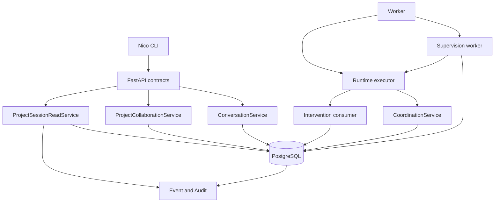
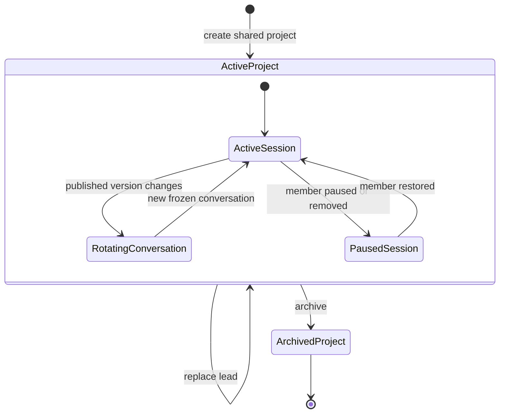
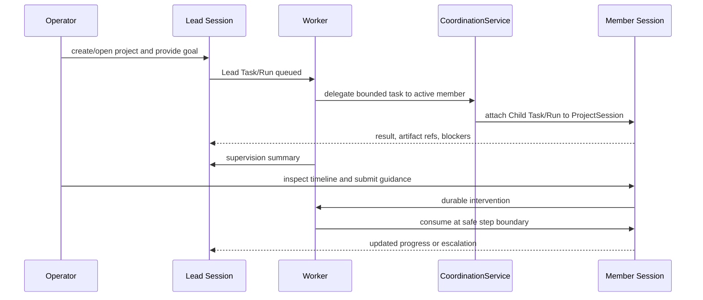

# Dual-Mode Chat and Project Sessions - Plan

## Goal Capsule

- **Objective:** 让 Nico 同时支持“用户与单个 Agent 的独立 Session”和“由主管 Agent 协调多个成员 Agent 的 Project”，并允许用户进入任一项目成员 Session 查看、询问和指导可审计的工作过程。
- **Authority hierarchy:** 本计划中的 Product Contract 与 session-settled KTD 优先于实现便利；现有 Conversation/Task/Run、AgentVersion 冻结、Tenant RLS、Event/Audit 和动态 Coordination 语义必须保持；实现细节服从仓库现有模式。
- **Execution profile:** 分阶段扩展持久化领域模型、HTTP API、Worker 调度和 CLI；先以迁移及集成测试固化边界，再接入交互体验和发布验证。
- **Stop conditions:** 如果实现要求复用跨 Turn 的 RuntimeSession、暴露原始模型思维链、绕过 AgentVersion 冻结，或使跨 Tenant/非项目成员 Agent 获得项目执行权限，应停止并回到架构评审。
- **Tail ownership:** 完成数据库升级/降级、API/CLI 兼容、Worker 恢复、安装包验证、文档更新和本地 release smoke 后才算交付。

---

## Product Contract

### Summary

Nico 提供两个清晰入口：`nico chat` 创建或恢复与一个 Agent 的独立 Session；`nico project new/open/session` 创建项目、与主管 Agent 协调，并进入各成员 Agent 的项目工作 Session。
两种入口共享 Conversation、Task、Run、RuntimeSession、Event 和 Audit 基础设施，但项目模式额外增加成员关系、稳定 ProjectSession、监督周期和运行中指导。

### Problem Frame

当前 `nico chat` 要求调用者同时提供 Project UUID 和 Agent UUID，即使用户只想与一个 Agent 单独交谈。
这把内部执行上下文暴露成了首次使用门槛，也没有表达 Project 作为多 Agent 共享工作空间的产品含义。

另一方面，Nico 已经具有 Project、可冻结 AgentVersion 的 Conversation、每 Turn 一个 Task/Run、动态 Child Run 委派、AgentMessage、Artifact、Event/Audit 和恢复能力，但缺少 Project 成员、主管角色、成员工作 Session、定期协调和用户干预的领域契约。
如果只把多个 Agent 塞进同一个 Conversation，会混淆用户对话、执行器状态与 Agent 间消息，并破坏 ADR-0012 已确定的生命周期边界。

### Actors

- A1. **Operator:** 使用 CLI 创建独立 Session 或 Project，查看项目状态，并对主管或成员 Agent 发出询问、指导、暂停或升级指令。
- A2. **Direct Agent:** 在独立 Session 中响应用户，不参与项目协调。
- A3. **Project Lead Agent:** 维护项目目标、拆分和分配任务、触发或执行同步周期、汇总风险并向 Operator 请求决策。
- A4. **Project Member Agent:** 在自己的 ProjectSession 中执行被分配的任务，发布结构化进度、Artifact、阻塞和结果。
- A5. **Worker:** 领取普通 Run、委派 Child Run、到期监督周期和待消费 Intervention，并保持数据库权威与故障恢复语义。

### Requirements

**Independent Sessions**

- R1. 裸 `nico chat` 必须允许用户按名称或终端选择器选择一个 ready Agent，并直接创建或恢复独立 Session，不要求用户提供 Project。
- R2. 独立 Session 在产品界面中不显示 Project，但服务端必须把它解析到 actor-scoped 的系统 Personal Project，以复用非空 Project 外键、Task、Memory、Artifact 和审计边界。
- R3. 同一 Tenant 内不同 actor 的 Personal Project 必须在默认解析、恢复和列表选择中隔离；重复创建必须幂等，且系统 Project 不出现在普通 `nico project list` 中，除非显式请求包含系统资源。该边界不替代人类身份认证或 RBAC。
- R4. 现有 `nico chat --project ... --agent ...`、`--resume`、`--continue` 和 Conversation API 必须保持兼容；旧 Conversation 不做语义重写。

**Project Workspace and Membership**

- R5. `nico project new` 必须创建共享 Project，要求选择一个 ready 且通过 Lead capability preflight 的 Project Lead Agent，并可选择零个或多个 ready Member Agent；不满足 Native coordination/策略条件时必须在写入 Project 前给出修复预览或失败。
- R6. Project 必须独立于 Lead Agent 生存；Lead 是可替换的 active membership role，而不是 Project 所有者或生命周期父对象。
- R7. 一个 active shared Project 必须恰好有一个 active Lead；Agent 只有作为 active ProjectMember 时才能被分配该 shared Project 的新任务、创建 ProjectSession 或成为委派目标。Personal Project 的 Direct Agent 由独立 Conversation 校验，不创建 ProjectMember。
- R8. 每个 active ProjectMember 必须拥有一个稳定 ProjectSession；AgentVersion 更新时轮换该 Session 的当前 Conversation，但保留旧 Conversation、Task、Run 和历史可读性。
- R9. Project 归档后不得创建新 Session、Task、监督周期或 Intervention，但历史、Artifact、Event 和 Audit 仍可读取。

**Lead Coordination and Work Execution**

- R10. Lead 必须能把 Project 目标拆成 Task，并通过现有 CoordinationService 创建受预算、权限、深度、重复和循环保护的成员 Child Run；RuntimeSession 必须冻结当时 active members 的具体 AgentVersion IDs，禁止把动态 membership 当作运行时 wildcard。
- R11. 每个委派 Task/Run 必须关联目标成员的 ProjectSession，使自主执行与用户对话出现在同一个工作台，而不伪造 ConversationTurn。
- R12. Project 必须支持手动和定期监督周期；每个周期是幂等、可恢复、可取消的 Lead Task/Run，并生成项目摘要、进度、风险、阻塞和下一步。
- R13. 定期监督必须采用有界 cadence、数据库 claim/lease 和唯一调度键，禁止在进程内使用不可恢复的 timer 作为权威状态；默认每 1 小时，可关闭，允许范围为 5 分钟至 7 天。
- R14. 更换 Lead、暂停成员或调整 cadence 必须使用 revision guard，并在 Event/Audit 中记录操作者、旧值、新值和原因。

**Inspection, Guidance, and Visibility**

- R15. Operator 必须能打开 Lead 或 Member 的 ProjectSession，读取由 ConversationTurn、Task、Run Event、Plan、ToolCall、Delegation、Artifact 和状态投影组成的统一时间线。
- R16. 时间线必须展示可审计的计划、决策理由、执行步骤、工具调用、文件/Artifact、测试结果、阻塞和摘要；不得承诺、请求或持久化模型原始私有思维链。
- R17. 对空闲成员的普通消息必须创建该 ProjectSession 当前 Conversation 的新 Turn；对正在运行的成员进行指导时，必须创建有长度上限、按不可信输入处理的持久化 RunIntervention，并在安全模型步骤边界一次性消费。Intervention 不得扩大工具、凭证、预算、成员或协调权限。
- R18. Intervention 必须区分 `local_guidance` 和 `project_change`；项目范围、优先级或跨 Agent 依赖变更必须路由到 Lead Session 重新规划，不得静默改变成员 Run 的项目合同。
- R19. 用户必须能查看 Intervention 的 pending/consumed/rejected 状态，并能用 revision-safe 操作取消 Run 或撤回尚未消费的 Intervention。

**Interfaces, Safety, and Compatibility**

- R20. 所有 Project、ProjectMember、ProjectSession、ProjectSupervisionCycle 和 RunIntervention 写操作必须具有 Tenant 复合外键、FORCE RLS、幂等键、revision guard 以及同事务 Event/Audit。
- R21. CLI 的交互模式与 `--json` 模式必须具有动作对等性；脚本可完全使用名称/ID 参数完成同样操作，交互选择器不能成为唯一入口。
- R22. CLI 必须支持 Agent/Project 的精确名称解析，并在重名、无匹配或多匹配时失败并给出可操作候选，不得任意选择。
- R23. API 和 Worker 必须在 Agent 非 ready、版本未发布、Lead runtime/policy 不支持项目协调、成员已移除、Project 已归档、Lead 缺失或调度重复时 fail closed。
- R24. 安装后的 `nico setup` 仍只负责 Provider 与 Starter Agent；首次独立聊天可懒创建 Personal Project，创建 Project 则通过独立引导完成。

### Key Flows

- F1. **Start an independent Session**
  - **Trigger:** Operator 运行 `nico chat`。
  - **Actors:** A1, A2。
  - **Steps:** CLI 解析/选择 Agent；服务端幂等解析 actor Personal Project；创建或恢复独立 Conversation；每条消息继续创建 Turn/Task/Run。
  - **Outcome:** 用户不感知 Project，也没有项目主管或成员协调语义。
  - **Covered by:** R1-R4, R21-R24。

- F2. **Create and open a Project**
  - **Trigger:** Operator 运行 `nico project new`。
  - **Actors:** A1, A3, A4。
  - **Steps:** 输入项目目标与验收；选择 Lead 和成员；服务端原子创建 ProjectMember 与 ProjectSession；创建 Lead 的协调 Conversation；CLI 打开 Lead Session。
  - **Outcome:** Project 拥有一个可替换主管、成员工作台和共享任务边界。
  - **Covered by:** R5-R9, R20-R24。

- F3. **Delegate and synchronize work**
  - **Trigger:** Lead Run 规划任务，或监督周期到期。
  - **Actors:** A3-A5。
  - **Steps:** 校验目标 ProjectMember；复用 CoordinationService 创建 Child Task/Run；关联 Member ProjectSession；结果和 Artifact 回传；Lead 生成结构化同步摘要。
  - **Outcome:** 多 Agent 执行仍使用现有预算、权限、父子 Run 和恢复协议。
  - **Covered by:** R7, R10-R14, R20, R23。

- F4. **Inspect and guide a Member**
  - **Trigger:** Operator 进入某个成员的 ProjectSession。
  - **Actors:** A1, A4, A5。
  - **Steps:** CLI 回放有界时间线；空闲时创建对话 Turn；运行中则提交 Intervention；Worker 在安全步骤边界消费并记录结果。
  - **Outcome:** 用户可以观察和指导工作，不篡改历史或注入不可审计的运行时状态。
  - **Covered by:** R15-R19, R21-R23。

- F5. **Replace the Lead without losing the Project**
  - **Trigger:** Operator 选择新的 ready Member 作为 Lead。
  - **Actors:** A1, A3, A5。
  - **Steps:** revision-safe 事务切换唯一 Lead；旧 Lead 降级为 Member 或移除；新的监督周期使用新 Lead 当前发布版本；历史 Session 和 Run 保持原绑定。
  - **Outcome:** Project 连续存在，未来协调切换到新 Lead，历史不被重写。
  - **Covered by:** R6-R9, R12-R14, R20, R23。

### Acceptance Examples

- AE1. **Covers F1 / R1-R4.** Given Tenant 中只有一个 ready Agent，when Operator 运行裸 `nico chat`，then CLI 直接进入独立 Session，服务端只创建或复用该 actor 的系统 Personal Project，且普通 Project 列表不显示它。
- AE2. **Covers F1 / R3.** Given 同一 Tenant 中两个不同 actor，when 两者分别创建独立 Session，then Conversation/Task 分别绑定不同 Personal Project，任何 actor-scoped 默认解析、恢复或列表选择不会串用对方 Session；该测试不把可伪造 actor header 当作访问控制证明。
- AE3. **Covers F2 / R5-R8.** Given 三个 ready Agent，when Operator 创建 Project 并选择一个 Lead、两个 Member，then 事务完成后恰有一个 active Lead、三个 stable ProjectSession 和一个 Lead 协调 Conversation。
- AE4. **Covers F2 / R7.** Given 一个不属于 Project 的 ready Agent，when Lead 尝试向它委派或 Operator 尝试打开其 ProjectSession，then 请求 fail closed，且不创建 Task、Run 或部分成员状态。
- AE5. **Covers F3 / R10-R13.** Given 同一监督周期被两个 Worker 并发领取，when claim 发生，then 只有一个 Lead Task/Run 被创建，另一个观察到幂等 replay 或无可领取工作。
- AE6. **Covers F3 / R11-R12.** Given Lead 向 Member 委派任务，when Child Run 产生计划、工具事件、Artifact 和结果，then Member ProjectSession 时间线可分页读取这些引用，Lead 同步摘要能引用结果而不复制私有对象内容。
- AE7. **Covers F4 / R17-R19.** Given Member Run 正在执行，when Operator 发送 local guidance，then 系统持久化一次 Intervention，Worker 仅在安全模型步骤边界消费一次，恢复或重试不会重复注入。
- AE8. **Covers F4 / R18.** Given Operator 在 Member Session 请求改变项目目标，when 选择 project change，then 指令进入 Lead Session 形成重新规划 Task，原 Member Run 不被静默改写。
- AE9. **Covers F5 / R6, R14.** Given Project 已有历史监督周期，when Operator 把另一个 Member 提升为 Lead，then 唯一 Lead 原子切换，未来周期使用新 Lead，旧 Conversation/Run 仍指向原 AgentVersion。
- AE10. **Covers R9, R23.** Given Project 已归档，when CLI 尝试发送新消息、创建 Intervention 或触发 sync，then API 返回稳定领域错误，历史时间线和 Artifact 仍可读。
- AE11. **Covers R5, R10, R23.** Given ready Agent 使用不支持 Native coordination 的 Runtime 或禁用协调策略，when Operator 选择它作为 Lead，then preflight 在创建 Project 前失败并解释缺少的 capability/policy；确认创建兼容 AgentVersion 后，新的监督 Run 冻结 active member 的具体版本列表。

### Success Criteria

- 裸 `nico chat` 在单 Agent 环境中不再要求 UUID 或 Project。
- Project 创建后可从 Lead Session 委派至少两个并行 Member Run，并在对应 Member ProjectSession 中观察其持久化过程。
- Worker 重启、CLI 断开和重复调度不会丢失或重复监督周期、Intervention 或 Child Run。
- 所有新增表通过 cross-tenant FK、FORCE RLS、upgrade/downgrade 和并发幂等测试。
- 旧 CLI 参数、旧 Conversation 和非 Conversation Task/Run 的行为保持兼容。

### Scope Boundaries

**In scope**

- 独立 Session 和 Project Session 两种 CLI 入口。
- actor-scoped 系统 Personal Project。
- Project Lead/Member、稳定 ProjectSession、可轮换 Conversation。
- 手动及有界定期监督、现有动态委派接入、项目时间线和运行中 Intervention。
- API/CLI JSON parity、Tenant 隔离、Event/Audit、迁移和发布文档。

#### Deferred to Follow-Up Work

- 全屏 TUI、鼠标操作、多窗格布局和 Web 项目控制台。
- 组织用户、邀请、SSO、细粒度人类 RBAC；首版仅使用现有 Tenant/actor 信任边界和 Agent membership。
- Reviewer/Observer 等更多 Agent 项目角色；首版只交付 `lead` 与 `member`。
- 跨 Project Agent 资源池、自动招聘/创建 Agent 和跨 Tenant 协作。
- 面向长期无人值守项目的复杂日历、时区和 cron 表达式；首版使用有上下限的 interval cadence。

**Outside this product's identity**

- 暴露或保存模型原始私有思维链。
- 把一个 RuntimeSession 跨多个用户 Turn 复用。
- 让 Redis、CLI 本地历史或进程 timer 成为项目协调的权威状态。

---

## Planning Contract

### Key Technical Decisions

- KTD1. **两种 UX 模式复用一套执行模型。** 独立和项目模式都落到现有 Conversation → ConversationTurn → Task → Run → RuntimeSession 链路，ProjectSession 只组织项目工作，不执行模型。 (session-settled: user-approved — chosen over separate personal/project execution stacks: 两种模式需要一致的恢复、工具、安全与审计语义。)
- KTD2. **独立 Session 使用 actor-scoped 系统 Personal Project。** `Project.kind=personal` 与 `owner_actor_id` 提供内部非空 Project 边界；普通 Project 使用 `kind=shared`，列表默认隐藏 personal。 (session-settled: user-approved — chosen over nullable project_id: 现有 Task、Memory、Artifact 和复合外键可以保持一致。)
- KTD3. **Project 通过 membership 拥有唯一可替换 Lead。** `ProjectMember` 是 Project 与 Agent 的 Tenant-scoped 多对多关系，数据库部分唯一索引保证一个 active Lead；Project 不外键依赖 Lead 生命周期。 (session-settled: user-approved — chosen over Project owned by one Agent: 项目历史和工作应在主管更换后继续存在。)
- KTD4. **ProjectSession 是稳定工作台，Conversation 是可轮换对话。** 每个 active ProjectMember 有一个稳定 ProjectSession，当前 Conversation 冻结 AgentVersion；版本变化时新建 Conversation 并移动 session pointer，旧记录保持可读。 (session-settled: user-approved — chosen over one forever-growing Conversation: AgentVersion 冻结和有界上下文不能被静默跨版本复用。)
- KTD5. **项目时间线是权威记录的查询投影。** 时间线按 Event sequence 聚合 session 关联的 ConversationTurn、Task/Run、Delegation、Plan、ToolCall 和 Artifact 引用，不创建第二套执行状态表；`Task.project_session_id` 和 `Conversation.project_session_id` 提供可索引关联。
- KTD6. **监督周期是持久化调度对象和普通 Lead Task/Run。** `ProjectSupervisionCycle` 保存 cadence slot、trigger、claim lease、Task/Run 和结果；Worker 使用数据库 claim 创建有界工作，进程 timer 只负责唤醒查询。
- KTD7. **运行中指导使用一次性 RunIntervention。** Intervention 在事务中绑定当前 Run/revision，Worker 在下一个安全模型步骤边界读取并冻结到 checkpoint/context，消费状态单调且恢复幂等；project change 改投 Lead Session。
- KTD8. **Agent membership 是项目执行授权的一部分。** Coordination policy 增加显式 `project_members` target scope；只有 Tenant 和 Lead AgentVersion 都允许该 scope 时，Runtime 才把 active members 解析成具体 AgentVersion IDs 并冻结到 RuntimeSession。CoordinationService 随后同时校验冻结 allowlist 和实时 active membership；不支持 wildcard，移除成员阻止新委派但不改写历史 Run。
- KTD9. **CLI 名称优先、ID 保底。** 交互命令显示名称和状态；脚本模式允许精确 name 或 UUID，歧义时失败；profile 保存最近独立 Agent 和 Project，但服务端仍校验每次选择。
- KTD10. **监督事实由数据库生成，模型只补充叙述。** 进度、状态、预算、阻塞、Artifact 和成员健康等结构化字段从权威记录确定性投影；Lead 模型仅生成有界 narrative summary，缺失或失败时不影响监督周期完成和机器可读结果。

### High-Level Technical Design

#### Component topology

#### Project and session lifecycle

#### Supervision, delegation, and intervention sequence

### Data and Compatibility Strategy

- 新迁移在现有 `20260720_0021` 之后追加 `projects.kind/owner_actor_id`、`project_members`、`project_sessions`、`project_supervision_cycles`、`run_interventions`，并为 `conversations` 与 `tasks` 增加可空 `project_session_id`。
- 现有 Project 回填为 `shared`；现有 Conversation/Task 的 `project_session_id` 保持空，因此旧行为不变。
- Provider setup 的 `Nico Local` Project 保持 shared 兼容；裸 `nico chat` 首次使用时另外幂等创建隐藏 Personal Project。
- Personal Project 的唯一键使用 Tenant + owner actor + kind，而不是可见 name；显示名称不参与身份判断。
- 所有新增表采用复合 Tenant 外键、RLS policy、最小 runtime role grant、索引和 downgrade；终态监督周期与 consumed/rejected Intervention 不允许回退。
- 不修改 AgentVersion 或历史 Conversation 的冻结语义；ProjectSession 只更新 current conversation pointer。

### System-Wide Impact

- **Control plane:** Project CRUD 从单纯 Task 分组扩展为 personal/shared kind、membership 和 Lead capability preflight；旧 endpoints 保持 additive compatibility。
- **Conversation and context:** Personal 与 ProjectSession Conversation 继续冻结 AgentVersion；ContextSnapshot 仍只选择同一 Conversation 的有界历史，不自动把其他成员 Session 内容注入模型。
- **Runtime and coordination:** 项目监督 Run 在 claim 时冻结 membership-derived target versions；Child Run 继续使用现有 budget ledger、permission narrowing、AgentMessage、Artifact grant、wake reconciliation 和 tree cancellation。
- **Worker lifecycle:** 普通 Run claim、Provider probe 和新增 supervision cycle claim 必须具有独立 lease/timeout，任何一类积压都不能饿死其他队列；doctor/health 暴露各队列最近成功和错误摘要。
- **Security and privacy:** Agent membership 是 Agent 执行授权，不替代人类身份认证；actor-scoped Personal Project 只提供默认选择边界，并依赖现有可信 actor header，因此生产暴露仍要求外部认证层。Timeline 只返回治理后的工作事实和引用。
- **Operations:** migration rollout 先升级 API/Worker 兼容 nullable session refs，再开放 CLI 项目入口；旧 Worker 不得在新 schema 开始产生 supervision cycle，版本兼容检查必须 fail closed。

### Sequencing

1. 先落数据库约束和领域合同，确保 membership、唯一 Lead、session 与 personal workspace 的不变量可测试。
2. 再实现 Project/Personal API 和 read model，保持旧 Conversation API 兼容。
3. 先发布基础 CLI，完成独立聊天、Project 创建、成员管理和只读 ProjectSession 的 Milestone A 验收。
4. 再接入 Coordination、监督 Worker、Intervention 和高级 CLI，使用真实 PostgreSQL 并发/恢复测试固化 Milestone B/C 语义。
5. 最后更新文档，并以本地 release 安装包完成端到端验收。

### Risks and Mitigations

- **现有多 Agent 委派没有 membership 概念。** 在 CoordinationService 的事务边界内校验目标成员，并用集成测试证明非成员、removed 成员和跨 Tenant 失败且无部分写入。
- **现有协调策略使用显式 AgentVersion allowlist。** 增加双重 opt-in 的 `project_members` scope，并在 RuntimeSession 创建时解析成具体版本；Project preflight 阻止 Hermes/禁用策略 Lead，绝不使用 wildcard 或在已有 Run 中动态扩权。
- **定期监督可能重复创建 Run。** 以 Project + cadence slot/explicit idempotency key 唯一约束和 SKIP LOCKED lease 作为数据库权威，Worker 重启只重放未完成周期。
- **运行中 Intervention 可能破坏恢复确定性。** 仅在明确 checkpoint 边界消费，记录 frozen intervention IDs/hash；恢复复用快照，不重新读取已消费或后到指令。
- **项目 Session 时间线查询可能放大 I/O。** 以 Task/Conversation 的 session FK 和 Event sequence 做有界游标查询，详细 ToolCall/Artifact 内容按需读取，不在列表复制大对象。
- **Personal Project 可能被错误当成人类权限边界。** 默认列表隐藏系统资源，解析 API 强制匹配 `owner_actor_id=context.actor_id`，并增加同 Tenant 多 actor 集成测试；文档明确这是可信 actor 上下文中的选择隔离，真正的用户鉴权/RBAC 仍由部署层负责。
- **“工作思路”容易被误解为原始思维链。** API 仅公开持久化计划、理由摘要、事件、调用、Artifact、测试和阻塞，不增加 raw reasoning 字段；CLI 文案明确“工作过程”。
- **一次交付面过大。** 按 Milestone A/B/C 交付；基础 CLI 在领域约束和时间线完成后即可启用，高风险监督与运行中 Intervention 通过 capability flag 独立开放。

### Threat Model

- **Actor spoofing:** 当前 `NICO_ACTOR_ID`/header 是部署信任输入，不能据此宣称用户级隔离；面向不可信网络前必须由认证代理签发并覆盖该值。
- **Membership identifier forgery:** API 不信任 CLI 传入的 Agent/ProjectSession 组合；每次写入都在同一事务内重新验证 Tenant、Project、active membership、role 和 revision。
- **Malicious guidance:** Intervention 作为不可信文本执行长度、类型和状态校验，只能影响下一模型输入，不能携带工具授权、secret reference、预算或目标 allowlist 变更。
- **Cadence denial of service:** cadence 受 5 分钟至 7 天范围、单 Project 唯一 due slot、claim lease、并发上限和 Worker 队列公平性约束；关闭 cadence 不删除历史 cycle。

### Phased Delivery

1. **Milestone A — 两种可用会话模式:** U1-U4 与 U7 的基础 CLI，交付裸 `nico chat`、Project 创建/成员管理、稳定成员 Session 和只读时间线；不启用自动监督或运行中 Intervention。
2. **Milestone B — 主管协调:** U5，交付 membership-aware delegation、手动 sync 和有界定期监督；结构化事实由数据库生成，Lead narrative 可降级。
3. **Milestone C — 实时指导与完整 CLI:** U6、U8 和 U9，交付安全 Intervention、项目变更升级、完整交互/JSON 对等、文档及安装版验收。

### Sources and Research

- `docs/decisions/ADR-0012-conversation-is-not-runtime-session.md`：Conversation、AgentMessage 和 RuntimeSession 必须保持独立生命周期。
- `docs/decisions/ADR-0013-bounded-conversation-context.md`：完整历史持久化，但模型上下文必须有界并冻结到 ContextSnapshot。
- `docs/domain-model.md`：Project 当前只分组 Task；Team membership 尚未实现；动态 Coordination 与 Artifact primitives 已存在。
- `backend/src/nico_agent/conversations/service.py`：Turn、Task 和首个 Run 的原子创建以及 AgentVersion 冻结模式。
- `backend/src/nico_agent/coordination/service.py`：Child Task/Run、预算预留、权限收窄、消息和 ancestry 的事务边界。
- `backend/src/nico_agent/cli/chat.py`：当前滚动式交互、resume/continue 和 slash-command 模式。

---

## Implementation Units

### U1. Add project collaboration persistence and invariants

- **Goal:** 建立 Personal/Shared Project、ProjectMember、ProjectSession、监督周期、Intervention 与现有 Conversation/Task 的数据库关系。
- **Requirements:** R2-R3, R6-R9, R11-R14, R17-R20；KTD2-KTD7。
- **Dependencies:** None。
- **Files:** `backend/migrations/versions/20260721_0022_project_collaboration.py`, `backend/src/nico_agent/domain/models.py`, `backend/src/nico_agent/domain/states.py`, `backend/tests/integration/test_project_collaboration_persistence.py`, `backend/tests/integration/test_infrastructure.py`。
- **Approach:** 使用追加迁移和可空兼容 FK；为 active Lead 建立部分唯一索引；为 personal owner、session membership、cycle slot 和 intervention idempotency 建立数据库唯一约束；所有新表开启 FORCE RLS 并添加 terminal monotonicity trigger。
- **Execution note:** 先编写真实 PostgreSQL 失败测试证明跨 Tenant FK、双 Lead、重复 cadence slot、终态回退和 Personal Project 重复均被数据库拒绝，再实现迁移和 ORM。
- **Patterns to follow:** `20260718_0013_multi_agent_coordination.py` 的 Tenant 复合 FK/RLS/终态保护；`20260719_0017_conversations.py` 的 Conversation/Task 关联与 downgrade。
- **Test scenarios:**
  1. 创建 shared Project、一个 Lead 和多个 Member 后，数据库只允许一个 active Lead，并允许 lead/member 角色原子切换。
  2. 同 Tenant/actor 的 Personal Project 重复请求命中同一记录；不同 actor 得到不同记录。
  3. ProjectSession 不能引用其他 Project 的 Member，Conversation/Task 不能引用跨 Tenant session。
  4. 同一 Project/cadence slot 只能创建一个监督周期，两个事务并发插入时只有一个成功。
  5. consumed/rejected Intervention 和 terminal supervision cycle 不能回退到 pending/running。
  6. upgrade 后旧 Project 为 shared、旧 Conversation/Task 可读；downgrade 删除新增对象且恢复旧 schema。
- **Verification:** Alembic head 唯一；数据库约束承担不变量而非只依赖 Python；旧 fixture 无需人工改写即可迁移。

### U2. Implement Project membership, Lead, and session APIs

- **Goal:** 提供原子创建 Project、管理成员、替换 Lead、归档和解析 ProjectSession 的服务及 HTTP 合同。
- **Requirements:** R5-R9, R14, R20-R23；F2, F5；KTD3-KTD4, KTD8。
- **Dependencies:** U1。
- **Files:** `backend/src/nico_agent/projects/__init__.py`, `backend/src/nico_agent/projects/contracts.py`, `backend/src/nico_agent/projects/service.py`, `backend/src/nico_agent/projects/api.py`, `backend/src/nico_agent/api.py`, `backend/src/nico_agent/control_plane.py`, `backend/src/nico_agent/api_schemas.py`, `backend/src/nico_agent/agent_versions.py`, `backend/tests/unit/test_project_contracts.py`, `backend/tests/integration/test_project_collaboration_api.py`, `backend/tests/unit/test_api.py`。
- **Approach:** 保留现有 `/projects` CRUD；新增 collaboration endpoints 完成 Lead capability preflight、create-with-members、member list/add/remove、replace-lead、session list/get；一个事务创建 membership、stable session 和冻结 Conversation；ControlPlane 对 shared Project 的普通 Task 创建/分配也必须校验目标 Agent 是 active ProjectMember，Personal Project 继续由 Conversation 路径校验 Direct Agent；需要新 Lead AgentVersion 时先展示 diff 并显式确认发布，Project 写入绝不隐式扩大协调能力；所有变更生成 Event/Audit 并使用 revision/idempotency guard。
- **Patterns to follow:** Provider activation 的 preview/atomic mutation discipline；ControlPlaneService 的 project/agent revision transition；ConversationService 的 Agent ready/version published 校验。
- **Test scenarios:**
  1. Covers AE3. 创建 Project 时一次提交 Lead/Member，返回 session identifiers，任何中途校验失败都不留下 Project 或部分成员。
  2. Covers AE4. draft/paused/non-member/cross-tenant Agent 不能成为 active member session 或任务目标。
  3. Covers AE9. 并发 replace-lead 只有匹配 revision 的事务成功，且始终恰有一个 active Lead。
  4. 暂停或移除有历史的 Member 只停止未来工作并把 stable session 标为 paused；恢复同一 membership 时复用该 session，只有归档整个 Project 才归档 session，且不删除旧 Conversation/Run。
  5. Covers AE10. 归档 Project 后所有写入口 fail closed，read endpoints 保持可用。
  6. API schema/OpenAPI 包含新增资源，并保持旧 `/projects` 响应字段兼容。
  7. Covers AE11. Hermes/禁用 policy Lead preflight 失败且不写 Project；兼容 Native Lead 返回冻结 member target preview。
  8. 通过普通 ControlPlane Task create/assign 绕过协作 endpoint 指向非成员 Agent 时同样 fail closed，且不留下 Task/Run。
- **Verification:** 一个 API 事务完成项目协作基线；失败、重放和并发路径具有稳定领域错误与审计证据。

### U3. Add Personal Project resolution and bare chat behavior

- **Goal:** 让独立 Session 不要求用户理解 Project，同时复用现有 Conversation 执行路径。
- **Requirements:** R1-R4, R20-R24；F1；KTD1-KTD2, KTD9。
- **Dependencies:** U1, U2。
- **Files:** `backend/src/nico_agent/conversations/contracts.py`, `backend/src/nico_agent/conversations/service.py`, `backend/src/nico_agent/conversations/api.py`, `backend/src/nico_agent/cli/chat.py`, `backend/src/nico_agent/cli/client.py`, `backend/src/nico_agent/cli/app.py`, `backend/src/nico_agent/cli/config.py`, `backend/tests/integration/test_conversation_api.py`, `backend/tests/unit/test_cli_chat.py`, `backend/tests/unit/test_cli_app.py`, `backend/tests/unit/test_cli_client.py`。
- **Approach:** 为 Conversation create 增加 additive `mode=personal|project`；personal 请求不接受显式 shared Project，由服务端按 actor 幂等解析隐藏 Project；CLI 裸 chat 按最近偏好或 ready Agent selector 创建/恢复，旧显式参数路径保持原样。
- **Patterns to follow:** `ProviderOnboardingCoordinator` 的 Rich selector/名称解析；ChatRunner 的 resume/continue/history；ConfigStore 的 profile-scoped persistence。
- **Test scenarios:**
  1. Covers AE1. 单 ready Agent 时裸 chat 自动进入；多个 ready Agent 时显示可取消 selector；无 ready Agent 时提示运行 setup/provider flow。
  2. Covers AE2. 同 Tenant 多 actor 的 personal create/continue 不交叉返回 Conversation。
  3. personal create 的幂等重放返回同一 Conversation/Project，冲突 payload 返回幂等错误。
  4. `--project/--agent`、`--resume`、`--continue` 和 JSON one-shot 的原有测试保持通过。
  5. 名称精确匹配、UUID、重名/无匹配和非 TTY 缺参分别产生确定结果，不任意选择。
  6. 普通 project list 默认不返回 personal，显式 include-system 才可读取且只限当前 actor。
- **Verification:** 新用户只需 `nico setup` 后运行 `nico chat`；脚本和旧调用者不受交互选择器影响。

### U4. Build stable ProjectSession conversations and timeline

- **Goal:** 把成员对话、自主 Task/Run 和执行证据汇聚为可分页、可恢复的成员工作台。
- **Requirements:** R8, R11, R15-R16, R20-R23；F3-F4；KTD4-KTD5。
- **Dependencies:** U1, U2。
- **Files:** `backend/src/nico_agent/projects/read_service.py`, `backend/src/nico_agent/projects/contracts.py`, `backend/src/nico_agent/projects/service.py`, `backend/src/nico_agent/projects/api.py`, `backend/src/nico_agent/conversations/service.py`, `backend/src/nico_agent/control_plane.py`, `backend/src/nico_agent/runtime/service.py`, `backend/tests/unit/test_project_timeline.py`, `backend/tests/integration/test_project_session_api.py`, `backend/tests/integration/test_conversation_api.py`。
- **Approach:** Conversation 和 Task 写入 nullable session FK；timeline 以 Event sequence 为游标，连接 session Conversation 和 session Task/Run，再返回有界 typed entries 与详细资源链接；AgentVersion 改变时只轮换 current Conversation pointer。
- **Patterns to follow:** Run Event 的 sequence/SSE replay；Conversation history/context selector；现有 Run plan/tool/artifact read APIs。
- **Test scenarios:**
  1. Covers AE6. 委派 Child Run 的任务、状态、计划、工具调用、Artifact refs 和结果按 sequence 出现在目标 Member timeline。
  2. timeline limit/cursor 无重复、无跳项，详细大对象不内联，cross-tenant/session 请求失败。
  3. Member 对话 Turn 与自主 Run 并存时，timeline 保持稳定顺序且权威状态来自原表。
  4. Agent 发布新版本后下一次 session chat 创建新冻结 Conversation，旧历史继续可查询。
  5. API 不返回 trajectory/raw reasoning 或对象存储 key，只返回允许的计划、理由摘要、事件和 refs。
  6. Project 归档或 Member removed 后 timeline 仍可读，但无法追加普通消息。
- **Verification:** 不新增第二套 Run/Turn 状态；一个 session timeline 能重建用户关心的完整工作过程并保持有界。

### U5. Add bounded Lead supervision and membership-aware delegation

- **Goal:** 让 Lead 可分配成员工作并通过手动/定期周期汇总项目，而不重写现有多 Agent Runtime。
- **Requirements:** R10-R14, R20, R23；F3, F5；KTD6, KTD8, KTD10。
- **Dependencies:** U1, U2, U4。
- **Files:** `backend/src/nico_agent/projects/orchestration.py`, `backend/src/nico_agent/projects/worker.py`, `backend/src/nico_agent/projects/contracts.py`, `backend/src/nico_agent/projects/api.py`, `backend/src/nico_agent/coordination/service.py`, `backend/src/nico_agent/coordination/policy.py`, `backend/src/nico_agent/runtime/service.py`, `backend/src/nico_agent/database.py`, `backend/src/nico_agent/worker.py`, `backend/tests/unit/test_project_supervision.py`, `backend/tests/integration/test_project_supervision_worker.py`, `backend/tests/integration/test_coordination_service.py`, `backend/tests/integration/test_multi_agent_runtime.py`。
- **Approach:** 数据库 claim due cycle；原子创建 Lead Task/Run 并关联 Lead ProjectSession；RuntimeSession 构建时以 Tenant ∩ Lead AgentVersion 的 `project_members` opt-in 解析并冻结 active member versions；Lead Runtime 继续通过 CoordinationService 委派，service 校验冻结 allowlist 与实时 membership 并把 Child Task 关联目标 session；完成时由数据库记录确定性生成结构化 metrics/status/risks/blockers/artifact refs，Lead 模型只补充有界 narrative，并持久化下一 cadence slot。
- **Execution note:** 先用两个真实 Worker/数据库事务证明 duplicate claim、崩溃 lease recovery、Lead replacement 和 cancel，再接入普通 worker loop。
- **Patterns to follow:** provider probe durable worker claim；Run lease/heartbeat；CoordinationService budget reservation、closure、wake reconciliation 和 tree cancellation。
- **Test scenarios:**
  1. Covers AE5. 两 Worker 并发只创建一个 cycle Task/Run；lease 过期后 replacement Worker 恢复同一 cycle。
  2. 非成员、removed Member、非 published version 和 archived Project 委派均在预算预留前失败。
  3. Lead 替换后已运行 cycle 继续使用冻结旧版本，下一 cycle 使用新 Lead 当前发布版本。
  4. 手动 sync idempotency key 重放不重复；scheduled cadence 默认 1 小时、可关闭、只接受 5 分钟至 7 天，并正确计算下一 slot。
  5. Child 完成、失败、取消、超时均能唤醒 Lead 并出现在数据库生成的结构化 summary；模型摘要失败时仍返回完整机器可读事实。
  6. Project archive 级联取消 active supervision Run tree，但不删除历史结果和共享 Artifact links。
  7. Covers AE11. membership 变化只影响新 RuntimeSession；已冻结 Run 不获得新增成员权限，被移除成员不能接受新的 delegation。
- **Verification:** 项目协调在 CLI 断开、Worker 重启和并发 worker 下保持 PostgreSQL 权威与 exactly-once logical creation。

### U6. Add safe runtime interventions and project-change escalation

- **Goal:** 允许用户在成员执行期间给予一次性、可审计指导，并把跨项目范围变更交给 Lead 重新规划。
- **Requirements:** R17-R20, R23；F4；KTD7。
- **Dependencies:** U1, U4, U5。
- **Files:** `backend/src/nico_agent/projects/interventions.py`, `backend/src/nico_agent/projects/contracts.py`, `backend/src/nico_agent/projects/api.py`, `backend/src/nico_agent/runtime/service.py`, `backend/src/nico_agent/runtime/contracts.py`, `backend/src/nico_agent/runtime/native/loop.py`, `backend/tests/unit/test_run_interventions.py`, `backend/tests/integration/test_project_interventions.py`, `backend/tests/integration/test_native_react_runtime.py`, `backend/tests/integration/test_native_plan_runtime.py`。
- **Approach:** local guidance 绑定当前 non-terminal Run 和 expected revision，并按不可信文本执行长度/类型检查；Runtime 在模型步骤之间 claim 并将 ID/hash 写入 checkpoint/context 后标记 consumed；合并上下文时保持 RuntimeSession 已冻结的工具、凭证、预算和协调 allowlist，Intervention 不能覆盖这些字段；project change 在 Lead current Conversation 创建重新规划 Turn；不支持在外部工具副作用中途注入。
- **Execution note:** 对恢复和 crash-window 写测试，证明“冻结但未标记 consumed”与“已 consumed 后重启”都不会重复把指导发送给模型。
- **Patterns to follow:** Tool approval 的 durable pending/decision/recovery；Runtime checkpoint hash/revision；AgentMessage 的单调状态和 bounded content。
- **Test scenarios:**
  1. Covers AE7. active ReAct/Plan Run 的 local guidance 在下一个模型边界只消费一次，并记录 Event/Audit/Context reference。
  2. Worker 在 freeze 与 consume 之间崩溃后恢复，不重复注入；后到 intervention 等待下一个边界。
  3. terminal Run、错误 revision、removed Member、archived Project 和超长输入 fail closed。
  4. pending Intervention 可 revision-safe 撤回；consumed/rejected 不能撤回或重放。
  5. Covers AE8. project change 创建 Lead 重新规划 Turn，不改变当前成员 Task input 或 AgentVersion snapshot。
  6. Direct/Hermes 等不声明 intervention capability 的 runtime 明确返回 unsupported，不静默丢弃指导。
  7. 伪造工具授权、secret reference、预算或成员目标的 guidance 只作为普通文本处理，不改变 RuntimeSession capability snapshot。
- **Verification:** 指导在运行恢复前后具有确定且可查询的生命周期，工具副作用和历史输入不被回写。

### U7. Deliver foundational Personal and Project CLI workflows

- **Goal:** 在监督与 Intervention 完成前，先提供无需复制 UUID 的独立聊天、Project 创建/打开、成员管理和只读成员 Session。
- **Requirements:** R1, R4-R9, R15-R16, R21-R24；F1-F2；KTD9。
- **Dependencies:** U2-U4。
- **Files:** `backend/src/nico_agent/cli/app.py`, `backend/src/nico_agent/cli/client.py`, `backend/src/nico_agent/cli/chat.py`, `backend/src/nico_agent/cli/project.py`, `backend/src/nico_agent/cli/renderers.py`, `backend/tests/unit/test_cli_project.py`, `backend/tests/unit/test_cli_chat.py`, `backend/tests/unit/test_cli_renderers.py`, `backend/tests/unit/test_cli_app.py`, `backend/tests/unit/test_cli_client.py`。
- **Approach:** 扩展现有 Typer/Rich/prompt_toolkit 模式；裸 `chat` 选择或恢复独立 Agent，`project new` 引导目标/验收/Lead/成员，`project open` 进入 Lead，`project session` 选择成员并读取 timeline，`project status/members` 同时提供脚本与人类模式；未启用的 sync/guide 能力明确显示 unavailable，而不是假成功。
- **Patterns to follow:** Provider onboarding 的键盘安全选择器和 progress spinner；ChatRunner 的 SSE/approval loop；Output 的 `--json` 单文档合同。
- **Test scenarios:**
  1. Project 名称、Agent 名称和 UUID 均可解析；歧义和无匹配显示候选并返回非零状态。
  2. 交互 `project new` 可取消且不产生写入；`--yes` 只跳过确认，不猜缺失 Lead/目标。
  3. `project open` 默认进入 Lead，`project session --agent NAME` 进入成员；paused/removed 成员仅允许 read-only history。
  4. 人类模式时间线清楚区分计划、工具、Artifact、阻塞和 summary；不显示 raw reasoning 文案。
  5. 每个基础 CLI 动作都有等价 `--json` 请求/响应，stdout 不混入 spinner 或提示文字。
  6. 旧 `nico project list/get` 和 `nico chat --project/--agent` 快照/行为保持兼容。
- **Verification:** Milestone A 可只用名称完成 personal chat、project creation、lead/member session inspection，不复制 UUID，也不依赖尚未交付的监督能力。

### U8. Deliver supervision and intervention CLI workflows

- **Goal:** 在服务端能力完成后补齐手动/定期同步、任务观察、运行中指导、升级、撤回和取消的完整交互。
- **Requirements:** R12-R19, R21-R23；F3-F5；KTD7, KTD9-KTD10。
- **Dependencies:** U5-U7。
- **Files:** `backend/src/nico_agent/cli/project.py`, `backend/src/nico_agent/cli/chat.py`, `backend/src/nico_agent/cli/renderers.py`, `backend/src/nico_agent/cli/slash.py`, `backend/src/nico_agent/cli/client.py`, `backend/tests/unit/test_cli_project.py`, `backend/tests/unit/test_cli_chat.py`, `backend/tests/unit/test_cli_renderers.py`, `backend/tests/unit/test_cli_client.py`。
- **Approach:** 增加 `project tasks/sync/cadence` 和 session 内 `guide/escalate/withdraw/cancel`；active Run 下普通输入提示选择 local guidance、project change 或排队 follow-up，非交互模式要求显式 action flag；结构化事实与 narrative summary 分区呈现。
- **Test scenarios:**
  1. active Run 下交互选择会映射到正确 intervention kind，取消选择不产生写入；非 TTY 缺少 action 时失败并给出可执行提示。
  2. cadence 命令显示默认 1 小时，接受 off 和 5 分钟至 7 天，越界输入在客户端和服务端均失败。
  3. pending guidance 可撤回，consumed/rejected 只读；cancel 使用 expected revision 并显示冲突后的最新状态。
  4. sync 输出把数据库权威 metrics/status 与模型 narrative 分开，模型摘要缺失仍可正常渲染和输出 JSON。
  5. 每个高级动作都有等价 `--json` 请求/响应，stdout 不混入 spinner、确认或 ANSI。
- **Verification:** Milestone C 可通过名称完成 lead sync、member guidance、project-change escalation 和状态追踪，human/JSON 行为对等。

### U9. Document, migrate, and release-test the two modes

- **Goal:** 更新公共文档、架构决策和安装后 smoke，使用户理解两种模式和安全边界。
- **Requirements:** R4, R16, R21-R24；所有 Success Criteria。
- **Dependencies:** U1-U8。
- **Files:** `README.md`, `docs/cli.md`, `docs/api.md`, `docs/domain-model.md`, `docs/architecture.md`, `docs/state-machines.md`, `docs/decisions/ADR-0015-project-session-and-membership.md`, `docs/installation.md`, `docs/troubleshooting.md`, `scripts/test-install.sh`, `backend/tests/integration/test_project_collaboration_e2e.py`。
- **Approach:** 新 ADR 记录 Project/ProjectMember/ProjectSession/Conversation/RuntimeSession 边界；README 以 `nico chat` 和 `nico project new` 两条最短路径开篇；release smoke 使用 mock Provider/Runtime 验证无需凭证的双模式生命周期。
- **Execution note:** 这是跨 API/CLI/安装包功能，最终以构建 wheel/image 后的真实 `make uninstall && make install` smoke 为准，不能只运行源码 CLI。
- **Patterns to follow:** 现有 conversation ADR、CLI handoff 文档和 `scripts/test-install.sh` 的隔离 HOME/本地 release 契约。
- **Test scenarios:**
  1. 全新 HOME 安装后 setup/bootstrap、裸 chat、project new、member session 和 project sync 的帮助与 mock smoke 成功。
  2. 从 migration 0021 数据库升级后旧项目/会话可读，新 personal/project 功能可创建，downgrade 路径验证完成。
  3. README/API/CLI 示例中的命令与 `--help`、OpenAPI 路径保持一致。
  4. `nico-service doctor` 与全部 Compose health checks 在新增 worker 职责后保持 healthy。
  5. credential scan、JSON stdout 和日志证明 session timeline/intervention 不泄露 API key、对象存储 key 或 raw reasoning。
- **Verification:** 发布产物而非源码 checkout 完成双模式 E2E；文档与实际 CLI/API 合同一致。

---

## Verification Contract

| Gate | Applies to | Command | Done signal |
|---|---|---|---|
| Static quality | U1-U9 | `.venv/bin/ruff check backend/src backend/tests` | 无 lint/import/async 错误 |
| Unit regression | U2-U8 | `.venv/bin/pytest backend/tests/unit` | 全部单元测试通过，CLI human/JSON 分支均覆盖 |
| Persistence and API | U1-U6 | `RUN_INTEGRATION=1 .venv/bin/pytest backend/tests/integration/test_project_collaboration_persistence.py backend/tests/integration/test_project_collaboration_api.py backend/tests/integration/test_project_session_api.py backend/tests/integration/test_project_interventions.py` | RLS、FK、幂等、并发、恢复和历史兼容通过 |
| Multi-Agent runtime | U5-U6 | `RUN_INTEGRATION=1 .venv/bin/pytest backend/tests/integration/test_coordination_service.py backend/tests/integration/test_multi_agent_runtime.py backend/tests/integration/test_native_react_runtime.py backend/tests/integration/test_native_plan_runtime.py` | membership guard、Child Run、监督与 Intervention 不破坏现有 runtime |
| Conversation regression | U3-U4 | `RUN_INTEGRATION=1 .venv/bin/pytest backend/tests/integration/test_conversation_api.py` | 旧显式 Project chat 与新 personal/project session 均通过 |
| Full backend | U1-U9 | `.venv/bin/pytest backend/tests/unit` plus repository integration suite with `RUN_INTEGRATION=1` | 无旧领域、Provider、Tool、Memory、Conversation 回归 |
| Release contract | U7-U9 | `make test-install` | installer、bundle、CLI entrypoint 和 release contract 通过 |
| Installed smoke | U9 | Build local release, reinstall it, then run `nico-service doctor` and the mock dual-mode E2E | 所有容器 healthy，安装版 CLI 完成 personal/project lifecycle |
| Source hygiene | U1-U9 | `git diff --check` and repository credential scan | 无 whitespace、secret、raw reasoning 或对象 key 泄漏 |

---

## Definition of Done

- R1-R24 均由至少一个 U-ID 和具体测试场景覆盖，AE1-AE11 有自动化证据。
- `nico chat` 对普通用户不再暴露 Project 要求；旧显式参数继续可用。
- `nico project new` 原子创建唯一 Lead、成员和稳定 ProjectSession，并可通过名称进入任一成员工作台。
- Lead 可使用现有 CoordinationService 创建 membership-authorized Child Run；定期监督在并发 Worker 和重启下逻辑只创建一次。
- 用户可读取有界、可分页的项目工作过程，并可安全提交、撤回和追踪 Intervention；系统不暴露原始思维链。
- 新增持久化对象具有 Tenant 复合 FK、FORCE RLS、revision、idempotency、Event/Audit、upgrade/downgrade 和终态保护。
- AgentVersion 轮换、Lead 替换、成员移除和 Project 归档不改写历史 Conversation/Task/Run。
- 单元、集成、多 Agent runtime、Conversation regression、release contract 和安装版双模式 smoke 全部通过。
- README、CLI、API、domain model、state machine、ADR、installation 和 troubleshooting 与实际行为一致。
- 实现过程中产生的废弃 schema、实验调度器、重复 read model、临时兼容分支和无用测试 fixture 已删除。
