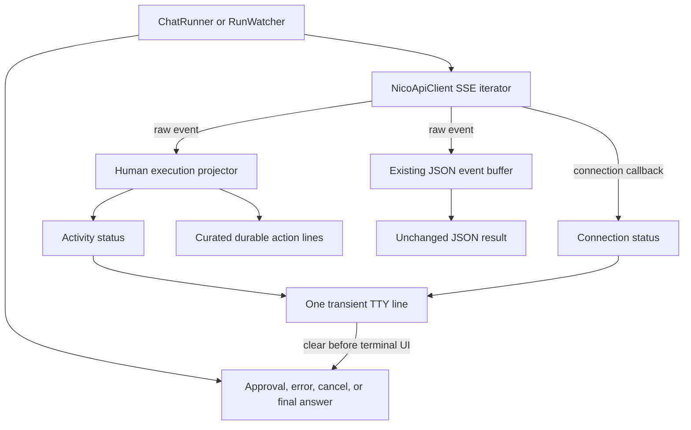
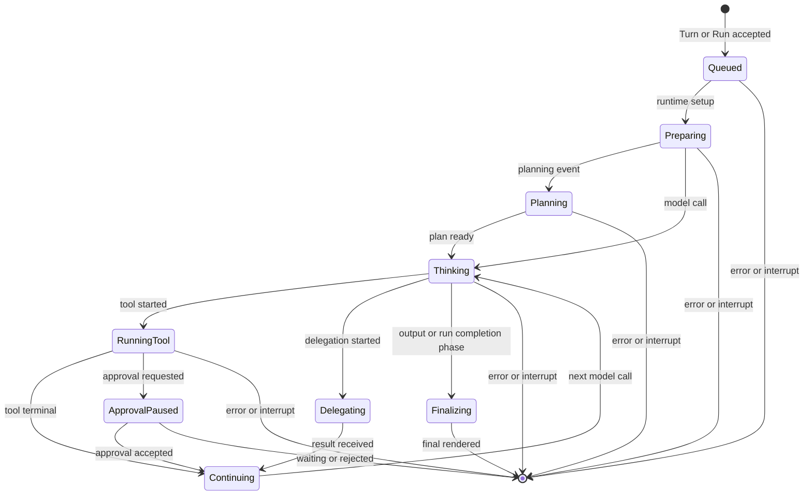

# CLI Execution Progress - Plan

## Goal Capsule

- **Objective:** 为 `nico chat` 和前台 `nico exec` 提供低噪音、可持续更新的执行反馈，让用户知道 Nico 当前处于排队、规划、思考、调用工具、等待审批、委派、重连还是收尾阶段，同时不暴露私有推理和内部协议事件。
- **Authority hierarchy:** 用户确认的“一条动态状态线 + 关键动作留痕”优先于现有逐事件输出方式；私有推理边界、JSON 机器输出契约和现有 Run/审批/Ctrl+C 语义不得改变。
- **Execution profile:** 先在共享执行渲染器中建立状态投影，再为 SSE 重连增加仅供人类界面的连接通知，最后接入 ChatRunner 与前台 RunWatcher 并更新文档。
- **Stop conditions:** 如果实现需要修改后端事件 schema、把原始 payload 或模型中间文本映射到人类状态、改变审批或取消语义、或让 `--json` 混入合成状态，应停止并回到设计评审。
- **Tail ownership:** 单元测试、CLI 定向回归、lint/format、文档检查和真实 TTY 手工 smoke 全部通过后才算交付。

---

## Product Contract

### Summary

每个前台执行从 Turn/Run 创建成功起立即显示一条可原地更新的状态线，例如 `Thinking · 0:08` 或 `Running http_read@1 · 0:12 | reconnecting 1/3`。
状态线在最终回答、审批面板、错误或中断出现前清除；工具完成、Artifact、审批、失败和取消等关键事实作为少量永久行保留在滚动历史中。

### Problem Frame

当前 `ExecutionRenderer` 为了隐藏内部生命周期事件，只保留工具、Artifact 和失败事件。
这解决了截图中的协议噪音，但文本型 Run 在最终回答前可能完全无输出，用户无法判断 CLI 是否仍在等待，也看不到最后已知执行阶段或网络重连状态。

恢复逐事件打印会重新暴露 `TaskCreated`、`RuntimeModelCallStarted`、sequence 和 payload 等内部实现细节，并让工具成功产生 start/success 两行重复记录。
需要的是一个稳定的人类状态投影，而不是协议事件浏览器。

### Actors

- A1. **Interactive operator:** 在 TTY 中使用 `nico chat` 或前台 `nico exec`，需要连续但安静的反馈，并可能处理工具审批或按 Ctrl+C。
- A2. **Log/script consumer:** 在非 TTY 或 `--no-color` 环境查看前台执行日志，需要无动画、无 ANSI、不会按帧刷屏的可读输出。
- A3. **Machine consumer:** 使用 `--json` 获取原始事件与最终对象，不能接收人类界面合成的状态事件。

### Requirements

**Continuous activity feedback**

- R1. 前台 Turn/Run 创建成功后必须立即进入可见的 `Queued` 或 `Preparing` 状态，不等待第一条 SSE 事件。
- R2. TTY 必须只显示一条动态活动状态线，并持续显示整次执行的 elapsed time；状态表达最后已知阶段，至少覆盖 preparing、planning、thinking、running tool、delegating/waiting for subagent、reflecting 和 finalizing，审批等待则由清除状态线后出现的审批面板表示。
- R3. SSE 重连必须作为独立连接状态追加到当前活动状态，而不是覆盖执行阶段；TTY 恢复连接后必须回到原活动状态且不留下成功重连日志，非 TTY 则每次重试最多打印一条有界提示。
- R4. 工具开始只更新动态状态；每次工具终态只留下一个永久摘要行，包含安全的工具引用、终态，以及能够可靠关联时的耗时。
- R5. Artifact 可用、审批请求、工具或 Run 失败、超时、拒绝和取消必须留下永久记录；成功 Run 不额外打印冗余的 `Run completed` 行。

**Interaction and output boundaries**

- R6. 展示审批面板或读取交互输入前必须暂停并清除动态状态；用户批准后若 Run 继续，状态线必须以 `Continuing` 或后续事件对应阶段恢复。
- R7. 人类输出只能从显式 allowlist 中提取阶段和安全摘要，不得显示模型 output delta、私有推理、上下文快照、checkpoint、原始事件名、sequence、内部 ID、未经策展的 arguments/result/payload。
- R8. `--json` 必须继续返回当前原始事件列表和最终对象，不新增合成进度事件；非 TTY 人类输出必须禁用动画和回车刷新，只打印一次启动提示、每次实际重连的一条有界提示及关键永久记录。

**Lifecycle and parity**

- R9. 正常完成、审批暂停、SSE 异常、Ctrl+C 和其他异常路径都必须在 `finally` 等价边界停止渲染，不能遗留 spinner、覆盖审批内容或吞掉现有异常。
- R10. `nico chat`、前台 `nico exec` 和其他复用 `RunWatcher` 的前台监看必须使用同一状态投影；`nico exec --detach`、Chat 的取消语义和 RunWatcher 的仅脱离语义保持不变。

### Key Flows

- F1. **Text-only completion**
  - **Trigger:** A1 提交一条不需要工具的消息。
  - **Actors:** A1。
  - **Steps:** 创建 Turn；立即显示 `Queued`；事件把状态推进到 `Preparing`、`Thinking`、`Finalizing`；清除状态线；显示最终回答。
  - **Outcome:** 用户全过程有反馈，但滚动历史中只保留用户输入和最终回答。
  - **Covered by:** R1, R2, R5, R7, R9。

- F2. **Tool execution with durable completion**
  - **Trigger:** Runtime 开始工具调用。
  - **Actors:** A1, A2。
  - **Steps:** 动态状态变为 `Running <tool>`；工具终态替换为一条成功或失败永久行；动态状态恢复为 `Thinking` 或 `Continuing`；最终回答前清除状态。
  - **Outcome:** 用户知道当前正在使用什么能力，但同一个成功工具不会产生 start/success 两条永久记录。
  - **Covered by:** R2, R4, R5, R7-R10。

- F3. **Approval pause and resume**
  - **Trigger:** 流中出现 `ApprovalRequested`。
  - **Actors:** A1。
  - **Steps:** 在打印审批面板前暂停动态渲染；审批面板成为当前可见等待状态；用户决定后，若继续消费同一流则恢复状态，否则干净退出监看。
  - **Outcome:** 审批内容稳定可读，prompt_toolkit/Rich 不互相覆盖。
  - **Covered by:** R2, R5-R7, R9, R10。

- F4. **Transient SSE disconnect**
  - **Trigger:** 事件流 timeout 或连接异常，但重试预算尚未耗尽。
  - **Actors:** A1, A2。
  - **Steps:** 保留最后活动阶段；追加 `reconnecting N/3`；客户端使用现有 cursor 重连并去重；成功后移除连接后缀；耗尽重试时清除动态状态并交给现有 `CliError` 路径。
  - **Outcome:** 用户能区分服务端工作和网络重连，且原始事件流契约不变。
  - **Covered by:** R2, R3, R7-R9。

- F5. **Interrupt execution or watching**
  - **Trigger:** A1 按 Ctrl+C。
  - **Actors:** A1。
  - **Steps:** 先停止动态状态；ChatRunner 沿用现有取消 Turn 的行为；RunWatcher 沿用只脱离、不中止服务端 Run 的行为；打印各自现有结果提示。
  - **Outcome:** 终端回到干净输入行，且操作语义没有被进度 UI 改变。
  - **Covered by:** R9, R10。

### Acceptance Examples

- AE1. **Covers F1 / R1-R2.** Given 首条 SSE 事件延迟 5 秒，when 用户提交消息，then Turn 创建后立即显示 `Queued` 且 elapsed time 继续变化，第一条事件到达后仍只有一条动态状态线。
- AE2. **Covers F1 / R7.** Given 流中包含 `RuntimeModelOutputDelta`、`RuntimeContextSnapshotCreated` 和内部 payload，when 人类模式渲染，then 只显示通用阶段，任何 delta 文本、事件名、sequence 和 payload 值都不出现在终端。
- AE3. **Covers F2 / R4-R5.** Given `ToolCallStarted` 后收到 `ToolCallSucceeded`，when Run 完成，then 滚动历史只保留一条该工具的成功摘要；无法可靠关联开始和结束时省略耗时而不猜测。
- AE4. **Covers F3 / R6.** Given 工具请求审批，when 面板和选择提示出现，then 屏幕上没有活动 spinner；批准后继续流式消费时状态线重新出现。
- AE5. **Covers F4 / R3.** Given SSE 在 sequence 7 后断开并成功重连，when 重试发生，then 状态短暂显示连接后缀，客户端以 cursor 7 恢复、重复事件不重复打印，恢复后后缀消失。
- AE6. **Covers F4 / R8-R9.** Given 三次重连均失败，when 客户端抛出 `SSE_DISCONNECTED`，then spinner 已清除、错误仍由现有 CLI 错误通道输出，且没有伪造 `Run failed` 事件。
- AE7. **Covers F5 / R10.** Given Chat 和 RunWatcher 分别被 Ctrl+C 中断，when 清理完成，then Chat 请求取消当前 Turn，而 RunWatcher 只打印“已停止监看”并保持服务端 Run 继续。
- AE8. **Covers R8.** Given 相同 Run 分别在 TTY、非 TTY 和 `--json` 模式执行，then TTY 使用单行动态状态，非 TTY 无 ANSI/回车动画、每次实际重连最多一行且每个关键动作只打印一次，JSON 与改造前事件数据结构一致。
- AE9. **Covers R2.** Given 终端宽度不足以容纳完整工具引用、elapsed 和连接后缀，when 状态刷新，then 输出仍占一个可渲染行；工具详情先以 ellipsis 截断，重连警告优先于工具详情，空间仍不足时最后隐藏 elapsed 而保留可识别的阶段。

### Success Criteria

- 提交后到第一条可见反馈之间不依赖 SSE 首事件到达；正常本地渲染在下一个同步输出点即可看到状态。
- 任意时刻最多存在一条动态状态线，且成功文本型 Run 不新增永久进度噪音。
- 同一成功工具在历史中只占一行；原始内部生命周期和模型 delta 的人类输出覆盖率为零。
- 重连、审批、异常和 Ctrl+C 的所有定向测试均证明状态资源被清理。
- `--json` 回归测试证明事件字段、顺序、上限和 `events_truncated` 行为不变。

### Scope Boundaries

**In scope**

- Chat 与前台 Exec/RunWatcher 的执行状态、连接状态和 elapsed time。
- 工具/Artifact/审批/终态的紧凑永久记录。
- TTY、非 TTY、`--no-color` 和 `--json` 的输出边界。
- 状态投影、SSE 重连通知、生命周期测试和 CLI 文档。

**Deferred to follow-up work**

- `/verbose`、`/quiet` 或工具详情展开级别；首版采用固定的 compact 默认值。
- 全屏 TUI、多 Run 并排进度、可折叠 tool result 和流式 Markdown 回答。
- 基于静默时长的服务端 watchdog 告警；首版只诚实展示最后已知阶段、本地 elapsed time 和已观测到的连接重试，不把持续动画宣称为服务端仍在推进的证明。

**Outside this plan**

- Logo 设计、进入 Chat 后的退出命令和其他已独立处理的 CLI 导航问题。
- 修改后端事件、Run 状态机、审批策略或暴露模型原始私有思维链。

---

## Planning Contract

### Key Technical Decisions

- KTD1. **采用单行动态状态与关键动作永久留痕的混合模式。** 工具 start 只改变状态，工具终态才写入历史；文本型成功 Run 只留下最终回答。 (session-settled: user-approved — chosen over keeping every phase as permanent lines: 用户需要持续反馈，但不希望滚动历史再次被执行协议淹没。)
- KTD2. **状态是人类语义投影，不是事件名格式化。** 显式 event-to-phase allowlist 只输出固定文案和安全工具/Artifact 名称；未知事件保持静默，禁止 raw fallback。这延续 `ExecutionRenderer` 当前隐去 delta 和内部生命周期的隐私边界。
- KTD3. **活动状态与连接状态是两个正交维度。** 执行事件推进 activity，`NicoApiClient.stream_run_events()` 的可选回调推进 connection；界面组合两者，但连接通知不进入事件列表、SSE schema 或 JSON 输出。该设计参考 OpenClaw 分离 activity/connection status 的做法。
- KTD4. **进度对象按一次 submit/watch 生命周期创建。** `ExecutionRenderer` 提供 scoped controller/context manager，调用者在审批、最终渲染和所有退出路径显式 pause/stop，并以 `finally` 作最后防线；不把 mutable Run 状态留在可跨 Turn 复用的 renderer 单例中。
- KTD5. **TTY 动画与日志输出分开。** TTY 使用 Rich 的单 task transient progress、spinner 和 elapsed column；非 TTY 只输出一次启动提示、有界重连提示与永久记录，`--no-color` 保留结构但不输出 ANSI；JSON 完全旁路人类进度。单行内容按“可识别阶段、连接异常、elapsed、工具详情”的优先级收缩，工具引用先 ellipsis，极窄终端最后隐藏 elapsed。
- KTD6. **Chat 与前台 Exec 共用投影，不共用控制语义。** `ChatRunner.submit()` 和 `RunWatcher.watch()` 都消费相同 progress controller，但 Ctrl+C、审批和 final 获取继续由各自 runner 决定，避免 UI 层拥有领域行为。
- KTD7. **首版不增加 verbosity 配置。** 固定 compact 行为可直接解决当前反馈缺失且不扩大 CLI 配置面；完整计划、步骤、工具与 Artifact 详情继续通过现有 inspection 命令和 `--json` 获取。

### High-Level Technical Design

以下结构表达职责边界，不规定最终类名或每个辅助方法的签名。

### Event Projection Contract

| Event family | Dynamic activity | Durable output | Payload policy |
|---|---|---|---|
| Turn/Task/Run accepted or started | `Queued` / `Preparing` | None | Ignore IDs and raw status |
| Plan lifecycle | `Planning` | None | Never print objective, raw step key, or plan payload from the live stream |
| Model call and output delta | `Thinking` / `Finalizing` | None | Never print model/provider details or delta content |
| Tool start | `Running <tool>` | None | Allow only curated tool reference; no arguments |
| Tool terminal | `Continuing` | One success/failure/cancel/timeout line | Allow tool reference, stable error code, reliable duration; no result |
| Approval requested | Pause and clear | Existing approval panel | Panel becomes the visible wait state and continues to use the server-redacted approval record |
| Delegation lifecycle | `Delegating` / `Waiting for subagent` | None in v1 | Ignore child IDs and internal payload |
| Reflection/evaluation | `Reflecting` | None | Never print rationale or evaluation content |
| Artifact available | Preserve current activity | One `Saved <name>` line | Allow curated name only |
| Run terminal | Stop or `Finalizing` until final fetch | Failure/cancel/timeout only | Final answer/error remains authoritative |
| Unknown/checkpoint/context snapshot | No change | None | No raw fallback |

平台 `ToolCall*` 事件是工具永久记录和耗时关联的权威来源，沿用当前 renderer 的选择并以 `run_step_id` 等稳定键关联 start/terminal。
`RuntimeToolCall*` 只允许在平台事件尚未提供更具体状态时作为通用 activity fallback，绝不生成第二条永久记录或第二个计时器。

### System-Wide Impact

- **Renderer state:** `ExecutionRenderer` changes from stateless per-event printing to creating a short-lived progress controller, while inspection tables and final answer rendering remain stateless.
- **Client callback:** `stream_run_events()` gains an optional human-facing connection observer. Existing callers, cursor behavior, deduplication, retry count and yielded event dictionaries remain source-compatible.
- **Prompt interaction:** Dynamic Rich rendering must be paused before approval prompt_toolkit/stdin interaction and restarted only after a decision continues the same generator.
- **Failure propagation:** Progress cleanup must not convert or swallow `CliError`, `KeyboardInterrupt`, approval suspension, or final-fetch errors.
- **Agent/tool parity:** Human users receive a curated projection while machine/agent consumers retain the richer raw JSON channel; no action exists only in the animation, and inspection commands remain the auditable source for full tool/plan details.

### Sequencing

1. Define and test the state projection and rendering lifecycle without changing runner behavior.
2. Add and test optional SSE connection notifications while preserving the iterator contract.
3. Wire the controller into ChatRunner and RunWatcher, then cover approval, interruption and final cleanup.
4. Document the visible contract and complete integrated verification.

### Risks and Mitigations

| Risk | Impact | Mitigation |
|---|---|---|
| Rich live output collides with approval input | Panel or typed answer is overwritten | Pause/clear before rendering approval; integration-test ordering with a fake controller |
| Event order causes status regression or flicker | User sees misleading phase changes | Centralize precedence/mapping, ignore low-value events, and make repeated/unknown events idempotent |
| Tool duration cannot be correlated | Incorrect latency is displayed | Track only correlatable start/terminal pairs; omit duration rather than pair by guess |
| Callback changes machine output | JSON consumers receive synthetic data | Keep callback optional and out-of-band; never append it to `events` |
| Exception leaves a spinner active | Shell prompt remains visually corrupted | Controller `stop()` is idempotent and always runs from `finally` |
| Non-TTY animation floods logs | CI output grows every refresh | Gate live rendering on terminal capability and use one static start line elsewhere |

### Sources and Research

**Repository grounding**

- `backend/src/nico_agent/cli/renderers.py:209` owns the shared execution presentation; its current allowlist hides lifecycle events but prints separate tool start and success lines.
- `backend/src/nico_agent/cli/chat.py:181` streams a Turn, handles inline approval, cancels on Ctrl+C and fetches the final Turn.
- `backend/src/nico_agent/cli/execution.py:20` reuses the renderer for observational Run watching, where Ctrl+C detaches rather than cancels.
- `backend/src/nico_agent/cli/client.py:664` already reconnects SSE with a cursor and deduplicates sequence values, but exposes no reconnect state to the renderer.
- `backend/src/nico_agent/cli/renderers.py:68` provides a local Rich status precedent for Provider setup.
- `backend/src/nico_agent/runtime/contracts.py:42` and `backend/src/nico_agent/runtime/contracts.py:90` define the event families and loop-state vocabulary that the allowlist must project without exposing payload content.

**External grounding**

- [Hermes `KawaiiSpinner` and compact tool completion renderer](https://github.com/NousResearch/hermes-agent/blob/f4df260f26c93f15694698869f3ea8e965eea301/agent/display.py#L1015-L1232) show a TTY-aware transient line with elapsed time and compact durable tool summaries, with animation disabled when the output environment cannot safely refresh in place.
- [Hermes CLI tool progress callback](https://github.com/NousResearch/hermes-agent/blob/f4df260f26c93f15694698869f3ea8e965eea301/cli.py#L10653-L10779) separates tool-start status updates from tool-completion records and deduplicates repeated tool activity according to verbosity.
- [OpenClaw TUI status](https://github.com/openclaw/openclaw/blob/60cb53233b7c8ce7ec6824621d427037937dff5f/src/tui/tui.ts#L1040-L1190) models activity and connection separately and keeps elapsed time moving while busy.
- [OpenClaw event handling](https://github.com/openclaw/openclaw/blob/60cb53233b7c8ce7ec6824621d427037937dff5f/src/tui/tui-event-handlers.ts#L980-L1135) maps lifecycle events into small human states and updates keyed tool components instead of dumping protocol events.
- [OpenClaw tool execution component](https://github.com/openclaw/openclaw/blob/60cb53233b7c8ce7ec6824621d427037937dff5f/src/tui/components/tool-execution.ts) keeps one tool component through running/success/error and only expands curated output on demand.

---

## Implementation Units

### U1. Build the scoped execution-progress projector

- **Goal:** Turn raw execution events into one safe transient status and compact durable action records.
- **Requirements:** R1-R8。
- **Files:** `backend/src/nico_agent/cli/renderers.py`; `backend/tests/unit/test_cli_renderers.py`.
- **Approach:** Add a controller/context manager created by `ExecutionRenderer` for one submit/watch call. It owns monotonic elapsed time, TTY capability, activity/connection labels, optional correlatable tool starts and idempotent stop/pause/resume. Keep `ExecutionRenderer.event()` or an equivalent durable renderer as the only printer of approved action lines. Use Rich `Progress`/status primitives with one task, width-aware ellipsis and transient cleanup; never render event type strings dynamically or describe the spinner as backend liveness proof.
- **Test scenarios:** Assert immediate initial state; phase transitions across planning/model/tool/delegation/finalization; one durable line per tool terminal; duration present only for correlated calls; unknown/delta/context events leak no content; approval pause/resume; repeated stop is safe; 20/40/80-column output follows the truncation priority without wrapping; JSON is silent; StringIO/non-TTY has no carriage-frame flood or ANSI and emits only bounded reconnect notices; no-color remains readable.
- **Verification:** The renderer tests prove AE1-AE4, AE9 and the presentation parts of AE8 without sleeping by injecting a monotonic clock or inspecting controller transitions.
- **Dependencies:** None.

### U2. Expose out-of-band SSE connection status

- **Goal:** Make transient disconnect/reconnect visible without changing yielded events or JSON results.
- **Requirements:** R3, R7-R9。
- **Files:** `backend/src/nico_agent/cli/client.py`; `backend/tests/unit/test_cli_client.py`.
- **Approach:** Add an optional typed observer to `stream_run_events()` for connection transitions such as connecting/reconnecting/recovered, including bounded attempt counters. Fire it around the existing retry loop while preserving `Last-Event-ID`, cursor deduplication, retry budget and terminal `SSE_TIMEOUT`/`SSE_DISCONNECTED` errors. Do not create synthetic events or invoke the observer when no caller supplies it.
- **Test scenarios:** Simulate timeout then recovery and assert callback order plus unchanged yielded events; simulate HTTP disconnect exhaustion and assert attempts plus existing error code; confirm a duplicated sequence after reconnect is not yielded or permanently rendered; confirm the default no-observer call path matches the old API behavior.
- **Verification:** Client tests prove AE5-AE6 and demonstrate that the returned iterator remains backward compatible.
- **Dependencies:** U1 defines the consumer-facing connection states, but this unit can be implemented against a narrow callback contract.

### U3. Integrate progress into Chat and attached execution lifecycles

- **Goal:** Apply the shared progress contract to every foreground execution path without changing control semantics.
- **Requirements:** R1-R10。
- **Files:** `backend/src/nico_agent/cli/chat.py`; `backend/src/nico_agent/cli/execution.py`; `backend/tests/unit/test_cli_chat.py`; `backend/tests/unit/test_cli_execution.py`.
- **Approach:** Start the controller immediately after Turn creation and before entering the stream. Pass its connection observer only in human mode, route each raw event through its projection/durable methods, pause before `renderer.approval()`, resume after an interactive approval continues, and stop before `renderer.final()` or any cancellation/detach/error output. Enclose the full stream/final-fetch boundary in idempotent cleanup. Keep JSON buffering, the 2,000-event cap, `events_truncated`, approval breaking rules, Chat cancellation and RunWatcher detachment unchanged. Ensure other `RunWatcher` consumers such as compact inherit the same foreground behavior.
- **Test scenarios:** Text-only delayed stream shows an initial status; approval is rendered after status cleanup and can resume; Chat Ctrl+C stops progress then cancels; RunWatcher Ctrl+C stops progress then detaches; final answer and terminal error appear after cleanup; JSON fakes accept no observer or produce identical result objects; detached exec creates no progress controller.
- **Verification:** Runner tests prove AE1, AE4, AE6-AE8 and explicitly assert existing cancel-versus-detach behavior.
- **Dependencies:** U1 and U2.

### U4. Document the compact execution-output contract

- **Goal:** Make the human/JSON distinction, visible phases and interruption behavior discoverable.
- **Requirements:** R2-R10。
- **Files:** `docs/cli.md`; `docs/progress/feature-matrix.md`.
- **Approach:** Add a short section with representative transient states and durable lines, state that private reasoning/raw lifecycle events are not shown, document TTY versus non-TTY/JSON behavior, and preserve the established Chat exit and Ctrl+C instructions without re-scoping them into this feature.
- **Test scenarios:** Test expectation: none — documentation-only unit; rely on the repository documentation checker and manual comparison with implemented labels.
- **Verification:** Docs contain no promise of raw chain-of-thought, no obsolete start/success pair example, and all commands/flags match the implemented CLI.
- **Dependencies:** U3 fixes the final visible wording.

---

## Verification Contract

| Gate | Command or procedure | Proves | Units |
|---|---|---|---|
| Focused unit suite | `.venv/bin/pytest -q backend/tests/unit/test_cli_renderers.py backend/tests/unit/test_cli_client.py backend/tests/unit/test_cli_chat.py backend/tests/unit/test_cli_execution.py` | Projection, reconnect callback, approval, cleanup, JSON parity and Ctrl+C semantics | U1-U3 |
| Backend unit regression | `.venv/bin/pytest -q backend/tests/unit` | Shared renderer/client signature changes do not regress other CLI/runtime units | U1-U3 |
| Lint | `.venv/bin/ruff check backend` | Imports, typing-adjacent issues and style rules | U1-U3 |
| Format | `.venv/bin/ruff format --check backend` | Repository Python formatting | U1-U3 |
| Documentation | `.venv/bin/python scripts/check-docs.py` | Updated CLI and feature-matrix references remain valid | U4 |
| TTY smoke | Run one text-only `nico chat` Turn, one tool Turn, one approval Turn, a forced reconnect, and Ctrl+C in both Chat and `nico exec` | Single-line refresh, prompt ordering, elapsed updates and shell cleanup in a real terminal | U1-U4 |
| Non-TTY/JSON smoke | Pipe an attached exec to a file, repeat with `--no-color`, and capture a `--json` run | No ANSI/frame flood and no synthetic JSON events | U1-U4 |

Behavioral acceptance requires the focused suite plus both smoke modes; the visual behavior cannot be fully proven by StringIO unit tests alone.

---

## Definition of Done

- R1-R10 each trace to an implementation unit and a focused or smoke verification gate.
- U1 yields one transient TTY task, safe allowlisted phase projection, one durable record per key action, and idempotent cleanup.
- U2 reports connection transitions out of band while leaving SSE cursor, retry and yielded-event behavior unchanged.
- U3 covers normal completion, tool completion, approval continuation, reconnect exhaustion, Chat cancellation, watcher detach and final-fetch exceptions without orphaned live output.
- U4 accurately documents human, non-TTY and JSON behavior without promising private reasoning visibility.
- Existing `--json` result shapes, Chat cancel semantics, RunWatcher detach semantics, approval policy and backend event schema remain unchanged.
- The final diff contains no abandoned alternate progress implementation, unused verbosity flag, duplicate renderer state machine or test-only sleeps.
