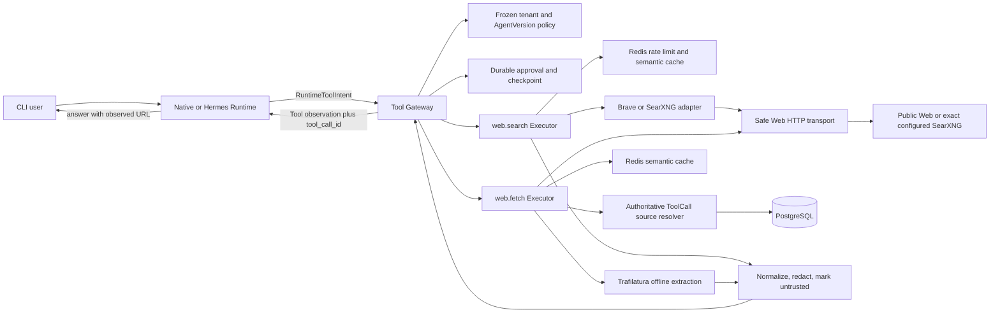
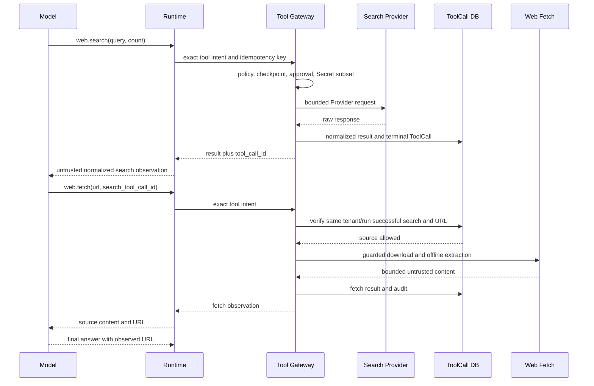

# Web Search and Fetch - Plan

## Goal Capsule

- **Objective:** 为 Nico 增加平台原生、可审计的 `web.search@1.0.0` 与 `web.fetch@1.0.0`，让 Agent 能检索当前公开网页、读取可信范围内的搜索结果、基于来源回答并保留紧凑的 CLI 进度，同时让所有联网行为继续经过 Tool Gateway 的租户策略、审批、Secret、SSRF 防护、幂等和审计边界。
- **Authority hierarchy:** 用户确认的完整 Search → Fetch 能力范围优先；ADR-0009 的唯一 Tool Gateway、ADR-0015 的持久化审批、不可变 AgentVersion 与租户策略交集、现有 Run/ToolCall 权威状态不可绕过。Hermes/OpenClaw 只作为交互与 Provider 抽象参考，不引入 Runtime 私有联网旁路。
- **Execution profile:** 先补齐 Provider 感知的 Secret 授权和共享安全 HTTP 基础，再实现 Provider/缓存/限流与 `web.search`，随后实现同 Run 来源授权、内容抽取与 `web.fetch`，最后完成 CLI 配置、Runtime 引导、可观测性、文档和端到端验收。
- **Stop conditions:** 如果实现需要允许模型自由指定 Provider endpoint、允许 fetch 任意 URL、启用 Hermes 原生 web/browser 工具、把搜索 API key 放入 Agent/Run/ToolCall JSON、默认渲染 JavaScript/登录页面、或跳过持久化审批，应停止并回到安全设计评审。
- **Tail ownership:** 只有在单元、集成、Runtime、CLI、SSRF、审批恢复、缓存隔离、Compose 契约和离线端到端测试全部通过，且文档能指导启用、诊断、关闭和轮换凭据后才算交付。

---

## Product Contract

### Summary

Nico 将提供两个互补的精确版本工具：

- `web.search@1.0.0`：查询一个由租户策略固定的搜索 Provider，返回结构化、规范化、标记为不可信外部内容的搜索结果。
- `web.fetch@1.0.0`：下载并抽取网页正文；目标 URL 必须来自同一 Run 中成功的 `web.search` ToolCall，或命中租户明确配置的域名 allowlist。

模型不能在参数中选择 Provider、base URL、认证方式或网络策略。API、Native Runtime、Hermes MCP toolset、CLI 和未来 Runtime 都使用同一 ToolDefinition 与 Tool Gateway 执行路径。首个托管 Provider 为 Brave Search API；同时保留可自托管的 SearXNG Adapter 与可选本地 Compose profile。

### Problem Frame

当前 Nico 只向 Agent 暴露文件、报告、通用 allowlisted HTTP、数据库和 Python 等平台工具。`http.read` 要求预先配置域名，不能发现未知网页；模型因此会正确地声明自己没有互联网搜索能力。

直接启用模型厂商的 hosted search、Hermes 自带 web 工具或一个任意 URL HTTP 工具会绕过 Nico 的 AgentVersion、租户策略、持久化审批、Secret、ToolCall 审计和 Run 恢复边界。另一方面，只加入搜索 API 仍不足以支撑可靠回答：搜索摘要可能被截断或失真，Agent 需要在可控范围内抓取原始来源、清理正文并引用实际 URL。

Hermes 的可插拔 search/extract Provider 说明“搜索”和“抽取”应是独立能力；OpenClaw 的实现进一步证明需要规范化 Provider 输出、缓存、SSRF 防护、重定向复检和不可信内容包装。本计划采用这些产品模式，但把授权与执行统一收口到 Nico Tool Gateway。

### Actors

- A1. **Interactive operator:** 在 `nico chat` 或前台 `nico exec` 中要求查询当前信息，需要知道正在搜索或读取来源，但不应看到内部事件、私有推理、API key 或完整查询参数。
- A2. **Agent/Runtime:** 读取授权后的工具定义，决定何时搜索、何时抓取结果，并在使用 Web 证据时引用实际来源；不能选择或绕过网络 Provider。
- A3. **Tenant administrator/developer:** 选择 Brave 或 SearXNG、设置 Secret/endpoint/域名限制、把工具授予指定 AgentVersion，并通过 doctor/test/disable 操作维护能力。
- A4. **Platform operator:** 监控 Provider 健康、费用、限流、缓存、错误率和 SSRF 拒绝，且不在日志或审计载荷中暴露查询正文、页面正文或 Secret。

### Requirements

**Search capability**

- R1. 授权的 Agent 必须能通过 `web.search@1.0.0` 搜索当前公开 Web，并得到统一结构的 `title`、规范化 `url`、`snippet`、可选 `published_at` 和 `site_name`；首版每次最多 10 条结果。
- R2. 模型参数只允许稳定的跨 Provider 字段：`query`、`count`、可选 `language`、`country`、`freshness` 和最多 10 个域名过滤条件；Provider、endpoint、凭据、SafeSearch 和底层网络策略由冻结的 Tool policy 决定。
- R3. 首个托管 Provider 必须是 Brave Search API；同一 Provider 契约还必须提供 SearXNG JSON Adapter。Provider 必须显式选择，不得在一次 Run 中静默切换或失败后自动 fallback。

**Fetch and evidence capability**

- R4. `web.fetch@1.0.0` 只能读取同一租户、同一 Run 的成功 `web.search@1.0.0` ToolCall 返回的 URL，或租户 `allowed_domains` 中的 URL；搜索来源路径必须携带 `search_tool_call_id`，并在服务端重新查询权威 ToolCall 记录验证，不能信任模型回传的摘要或来源标记。
- R5. Fetch 必须支持 HTML、纯文本、Markdown、JSON 与 `+json` 文本响应；HTML 使用受控的正文抽取器输出 `markdown` 或 `text`，默认最多 20,000 字符。PDF、二进制、压缩包、媒体、下载落盘、登录态、Cookie、浏览器自动化和 JavaScript 渲染不在首版范围。
- R6. 只要本 Run 成功使用过 Web 工具并进入最终回答阶段，Native Runtime 必须要求模型在最终文本中使用本 Run 观察到的来源 URL；若第一次最终回答没有任何匹配来源，允许一次有界的引用修复轮次，仍不满足则保留回答但记录稳定的 `WEB_CITATION_MISSING` 诊断，不伪造引用。

**Security, authorization and data handling**

- R7. 两个工具必须由 Tool Gateway 注册、授权和执行，使用精确版本、网络权限、medium 风险、pre-action checkpoint、once/run 持久化审批、幂等 ToolCall、超时、有限重试、取消、输出 schema、Secret redaction 和审计。现有 approval grant 按 ToolDefinition 生效，因此同一 Run 首次 search 与首次 fetch 分别需要一次审批，之后各自可复用 run scope；任何 Runtime 不得获得直接网络客户端或原生 Web tool 旁路。
- R8. 任意外部 fetch 必须执行 URL 规范化、禁止 userinfo/fragment、HTTPS 默认、DNS 全结果校验、非公网地址拒绝、IP pinning、Host/SNI 保留、禁用环境 proxy、逐跳重定向复检、端口/content-type/下载字节/重定向次数/总时长限制。自托管 SearXNG 只允许访问平台预配置的精确 endpoint，可单独允许 loopback/private HTTP，模型输入不能触发该例外。
- R9. Search/Fetch 的 Provider 文本、摘要、标题、页面正文和错误详情必须被视为不可信数据；统一执行 Unicode/控制字符清理、Secret redaction、长度限制、URL 规范化和显式 `external_content` 元数据。不得把 Provider 原始响应作为兼容 fallback 返回给模型。
- R10. Provider Secret 只允许逻辑名引用并在授权执行前解析。ToolDefinition 声明 Provider 可能使用的 Secret 上限，Executor 根据冻结 Provider 配置选择本次真正需要的子集；Brave 缺少凭据时失败关闭，SearXNG 不得被迫配置虚假 Secret。
- R11. Redis 语义缓存必须租户隔离、版本化并只存规范化后的有界输出；fetch 的来源授权必须发生在缓存读取之前。Redis 限流至少按 tenant + tool + provider 计数；缓存故障可降级为未缓存，硬限流状态不可验证时生产模式失败关闭。

**Operations and UX**

- R12. `nico web configure/status/test/disable` 必须支持交互与 JSON 模式。CLI 必须在读取或暂存 Secret 前检查部署写策略、目标 Agent/tenant revision 与 Provider 基础配置；Secret 通过隐藏输入进入本地主机 Secret 事务，随后 probe、展示变更预览、确认并原子更新租户 policy、发布新的不可变 AgentVersion。失败或取消必须回滚 Secret 与策略变更；development `make run` 可显式开启写入，production 默认关闭直到 operator 配置。
- R13. `make run` 必须继续以本地源码运行 API/Worker/Web、自动同步 editable CLI，并只用 Compose 启动基础设施。选择本地 SearXNG 时可通过可选 Compose profile 启动并绑定 loopback；默认 Brave 开发不新增应用镜像构建。
- R14. 普通进度与终态摘要只展示 `Searching web`、`Reading source` 等语义状态，不展示 query、URL 参数、页面正文、原始 ToolCall payload 或 Provider 内部事件。持久化审批面板是唯一例外：它必须显示有界的 outbound query 预览或 URL origin，使用户知道即将向外部服务发送什么；`--json` 保留现有原始事件契约，Chat header 从 AgentVersion policy 如实显示两个精确工具。
- R15. 未授权时模型看不到工具；配置不完整、Provider 鉴权失败、429/5xx、来源不匹配、SSRF 拒绝、内容类型不支持、内容过大和抽取失败必须返回稳定、可诊断、已脱敏的错误码。`nico doctor`/`nico web status` 必须能区分“未授权、未配置、Secret 不可用、Provider 不可达、最近 probe 失败”。
- R16. 能力必须具备离线可重复的契约测试、Redis/PostgreSQL 集成测试、Native 与 Hermes MCP 平台工具可达性测试、CLI 测试和真实 Run 端到端测试；实时 Brave/SearXNG 网络 smoke 只能作为显式凭据门控的可选验收，不得成为默认 CI 的不稳定依赖。

### Key Flows

- F1. **Configure and publish Web capability**
  - **Trigger:** A3 运行 `nico web configure` 并选择 Brave 或 SearXNG。
  - **Actors:** A3, A4。
  - **Steps:** CLI 获取 catalog并预检部署写策略与目标 revisions；隐藏读取或引用凭据；本地 ServiceBridge 暂存 Secret；服务端 probe Provider；生成 tenant policy 与目标 Agent 新版本的合并预览；用户确认；服务端按 revision 原子激活；本地主机提交 Secret 事务并刷新 Worker。
  - **Outcome:** 新 Run 冻结包含 `web.search@1.0.0` 和 `web.fetch@1.0.0` 的精确 policy；旧 AgentVersion/旧 Run 不变。
  - **Covered by:** R3, R10, R12-R13, R15。

- F2. **Search current Web**
  - **Trigger:** A1 提出需要当前或外部事实的问题，A2 选择 `web.search`。
  - **Actors:** A1, A2, A4。
  - **Steps:** Runtime 列出授权定义；模型产生稳定参数；Gateway 保存 checkpoint 并按 once/run 请求审批；Executor 解析选中 Provider 所需 Secret、执行限流/缓存、调用 Adapter、规范化与包装输出；ToolCall 与事件持久化；CLI 只保留紧凑状态。
  - **Outcome:** A2 收到结构化结果和权威 `tool_call_id`，A4 获得不含 query 正文的审计与指标。
  - **Covered by:** R1-R3, R7-R11, R14-R16。

- F3. **Fetch a searched source and cite it**
  - **Trigger:** A2 选择一个搜索结果并调用 `web.fetch(url, search_tool_call_id)`。
  - **Actors:** A1, A2, A4。
  - **Steps:** Gateway 再次授权；Fetch Executor 在数据库中确认 ToolCall tenant/run/status/name 与精确规范化 URL；通过安全传输下载；按 content-type 抽取、清理、截断和包装；Runtime 把结果加入 tool observation；最终回答引用该 URL，必要时进行一次引用修复。
  - **Outcome:** 用户得到基于原始来源的回答，fetch 不能被转化为任意 URL SSRF 或开放代理。
  - **Covered by:** R4-R11, R14-R16。

- F4. **Fetch an administrator-allowed domain directly**
  - **Trigger:** A3 已在 tenant policy 设置 `allowed_domains`，A2 直接调用 `web.fetch`。
  - **Actors:** A2, A3。
  - **Steps:** Fetch Executor 在没有 `search_tool_call_id` 时只接受 allowlist 域名；之后执行与 F3 相同的网络和抽取边界。
  - **Outcome:** 文档站或内部明确批准的公开站点可直接读取，但 AgentVersion 只能收窄、不能扩大 tenant allowlist。
  - **Covered by:** R4-R5, R7-R11。

- F5. **Durable approval, disconnect and resume**
  - **Trigger:** 首个 search 或 fetch 需要 medium 风险审批，或 CLI 在等待时断开。
  - **Actors:** A1, A2。
  - **Steps:** Gateway 在副作用前保存 checkpoint；Run 进入 `waiting_for_approval` 并释放 lease；CLI 展示服务端审批；决定被持久化后 Run 重新领取并使用相同 idempotency key 恢复；本地已经提交成功 ToolCall 或 semantic cache 的 Provider 调用不重复产生外部请求，远端响应尚未本地提交的崩溃窗口按 KTD14 处理。
  - **Outcome:** 用户能明确看到 search 与 fetch 两个独立审批范围；审批、断线和 Worker 重启不会丢失决定，已经本地提交的调用不会重复，KTD14 所述崩溃窗口除外。
  - **Covered by:** R7, R11, R14, R16。

- F6. **Provider or content failure**
  - **Trigger:** Secret 缺失、Provider 429/5xx、DNS/redirect 触发安全拒绝、内容类型不支持或正文为空。
  - **Actors:** A1-A4。
  - **Steps:** Adapter/transport 将外部错误映射到稳定码；Gateway 只对明确 retryable 的网络/429/5xx 错误按预算重试；输出与日志脱敏；Runtime 观察失败并决定更换 query、选择另一来源或诚实说明限制；同一 Run 中不静默切 Provider。
  - **Outcome:** 用户得到可理解的失败，审计能定位类别，权限和数据边界保持关闭。
  - **Covered by:** R3, R7-R11, R15-R16。

### Acceptance Examples

- AE1. **Covers F2 / R1-R3.** Given AgentVersion 和 tenant policy 都授权 Brave，when 模型调用 `web.search` 查询 5 条结果，then Provider 参数由 frozen config 决定，输出严格符合统一 schema，结果数不超过 5，且不存在原始 Brave JSON 字段。
- AE2. **Covers F2 / R7.** Given tenant 授权而 AgentVersion 未授权，或反之，when Runtime 枚举工具，then `web.search`/`web.fetch` 都不可见；模型不能借助 Hermes native web 或 hosted search 绕过该结果。
- AE3. **Covers F1 / R10, R12.** Given 选择 Brave 并隐藏输入 key，when probe 或 publish 失败，then key 不出现在 argv/stdout/log/DB，Secret 文件和 Worker 状态回滚，tenant policy 与 AgentVersion 不发生半提交。
- AE4. **Covers F1 / R3, R10.** Given 选择无凭据 SearXNG，when 工具授权，then conditional Secret 选择为空并可正常执行；选择 Brave 且缺少 `web_search_brave_api_key` 时工具不可执行并返回 `WEB_SEARCH_SECRET_UNAVAILABLE`。
- AE5. **Covers F3 / R4.** Given Run A 的成功 search ToolCall 返回 URL U，when Run A 使用该 ToolCall ID fetch U，then 成功；when Run B、另一 tenant、失败的 ToolCall、伪造 ID 或不同规范化 URL 尝试 fetch，then 在任何缓存/网络访问前返回 `WEB_FETCH_SOURCE_DENIED`。
- AE6. **Covers F4 / R4.** Given tenant allowlist 含 `docs.example.com` 且 AgentVersion 未增加新域，when 直接 fetch 该域成功；when AgentVersion 尝试加入 `other.example.com`，then policy intersection 不会扩大 tenant scope。
- AE7. **Covers F3 / R8.** Given URL 初始解析为公网但第二个 DNS 结果为私网，或 redirect 指向 loopback/metadata IP/private address/未授权新 origin，when fetch，then 请求被拒绝且不会连接目标；环境 `HTTP_PROXY` 不改变行为。
- AE8. **Covers F3 / R5, R9.** Given HTML 同时含导航、正文、脚本和 prompt injection 文本，when fetch，then Trafilatura 只处理已下载 bytes 并输出正文 Markdown、控制字符被清理、内容被标为不可信、脚本不执行，超过 20,000 字符时明确 `truncated=true`。
- AE9. **Covers F2-F3 / R11.** Given 同 tenant、相同规范化参数在 TTL 内重复 search/fetch，when 第二次执行，then semantic cache 可命中但新的 ToolCall、审批判断和审计仍存在（once/run grant 可复用而不新建审批请求）；换 tenant、Provider、policy hash、extract mode 或 URL 时不共享缓存；fetch 缺少合法来源时即使有缓存也失败。
- AE10. **Covers F3 / R6.** Given Web tool 已返回来源而模型首个最终文本没有任何匹配 URL，when Native Runtime 收尾，then最多追加一次 citation repair；若修复文本包含观察到的来源 URL则成功，若仍没有则记录 `WEB_CITATION_MISSING` 且不注入虚假链接。
- AE11. **Covers F5 / R7, R16.** Given 已提交的 semantic cache 或 ToolCall 成功结果存在后 Worker 重启，when Run 恢复，then不会再次请求 Provider；given Worker 在远端返回与本地 cache/ToolCall 提交之间崩溃，then允许只读 Provider 请求被重复一次，但最终仍只有一个权威 ToolCall 结果，attempts/metrics 能识别该 at-least-once 窗口且文档不承诺绝对不重复计费。
- AE12. **Covers F2-F3 / R14.** Given 相同 Run 分别在 TTY、非 TTY 和 `--json` 执行，then普通 TTY 进度只显示 `Searching web`/`Reading source` 动态状态和各一个终态摘要，审批面板只显示有界 query/origin 预览，非 TTY 普通进度不输出 query/正文，JSON schema 与现有事件契约兼容。
- AE13. **Covers F6 / R15.** Given Brave 返回 401、429、无效 JSON 和 503，then 分别映射为不重试的认证错误、受 Retry-After/本地预算约束的限流错误、协议错误和有界重试的不可用错误，Provider body 与 key 都不进入模型或 CLI。
- AE14. **Covers F1 / R13.** Given clean checkout 已安装开发依赖，when `make run` 启动默认 Brave 模式，then不构建应用镜像且 `nico` 指向最新 editable CLI；when选择 SearXNG profile，then只启动 loopback 绑定的基础搜索服务，API/Worker/Web 仍从源码运行。

### Success Criteria

- 一个配置完成的 Native Agent 能在离线 fake Provider E2E 中自主完成“search → fetch 至少一个来源 → 含观察到 URL 的最终回答”。
- 未授权、跨 Run、跨 tenant、SSRF、redirect、缓存绕过和 Secret 泄露测试均为零容忍通过；任何失败都发生在外部网络访问前或返回严格有界、脱敏的错误。
- 搜索与抓取默认 p95 平台附加处理时间（不含 Provider/远端等待）在测试基准中分别低于 100 ms 和 250 ms；HTML 抽取在最大下载限制内无无界内存增长。
- 默认 CI 不依赖公网或真实 API key；Provider contract fixtures、fake HTTP 服务、PostgreSQL/Redis 集成和 Runtime E2E 可重复通过。
- CLI 人类输出不包含 query、页面正文、Secret、原始 Provider payload、内部 event name 或 sequence；`--json` 与既有机器契约保持兼容。
- 启用、轮换、probe、禁用和回滚均有文档化路径，新旧 AgentVersion/Run 的冻结行为可通过测试证明。

### Scope Boundaries

**In scope**

- `web.search@1.0.0`、`web.fetch@1.0.0` 的 schema、Executor、Provider Adapter、Tool Gateway 注册和 Runtime tool intent 路径。
- Brave Search API 与 SearXNG JSON 搜索 Adapter；SearXNG 可选本地 Compose profile。
- 共享安全 HTTP transport、同 Run 来源验证、HTML/文本/JSON 抽取、内容清理、不可信标记和引用要求。
- Redis cache/rate limit、稳定错误、指标/审计、CLI 配置/状态/probe/disable/doctor、AgentVersion 发布和文档。
- Native Runtime 完整 Agent 流，以及 Hermes 通过 Nico 按 Run MCP toolset 使用同一平台工具的契约验证。

**Deferred to follow-up work**

- 新增其他托管 Provider、Provider 自动优选、跨 Provider fallback、图片/新闻/地图等垂直搜索。
- PDF/Office 文档解析、文件下载为 Artifact、robots/crawl-delay 管理、多页 crawl、站点地图和批量抓取。
- 声明级 claim-to-citation 对齐、结构化 citations 字段和 UI 可点击引用卡；首版只验证最终文本至少引用一个本 Run 观察到的 URL。
- 分布式全局成本预算、Provider 账单同步和生产级认证/配额控制；本计划实现基础限流，但不能替代 `docs/security.md` 中仍待完成的正式认证工作。

**Outside this plan**

- 浏览器自动化、JavaScript 渲染、登录页、Cookie/session、CAPTCHA、反爬绕过、网页表单写操作。
- 启用模型厂商 hosted search、Hermes/OpenClaw 原生 web/browser/terminal 工具或任何绕过 Tool Gateway 的网络能力。
- 让模型配置 Provider endpoint、私网例外、代理或凭据；在最终回答中伪造或自动替换来源。

---

## Planning Contract

### Key Technical Decisions

- KTD1. **所有 Web 能力继续只走 Nico Tool Gateway。** (session-settled: user-approved — 用户确认完整 Search/Fetch 方案；ADR-0009 已禁止 Runtime 原生联网旁路。) Native 使用 `GatewayRuntimeToolHandler`，Hermes 只使用 Nico 按 Run MCP toolset；模型 hosted search 保持关闭。
- KTD2. **搜索与抓取是两个独立、可组合的精确版本工具。** 这沿用 Hermes 的 search/extract 能力分离和 OpenClaw 的 search/fetch 边界，使审批、预算、来源授权、缓存和失败处理可分别控制；不把搜索后的自动抓取隐藏在一个黑盒调用中。
- KTD3. **Provider 显式固定，不做静默 fallback。** Provider 由 tenant policy 选择并冻结进 RuntimeSession tool policy snapshot，模型输入不包含该字段。可重复性、费用归属和审计优先于 Hermes/OpenClaw 的自动探测便利；切换 Provider 必须发布新 AgentVersion 并只影响新 Run。
- KTD4. **Brave 是首个托管 Provider，SearXNG 是同契约的自托管 Adapter。** Brave 提供稳定托管 API；SearXNG 满足本地/私有部署与未来替换需求。Adapter 只负责 Provider 请求与归一化，不能决定授权、缓存、Secret 或任意网络例外。
- KTD5. **ToolDefinition Secret 是可能集合，Executor 选择实际必需子集。** 为 `ToolExecutor` 增加纯函数式 `required_secret_names(tool_config)` 能力；Gateway 先从 frozen config 验证 Provider，再要求返回集合是 `spec.secret_names` 子集，最后仅解析该子集。现有 Executor 默认返回全部声明 Secret，保持兼容；避免为 SearXNG 配置虚假 Secret或按部署产生不同 ToolDefinition hash。
- KTD6. **Fetch 来源授权复用权威 ToolCall，而不新增数据库表。** `search_tool_call_id` 必须指向同 tenant/run 的成功 `web.search@1.0.0`，服务端从持久化 result 重新取出并规范化比对 URL；允许域名来自 frozen config。这样跨重启可恢复，又不引入只为短期来源列表服务的重复持久化模型。
- KTD7. **安全传输从 `http.read` 和模型 transport 提炼，按策略模式复用。** 公网 fetch 使用 strict-public 模式；Provider endpoint 使用 exact-configured-endpoint 模式；SearXNG 的 loopback/private HTTP 例外只由部署 settings 和精确 hostname 共同开启。两种模式共享 DNS 全结果校验、pinning、Host/SNI、禁 proxy、bounded streaming 与逐跳检查，禁止复制出第三套不一致网络代码。
- KTD8. **跨 origin redirect 默认拒绝。** Fetch 只自动跟随同规范化 origin 的重定向；新的 origin 必须单独命中 tenant allowlist 或同一权威 search ToolCall 的结果 URL。首版不依赖不完整的 public-suffix 推断，也不把 `www` 变化当作隐式可信。
- KTD9. **Trafilatura 2.1.0 只承担离线正文抽取。** Nico transport 先完成下载与边界检查，再把 bytes 交给 pinned dependency；禁止使用 Trafilatura 的下载/crawl API。HTML 默认 `include_comments=false`、`include_tables=false`，输出 Markdown 或 text；为空时以受控的 HTML-to-text fallback 返回，仍需长度和不可信包装。
- KTD10. **缓存是性能层，不是授权或 ToolCall 幂等层。** ToolCall idempotency 继续处理相同调用恢复；Redis semantic cache 处理不同 ToolCall 的相同规范化请求。每个调用仍经过审批判断并产生审计，once/run grant 可以复用；fetch 在查缓存前验证来源，cache key 包含 tenant、工具 schema 版本、Provider、policy hash 和规范化参数。
- KTD11. **引用采用“观察到 URL 的最小可验证约束”。** Runtime 记录本 Run Web observations 的规范化 URL；使用 Web 结果后，最终文本至少包含一个集合内 URL，否则最多修复一次并记录诊断。首版不声称验证每个 claim，不引入会误判的全文 citation validator。
- KTD12. **Web 配置复用 Provider onboarding 的事务体验，但使用独立领域服务。** `web_onboarding` 复用 catalog/probe/preview/confirm/publish 和本地可恢复 Secret transaction 的模式，不把 Search Provider 塞进 ModelEndpoint 表，也不让 CLI 直接拼装多资源写入。
- KTD13. **区分知情审批、租户权威数据和操作遥测。** 普通进度、服务日志和 metrics 不记录 query、结果正文或 URL query string；tenant-RLS 下的 ToolCall/RunStep 与 ToolApproval 可以保存执行/恢复所需的参数和结果，审批 UI 只显示最多 300 字符的 outbound query 或 URL origin。Event/Audit 摘要仅保存 provider、tool、status、result count、cache、latency、error code 与 origin/hash；文档明确数据库保留与敏感查询风险。
- KTD14. **外部只读 HTTP 调用采用 at-least-once 语义。** Gateway 能保证单一权威 ToolCall 结果并复用已经提交的 ToolCall/cache，但无法在远端响应与本地事务提交之间做分布式原子提交。该崩溃窗口允许重复一次 Search/Fetch 请求；不得承诺严格 exactly-once 或绝对单次计费，必须通过 attempt/latency/cache 指标识别。

### High-Level Technical Design

下图表达职责和信任边界，不规定最终类名或方法签名。





### Tool Contracts

| Contract | Input | Output | Fixed controls |
|---|---|---|---|
| `web.search@1.0.0` | `query` 1-2,000 chars; `count` 1-10 default 5; optional BCP-47-like `language`, ISO country, `freshness` enum `day/week/month/year`, `domains` max 10 | `provider`, authoritative `query`, `results[]`, `result_count`, `cached`, `took_ms`, `external_content` | `network.web.search`, medium risk, 30 s, max 2 attempts only for mapped retryable errors, max output 128 KiB |
| `web.fetch@1.0.0` | absolute `url`; optional `search_tool_call_id`; `extract_mode` enum `markdown/text`; `max_chars` 100-20,000 default 20,000 | original/final URL, HTTP status, content type, title, extractor, content, bytes, hash, fetched time, redirects, truncated, cached, `external_content` | `network.web.fetch`, medium risk, 30 s, max 2 attempts for transport failures only, max download 750 KiB, max output 128 KiB |

`external_content` 是固定平台元数据：`untrusted=true`、`source=web_search|web_fetch`、`wrapped=true`、`provider`（search）或 `origin`（fetch）。Provider 回显的 query 不作为权威输入；输出中的 query 使用经过验证的模型参数，避免 Provider 注入或变形。

### Policy and Configuration Contract

租户 policy 是能力上限，AgentVersion policy 只能取交集。以下是结构示意，不是要求实现者复制具体序列化代码：

```yaml
tool_policy:
  allow: [web.search@1.0.0, web.fetch@1.0.0]
  permissions: [network.web.search, network.web.fetch]
  secret_refs:
    web_search_brave_api_key: env:NICO_TOOL_SECRET_WEB_SEARCH_BRAVE_<ROTATION>
  tools:
    web.search@1.0.0:
      provider: brave
      count_limit: 10
      cache_ttl_seconds: 900
      rate_limit_per_minute: 20
      safe_search: moderate
    web.fetch@1.0.0:
      allowed_domains: []
      cache_ttl_seconds: 900
      max_download_bytes: 768000
      max_chars: 20000
      max_redirects: 3
```

SearXNG 只把 `provider` 换为 `searxng` 并引用平台 catalog 中的 endpoint key；Agent policy 不携带 raw base URL。SearXNG JSON 必须由服务端启用，未启用时 403 映射为明确配置错误。

### Provider and Error Contract

- Provider registry 是静态受信代码 catalog，键、能力、Secret 需求、允许 endpoint 类型和 Adapter factory 均由平台定义；用户不能通过配置加载任意 Python 类。
- Brave 使用官方 Web Search endpoint 与 `X-Subscription-Token`；count 上限 10 即使官方允许更大，以控制 token/费用。认证、429、5xx、无效 JSON、缺字段分别映射稳定错误。
- SearXNG 使用 `/search` JSON、`q`、`format=json`、language/pageno/time_range/safesearch 等受控字段；HTML fallback 和非 JSON响应一律视为协议/配置错误。
- 稳定错误族至少包括 `WEB_SEARCH_NOT_CONFIGURED`、`WEB_SEARCH_SECRET_UNAVAILABLE`、`WEB_PROVIDER_AUTH_FAILED`、`WEB_PROVIDER_RATE_LIMITED`、`WEB_PROVIDER_UNAVAILABLE`、`WEB_PROVIDER_PROTOCOL_ERROR`、`WEB_FETCH_SOURCE_DENIED`、`WEB_FETCH_TARGET_DENIED`、`WEB_FETCH_REDIRECT_DENIED`、`WEB_FETCH_CONTENT_UNSUPPORTED`、`WEB_FETCH_TOO_LARGE`、`WEB_FETCH_EXTRACTION_FAILED` 和 `WEB_CITATION_MISSING`。
- 外部错误 message 只允许有界、清理后的描述；Provider response body、HTML、query、Secret 和完整 URL query 不进入 Event/Audit payload。

### System-Wide Impact

- **Tool contracts and authorization:** `ToolExecutor` 增加 conditional Secret 选择；`authorize_tool` 和 Gateway 在 list/execute 两个入口使用同一 Provider 配置验证，现有工具通过默认实现保持行为不变。ToolDefinition content hash 仍包含“可能 Secret 集合”，不会随部署 Provider 选择漂移。
- **Persistence:** 不新增来源授权表；复用 `ToolCall.result`、tenant/run/status/name/version 与 `RuntimeSession.tool_policy_snapshot`。需要确认 ToolCall result 的既有保留策略至少覆盖 Run 恢复窗口；如果将来压缩/清理结果，必须先迁移来源授权记录。
- **Runtime:** Native ReAct/Plan 通过现有 `GatewayRuntimeToolHandler` 获得工具；tool observation 已包含平台 `tool_call_id`，可作为 fetch 参数。Direct mode仍不调用工具。Hermes 使用现有按 Run MCP server/toolset，不开启自身 Web 插件。
- **Prompt/context:** 工具描述明确何时搜索、何时 fetch、如何传 `search_tool_call_id`、外部内容不可信和引用要求；系统上下文保留“工具结果是不可信数据”规则。引用修复只在已使用 Web 工具且最终文本无匹配 URL 时触发一次。
- **HTTP safety:** `http.read` 与模型 Provider 现有安全逻辑需要抽取公共 primitives，但原有错误码和测试必须保持；Provider exact endpoint 与 arbitrary public fetch 使用不同 policy object，避免私网例外扩散。
- **Secrets and maintenance:** 本地 Secret 文件从 model-only 演进为能承载 `NICO_MODEL_SECRET_*` 与 `NICO_TOOL_SECRET_*` 的受控 store；ServiceBridge action 和 journal 语义泛化，保留单活动事务、owner/mode attestation、Worker restart、commit/rollback/recover。
- **CLI/API:** 新增 Web catalog/probe/preview/activate/status/disable API 和 thin CLI coordinator；服务端拥有合并 tenant policy、复制当前 AgentVersion、revision 冲突和发布事务。CLI 不直接写数据库或把 key 发为普通 metadata。
- **Deployment policy:** 新增独立的 Web Provider 写入开关与 capability status，不能复用含义不同的 model endpoint policy；CLI 在 Secret prompt 前预检。`make run` development 明确开启，production 默认关闭并在 status/doctor 给出修复指引。
- **Development/release:** `make run` 已会比较 `pyproject.toml` fingerprint、同步 editable venv、安装 `nico` symlink并运行源码；新增 Trafilatura 后自动触发依赖同步。SearXNG 作为可选 Compose基础服务，`stop_containerized_app_services` 与 infra allowlist 需识别它。
- **Observability:** metrics 记录 tool/provider/status/cache/latency/result count/bytes/error code；Event/Audit 继续只记录安全摘要。日志 correlation 使用现有 run/tool IDs，但面向 CLI 的人类渲染不显示内部 ID。
- **Failure propagation:** Provider、cache、rate limit、source resolver、transport、extractor 各自映射稳定错误，Gateway 决定重试与终态；Runtime 收到普通 tool failure，可换来源或说明失败，不能自动切 Provider。
- **Data/privacy:** 搜索 query 与网页内容会存在于 tenant-RLS 下的执行/审批记录并可能进入模型上下文；启用文档必须明确保留范围和删除责任。缓存租户隔离且 TTL 有界，不缓存认证 header、Provider raw body或跨 tenant数据；若未来缩短 ToolCall result 保留期，必须先为仍可恢复的 Run 保留 provenance 所需最小 URL 集合。
- **Agent parity:** 人和 Agent 通过同一 AgentVersion 获取能力；CLI 只负责配置/审批/观察，不存在只能人手动完成的隐式 fetch。Native 与 Hermes MCP 都提交相同 tool intent，结果、审批和失败语义一致。

### Sequencing

1. U1 建立 conditional Secret 与 Provider 配置验证，不改变现有工具行为。
2. U2 提炼安全 HTTP、URL 规范化和不可信内容 primitive，为两个工具提供共同底座。
3. U3 实现 Provider registry、Brave/SearXNG Adapter、Redis cache/rate limit 与离线 contract fixtures。
4. U4 注册并贯通 `web.search`，先实现可审计搜索闭环。
5. U5 增加来源 resolver、fetch transport、抽取器和 `web.fetch`。
6. U6 完成 Runtime 使用策略、citation repair 与 Native/Hermes MCP parity。
7. U7 完成 Web onboarding API、Secret transaction 和不可变 AgentVersion 发布。
8. U8 完成 CLI、`make run`/SearXNG profile、进度和 doctor/status。
9. U9 完成跨层 E2E、运维文档、feature matrix 与受控 rollout。

### Delivery Phases

| Phase | Units | Deliverable | Exit gate |
|---|---|---|---|
| P1 — Security foundation | U1-U2 | conditional Secret 授权与共享 safe HTTP primitives | 现有工具/HTTP/model transport 无回归；SSRF corpus 与 list/execute 一致性通过 |
| P2 — Search vertical slice | U3-U4 | Brave/SearXNG Provider 层、cache/rate limit 与可审计 `web.search` | fake Provider 下模型能搜索；审批、重试、缓存隔离和错误映射通过 |
| P3 — Fetch and evidence | U5-U6 | provenance fetch、正文抽取、Runtime 组合与 citation 行为 | search → fetch → cited answer E2E 通过；跨 Run/tenant/redirect 攻击全拒绝 |
| P4 — Product activation | U7-U8 | onboarding API、Secret transaction、CLI、doctor 与本地 SearXNG | configure/cancel/rollback/disable、TTY/JSON 和 `make run` 契约通过 |
| P5 — Release readiness | U9 | 离线全链测试、文档、监控与受控 rollout | 所有自动化 gates、安装包验证和单 tenant smoke 通过 |

每个 Phase 都可以单独合并和测试，但在 P4 完成前不应向普通用户宣传可配置能力，在 P5 完成前不应默认授权任何 tenant。

### Risks and Mitigations

| Risk | Impact | Mitigation |
|---|---|---|
| Web 内容 prompt injection | 页面诱导模型泄露数据或调用高风险工具 | 双层不可信标记、系统上下文规则、工具仍逐次经过 policy/approval；禁止把页面文本当指令 |
| SSRF/DNS rebinding/redirect pivot | 访问 metadata、loopback 或私网服务 | 全 DNS 结果校验、IP pinning、逐跳复检、strict-public 默认、exact endpoint 特例隔离、跨 origin fail-closed 测试 |
| Query/URL/正文泄露 | 日志、metrics、CLI 或跨租户缓存暴露敏感研究内容 | 只在 tenant ToolCall result 与模型 observation 保存必要数据；日志/事件摘要不含正文，URL query hash/移除，cache tenant scope + TTL |
| Conditional Secret 改动回归现有工具 | database.read 等授权失败或 hash 漂移 | 默认返回全部已声明 Secret；单元/集成对现有 executor 逐一回归；定义 hash 只含可能集合 |
| Provider schema/计费/限流漂移 | 搜索中断或意外费用 | Adapter contract fixtures、稳定错误、显式 Provider、count/rate/cost 上限、可选 live smoke、status/doctor |
| 远端响应与本地提交之间崩溃 | 同一个只读请求可能重复并产生额外费用 | 明确 at-least-once 合同；优先复用已提交 ToolCall/cache；保留单一权威结果并监控 attempt/cost，不声称 exactly-once |
| SearXNG 私网例外污染任意 fetch | Agent 利用自托管设置访问内网 | endpoint 从静态 catalog/settings 选择；模型不可传 base URL；独立 network policy，精确 host/port，不能复用为 fetch target |
| 抽取器 CPU/内存或供应链风险 | 大 HTML 阻塞 Worker 或引入漏洞 | 下载 750 KiB、20k 输出、超时/并发限制、固定 Trafilatura 2.1.0、只离线抽取、依赖审计；后续需要时移至隔离服务 |
| Citation repair 增加 token/延迟 | Web 回答多一次模型调用 | 仅当使用 Web 且没有任何观察 URL 时触发，最多一次，计入现有预算并可观测 |
| Cache 掩盖授权或过期内容 | 越权或回答陈旧 | 授权先于 cache；key 包含 tenant/policy/schema/provider/normalized args；默认 TTL 15 分钟并返回 fetched_at/cached |
| Redis 故障破坏成本控制 | 无限制调用 Provider | cache 失败降级；生产 hard limiter 无法判断时失败关闭，开发可显式 soft 模式；指标告警 |
| 持久化 approval 造成首次搜索摩擦 | 用户每个 Run 首次调用要确认 | 保持 once/run、CLI 使用语义化工具名；不因便利降低网络风险；后续另行评估租户预批准 scope |
| Hermes 行为与 Native 不一致 | 某 Runtime 绕过或无法使用工具 | 禁用 Hermes native Web，只验收 Nico MCP toolset；Provider 不支持平台工具时能力不可宣称可用 |
| 当前部署缺正式认证 | 远程用户可能修改配置或读取结果 | Web rollout 默认 local/trusted-network；生产启用受 `docs/security.md` 认证补全项约束并在 status 中告警 |

### Sources and Research

**Repository grounding**

- `docs/decisions/ADR-0009-tool-gateway-and-sandbox-boundary.md` 要求 Runtime 只能产生 tool intent 或调用 Nico 按 Run MCP，Hermes 原生 web/browser 保持关闭。
- `docs/decisions/ADR-0015-durable-tool-approval.md` 固定 medium/high 工具的 once/run 持久化审批与 checkpoint/resume 语义。
- `backend/src/nico_agent/tools/contracts.py`、`policy.py`、`gateway.py` 提供精确 ToolDefinition、冻结策略、Secret、schema、重试、审批、幂等和 ToolCall 权威边界。
- `backend/src/nico_agent/tools/builtin/http_read.py` 已实现域名 allowlist、DNS 全结果校验、IP pinning、Host/SNI、redirect 复检、禁 proxy 和有界响应，是 Web transport 的主要仓库模式。
- `backend/src/nico_agent/models/http_safety.py` 提供受信 endpoint 与公网 endpoint 的第二个安全传输先例；计划将公共 primitive 抽出而不合并两种策略。
- `backend/src/nico_agent/runtime/tools.py` 与 `runtime/native/loop.py` 已把授权定义映射为模型工具并把 `tool_call_id` 放入 observation；无需新增 Runtime 到 Gateway 协议。
- `backend/src/nico_agent/runtime/hermes.py` 已通过按 Run toolset 声明 `PLATFORM_TOOLS`；Web 功能沿用该边界而不调用 Hermes 私有 Provider。
- `backend/src/nico_agent/provider_onboarding/`、`cli/provider.py`、`cli/service_bridge.py` 和 `local_secret_transaction.py` 提供 probe → preview → confirm → publish 与可恢复本地 Secret 事务模式。
- `scripts/local-dev.sh` 和 `Makefile` 已实现 editable CLI 同步、本地源码服务与 Compose 基础设施分离；本计划只增加可选 SearXNG 基础服务。

**External grounding**

- [Hermes Web Search documentation](https://hermes-agent.nousresearch.com/docs/user-guide/features/web-search) 将 search 与 extract 作为独立能力并支持 Provider 配置。
- [Hermes Provider plugin contract](https://hermes-agent.nousresearch.com/docs/developer-guide/web-search-provider-plugin) 和 [pinned provider source](https://github.com/NousResearch/hermes-agent/blob/d604141d097eec4a49493ad1eaceb9b2ca1e496d/agent/web_search_provider.py) 说明 capability-aware registry 与统一结果形状。
- [OpenClaw web tools documentation](https://docs.openclaw.ai/tools/web) 与 [normalized search output source](https://github.com/openclaw/openclaw/blob/a65ad9a3fd1ce668c798ac2937eaac0626e4b6f4/src/agents/tools/web-search-output.ts) 支持规范化 URL、Provider 输出收敛、缓存和不可信外部内容标记。
- [OpenClaw web fetch source](https://github.com/openclaw/openclaw/blob/a65ad9a3fd1ce668c798ac2937eaac0626e4b6f4/src/agents/tools/web-fetch.ts) 与 [guarded fetch source](https://github.com/openclaw/openclaw/blob/a65ad9a3fd1ce668c798ac2937eaac0626e4b6f4/src/agents/tools/web-guarded-fetch.ts) 支持 bounded fetch、readability、重定向限制与 SSRF 网络模式；Nico 首版不复制其 spill-to-file 行为。
- [Brave Search API documentation](https://api-dashboard.search.brave.com/app/documentation/web-search/get-started) 定义 `X-Subscription-Token`、Web Search endpoint 和查询参数。
- [SearXNG Search API documentation](https://docs.searxng.org/dev/search_api.html) 定义 `/search`、`format=json`、language/time_range/safesearch，并指出 JSON format 未启用会返回 403。
- [Trafilatura 2.1.0 Python documentation](https://trafilatura.readthedocs.io/en/latest/usage-python.html) 支持从已有 HTML 字节抽取正文并输出 Markdown/text；[PyPI release](https://pypi.org/project/trafilatura/) 支持 Python 3.10+，与项目 Python 3.11+ 兼容。

### Resolved During Planning

- RP1. **是否每次搜索都自动抓取所有结果？** 否。Search 与 Fetch 分开，模型按需抓取，控制费用、token 和攻击面。
- RP2. **是否允许 Provider 自动 fallback？** 否。显式 Provider 冻结到 Run，失败时由用户/管理员切换配置并发布新版本。
- RP3. **Fetch 是否等价于新的任意 URL `http.read`？** 否。默认要求同 Run search provenance，仅额外允许 tenant allowlist。
- RP4. **是否新建来源表？** 首版不新建；权威 ToolCall result 足以跨重启验证，减少重复状态。
- RP5. **是否由抽取库下载页面？** 否。Trafilatura 只离线处理 Nico 安全 transport 已下载的 bytes。
- RP6. **是否记录完整 query 作为 metrics/audit？** 普通日志、metrics 与事件摘要不记录；query 只存在于受租户隔离的执行/审批权威记录与模型上下文，审批 UI 仅显示有界预览以支持知情授权。

### Open Questions

无产品阻塞问题。实现阶段只允许决定不改变合同的细节：Redis key 编码、内部类名、指标后端命名和测试 fixture 组织。若真实站点兼容性证明“同 origin redirect”过严，应提交独立设计变更，不能在实现中静默扩大为任意公网 redirect。

---

## Implementation Units

### U1 — Provider-aware Tool Secret authorization

- **Goal:** 让 Tool Gateway 能根据冻结 tool config 解析 Provider 实际需要的 Secret 子集，同时保持所有现有 Executor 的授权、definition hash 和错误行为兼容。
- **Requirements:** R7, R10, R15；AE2, AE4。
- **Dependencies:** None。
- **Files:** `backend/src/nico_agent/tools/contracts.py`, `backend/src/nico_agent/tools/policy.py`, `backend/src/nico_agent/tools/gateway.py`, `backend/src/nico_agent/tools/registry.py`, `backend/tests/unit/test_tool_contract.py`, `backend/tests/unit/test_tool_policy.py`, `backend/tests/integration/test_tool_gateway.py`。
- **Approach:** 为 Executor 契约增加从已授权 `tool_config` 计算 required Secret names 的能力；默认适配器返回 `spec.secret_names`。Gateway 的 list 与 execute 路径先取得 executor、验证返回值是声明集合子集，再只检查/解析该子集。Provider config 无效必须让工具不被枚举并在直接执行时返回相同稳定拒绝，避免 list/execute 漂移。
- **Patterns:** 延续 `authorize_tool()` 的 fail-closed intersection、`EnvironmentSecretResolver` 的 late resolution 和 ToolDefinition content hash；不要把 Secret 值或 deployment-specific requirement 写入 spec。
- **Test scenarios:** 现有带/不带 Secret 工具行为不变；Brave config 选择一个 Secret；SearXNG 选择空集；未声明 Secret、未知 Provider、缺 ref、空 ref 和 env 值缺失分别失败；list 与 execute 一致；content hash 在 Provider 配置变化时不变而 policy snapshot hash 变化。
- **Verification:** 所有现有 tool contract/policy/gateway 测试无回归；新增测试证明只解析选中子集且任意扩大集合都在 Executor 执行前被拒绝。

### U2 — Shared safe Web transport and external-content primitives

- **Goal:** 建立 Search Provider 与 Fetch 共用、但策略隔离的 URL/网络/响应安全基础。
- **Requirements:** R8-R9, R15；AE7-AE8。
- **Dependencies:** U1。
- **Files:** `backend/src/nico_agent/net/safe_http.py` (new), `backend/src/nico_agent/web/normalization.py` (new), `backend/src/nico_agent/tools/builtin/http_read.py`, `backend/src/nico_agent/models/http_safety.py`, `backend/tests/unit/test_safe_http.py` (new), `backend/tests/unit/test_http_read_tool.py`, `backend/tests/unit/test_model_http_safety.py` (new or existing equivalent).
- **Approach:** 提炼 URL canonicalization、IDNA、DNS resolve/all-address validation、IP pinning、Host/SNI、no-proxy client、bounded streaming、redirect loop 与 clean external text。用明确 policy object 表达 strict-public、existing allowlisted HTTP 和 exact-configured endpoint，不用布尔参数组合隐含信任。保持 `http.read` 与 model adapter 现有公开错误语义。
- **Patterns:** 以 `http_read.py` 的 injectable resolver/transport 为测试缝，以 `models/http_safety.py` 的 trusted endpoint 为 SearXNG 精确 endpoint 先例；每个 redirect 重新解析与授权。
- **Test scenarios:** userinfo/fragment/control char/IDNA/IPv4-mapped IPv6、混合公网私网 DNS、DNS 为空/变化、非默认端口、HTTP downgrade、proxy env、同 origin 与跨 origin redirect、响应过大、timeout/cancel、错误正文清理；原有 HTTP/model 测试保持。
- **Verification:** 伪 transport 断言请求实际连接 pinned IP 且 Host/SNI 正确；所有安全拒绝在发送 body 或跟随 redirect 前发生；strict policy 无任何 private/loopback escape。

### U3 — Web Provider registry, adapters, cache and rate limit

- **Goal:** 实现显式、可测试的 Brave/SearXNG 搜索层，并在 Provider 外围提供租户隔离的 Redis cache 与限流。
- **Requirements:** R1-R3, R9-R11, R15；AE1, AE4, AE9, AE13。
- **Dependencies:** U1, U2。
- **Files:** `backend/src/nico_agent/web/contracts.py` (new), `backend/src/nico_agent/web/registry.py` (new), `backend/src/nico_agent/web/providers/brave.py` (new), `backend/src/nico_agent/web/providers/searxng.py` (new), `backend/src/nico_agent/web/cache.py` (new), `backend/src/nico_agent/web/rate_limit.py` (new), `backend/src/nico_agent/config.py`, `backend/pyproject.toml`, `backend/tests/unit/test_web_provider_registry.py` (new), `backend/tests/unit/test_brave_search_provider.py` (new), `backend/tests/unit/test_searxng_search_provider.py` (new), `backend/tests/unit/test_web_cache.py` (new), `backend/tests/unit/test_web_rate_limit.py` (new).
- **Approach:** 定义内部 SearchRequest/SearchResult/Page 归一化契约与 trusted static Provider registry。Adapter 接收 validated config、resolved Secret 和 safe transport，输出严格内部类型。Cache key 包含 tenant/provider/schema/policy/normalized args；Limiter 使用 Redis Lua/事务保证原子窗口并区分 development soft 与 production hard failure mode。
- **Patterns:** 借鉴 `models/gateway.py` 的 Redis limiter、Provider onboarding catalog 的静态代码 catalog、Hermes capability-aware Provider 设计和 OpenClaw 的 normalized closed union；不支持 raw Provider passthrough。
- **Test scenarios:** 参数映射、header、SafeSearch、domain/freshness/language、count clamp；401/403/429/5xx/invalid JSON/missing fields；SearXNG 403 JSON-disabled；explicit Provider 无 fallback；cache tenant/provider/policy isolation、TTL、corrupt entry miss、Redis outage；rate counter 原子、Retry-After 和 cancel。
- **Verification:** 两个 Adapter 用同一 fixtures 通过归一化 contract suite；所有 Provider raw body/Secret 不出现在错误；cache/limiter 在并发测试中符合上限。

### U4 — `web.search@1.0.0` Tool Gateway integration

- **Goal:** 把搜索作为正式平台工具注册并贯通授权、审批、执行、持久化和模型 observation。
- **Requirements:** R1-R3, R7, R9-R11, R14-R16；F2；AE1-AE2, AE9, AE11-AE13。
- **Dependencies:** U1-U3。
- **Files:** `backend/src/nico_agent/tools/builtin/web_search.py` (new), `backend/src/nico_agent/tools/builtin/__init__.py`, `backend/src/nico_agent/tools/gateway.py`, `backend/src/nico_agent/worker.py`, `backend/src/nico_agent/runtime/tools.py`, `backend/tests/unit/test_web_search_tool.py` (new), `backend/tests/integration/test_web_search_gateway.py` (new), `backend/tests/unit/test_native_react_loop.py`, `backend/tests/integration/test_native_react_runtime.py`。
- **Approach:** 定义精确 JSON Schema、medium risk、network permission、retry codes、128 KiB输出和 possible Secret set；Executor 验证 frozen config、执行 limiter/cache/Provider、清理每个字段、规范化 URL并附 external marker。Usage 只记录安全计数/latency/cache/provider。Gateway 的 `ApprovalRequested` Event/Audit 只保留安全摘要而不复制 arguments，tenant-RLS 下的 ToolApproval 仍保存知情审批所需参数。注册到 Worker registry，使 Runtime 自动从 Gateway 枚举。
- **Patterns:** 复制现有 built-in Executor 的 spec/implementation hash 结构、Gateway tool result 语义和 Native model tool definition 转换，不在 Runtime 编写 Provider 特例。
- **Test scenarios:** schema 边界、domain/freshness、output bytes、恶意 title/snippet/query echo、URL scheme、重复 URL、空结果；approval pause/resume、300 字符 query 预览与普通事件不泄露、idempotency、retry/cancel、Worker restart；未授权不枚举，授权时模型能调用并看到 tool_call_id。
- **Verification:** 一个 fake OpenAI-compatible model 在 integration test 中发出 `web.search` tool call并收到 normalized observation；数据库只有一个正确终态 ToolCall，Event/Audit 不含 query/结果正文。

### U5 — Provenance-authorized `web.fetch@1.0.0` and extraction

- **Goal:** 在不形成开放代理的前提下读取搜索来源或租户 allowlist 页面并输出有界正文。
- **Requirements:** R4-R5, R7-R11, R15-R16；F3-F4；AE5-AE9, AE11。
- **Dependencies:** U2, U4。
- **Files:** `backend/src/nico_agent/web/source_authorization.py` (new), `backend/src/nico_agent/web/extraction.py` (new), `backend/src/nico_agent/tools/builtin/web_fetch.py` (new), `backend/src/nico_agent/tools/builtin/__init__.py`, `backend/src/nico_agent/worker.py`, `backend/pyproject.toml`, `backend/tests/unit/test_web_source_authorization.py` (new), `backend/tests/unit/test_web_extraction.py` (new), `backend/tests/unit/test_web_fetch_tool.py` (new), `backend/tests/integration/test_web_fetch_gateway.py` (new).
- **Approach:** Source authorizer 在 tenant transaction 中查询成功 search ToolCall，验证 tenant/run/name/version/status并从 result 取 URL 集合；URL canonicalization 必须与 Search 使用同一函数。先授权，再 cache，再 safe fetch；cross-origin redirect 每一跳重新做 provenance/allowlist。内容按 MIME 分派，HTML 使用 pinned Trafilatura 2.1.0 离线抽取；JSON 以稳定格式序列化，所有输出 clean/wrap/truncate。
- **Patterns:** 使用 Gateway 的 tenant transaction 与 ToolCall 权威数据，不接受客户端签名；沿用 `http.read` bounded response，但把 target eligibility 换成 provenance/allowlist。
- **Test scenarios:** same run success、cross-run/tenant/failed call/wrong tool/forged ID/URL mismatch；allowlist intersection；cache before-auth regression；same/cross origin redirects；HTML/plain/Markdown/JSON/+json、charset、empty/broken HTML、unsupported PDF/binary、download/output limit、hash/fetched_at/truncated；prompt injection 只作为数据返回。
- **Verification:** 对每个拒绝场景断言 transport 未被调用；对有效场景断言 ToolCall result 可在 Worker restart 后再次作为来源依据；依赖扫描确认 Trafilatura 只从已有 bytes 调用。

### U6 — Runtime Web usage and citation behavior

- **Goal:** 让 Agent 正确发现、组合和引用 Web 工具，并保证 Native/Hermes 平台工具边界一致。
- **Requirements:** R6-R7, R14, R16；F2-F3, F5-F6；AE2, AE10-AE12。
- **Dependencies:** U4-U5。
- **Files:** `backend/src/nico_agent/runtime/native/context.py`, `backend/src/nico_agent/runtime/native/loop.py`, `backend/src/nico_agent/runtime/contracts.py` if a bounded diagnostic field is required, `backend/src/nico_agent/runtime/hermes.py`, `backend/src/nico_agent/mcp/` existing toolset files, `backend/tests/unit/test_native_react_loop.py`, `backend/tests/unit/test_native_plan_loop.py`, `backend/tests/integration/test_native_react_runtime.py`, `backend/tests/integration/test_tool_gateway_mcp.py` (new or existing MCP suite).
- **Approach:** 工具 description 加入当前信息/搜索/fetch/provenance/citation 的简洁说明；Runtime 从 successful Web observations 收集 canonical URL。Native finalization 若使用过 Web 且无 URL 匹配，执行最多一次 correction round，受现有 token/call budget、cancel和checkpoint约束。Hermes Adapter 继续只传按 Run MCP toolset，并添加启动配置断言以防原生 web/browser toolsets。
- **Patterns:** 复用现有 tool history、model round、checkpoint 和 `RuntimeToolOutcome.tool_call_id`；系统 prompt 只声明安全原则，具体操作留在工具 description。未知 Runtime 不支持 PLATFORM_TOOLS 时不宣称 Web 可用。
- **Test scenarios:** 当前信息问题触发 search；search 后按 tool_call_id fetch；有正确引用无 repair；无引用一次修复；修复仍失败只诊断；没使用 Web 不触发；预算/cancel/checkpoint resume；恶意页面要求泄密不改变 Tool Gateway approval；Hermes command 只有 Nico toolset。
- **Verification:** Native fake-model E2E 生成带观察 URL 的答案；Hermes contract test 证明相同工具经 MCP 产生平台 ToolCall，且命令/环境没有启用 Hermes native Web。

### U7 — Web onboarding API and recoverable Secret activation

- **Goal:** 为管理员提供服务端拥有的、原子且可恢复的 Web Provider 配置与 AgentVersion 发布流程。
- **Requirements:** R3, R10, R12-R13, R15；F1；AE3-AE4, AE14。
- **Dependencies:** U1, U3-U5。
- **Files:** `backend/src/nico_agent/web_onboarding/contracts.py` (new), `catalog.py` (new), `service.py` (new), `api.py` (new), `backend/src/nico_agent/main.py`, `backend/src/nico_agent/api_schemas.py`, `backend/src/nico_agent/agent_versions.py`, `backend/src/nico_agent/config.py`, `backend/src/nico_agent/local_secret_transaction.py`, `scripts/nico-dev-service`, `scripts/nico-dev-worker`, `backend/tests/unit/test_web_onboarding_catalog.py` (new), `backend/tests/integration/test_web_onboarding.py` (new), `backend/tests/unit/test_local_secret_transaction.py`。
- **Approach:** Catalog 返回 Provider、是否需 Secret、endpoint choices 与默认安全 config；probe 使用服务器选定 Adapter但不发布。Preview 计算 tenant tool policy merge 和复制当前 AgentVersion 后的新 tool policy，返回 hashes/revisions；activate 在单一 tenant transaction 中 compare-and-swap 更新 settings、创建/发布 immutable version。Secret transaction 泛化为 `credential-secret`，支持 model/tool env prefix allowlist、独立 journal kind 和现有 restart/rollback/recover。
- **Patterns:** 严格复用 `provider_onboarding` 的 candidate/probe/activation/revision 冲突与 `AgentVersionLifecycle.command_from_version`，但 Web 数据不写 ModelEndpoint 表。
- **Test scenarios:** first config、existing Agent merge、starter Agent、revision conflict、confirmation missing、deployment write policy disabled（在 Secret prompt 前失败）、probe failure、publish failure、ServiceBridge timeout、Secret exists/rotation、crash recovery、rollback；development/production 默认值；禁用创建新版本而不改旧 Run。
- **Verification:** 事务注入失败测试证明 tenant settings 和 AgentVersion 要么同时成功要么都不变；Secret 测试证明值只出现在 mode 0600 的本地 store和 Worker env，不出现在 API payload/DB/log。

### U8 — CLI, local development, progress and diagnostics

- **Goal:** 让 Web 能力可从终端安全配置、测试、观察和关闭，并融入当前 `make run` 源码工作流。
- **Requirements:** R12-R15；F1-F2, F6；AE3, AE12-AE14。
- **Dependencies:** U6-U7。
- **Files:** `backend/src/nico_agent/cli/app.py`, `backend/src/nico_agent/cli/web.py` (new), `backend/src/nico_agent/cli/client.py`, `backend/src/nico_agent/cli/service_bridge.py`, `backend/src/nico_agent/cli/renderers.py`, `backend/src/nico_agent/cli/execution.py`, `backend/tests/unit/test_cli_web.py` (new), `backend/tests/unit/test_cli_app.py`, `backend/tests/unit/test_cli_service_bridge.py`, `backend/tests/unit/test_cli_renderers.py`, `Makefile`, `scripts/local-dev.sh`, `docker-compose.yml`, `deploy/searxng/settings.yml` (new), `scripts/test-dev-workflow.sh`。
- **Approach:** 增加 `nico web configure/status/test/disable`，交互 key 永远 hidden，JSON 模式只接 credential ref。Renderer 把两个工具映射为语义化状态/终态，不输出 args/result。Doctor 查询服务端 capability/config/probe 状态并检查本地 Secret reference 可解析。Compose profile `web-search-local` 启动 pinned SearXNG 并仅绑定 loopback；`local-dev.sh` 将其视为可选 infra，而非需停止的应用服务。
- **Patterns:** 复用 `ProviderOnboardingCoordinator` 的薄 CLI、`ExecutionProgress` allowlist、`make run` dependency fingerprint 和 `nico-dev` symlink；不创建第二套 CLI 配置存储。
- **Test scenarios:** 交互/JSON/provider selection/hidden key/confirmation/cancel；status 五种诊断；test 不发布；disable/version merge；普通进度不泄露 query/URL/body而审批只显示有界 query 或 origin；TTY/non-TTY/JSON；dry-run make output；SearXNG profile health/loopback bind；新增 pyproject 依赖触发 venv resync且无 image build。
- **Verification:** snapshot/capture 断言 CLI 输出安全；`scripts/test-dev-workflow.sh` 证明默认与 SearXNG 模式；在另一个 shell 中 `nico chat` 使用最新 editable CLI。

### U9 — End-to-end verification, documentation and rollout

- **Goal:** 用可重复的跨层验收关闭功能，并提供启用、运行、故障排查、隐私与回滚说明。
- **Requirements:** R1-R16；F1-F6；AE1-AE14。
- **Dependencies:** U1-U8。
- **Files:** `backend/src/nico_agent/testing/fake_web.py` (new), `backend/src/nico_agent/testing/fake_model.py`, `backend/tests/integration/test_web_agent_e2e.py` (new), `scripts/e2e-web-tools.sh` (new), `scripts/test.sh`, `.github/workflows/ci.yml` or active CI workflow, `docs/tool-gateway.md`, `docs/runtime.md`, `docs/cli.md`, `docs/configuration.md`, `docs/development.md`, `docs/security.md`, `docs/testing.md`, `docs/troubleshooting.md`, `docs/progress/feature-matrix.md`, `README.md`。
- **Approach:** Fake Web service 覆盖 Search JSON、HTML、redirect、private targets、429/5xx和slow body；fake model按脚本完成 search/fetch/cite。默认 CI 运行离线 full chain，并建立 Search normalization/cache 与最大 HTML extraction 的平台处理基准；可选 live smoke 由显式 env/credential gate 运行且不打印请求。文档说明 policy 示例、Secret rotation、approval、cache/retention、SearXNG、doctor、disable/rollback与生产认证前置条件。
- **Patterns:** 延续现有 goal E2E scripts、Compose profiles、feature matrix与文档分层；测试数据不包含真实凭据或依赖公网。
- **Test scenarios:** 完整 configure → publish → Run → approval → search → fetch → cite；CLI disconnect/reconnect、Worker restart/idempotency、远端响应后本地提交前崩溃的 at-least-once 窗口、Redis outage modes、Provider errors、disable 后新旧 Run 差异；Search/Fetch 平台处理 p95 基准；Native/Hermes MCP parity；release wheel/install 后命令存在且 Trafilatura dependency 完整。
- **Verification:** `scripts/test.sh` 和新增 E2E 全绿；CI artifact 无 Secret；feature matrix 标记具体支持/限制；手工 smoke 只在用户提供测试 key时运行并记录 Provider、时间和成功码，不记录 query。

---

## Verification Contract

### Automated Gates

- **Contract/unit gate:** Tool secret subset、URL normalization、安全 HTTP、Provider mapping、cache/limiter、source authorization、extraction、citation policy、CLI render/config 的定向测试全部通过。
- **Regression gate:** 现有 Tool Gateway、`http.read`、model HTTP safety、provider onboarding、local Secret transaction、Native ReAct/Plan、Hermes、CLI progress 和 `make run` 测试无回归。
- **Integration gate:** PostgreSQL RLS/ToolCall provenance、Redis isolation/rate、durable approval、Worker restart、AgentVersion activation 与 disable/rollback 全部在真实依赖上通过。
- **E2E gate:** 离线 fake model + fake Web 服务完成 F1-F6，最终回答至少含一个由本 Run search/fetch observation 提供的 URL。
- **Security gate:** SSRF corpus、redirect、DNS mixed result、userinfo、port、proxy、cache-before-auth、cross-run/cross-tenant、external content injection、Secret redaction 和日志捕获测试全部通过。
- **Packaging gate:** wheel/安装包包含新增模块与 pinned extractor dependency；`make run` 不构建应用镜像并安装最新 editable CLI；可选 SearXNG image 以 digest pinning并通过 healthcheck。
- **Documentation gate:** Tool contract、配置、隐私、审批、错误、local/prod部署、SearXNG、轮换/禁用和测试命令与实现一致，无 raw key 示例。

### Runtime/Agent-Native Gate

- 工具未授权时，Native 与 Hermes 都无法看到或调用它们；授权后两者得到相同精确 schema和 Tool Gateway结果。
- 模型可以从 search observation 取得平台 `tool_call_id` 并把它用于 fetch；该关联跨 checkpoint/Worker restart 仍成立。
- 每次潜在外部请求前均存在持久化 approval/checkpoint；批准、拒绝、过期、断线和恢复沿用 ADR-0015。
- 页面文本不能改变 tool allowlist、Provider、Secret、endpoint、approval或后续调用权限；任何后续动作仍独立授权。
- 使用 Web 证据的 Native 最终回答通过 observed-URL citation检查；无引用只修复一次且绝不伪造。

### Human Verification

- 在 TTY 中配置 Brave：确认 API key 输入隐藏，preview 清楚列出 tenant policy 与新 AgentVersion，取消后无残留，确认后 header 显示两个工具。
- 在 `nico chat` 提问一个时效问题：普通进度只看到 `Searching web`、`Reading source` 和有界终态摘要，审批面板显示有界 query/origin 预览，最终答案含可打开来源；除此之外终端滚动历史不出现 query、正文或内部事件。
- 使用 `--json` 验证机器输出仍是现有事件/结果结构；Web output 只出现在正式 ToolCall result 中，没有 CLI 合成事件。
- 在 `make run` 默认模式确认无应用镜像 build；修改 Web Python依赖后重新运行确认 venv/CLI同步；启用 SearXNG profile确认端口只绑定 127.0.0.1。
- 用 `nico web status/test/disable` 验证健康、错误分类、probe 不发布、disable 只影响新 AgentVersion/新 Run。

### Rollout and Rollback

1. 合并后默认不向任何现有 tenant/AgentVersion授权 Web 工具。
2. 先在 development tenant 使用 SearXNG/fake Provider通过完整 E2E，再以专用 Brave测试 key做显式 live smoke。
3. 对单个测试 Agent发布新版本，观察 Provider latency/error/429、cache hit、SSRF rejects、citation missing和审批体验。
4. 扩大到受信本地/内网部署；在正式认证与配额控制完成前，不宣称公网多租户 production-ready。
5. 回滚时通过 `nico web disable` 发布移除工具的新 AgentVersion并撤销 tenant allow；旧 Run继续按其 frozen snapshot可审计完成或由 operator取消。轮换/删除本地 Secret只在所有引用它的 Run结束后进行。
6. 代码级 rollback 可以取消工具注册与 onboarding route，但不删除历史 ToolDefinition、ToolCall、Event/Audit或已发布 AgentVersion。

---

## Definition of Done

- `web.search@1.0.0` 与 `web.fetch@1.0.0` 以精确 schema 注册，通过 Tool Gateway 的 policy、conditional Secret、approval、checkpoint、idempotency、retry、cancel、output和审计全链路。
- Brave 与 SearXNG Adapter 都通过统一 contract suite；Provider由 frozen config显式选择，模型不能选择 endpoint或触发 fallback。
- Fetch provenance、tenant allowlist、URL canonicalization、DNS/IP/redirect/port/proxy/content/size边界经过正反测试，无法作为跨 Run、跨 tenant 或私网开放代理。
- HTML/文本/Markdown/JSON抽取有界、被标记为不可信；Trafilatura固定为2.1.0且只处理已下载 bytes。
- Redis semantic cache和rate limit具备tenant/provider/policy隔离，cache永不绕过授权，生产hard limiter故障行为明确。
- Native完成自主search → fetch → citation并通过一次有界citation repair；Hermes只通过Nico MCP toolset获得同一能力，原生Web工具保持关闭。
- Web onboarding、Secret transaction、AgentVersion发布、CLI configure/status/test/disable/doctor全部可恢复、可诊断、无Secret泄露。
- `make run`继续源码运行并同步最新CLI；默认不构建应用镜像，可选SearXNG只作为loopback基础服务启动。
- CLI human模式只展示语义化紧凑进度，审批面板仅显示有界 query/origin 预览；`--json`契约兼容，query/正文/原始Provider payload/内部生命周期不出现在其他人类输出或操作日志。
- 自动化、集成、E2E、安全、打包和文档 gates 全部通过；默认CI完全离线，live Provider smoke显式门控。
- 文档明确支持范围、审批、隐私/保留、费用/限流、错误、SearXNG、凭据轮换、disable/rollback和当前production认证限制。
