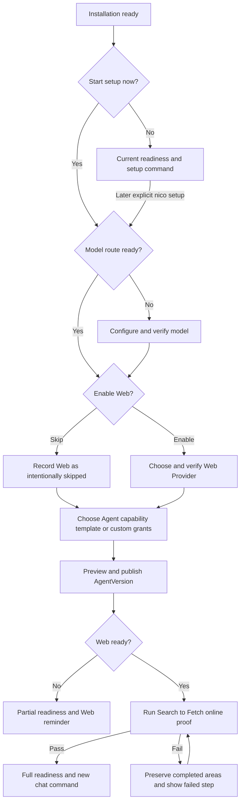
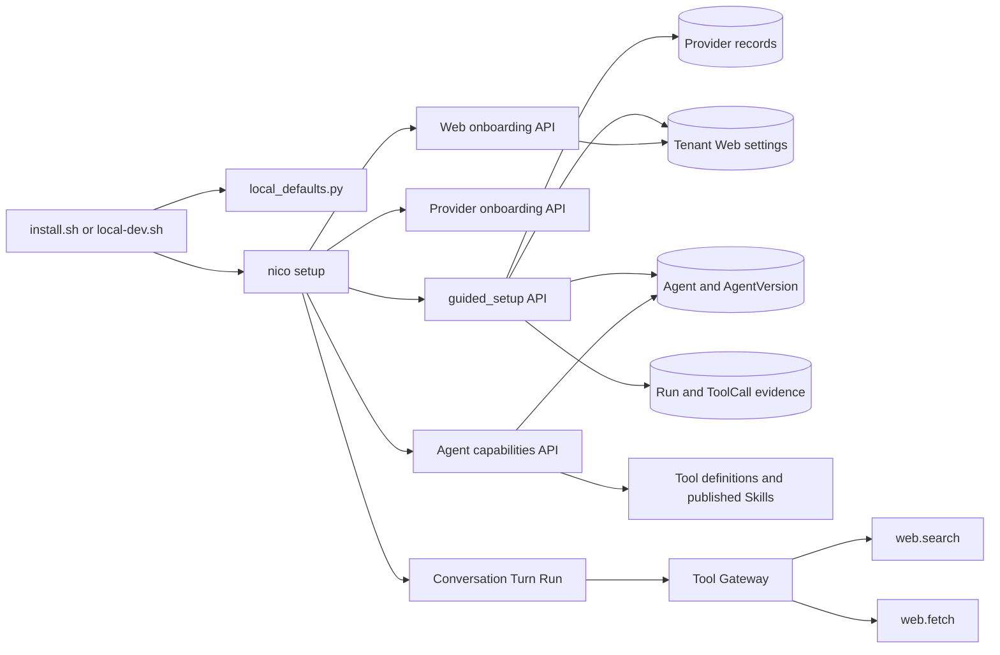
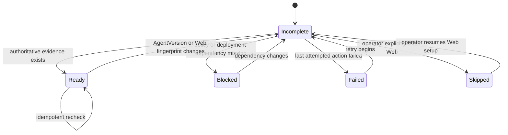
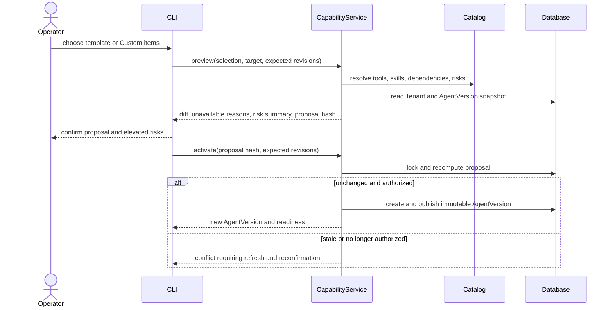
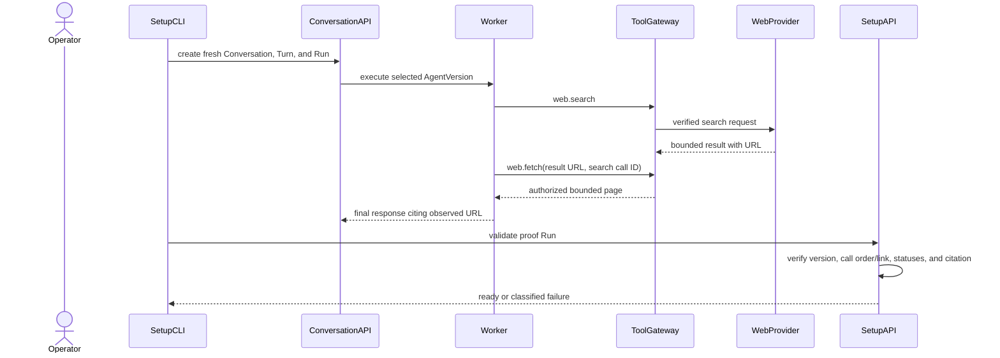
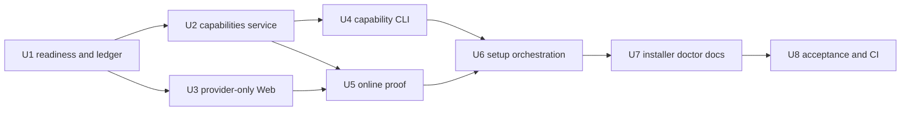

## Goal Capsule

- **Objective:** Turn first installation and later Agent creation into a guided, resumable path that verifies a real model, offers Web Search, applies explicit Agent-level capabilities, and proves the resulting Agent can complete Search → Fetch before declaring the installation fully ready.
- **Product authority:** The user-confirmed readiness checklist, AgentVersion-level capability ownership, Web defaults, capability selection rules, partial-ready behavior, and full-ready acceptance standard define the product contract; existing transactional Provider/Web onboarding, immutable AgentVersion publication, tenant policy intersection, Secret handling, and Run audit boundaries remain mandatory.
- **Open blockers:** None. Product behavior, service boundaries, implementation units, and verification gates are settled below.
- **Execution profile:** Deep, cross-cutting implementation across API contracts, transactional services, CLI orchestration, installation bootstrap, diagnostics, and offline acceptance tests.
- **Stop conditions:** Stop publication or proof on stale revisions, changed capability availability, an unverified Provider, missing tenant authority, rejected runtime approval, or any failure to establish Search → Fetch → citation evidence through a normal Run.
- **Tail ownership:** The implementing owner must finish unit tests, integration tests, installer regression, offline end-to-end acceptance, docs, and CI wiring before this feature is considered complete.

---

## Product Contract

### Summary

Nico will provide a resumable `nico setup` readiness checklist covering model routing, Web Provider setup, Agent capabilities, and an end-to-end online verification.
Interactive installation will offer to start this flow immediately, while later Agent creation and updates will reuse the same capability selector.

### Problem Frame

Nico currently installs a working service stack and prints `nico setup`, but setup stops once it finds a usable model route.
Model onboarding, Web onboarding, AgentVersion policy, tool definitions, and published Skills exist as separate surfaces, so a user can successfully chat while the selected Agent still lacks `web.search` and `web.fetch`.
The resulting failure is technically correct but experientially confusing: the product appears installed, the model works, and yet the Agent says it cannot access the Web.

Operators can repair this state through separate commands, but doing so requires knowledge of Provider readiness, Agent revisions, immutable version publication, policy intersection, and frozen Conversation versions.
That is platform knowledge the first-run journey should translate into visible readiness steps and actionable choices.

### Key Decisions

- **Use a resumable readiness checklist.** `nico setup` evaluates durable model, Web, Agent capability, and verification states, then continues only the missing or selected steps. (session-settled: user-directed — chosen over a fixed linear wizard and a capability-goal inference flow: setup must recover cleanly and remain useful for later maintenance.)
- **Start setup from interactive installation by default.** After services and the local profile are ready, installation asks whether to begin setup immediately with “yes” as the default; skipping leaves a copyable command. (session-settled: user-directed — chosen over launching without consent or only printing a next step: first use should be guided without trapping an unprepared operator.)
- **Own capabilities at AgentVersion level.** Model connections remain reusable, while each new or updated Agent receives an explicit Tool and Skill policy in a newly published immutable version. (session-settled: user-directed — chosen over model-level capability inheritance: Agents sharing one model can have different duties and risk boundaries.)
- **Recommend Web without silently granting it.** Setup recommends enabling Web, suggests local SearXNG for a local single-node deployment, also offers Brave, and permits skipping. (session-settled: user-directed — chosen over default-off Web or automatic SearXNG activation: Web should be discoverable while Provider and Agent authorization remain explicit.)
- **Choose a template before customization.** The capability step presents a small set of maintained templates and lets the operator switch to a complete custom selector with select-all and per-item choices. (session-settled: user-directed — chosen over always showing a raw catalog or enabling everything by default: the common path stays short without removing control.)
- **Define select-all as all currently usable capabilities.** Unavailable items remain visible but disabled with a reason, and medium/high-risk selections receive a consolidated confirmation before publication. (session-settled: user-directed — chosen over granting unavailable capabilities or excluding every elevated-risk capability from select-all: the result must be valid and understandable before it is published.)
- **Require online proof for full readiness.** A fresh local setup is fully ready only after a real model route, Web Provider, Web-authorized AgentVersion, and Search → Fetch verification succeed. (session-settled: user-directed — chosen over chat-only readiness, mandatory first-run personalization, and configuration export: the first release optimizes for an immediately usable online Agent.)
- **Allow partial readiness after an explicit Web skip.** Model chat remains usable, but setup and diagnostics continue to identify Web as incomplete until it is configured or the product policy changes. (session-settled: user-directed — chosen over blocking setup or treating the skip as permanently complete: users may defer Web without losing a truthful readiness signal.)

### Actors

- A1. **Interactive local operator:** Installs Nico, supplies credentials through hidden input or references, chooses defaults and capabilities, reviews risk, and starts the first chat.
- A2. **Automation operator:** Installs or deploys Nico without a TTY and needs deterministic completion plus an actionable handoff instead of an interactive wait.
- A3. **Nico setup experience:** Evaluates readiness, orchestrates existing configuration journeys, preserves completed work, explains blocked items, and reports full or partial readiness.
- A4. **Nico control plane and Worker:** Verify Providers, enforce tenant and AgentVersion policy, publish immutable versions, execute the online proof through normal runtime boundaries, and retain authoritative status.
- A5. **Agent author:** Creates or updates Agents after first setup and reuses the same capability templates, catalog, dependency explanations, risk confirmation, and publication behavior.

### Requirements

#### Setup entry and readiness

- R1. Interactive installation must ask whether to start guided setup after services, Tenant, Project, and the active local profile are ready, with starting now as the default choice.
- R2. Declining the installation prompt must finish installation successfully and print a copyable `nico setup` command without claiming that online Agent setup is complete.
- R3. A non-interactive installation must never wait for input; it must finish deployment, evaluate the current readiness state, and, when any guided area remains incomplete, report that state and print the explicit follow-up command.
- R4. `nico setup` must show four authoritative readiness areas: real model route, Web Provider, Agent capabilities, and Search → Fetch verification.
- R5. Each readiness area must distinguish ready, incomplete, blocked, and failed outcomes using actionable language without exposing credentials or private payloads; the Web area must additionally distinguish an intentionally skipped outcome.
- R6. Re-running setup must preserve completed areas, continue incomplete work, and allow an operator to select a ready area for reconfiguration rather than silently replacing it.
- R7. When all areas are ready, setup must show the current configuration and offer maintenance choices instead of replaying credential prompts.

#### Model and Web Providers

- R8. The model area must reuse the existing guided Provider catalog, hidden credential handling, model selection, real completion probe, preview, confirmation, rollback, and Agent binding behavior.
- R9. An already verified and active model route must satisfy the model area while remaining explicitly changeable by the operator.
- R10. The Web area must ask whether to enable Web and recommend yes without enabling a Provider or modifying Agent policy before confirmation.
- R11. Local single-node setup must recommend SearXNG, present Brave as an alternative, explain their credential and deployment differences, and allow Web setup to be skipped.
- R12. Selecting a Web Provider must verify its exact configured endpoint before the setup flow can use it for Agent authorization or online proof.
- R13. Configuring a Web Provider must not automatically grant Web tools to every Agent; the selected Agent capability policy remains the authorization boundary.
- R14. Skipping Web must produce partial readiness, leave model chat available, and keep an actionable Web reminder in both setup and diagnostics.

#### Capability catalog and templates

- R15. Capability selection must apply to a newly created or updated immutable AgentVersion, never to the reusable model connection.
- R16. First setup must offer at least Minimal, Web Research, Developer, and Custom choices, with Web Research recommended when the Web area is ready.
- R17. Minimal must grant no optional Tool or Skill capabilities beyond platform-required runtime functions.
- R18. Web Research must select `web.search` and `web.fetch` when they are usable and must not add file mutation, database, or Python execution capabilities.
- R19. Developer must select usable file read/write, report, and Python capabilities; Web capabilities may be included only when the Web area is ready, while endpoint-specific HTTP and database access remain explicit custom choices.
- R20. Custom must present all current platform Tool definitions and all eligible published Skills with name, description, exact version, availability, risk or trust signal, and any operator-actionable dependency reason.
- R21. Operators must be able to select all currently usable capabilities, clear all optional capabilities, and toggle individual Tools and Skills.
- R22. Select-all must exclude unavailable capabilities from the proposed grant while keeping them visible and explaining the missing Provider, Secret, endpoint policy, data source, deployment component, publication state, or tenant permission.
- R23. Medium/high-risk capability selections must be summarized in one explicit confirmation before publication, while any capability-specific runtime approval remains enforced when the Agent later invokes it.
- R24. The proposed AgentVersion preview must show capability additions and removals separately from model-route changes before the operator confirms publication.
- R25. Tenant policy and deployment availability remain upper bounds; the capability selector may narrow them for an Agent but must never expand them implicitly.
- R26. If no eligible published Skills exist, the Skill section must say so and remain a valid empty selection rather than hiding the concept or blocking setup.

#### Agent lifecycle and compatibility

- R27. First setup must create a Starter Agent or update one selected existing Agent only after the model route and requested capabilities form a valid publishable version.
- R28. Later Agent creation and AgentVersion update flows must reuse the same templates, custom catalog, availability rules, risk confirmation, preview, and publication semantics.
- R29. Capability changes must publish a new immutable AgentVersion and leave prior versions, active Runs, and existing Conversations frozen to their original policies.
- R30. After capability publication, setup must explain that a new Conversation is required to use the new version when an older Conversation already exists.
- R31. Updating a model route without entering capability customization must preserve the selected Agent’s existing Tool and Skill policy.

#### Verification and completion

- R32. Full readiness verification must execute a bounded real Agent Run that performs Search → Fetch through the same Tool Gateway, policy, Provider, approval, Secret, audit, and citation boundaries used by normal chat.
- R33. The verification must use a benign deterministic query, fetch at least one authorized result, and confirm that the final response cites an observed source URL.
- R34. Setup must never use a privileged network shortcut or Provider-only health check as a substitute for the Agent-level online proof.
- R35. A successful full setup must show the selected model, Web engine, Agent, AgentVersion, capability template or custom summary, verification result, and a copyable `nico chat` command.
- R36. Setup, diagnostics, and the first new chat must agree about whether `web.search` and `web.fetch` are available to the selected AgentVersion.
- R37. The setup experience must not display or persist raw model keys, Web keys, full Provider responses, fetched page bodies, or private runtime reasoning.

#### Failure, cancellation, and recovery

- R38. A failed, cancelled, or rejected area must leave previously verified Providers and published AgentVersions usable.
- R39. Setup interruption must preserve authoritative completed areas and allow the next invocation to continue from the first unresolved area without replaying committed Secret input.
- R40. A failed Web or online verification must report whether the cause is configuration, credential, endpoint reachability, Agent authorization, approval, Tool execution, fetch policy, or citation validation.
- R41. If a requested template becomes invalid because availability changes before publication, setup must refresh the proposal and require confirmation again rather than publishing a stale grant.

The readiness lifecycle is:



### Key Flows

- F1. First interactive installation reaches full readiness
  - **Trigger:** A1 completes an interactive local installation and accepts the default offer to begin setup.
  - **Actors:** A1, A3, A4
  - **Steps:** Setup configures or selects a verified model; recommends and verifies local SearXNG; presents Web Research and other capability choices; previews and publishes the Starter AgentVersion; runs the online proof.
  - **Outcome:** Every readiness area is ready and A1 receives a new `nico chat` command for an Agent that can search, fetch, and cite.
  - **Covered by:** R1, R4-R13, R15-R18, R23-R25, R27, R32-R37

- F2. Operator resumes interrupted setup
  - **Trigger:** A1 exits after completing the model area but before Web or Agent publication.
  - **Actors:** A1, A3, A4
  - **Steps:** The next `nico setup` reads authoritative state, marks the model ready, starts at the unresolved Web area, and never requests the committed model key again.
  - **Outcome:** Setup continues without duplicating Provider routes or discarding completed work.
  - **Covered by:** R4-R9, R38-R41

- F3. Operator skips Web
  - **Trigger:** A1 explicitly declines Web during first setup.
  - **Actors:** A1, A3, A4
  - **Steps:** Setup records Web as intentionally skipped, continues to capability selection with Web capabilities unavailable, publishes the selected valid AgentVersion, omits the online proof, and explains how to resume later.
  - **Outcome:** Model chat through the selected Agent works, but setup and diagnostics report partial readiness rather than full readiness.
  - **Covered by:** R10-R18, R22, R25, R27, R35-R36

- F4. Agent author customizes capabilities
  - **Trigger:** A5 creates or updates an Agent and selects Custom.
  - **Actors:** A5, A3, A4
  - **Steps:** The selector lists usable and unavailable Tools and Skills; A5 selects all usable items or individual items; setup explains unavailable dependencies; elevated-risk choices receive consolidated confirmation; a diff is reviewed and published.
  - **Outcome:** The new AgentVersion contains only valid confirmed grants and does not change the model connection or other Agents.
  - **Covered by:** R15, R20-R26, R28-R31, R41

- F5. New capabilities coexist with frozen Conversations
  - **Trigger:** A5 publishes Web capability to an Agent that already has active Conversations.
  - **Actors:** A1, A3, A4, A5
  - **Steps:** Publication creates a new current AgentVersion; existing Conversations retain the old version; setup explains the boundary and provides a command that creates a new Conversation.
  - **Outcome:** Old work remains reproducible and new chats receive the newly authorized capabilities.
  - **Covered by:** R29-R31, R35-R36

- F6. Online proof fails safely
  - **Trigger:** Search, fetch, approval, Provider access, or citation validation fails after AgentVersion publication.
  - **Actors:** A1, A3, A4
  - **Steps:** Setup records the failed verification area, preserves the verified Provider and published version, reports the failure class, and offers a retry after the operator corrects the cause.
  - **Outcome:** Setup is not fully ready, no working prior configuration is destroyed, and the failure is resumable.
  - **Covered by:** R32-R41

### Acceptance Examples

- AE1. **Covers R1, R4-R13, R16-R18, R27, R32-R37.** Given a fresh interactive local installation with no real model or Web configuration, when the operator accepts setup, chooses a model credential, accepts the recommended SearXNG and Web Research defaults, and confirms publication, then setup verifies a real model call, completes Search → Fetch with a cited URL, reports full readiness, and prints a usable new-chat command.
- AE2. **Covers R2-R3.** Given a fresh installation without an interactive terminal or an operator who declines setup, when deployment finishes, then installation exits successfully, does not wait for input, reports incomplete setup, and prints `nico setup`.
- AE3. **Covers R6-R9, R38-R39.** Given a verified model route and an interrupted setup before Web selection, when the operator runs `nico setup` again, then the model area is already ready and setup resumes at Web without requesting or replacing the model credential.
- AE4. **Covers R10-R14.** Given a verified model, when the operator skips Web, then chat remains usable, the online proof is not presented as passed, and setup plus diagnostics report partial readiness with a Web continuation action.
- AE5. **Covers R15, R20-R26, R41.** Given Custom selection where a database tool has no usable data source and Python plus file write are available elevated-risk tools, when the operator selects all usable capabilities, then the database item remains disabled with its reason, the usable items enter an AgentVersion-level proposal, and the elevated-risk summary requires confirmation before publication.
- AE6. **Covers R28-R31, R35-R36.** Given an existing Conversation frozen to AgentVersion 1, when an author publishes AgentVersion 2 with Web Research, then the old Conversation still lacks Web, setup explains the frozen boundary, and a new Conversation created from the printed command receives Search and Fetch.
- AE7. **Covers R32-R40.** Given a valid model and AgentVersion but an unreachable Web Provider, when the online proof runs, then setup classifies the Provider failure, preserves completed configuration, reports incomplete verification, and can retry without republishing an indistinguishable version.
- AE8. **Covers R31, R38.** Given an Agent with a custom Tool and Skill policy, when the operator changes only its model Provider, then the new version preserves that capability policy and a failed model verification leaves the previous version current.
- AE9. **Covers R19.** Given Web is not ready and file, report, and Python tools are usable, when the operator selects Developer, then the proposal includes only those usable Developer capabilities, excludes Web, HTTP, and database capabilities, and explains that Web can be added after its Provider is ready.

### Success Criteria

- A new interactive local installation can reach a source-citing online `nico chat` without editing environment files, policy JSON, database records, or internal IDs by hand.
- Re-running `nico setup` after success produces an accurate ready summary without repeating credentials or creating duplicate Provider and AgentVersion records.
- Re-running after interruption starts from the first unresolved readiness area and preserves every previously committed working area.
- The Agent capability summary shown before publication matches the tools exposed to the first new Run.
- Setup, diagnostics, audit records, and normal output contain no raw model or Web credential.

### Scope Boundaries

#### In scope

- Interactive post-install setup for the local Native deployment.
- A resumable readiness checklist composed from existing model and Web onboarding behavior.
- Maintained Agent capability templates plus a complete Tool and published-Skill selector.
- Agent creation/update integration, immutable publication, risk review, partial readiness, and Agent-level online proof.
- Deterministic non-interactive installation handoff without prompts.

#### Deferred for later

- Exporting or importing a credential-free deployment blueprint for repeatable non-interactive setup.
- Organization-authored capability templates, centrally managed template rollout, or a template marketplace.
- A browser-based setup wizard with parity to the terminal flow.
- Automatically migrating existing Conversations to a new AgentVersion.
- Treating remote multi-user administration, delegated setup roles, or hosted Secret custody as first-run targets.

#### Outside this product’s identity

- Granting Tools or Skills globally because a model connection was selected.
- Silently enabling every available capability or bypassing tenant policy, Provider verification, runtime approval, Tool Gateway, Secret, audit, or immutable-version boundaries to make setup appear complete.

### Dependencies and Assumptions

- The existing model Provider and Web Provider transactions remain the authority for credential handling, verification, preview, activation, rollback, and Worker readiness.
- Local SearXNG remains an available credential-free deployment option, while Brave remains an explicitly credentialed alternative.
- Tool definitions expose sufficient catalog metadata to explain exact versions, availability, risk, and prerequisites.
- Only eligible published Skills can be granted; draft, disabled, incompatible-scope, or otherwise unavailable Skills remain non-selectable.
- Tenant policy remains the maximum capability boundary and AgentVersion policy remains the per-Agent restriction.
- Runtime verification can create a bounded auditable Run and obtain any required operator approval without using a privileged test-only execution path.

### Sources and Research

- `docs/plans/2026-07-20-001-feat-one-command-install-release-plan.md` defines the current installation and profile handoff.
- `docs/plans/2026-07-20-002-feat-interactive-provider-onboarding-plan.md` defines transactional model onboarding and immutable Agent binding.
- `docs/plans/2026-07-21-003-feat-web-search-fetch-plan.md` defines Web Provider onboarding, Search → Fetch authorization, and citation verification.
- `scripts/install.sh` currently creates the local profile and prints `nico setup` after installation.
- `backend/src/nico_agent/cli/app.py` currently treats setup readiness as real-model readiness only.
- `backend/src/nico_agent/worker.py`, `backend/src/nico_agent/domain_api.py`, and `backend/src/nico_agent/growth_api.py` expose the current platform Tool registry, Tool definition catalog, and Skill catalog foundations.
- `backend/src/nico_agent/agent_versions.py` keeps model routing, Tool policy, Skill policy, and other behavior as distinct immutable AgentVersion fields.

---

## Planning Contract

**Product Contract preservation:** Product Contract decisions and scope are unchanged; review-only coherence corrections clarified R5 and the lifecycle diagram without changing behavior.

### Key Technical Decisions

- **KTD1 — The server owns consolidated readiness.** Add a tenant-scoped guided-setup service that derives model, Web, Agent capability, and proof status from authoritative Provider, Web, AgentVersion, Run, and ToolCall records. Store only user intent and bounded proof evidence in `Tenant.settings["guided_setup"]`; do not persist duplicate `ready` booleans. This prevents the CLI, installer, and doctor from disagreeing.
- **KTD2 — Proof evidence is revision-bound.** A successful proof records the Run ID, selected AgentVersion ID, active Web candidate hash, completion time, and safe result class. The proof becomes incomplete when the selected AgentVersion or active Web candidate changes, so stale success cannot satisfy readiness.
- **KTD3 — Capability ownership remains AgentVersion-scoped.** Capability preview produces a non-mutating proposal; activation creates and publishes an immutable AgentVersion while preserving model, memory, plugin, coordination, budget, and run configuration fields. `(session-settled: user-directed — chosen over model-level capability inheritance: Agents sharing one model need distinct duties and risk boundaries.)`
- **KTD4 — Fresh local Tenants receive a bounded bootstrap ceiling.** A single backend-owned local-defaults helper supplies file read/write, report, and Python permissions to both `scripts/install.sh` and `scripts/local-dev.sh` during new Tenant creation. HTTP, database, Web, and Skills remain unavailable until their own dependency or tenant authorization exists; existing Tenants are not silently widened. `(session-settled: user-approved — chosen over leaving every self-contained built-in unavailable on a fresh local install: the Developer template must be useful without granting endpoint-backed capabilities.)`
- **KTD5 — Guided Web activation has a provider-only transaction.** Extend the existing Web probe/preview/activate flow with an explicit provider-only scope that verifies and activates tenant Web configuration without publishing an AgentVersion. The later capability transaction publishes the one reviewed final version. Standalone `nico web configure` retains its current combined Provider-plus-Agent convenience. `(session-settled: user-approved — chosen over publishing a temporary Web-authorized version before capability selection: the final grant should be reviewed once.)`
- **KTD6 — Templates compile into the same policy proposal as Custom.** Minimal, Web Research, and Developer are maintained server-side profile definitions. Every template and Custom selection resolves against the same live Tool/Skill catalog, tenant ceiling, dependency status, and risk metadata before preview. `(session-settled: user-directed — chosen over separate template mutation paths: preview, stale-proposal handling, and audit semantics must stay identical.)`
- **KTD7 — Capability activation is optimistic and hash-bound.** Preview returns a canonical proposal hash plus expected Tenant and Agent revisions. Activation recomputes availability under row locks and rejects changed revisions or hashes, requiring the CLI to refresh and reconfirm rather than publishing a stale grant.
- **KTD8 — Online proof uses a normal Conversation Run.** The CLI creates a fresh Conversation/Turn/Run with a fixed benign query, displays normal user-facing progress, and handles persisted approvals through shared approval-continuation code. The server validates successful `web.search` then authorized `web.fetch` ToolCalls and a final citation of an observed URL. `(session-settled: user-directed — chosen over a Provider health probe or privileged network shortcut: full readiness must prove the Agent users will actually run.)`
- **KTD9 — Setup is a resumable checklist, not a one-shot wizard.** `nico setup` fetches consolidated readiness, skips ready areas by default, resumes incomplete areas, and offers explicit maintenance of ready areas. A Web skip yields partial readiness and still permits a non-Web AgentVersion. `(session-settled: user-directed — chosen over restarting a linear wizard: interruption and later maintenance are first-class flows.)`
- **KTD10 — Installation prompts only on a real TTY.** Interactive installation offers guided setup with yes as the default after the profile exists. Decline and non-interactive paths finish successfully, report the current derived readiness (`incomplete`, `partial`, or `full`), and print `nico setup` when follow-up remains; neither fabricates answers nor waits without a terminal. `(session-settled: user-directed — chosen over unconditional launch or a passive hint-only install: guidance must be immediate but consensual.)`
- **KTD11 — Capability changes are operator control-plane actions.** Capability catalog, preview, and activation use the same Tenant/Agent authorization boundary as current AgentVersion publication. Runtime Agents receive only the selected Tools and Skills, not a setup or self-modification tool, so they cannot widen their own policy. This preserves action and context parity for normal Agent work without turning administrative capability grants into an Agent action.

### High-Level Technical Design

The control plane exposes two cohesive additions: a capability transaction and a read-mostly guided-setup coordinator. The CLI owns terminal sequencing, but all status and mutation decisions remain server-side. The diagrams fix boundaries, state ownership, and transaction order; exact class decomposition may adjust during implementation if those contracts remain intact.



Readiness is derived independently for each area and then folded into one overall result. `skipped` is an explicit user intent for Web, not a successful Web configuration.



Capability selection is a two-phase server transaction. The preview is informative but activation remains the enforcement point.



The full-ready proof deliberately crosses the same boundaries as chat and is validated from persisted evidence rather than terminal output alone.



### Expected Module Layout

```text
backend/src/nico_agent/
├── agent_capabilities/
│   ├── __init__.py
│   ├── api.py
│   ├── catalog.py
│   ├── contracts.py
│   ├── policy.py
│   └── service.py
├── guided_setup/
│   ├── __init__.py
│   ├── api.py
│   ├── contracts.py
│   └── service.py
├── cli/
│   ├── approvals.py
│   ├── capabilities.py
│   └── setup.py
└── local_defaults.py
```

Existing files remain the integration points: `api.py` registers routers; `agent_versions.py` supports Tool and Skill policy overrides; Web onboarding adds provider-only activation; CLI `app.py`, `client.py`, and `renderers.py` expose commands and terminal output; installer and local-dev scripts consume the same local defaults.

### Authoritative State and Data Contract

- `GET /api/v1/setup/readiness` returns the four ordered areas, overall `full`, `partial`, or `incomplete` readiness, the selected target Agent/AgentVersion, safe reasons, and permitted next actions. It composes existing Provider/Web readiness rather than copying their state.
- `Tenant.settings["guided_setup"]` is schema-versioned and limited to Web intent (`enabled` or `skipped`), selected Agent ID, optional selected profile key, and latest proof evidence. Credentials, model responses, page bodies, prompts, and private reasoning are forbidden.
- Proof evidence stores `run_id`, `agent_version_id`, `web_candidate_hash`, `status`, `verified_at`, and a safe failure class. Readiness recomputes the current fingerprint and ignores mismatched evidence.
- `GET /api/v1/agent-capabilities/catalog` returns maintained profiles plus all Tool definitions and eligible published Skill versions. Each item carries stable ID, exact version, description, risk/trust, `usable`, and a machine-readable plus display-safe unavailability reason.
- `POST /api/v1/agent-capabilities/preview` and `/activate` accept an existing-Agent target or a starter-Agent target, selection/profile, expected revisions, and on activation the preview hash. Responses separate Tool/Skill additions and removals from model-route changes.
- Web preview/activation adds an explicit `scope` of `provider_only` or `provider_and_agent`. Existing CLI calls default to `provider_and_agent`; guided setup sends `provider_only`.
- `POST /api/v1/setup/proofs` validates a completed Run owned by the current Tenant. It never accepts client assertions about ToolCalls or citations as proof.

### System-Wide Impact

- **Interaction graph:** Installer creates the profile and optional setup prompt; setup composes Provider onboarding, Web onboarding, capability publication, normal execution, approval continuation, and proof validation. Doctor reads the same readiness endpoint.
- **Error propagation:** Existing domain error codes remain intact. Guided setup maps them into model, Web, capability, approval, tool, fetch, or citation failure classes and keeps the original request ID for support without echoing sensitive detail.
- **State lifecycle:** Provider and Web activation remain transactional; capability publication produces a new immutable AgentVersion; old Conversations stay pinned; proof is invalidated by a changed version or Web fingerprint; interruption leaves all committed records usable.
- **API compatibility:** Existing Provider and `nico web configure` request behavior remains valid through defaulted new fields. Existing `nico setup` Provider flags remain accepted and feed the model step before continuing the checklist. New JSON/non-interactive flags must be deterministic.
- **Agent boundary:** The selected AgentVersion receives only its compiled Tool and Skill context. The setup catalog, unavailable capabilities, Tenant ceiling, proposal hash, and setup ledger are not injected into the model context, and no runtime Tool can call capability activation.
- **Workspace boundary:** File/report/Python grants continue to use the existing Agent workspace and Sandbox Runner. Guided setup changes authorization only; it does not create a second workspace, mount host paths, or weaken runtime approval and isolation.
- **Observability:** Audit Provider activation, capability preview/activation, AgentVersion publication, setup intent changes, and proof validation. Log IDs, hashes, safe statuses, and durations only—never Secret values, raw Provider payloads, fetched bodies, or hidden model reasoning.

### Risks and Mitigations

- **Tenant settings lost-update risk:** Every guided ledger or tenant ceiling mutation uses a locked Tenant row and expected revision; capability/Web transactions update all related state atomically.
- **Catalog drift between review and publish:** Activation recomputes the canonical proposal and rejects hash or revision changes with a refresh-required conflict.
- **False-ready proof:** Validation requires the exact selected AgentVersion, successful ordered Search and linked Fetch calls, a completed Run, and a final citation matching the runtime-observed URL set.
- **Approval deadlock in setup:** Extract the existing chat approval loop into a shared helper, surface the pending capability and risk, and persist the operator decision through the normal approval API before Run continuation.
- **Fresh-install overgrant:** Local defaults authorize only self-contained built-ins at the Tenant ceiling; Agent templates still narrow the grant, and medium/high-risk calls retain runtime approval.
- **Offline CI instability:** Use the existing fake model Web tool sequence and fake Web transport/service for the required acceptance path. A real Brave smoke test remains optional and credential-gated.

### Rollout and Compatibility

- No database migration or backfill is required: the guided ledger is a namespaced Tenant settings value, and capability changes use existing AgentVersion rows.
- Deployment is additive. Register the new APIs and CLI commands first, while defaulted Web activation scope preserves old clients and standalone `nico web configure` behavior.
- Fresh Tenants created by local install or `make run` receive the bounded local ceiling. Existing Tenants keep their current settings and may see Developer items as unavailable until an operator deliberately updates tenant policy; setup must explain this rather than widening them.
- If the feature is rolled back, already published AgentVersions and Provider configuration remain valid. Unknown `guided_setup` settings are ignored by older code, and no cleanup migration is necessary.
- Support diagnosis starts with the consolidated readiness response and request ID, then follows Provider probe, Web probe, AgentVersion publication, Run, and ToolCall audit records. Raw Secrets and fetched content are never support artifacts.

---

## Implementation Units

### U1 — Authoritative guided-setup readiness and ledger

- **Goal:** Give setup, doctor, and automation one safe, resumable source of truth for all four readiness areas.
- **Requirements:** R3-R7, R9, R14, R35-R40; F2, F3, F6; AE2-AE4, AE7; KTD1, KTD2, KTD9.
- **Dependencies:** Existing Provider setup readiness, Web status/readiness, Tenant revision handling, Agent/AgentVersion records, Run and ToolCall audit data.
- **Files:** Create `backend/src/nico_agent/guided_setup/__init__.py`, `contracts.py`, `service.py`, and `api.py`; modify `backend/src/nico_agent/api.py`; create `backend/tests/unit/test_guided_setup_service.py` and `backend/tests/integration/test_guided_setup_api.py`.
- **Approach:** Define stable area and overall states; derive model, Web, and capability status from existing services and current AgentVersion; parse a schema-versioned ledger from Tenant settings; add locked, revision-checked helpers for Web intent, selected Agent, and proof evidence; expose readiness and intent endpoints with safe next actions. Treat an absent/malformed ledger as incomplete without crashing or erasing unrelated Tenant settings.
- **Patterns:** Follow `provider_onboarding/service.py` and `web_onboarding/service.py` for tenant transactions, safe response contracts, audit events, and domain errors. Preserve unknown Tenant settings keys.
- **Test scenarios:** Unit-test fresh, all-ready, Web-skipped, blocked, failed, stale-proof, malformed-ledger, and unrelated-settings preservation. Integration-test tenant isolation, revision conflicts, idempotent intent writes, setup status after Provider/Web/Agent changes, and response redaction.
- **Verification:** `pytest -q backend/tests/unit/test_guided_setup_service.py`; `RUN_INTEGRATION=1 pytest -q backend/tests/integration/test_guided_setup_api.py`.

### U2 — Capability catalog, templates, and immutable publication

- **Goal:** Resolve every template or Custom selection into a current, reviewable, transaction-safe AgentVersion proposal.
- **Requirements:** R15-R31, R38, R41; F3-F5; AE5, AE6, AE8, AE9; KTD3, KTD4, KTD6, KTD7, KTD11.
- **Dependencies:** U1 contracts; ToolDefinition registry/catalog, growth Skill queries, tenant Tool/Skill policy, Web readiness, `AgentVersionLifecycle`.
- **Files:** Create `backend/src/nico_agent/agent_capabilities/__init__.py`, `catalog.py`, `contracts.py`, `policy.py`, `service.py`, and `api.py`; create `backend/src/nico_agent/local_defaults.py`; modify `backend/src/nico_agent/api.py`, `backend/src/nico_agent/agent_versions.py`, `backend/tests/unit/test_agent_capability_catalog.py`, `backend/tests/unit/test_agent_capability_policy.py`, and `backend/tests/integration/test_agent_capability_activation.py`.
- **Approach:** Build server-owned Minimal, Web Research, and Developer profiles; enumerate all Tools and eligible exact published Skill versions; retain unavailable entries with reason codes; compile selections into canonical Tool and Skill policies; preview additions/removals/risks; activate under Tenant and Agent row locks after hash/revision revalidation. Support either creating a Starter Agent or versioning an existing Agent. Extend `command_from_version` with a Skill policy override while preserving every unrelated field.
- **Patterns:** Reuse Tool policy normalization/intersection, runtime Skill policy shape, canonical hashing, AgentVersion lifecycle, and audit/event conventions. The local-defaults module emits a deterministic bootstrap settings object for both installation paths and does not mutate established Tenants.
- **Test scenarios:** Unit-test all three maintained profiles plus Custom selection, Web-ready/not-ready Developer behavior, empty Skills, unpublished/tenant-denied Skills, unavailable database/HTTP dependencies, select-all/clear-all, exact-version output, risk aggregation, deterministic hashes, and preservation of unrelated AgentVersion fields. Integration-test starter creation, existing-Agent update, stale Tenant/Agent revision, availability changing after preview, tenant-boundary rejection, immutable old versions, model-only updates preserving Tool/Skill policy, and denial of any attempt to activate through runtime Agent credentials or context.
- **Verification:** `pytest -q backend/tests/unit/test_agent_capability_catalog.py backend/tests/unit/test_agent_capability_policy.py`; `RUN_INTEGRATION=1 pytest -q backend/tests/integration/test_agent_capability_activation.py`.

### U3 — Provider-only Web activation for guided setup

- **Goal:** Verify and activate the Web engine before capability review without creating a transient AgentVersion.
- **Requirements:** R10-R14, R24-R25, R38, R41; F1-F3, F6; AE1, AE3, AE4, AE7; KTD5, KTD7.
- **Dependencies:** Existing Web Provider catalog, probe worker, preview/activate transaction, tenant policy merge helpers, U1 readiness.
- **Files:** Modify `backend/src/nico_agent/web_onboarding/contracts.py`, `service.py`, `api.py`, `backend/src/nico_agent/cli/web.py`, `backend/src/nico_agent/cli/client.py`, `backend/tests/unit/test_cli_web.py`, `backend/tests/integration/test_web_onboarding.py`, and `backend/tests/integration/test_web_onboarding_api.py`.
- **Approach:** Add a defaulted activation scope. In `provider_only`, require a succeeded exact-candidate probe, preview only Tenant Web configuration and Tenant Web ceiling changes, and atomically activate without an Agent target. In `provider_and_agent`, preserve the current behavior and API compatibility. Return the active candidate hash for downstream capability preview and proof fingerprinting.
- **Patterns:** Keep the existing probe → preview → confirm → activate workflow, `WEB_PROVIDER_WRITES_ENABLED` guard, rollback semantics, Secret references, and `_merge_tenant_policy` helpers.
- **Test scenarios:** Cover SearXNG and Brave provider-only activation, absent/stale/failed probes, Tenant revision conflict, no AgentVersion side effect, idempotent retry, rollback on transaction failure, response redaction, and regression of standalone combined activation.
- **Verification:** `pytest -q backend/tests/unit/test_cli_web.py`; `RUN_INTEGRATION=1 pytest -q backend/tests/integration/test_web_onboarding.py backend/tests/integration/test_web_onboarding_api.py`; `scripts/e2e-web-tools.sh`.

### U4 — Reusable CLI capability selector and Agent lifecycle commands

- **Goal:** Make the same safe capability experience available during first setup and later Agent creation/versioning.
- **Requirements:** R16-R31, R37, R41; F3-F5; AE5, AE6, AE8, AE9; KTD3, KTD6, KTD7, KTD11.
- **Dependencies:** U2 API and contracts; existing CLI output, prompt, client, and Agent read commands.
- **Files:** Create `backend/src/nico_agent/cli/capabilities.py`; modify `backend/src/nico_agent/cli/app.py`, `client.py`, `renderers.py`, `backend/tests/unit/test_cli_app.py`, `test_cli_client.py`, `test_cli_renderers.py`, and create `backend/tests/unit/test_cli_capabilities.py`.
- **Approach:** Add `nico agent create` for starter/new Agents and `nico agent capabilities` for publishing a capability-only successor version. Present templates first; Custom renders numbered Tool and Skill tables, accepts comma-separated choices plus select-all/clear-all, disables unavailable rows with reasons, and consolidates elevated-risk confirmation. Render the server preview diff before activation. Keep `--json` and non-interactive selection/profile flags deterministic and fail with actionable usage errors when confirmation data is missing.
- **Patterns:** Follow Provider/Web coordinator separation: pure input dataclass, coordinator, API client methods, renderers, and thin Typer commands. Never send hidden input or local prompt metadata to the API.
- **Test scenarios:** Cover recommended profile choice, numbered Custom selection, select-all excluding unavailable items, clear-all, empty Skills, risk rejection, preview rejection, stale-proposal retry requiring reconfirmation, JSON mode, non-TTY behavior, Starter Agent creation, existing update, and frozen-Conversation guidance.
- **Verification:** `pytest -q backend/tests/unit/test_cli_capabilities.py backend/tests/unit/test_cli_app.py backend/tests/unit/test_cli_client.py backend/tests/unit/test_cli_renderers.py`.

### U5 — Shared approval continuation and Agent-level online proof

- **Goal:** Prove a configured Agent can search, fetch, and cite through ordinary audited runtime boundaries.
- **Requirements:** R32-R41; F1, F2, F5, F6; AE1, AE6, AE7; KTD2, KTD8, KTD11.
- **Dependencies:** U1 proof contracts, U2 published AgentVersion, U3 verified Web activation, existing Conversation APIs, `ExecRunner`/`RunWatcher`, chat approval loop, ToolCall audit and native citation helpers.
- **Files:** Create `backend/src/nico_agent/cli/approvals.py`; modify `backend/src/nico_agent/cli/chat.py`, `execution.py`, `client.py`, `backend/src/nico_agent/guided_setup/service.py`, `backend/tests/unit/test_cli_approvals.py`, `backend/tests/unit/test_cli_chat.py`, `backend/tests/unit/test_cli_execution.py`, and create `backend/tests/integration/test_guided_setup_proof.py`.
- **Approach:** Extract the persisted approval decision/resume loop from chat for shared use. Start proof with a fixed benign request in a fresh Conversation pinned to the selected current AgentVersion. Stream concise normal progress, pause for required approvals, then submit the completed Run ID for server validation. Query persisted ToolCalls to require successful Search before Fetch, require the Fetch to reference the Search platform call ID and an authorized result URL, and reuse observed-URL citation validation on the final output. Save only bounded fingerprint evidence or a safe failure class.
- **Patterns:** Preserve `RunWatcher`, tool approval service, source authorization, tenant isolation, output redaction, and request IDs. Do not call Web adapters directly from setup.
- **Test scenarios:** Unit-test approval accept/reject/expiry/resume/idempotency and Chat regression. Integration-test passing Search → Fetch → citation, wrong AgentVersion, Fetch without Search, unrelated URL, failed ToolCall, missing citation, rejected approval, Provider reachability failure, tenant isolation, and invalidation after AgentVersion/Web candidate change.
- **Verification:** `pytest -q backend/tests/unit/test_cli_approvals.py backend/tests/unit/test_cli_chat.py backend/tests/unit/test_cli_execution.py`; `RUN_INTEGRATION=1 pytest -q backend/tests/integration/test_guided_setup_proof.py backend/tests/integration/test_web_agent_e2e.py`.

### U6 — Resumable `nico setup` checklist

- **Goal:** Orchestrate model, Web, capabilities, and proof as a truthful first-run and maintenance experience.
- **Requirements:** R4-R14, R27, R30, R32-R40; F1-F3, F5, F6; AE1, AE3, AE4, AE6, AE7; KTD8, KTD9.
- **Dependencies:** U1-U5; existing Provider coordinator and ServiceBridge.
- **Files:** Create `backend/src/nico_agent/cli/setup.py`; modify `backend/src/nico_agent/cli/app.py`, `client.py`, `renderers.py`, `backend/tests/unit/test_cli_app.py`, `test_cli_renderers.py`, and create `backend/tests/unit/test_cli_setup.py`.
- **Approach:** Replace model-only setup orchestration with a four-row checklist. On each invocation fetch readiness, skip ready areas, resume the first unresolved area, and permit explicit maintenance selection. Reuse Provider onboarding for model, provider-only Web onboarding for Web, and the capability coordinator for the selected/new Agent. If Web is skipped, continue to a valid non-Web Agent and report partial readiness without running proof. If Web is enabled, run U5 proof and print the full summary plus a copyable new-chat command. Preserve existing Provider flags as seeded setup inputs.
- **Patterns:** CLI remains an orchestrator, not a second policy engine. Render only user-relevant milestones—checking, waiting for Provider verification, publishing AgentVersion, running Search, fetching source, validating citation—and suppress internal event names and private reasoning.
- **Test scenarios:** Cover fresh full setup, resume after every committed boundary, all-ready maintenance, Web skip, failed/retried proof, cancellation, existing Agent target, Starter Agent target, frozen Conversation message, old setup flags, JSON mode, non-TTY missing-input errors, and no secret leakage in snapshots.
- **Verification:** `pytest -q backend/tests/unit/test_cli_setup.py backend/tests/unit/test_cli_app.py backend/tests/unit/test_cli_renderers.py`.

### U7 — Installer prompt, local bootstrap policy, doctor, and docs

- **Goal:** Connect guided setup to install and local development while keeping automation non-blocking and diagnostics consistent.
- **Requirements:** R1-R3, R11, R14, R35-R37; F1-F3; AE1-AE4; KTD4, KTD9, KTD10.
- **Dependencies:** U1 readiness endpoint, U2 local defaults, U6 CLI flow.
- **Files:** Modify `scripts/install.sh`, `scripts/local-dev.sh`, `backend/src/nico_agent/cli/app.py`, `backend/tests/unit/test_cli_app.py`, `scripts/test-install.sh`, `docs/installation.md`, `docs/getting-started.md`, `docs/cli.md`, `docs/troubleshooting.md`, and `docs/tool-gateway.md`.
- **Approach:** During new local Tenant bootstrap, obtain deterministic settings from `python -m nico_agent.local_defaults` and include them in the existing Tenant create request; never retrofit an existing Tenant. After profile activation, prompt on `/dev/tty` with yes as default and launch `nico setup` only on consent. For decline/noninteractive install, query consolidated readiness, print the current derived state and follow-up command without waiting, and keep installer success independent from optional setup completion. Change doctor to consume consolidated readiness and distinguish skipped, unconfigured, blocked, and failed Web/proof states. Document templates, tenant ceilings, runtime approvals, resumption, frozen Conversations, and SearXNG versus Brave.
- **Patterns:** Retain existing `NON_INTERACTIVE`, secure file, `/dev/tty`, and shell error-handling conventions. Keep installer success independent from optional guided setup success while reporting the latter accurately.
- **Test scenarios:** Extend installer tests for default yes, explicit no, no TTY, setup failure after successful install, safe command quoting, fresh settings payload, and existing-state reuse. CLI tests cover doctor full/partial/blocked exit semantics and redaction. Markdown examples cover both local SearXNG and credentialed Brave.
- **Verification:** `scripts/test-install.sh`; `pytest -q backend/tests/unit/test_cli_app.py`; `npx --yes markdownlint-cli2 "docs/**/*.md" "README.md"`.

### U8 — Offline acceptance, regressions, and CI

- **Goal:** Prove the complete first-run contract repeatably without external credentials and retain optional live-provider confidence.
- **Requirements:** R1-R41; F1-F6; AE1-AE9; all KTDs.
- **Dependencies:** U1-U7; existing fake model Web sequence, fake Web fixture, Compose/integration harness, CI workflow.
- **Files:** Create `scripts/e2e-guided-setup.sh`; modify `docker-compose.yml` to expose the existing fake model and fake Web ASGI apps under a dedicated guided-setup test profile; modify `.github/workflows/ci.yml`.
- **Approach:** Drive a clean Tenant through model activation, provider-only fixture-backed SearXNG activation, Web Research publication, normal approval-backed Search → Fetch, citation proof, final readiness, rerun idempotency, and new chat. Add a second path for Web skip/partial readiness and targeted failure recovery. Reuse `backend/src/nico_agent/testing/fake_model.py` and `fake_web.py` unchanged unless a missing observable behavior is first captured by a failing test. Retain `scripts/e2e-provider-onboarding.sh` and `scripts/e2e-web-tools.sh` as regressions; document an opt-in Brave smoke command gated by an environment Secret and excluded from required CI.
- **Patterns:** Follow existing shell E2E cleanup, random resource naming, bounded polling, failure diagnostics, and Secret redaction. No committed credentials or live-network dependency in required CI.
- **Test scenarios:** Full ready, partial ready, resume after interruption, idempotent rerun without duplicate versions, stale preview rejection, old Conversation frozen/new Conversation enabled, approval rejection/retry, classified Provider failure, and output scan for credential/fetched-body leakage.
- **Verification:** `scripts/e2e-guided-setup.sh`; `scripts/e2e-provider-onboarding.sh`; `scripts/e2e-web-tools.sh`; complete CI workflow.

### Sequencing and Dependencies



U2 and U3 may proceed in parallel after U1. U4 may proceed while U5 is implemented. U6 is the first integration point that requires all service and shared-runtime pieces; U8 owns the shipping tail.

---

## Verification Contract

- **Fast backend and CLI gate:** Run `scripts/test.sh`. It must complete Ruff checks/format validation, backend unit tests, frontend tests, and frontend build with no new failures.
- **Database integration gate:** Run `scripts/test-integration.sh`. All existing and new Provider, Web, AgentVersion, guided-setup, and proof integration tests must pass against migrated PostgreSQL.
- **Installer gate:** Run `scripts/test-install.sh`. Interactive-default, decline, noninteractive, existing-state, and post-install setup-failure cases must be deterministic and must not hang.
- **Provider regressions:** Run `scripts/e2e-provider-onboarding.sh` and `scripts/e2e-web-tools.sh`. Existing standalone model/Web onboarding and authorization behavior must remain compatible.
- **Guided acceptance:** Run `scripts/e2e-guided-setup.sh`. It must demonstrate full readiness, cited Search → Fetch, idempotent rerun, Web-skip partial readiness, resumable failure, and no duplicate indistinguishable AgentVersion.
- **Documentation gate:** Run `npx --yes markdownlint-cli2 "docs/**/*.md" "README.md"` and `git diff --check`; both must complete cleanly.
- **Optional live confidence:** With an explicitly supplied Brave Secret and deployment writes enabled, run the documented live smoke command. This is never a required CI gate and must skip clearly when credentials are absent.
- **Manual terminal check:** In a real TTY, verify the four-row progress display, hidden credential prompt, single consolidated risk confirmation, approval continuation, `Ctrl-C` recovery, and copyable `nico chat` handoff. No internal runtime event stream or hidden reasoning should appear.

## Definition of Done

- Every R1-R41 requirement and AE1-AE9 example is covered by at least one named implementation unit and an automated or explicitly manual verification.
- Setup, doctor, and a newly created chat agree on the selected AgentVersion and whether `web.search`/`web.fetch` are available.
- Fresh local installation offers useful bounded Developer capabilities without silently granting Web, HTTP, database, or Skills above the Tenant ceiling.
- Provider-only guided Web activation creates no transient AgentVersion; final capability activation creates exactly one reviewed immutable version per successful distinct proposal.
- A full-ready result is impossible without persisted evidence for a normal successful Search → Fetch → cited response Run using the selected version and current Web candidate.
- Interrupted, cancelled, declined, stale, and failed flows preserve prior working Providers and AgentVersions and resume without asking for committed Secrets again.
- Existing `nico web configure`, Provider setup flags, Conversations, Runs, and immutable version behavior remain backward compatible.
- Required unit, integration, installer, E2E, lint, and CI gates pass; live Brave verification remains optional.
- Documentation explains first setup, later capability maintenance, risk/runtime approvals, partial readiness, frozen Conversations, and remediation commands.
- Logs, API responses, setup ledger, test artifacts, and terminal output contain no raw credentials, full Provider payloads, fetched bodies, or private reasoning; temporary fixture/process resources are cleaned up on success and failure.
