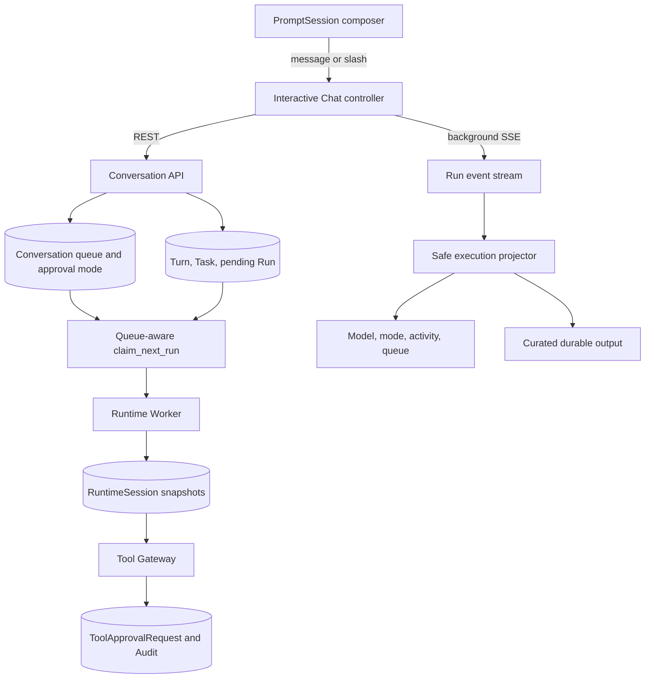
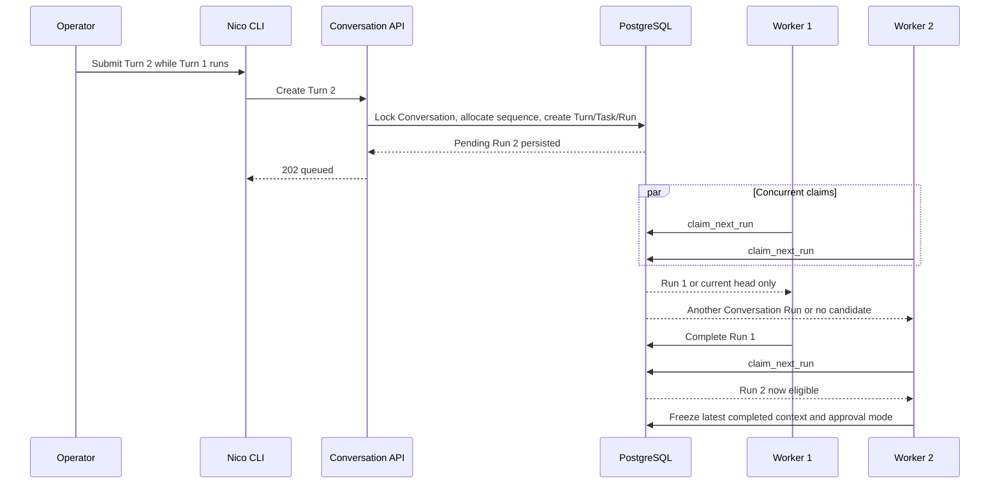
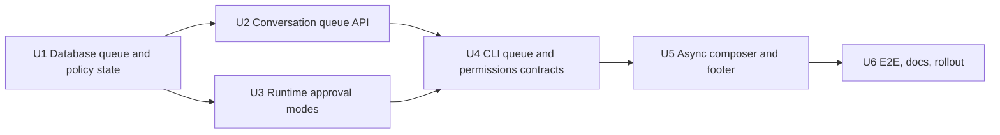

# Chat Session Permissions and Durable Queue - Plan

## Goal Capsule

- **Objective:** 让 `nico chat` 在模型执行期间持续接受输入，将后续消息保存为服务端串行队列，并让用户在同一 Conversation 中选择工具审批模式且始终看见当前模型、有效审批模式、执行阶段和排队数量。
- **Authority hierarchy:** 用户确认的服务端持久队列与异常暂停语义优先；AgentVersion/租户工具授权、CLI 薄客户端边界、Run/ToolApprovalRequest 审计事实、JSON 输出契约和私有推理边界不得被弱化。
- **Execution profile:** 先扩展 Conversation 和数据库领取契约，再接入运行时审批快照，最后把交互 Chat 改为异步 composer、队列 watcher 与常驻状态栏。
- **Stop conditions:** 如果实现需要让 CLI 直接访问数据库或 Runtime、允许同一 Conversation 并行执行多个 Run、让 `auto-all` 扩张 AgentVersion 工具授权、丢弃排队消息、或把模型中间推理显示在状态栏，应停止并回到设计评审。
- **Tail ownership:** 数据迁移往返、并发领取、审批事实、CLI 单元/PTY、真实 API/Worker E2E、文档和安全回归全部通过后才算交付。

---

## Product Contract

### Summary

本计划为 Nico Chat 增加 Conversation 级工具审批模式、服务端持久 FIFO 消息队列和始终可见的输入框/状态栏。
普通文本在活动 Run 期间按 Enter 后成为下一条持久 Turn；正常完成自动推进，失败、工具拒绝、审批过期或取消则保留后续消息并暂停队列。

### Problem Frame

当前工具审批只提供单次允许、当前 Run 允许和拒绝，`NICO_TOOL_APPROVAL_REQUIRED_RISKS` 只能在部署级统一配置。
这既不能表达“这个 Conversation 的 medium 每次询问”，也不能安全表达“这个 Conversation 自动批准已授权工具”。

当前交互循环在 `PromptSession.prompt()` 返回后同步提交 Turn 并消费完整 SSE，模型运行时 composer 不存在。
服务端同时用 `CONVERSATION_RUN_ACTIVE` 拒绝下一条 Turn，所以仅保持输入框可见仍无法兑现“按 Enter 排队”的行为。

数据库 `claim_next_run()` 会领取任意可领取 Run。
如果只删除应用层冲突检查，两个 Worker 可以同时执行同一 Conversation 的多条消息，破坏顺序、上下文和用户预期。

### Actors

- A1. **Interactive operator:** 在真实 TTY 中持续对话、提前输入后续消息、处理审批、调整当前 Conversation 的审批模式并管理暂停队列。
- A2. **Returning operator:** 退出后通过 `--resume` 或 `--continue` 恢复活动 Run、审批、权限模式、队列顺序和未执行消息。
- A3. **Automation consumer:** 使用单轮 human、非 TTY 或 `--json` 调用，需要稳定 REST/JSON 结果而不接收交互式 footer 或隐式授权。
- A4. **Runtime worker:** 在数据库权威领取规则下执行 Conversation 队列头，并按冻结的运行时审批模式处理工具调用。

### Requirements

**Conversation approval modes**

- R1. Conversation 必须支持 `ask`、`auto-medium` 和 `auto-all` 三种审批模式，新 Conversation 默认使用 `ask`。
- R2. `ask` 必须沿用当前配置的 medium/high 人工审批；`auto-medium` 只自动批准 medium；`auto-all` 自动批准所有原本需要审批且已经被授权的工具调用。
- R3. 审批模式不得添加 ToolDefinition、Skill、Secret、网络、文件系统或其他 AgentVersion/租户策略未授权的能力。
- R4. 模式必须保存在服务端 Conversation 中并随 `--resume` 恢复；活动 Run 使用首次准备 RuntimeSession 时冻结的模式，模式变更只影响尚未开始的排队 Run。
- R5. `/permissions` 必须显示当前模式并支持交互选择或 `ask|auto-medium|auto-all` 参数；扩大到自动批准模式需要明确确认。
- R6. 每次模式变更以及每个自动批准的敏感 ToolCall 必须产生可区分人工决定与 Conversation policy 的 Event/Audit 事实。
- R7. 现有 allow-once、allow-for-Run、reject、审批过期和断线恢复合同必须继续适用于仍需人工确认的调用。

**Durable FIFO queue**

- R8. 活动 Run 存在时，创建 Turn 必须返回 `202` 并持久化 Turn、Task、pending Run 和附件绑定，不再返回 `CONVERSATION_RUN_ACTIVE`。
- R9. 每个 Conversation 任意时刻最多一个 Run 可被 Worker 领取或执行；后续 Run 按 Turn sequence 严格 FIFO，跨 Worker 和租约恢复也不能越过队列头。
- R10. 排队 Turn 的 Conversation 上下文必须在它真正开始执行时冻结，使其看到此前已完成 Turn 的最终回答，而不是提交排队消息时的旧上下文。
- R11. 队列、排队数量、暂停原因、暂停 Turn 和当前执行 Turn 必须由服务端提供；关闭 CLI 不得删除或转成本地状态。
- R12. 当前 Turn 正常完成且队列为 active 时，下一条自动变为可领取；Run 失败/超时、当前 Turn 取消、工具拒绝或审批过期时，后续消息保留且队列进入 paused。
- R13. 暂停后 `/retry` 可以只重试造成暂停的失败 Turn，但不得顺带启动后续消息；`/queue resume` 表示跳过或接受异常并恢复后续 FIFO 推进。
- R14. `/queue` 必须显示当前和排队 Turn；`/queue cancel <turn>` 必须以现有权威取消语义保留审计事实，`/queue resume` 必须使用 revision 防止并发覆盖。
- R15. 第一版队列必须有服务端有界长度，默认最多保留 20 条未开始 Turn；达到上限时返回稳定错误且不创建部分 Task/Run。
- R16. 第一版不支持编辑或重排已提交 Turn；用户只能取消一条并重新提交，历史 sequence 不复用。

**Interactive composer and status**

- R17. 交互 Chat 必须在 Run 的 queued、running、waiting approval 和 finalizing 阶段持续显示 composer，后台 SSE/Rich 输出不得破坏用户正在输入的草稿。
- R18. 活动 Run 期间普通文本按 Enter 必须提交为下一条服务端 Turn；slash command 仍立即执行，不进入消息队列。
- R19. Project Session 的普通文本也必须默认排队；对当前 Run 的指导和范围变更继续通过 `/guide` 与 `/escalate` 明确表达，不再弹出含“wait and send later”的临时选择菜单。
- R20. footer 必须持续显示来自服务端事实的模型 ID、当前 Run 的有效审批模式、执行阶段和排队数量；窄终端可以对模型 ID 做确定性缩写，但 `/status` 必须显示完整精确值。Conversation 模式与活动 Run 冻结模式不同的时候必须同时表达“current”和“next”。
- R21. footer 只能复用现有安全事件投影，不得显示模型 output delta、私有推理、原始工具参数、内部 ID 或未经策展的 payload。
- R22. 审批到达时必须保存 composer 草稿、切换为审批输入并在决定后恢复草稿；审批面板仍只显示服务端脱敏预览。
- R23. 活动 Run 中 `Ctrl+C` 必须取消当前执行 Turn 并触发队列暂停；`Ctrl+D`、`/exit` 或终端断线只退出观察，不取消活动 Run 或排队消息。
- R24. 单轮 human、非 TTY、`nico exec`、`nico run watch` 和 `--json` 保持现有同步/机器契约；常驻 composer/footer 只属于交互 TTY Chat。

**Compatibility and control targeting**

- R25. `last_turn_id` 继续表示最近提交的 Turn，但 `/cancel`、审批恢复、`/approvals`、`/tools`、`/inspect` 和执行状态必须优先指向服务端报告的活动队列头，而不是最后排队的 Turn。
- R26. 归档和 compaction 必须检查 Conversation 的全部非终态 Turn，而不是只检查 `last_turn_id`；存在活动或排队 Turn 时不得开始 compaction 或归档。
- R27. 所有写操作继续使用 tenant/actor 上下文、revision、idempotency key、Event 和 Audit；CLI 不得持有权限或队列的最终状态。
- R28. 部署必须能配置不可被 Conversation mode 自动批准的 locked risk 集合；模式与部署锁冲突时服务端必须拒绝扩大，而不是静默降级成一个名称不真实的 `auto-all`。
- R29. 只有 Conversation 的 `created_by` actor 可以扩大或改变自动批准范围；Agent、模型、ToolCall 或其他只读观察者不能自行提升该 Conversation 的模式。

### Key Flows

- F1. **Set Conversation approval mode**
  - **Trigger:** A1 在 Chat 中执行 `/permissions`。
  - **Actors:** A1。
  - **Steps:** CLI 读取服务端模式与 revision；用户选择模式；扩大自动批准范围时确认；API 更新 Conversation 并返回当前/下一 Run 的有效说明；footer 刷新。
  - **Outcome:** 后续首次启动的 Run 冻结新模式，活动 Run 保持原模式，变更和后续自动批准都有审计事实。
  - **Covered by:** R1-R7, R20, R27。

- F2. **Queue while the model is working**
  - **Trigger:** 当前 Run 正在执行时 A1 输入普通消息并按 Enter。
  - **Actors:** A1, A4。
  - **Steps:** API 在一个事务中创建下一 sequence 的 Turn/Task/Run 并消费暂存附件；CLI 显示简短 queued 回执并立即恢复 composer；数据库只允许队列头被领取；上一轮完成后下一轮冻结包含前一回答的上下文并执行。
  - **Outcome:** 消息跨 CLI 退出仍然存在，回答按提交顺序出现且同一 Conversation 不并行。
  - **Covered by:** R8-R11, R15, R17-R19, R24, R27。

- F3. **Pause after abnormal outcome**
  - **Trigger:** 活动 Run 失败/超时/取消，或 A1 拒绝/放任过期一个敏感工具审批。
  - **Actors:** A1, A4。
  - **Steps:** 权威 Run/Approval 终态投影暂停 Conversation queue；活动 Turn 可以完成错误处理，但后续 Run 不再可领取；footer 显示 paused 原因和数量；排队 Turn 保留。
  - **Outcome:** 依赖前一回答的消息不会在缺少正常结果时盲目继续。
  - **Covered by:** R11-R14, R20, R23, R25。

- F4. **Recover or skip a paused head**
  - **Trigger:** A1 查看 `/queue` 后选择 `/retry`、取消排队 Turn 或 `/queue resume`。
  - **Actors:** A1, A4。
  - **Steps:** retry 仅允许暂停原因 Turn 产生新 attempt；取消保留终态事实；resume 清除暂停门并让最早可执行 Turn 重新满足 claim 条件。
  - **Outcome:** 用户显式决定如何继续，服务端保持 sequence、attempt 和审计链。
  - **Covered by:** R13-R16, R25-R27。

- F5. **Approval without losing the draft**
  - **Trigger:** A1 正在输入下一条消息时当前 Run 请求人工审批。
  - **Actors:** A1。
  - **Steps:** Chat 保存当前 buffer；停止普通 composer 提交；显示脱敏审批并接受 once/run/reject；恢复原草稿和 footer；批准后继续消费同一 Run。
  - **Outcome:** 审批仍是明确的模态安全动作，用户提前输入的内容不会丢失或误当成审批答案。
  - **Covered by:** R5-R7, R17, R20-R22。

- F6. **Exit and resume**
  - **Trigger:** A2 在活动 Run 或有排队消息时退出，然后执行 `nico chat --resume`。
  - **Actors:** A2, A4。
  - **Steps:** 退出只断开 CLI；Worker 继续按队列状态运行；恢复时 CLI 获取 queue snapshot、Conversation mode、活动 Run 和待审批请求，再接续 SSE。
  - **Outcome:** 模型、有效权限、执行状态和队列数量与服务端事实一致。
  - **Covered by:** R4, R9-R11, R20, R23-R25, R27。

### Acceptance Examples

- AE1. **Covers R1-R7.** Given Conversation 为 `ask`，when medium 工具被调用，then CLI 每次收到人工审批；切换到 `auto-medium` 后新 Run 的 medium 调用立即产生 policy-approved 事实而 high 仍等待人工决定。
- AE2. **Covers R2-R3, R6.** Given Conversation 为 `auto-all` 但 AgentVersion 未授权某工具，when 模型请求该工具，then Tool Gateway 仍拒绝访问且不得把拒绝记录成自动批准。
- AE3. **Covers R4, R20.** Given 活动 Run 冻结为 `ask`，when A1 将 Conversation 改为 `auto-all`，then footer 显示当前 Run 仍为 `ask`、下一 Run 为 `auto-all`，当前待审批不会被追溯批准。
- AE4. **Covers R8-R11.** Given Turn 1 正在运行，when A1 连续提交 Turn 2 和 Turn 3 且两个 Worker 同时领取，then 两个请求都返回 `202`，只有 Turn 1 的 Run 可被领取，之后严格按 2、3 顺序执行。
- AE5. **Covers R10.** Given Turn 2 在 Turn 1 完成前已经排队，when Turn 2 开始，then ContextSnapshot 包含 Turn 1 的最终 assistant output，而不是排队时的空结果。
- AE6. **Covers R12-R14.** Given Turn 1 失败且 Turn 2/3 已排队，when 失败被投影，then queue 为 paused、Turn 2/3 仍 queued、Worker 不领取它们；`/queue resume` 后 Turn 2 才可执行。
- AE7. **Covers R13, R25.** Given 失败 Turn 后面已经存在排队 Turn，when A1 执行 `/retry`，then retry 指向暂停原因 Turn 而不是队尾；retry 可以单独执行，但成功后后续队列仍等待显式 resume。
- AE8. **Covers R14-R16.** Given 队列已有 20 条未开始 Turn，when 再提交一条，then 服务端返回稳定 queue-full 错误且数据库中没有孤立 Task、Run 或附件消费；取消一条后可以再次提交。
- AE9. **Covers R17-R22.** Given 当前 Run 正在 Thinking 且 A1 已输入一半草稿，when 工具审批到达并完成，then composer 切换到审批、草稿不作为决定提交，决定后原文本完整恢复，footer 未泄漏 query、URL path 或模型 delta。
- AE10. **Covers R19, R25.** Given Project Session 有活动 Run，when A1 输入普通文本，then 文本排入下一 Turn；只有显式 `/guide` 才修改当前 Run，`/cancel` 仍取消活动头而不是队尾。
- AE11. **Covers R23-R24.** Given 活动 Run 和两条排队消息，when A1 按 `Ctrl+D` 或 `/exit`，then CLI 退出而服务端状态不变；重新进入后数量一致；`Ctrl+C` 则取消活动 Turn 并暂停队列。
- AE12. **Covers R24, R27.** Given 相同 Conversation 分别通过交互 TTY、非 TTY 和 `--json` 访问，then 只有 TTY 显示 footer/composer，JSON stdout 仍是单个无 ANSI 文档，所有模式读取同一服务端 queue/permission 事实。
- AE13. **Covers R28-R29.** Given 部署锁定 high risk 且另一个 actor 可以读取共享 Conversation，when 创建者选择 `auto-all` 或另一 actor 尝试修改模式，then 前者收到 policy conflict、后者收到权限拒绝，活动/后续 Run 的快照均不改变。

### Success Criteria

- 同一 Conversation 在双 Worker 并发领取测试中始终最多一个非终态执行 Run。
- 活动 Run 期间 composer 可立即重新接受输入，提交回执不等待当前 SSE 结束。
- CLI 退出/恢复前后的 queue sequence、暂停原因、权限模式和排队数量完全一致。
- `auto-medium`/`auto-all` 不减少 Tool authorization 的拒绝覆盖，且所有自动批准可从 Event/Audit 追溯。
- footer 在窄终端仍保留模型、审批模式、执行/暂停状态和有界队列计数，human 输出中的私有 delta/payload 覆盖率为零。

### Scope Boundaries

#### In Scope

- Conversation 级审批模式、RuntimeSession 冻结快照和自动批准审计。
- Conversation FIFO、异常暂停、恢复、取消、重试和队列上限。
- 交互 TTY composer、后台 SSE watcher、审批草稿恢复和常驻 footer。
- personal chat 与 Project Session chat 的一致排队语义。
- REST/CLI/文档/迁移/并发/E2E 验证。

#### Deferred to Follow-Up Work

- 编辑或重新排序已提交 Turn、批量清空队列、用户主动 pause 和多 Conversation 队列面板。
- 为新 Conversation 配置 profile 级默认审批模式；首版始终从安全的 `ask` 开始。
- 多设备实时协同编辑 composer；服务端队列仍支持多个客户端提交和查询。

#### Outside This Plan

- 扩张 AgentVersion Tool/Skill allowlist、Tenant policy、Secret 或沙箱权限。
- 全屏 TUI、流式 Markdown token、私有思维链或原始协议事件展示。
- 改变 `nico exec`/`run watch` 的权限或 Ctrl+C 语义。
- 为 Agent 暴露能自行提升 Conversation 审批模式的工具。

---

## Planning Contract

### Key Technical Decisions

- KTD1. **采用服务端持久 FIFO，而不是本地草稿或进程内队列。** Turn、Task 和 Run 在用户按 Enter 时即事务性创建，CLI 只观察权威队列。 (session-settled: user-directed — chosen over local draft-only and in-memory queue: 用户选择消息在退出 CLI 后仍然存在并由服务端顺序执行。)
- KTD2. **异常终态暂停而不清空或继续队列。** 正常完成自动推进；失败、拒绝、过期或取消保留后续 Turn 并要求显式恢复。 (session-settled: user-directed — chosen over always continuing or cancelling remaining messages: 用户选择在异常后先保留上下文依赖并决定如何继续。)
- KTD3. **审批提供三档 Conversation mode。** `ask` 是安全默认，`auto-medium` 提供中间档，`auto-all` 只自动批准已授权工具。 (session-settled: user-approved — chosen over a two-state ask/all switch and deployment-wide bypass: 用户确认三档模式与能力授权分层后生成本计划。)
- KTD4. **权限授权与人工审批保持两层。** Tool authorization 先按 Tenant、AgentVersion、ToolDefinition、Secret 和执行上下文决定能否调用；Conversation mode 只决定已授权 medium/high 调用是否等待人类。
- KTD5. **首次 RuntimeSession 准备冻结审批模式。** 将有效 mode 和来源写入 `RuntimeSession.execution_manifest`，恢复同一 Run 时复用快照；不在每次 ToolCall 时读取可变 Conversation，避免运行中策略漂移。
- KTD6. **自动批准仍创建 ToolApprovalRequest 终态事实。** policy 决定在同一事务内把请求解析为 approved，`decided_by`/decision payload 标出 Conversation policy；不能通过“不创建审批记录”隐藏敏感操作。
- KTD7. **Turn/Task/Run 在 enqueue 时创建，claim 时串行。** 保持现有非空外键和原子附件物化，数据库领取函数通过 Conversation head-of-line 条件防止并行；非 Conversation Run 保持当前优先级和租约行为。
- KTD8. **queue state 属于 Conversation。** `active|paused`、暂停原因、暂停 Turn 和时间使用 revisioned 字段持久化；`last_turn_id` 继续表示提交尾部，新的 queue read model 提供 active/head/queued 投影。
- KTD9. **取消等于审计终态，不做物理删除。** `/queue cancel` 复用 Run tree cancellation；取消非队头的未来 Turn 不暂停队列，取消当前可执行头则按异常语义暂停。
- KTD10. **继续使用滚动式 prompt_toolkit。** 交互 Chat 使用 `prompt_async`、动态 prompt/footer 和受控后台 watcher，不引入 Textual 或全屏 alternate screen，保持 ADR-0011 的 SSH、复制和日志体验。
- KTD11. **执行投影只有一份，渲染适配器有两种。** `ExecutionProgress` 的安全 activity/connection 投影供 Chat footer 与现有 Rich Live 共用；interactive Chat 不同时启动 Rich spinner，`exec/watch` 保持当前临时状态行。
- KTD12. **队列控制面显式区分 head 与 tail。** 所有“当前运行”命令读取 queue snapshot 的 active/head；历史/最近提交继续使用 `last_turn_id`，避免排队后 `/cancel`、审批恢复或 inspect 错指队尾。
- KTD13. **部署锁是 Conversation 自动批准的上限。** 保留 `NICO_TOOL_APPROVAL_REQUIRED_RISKS` 的现有默认语义，并增加独立 locked-risk 配置；选择冲突模式直接失败，避免管理员以为 high 必须人工确认而 Conversation 实际绕过。
- KTD14. **队列暂停只阻止尚未开始的后续 Run。** 已有 RuntimeSession 或已进入 planning/running/waiting-for-tool 的队列头在租约过期后仍可恢复；否则工具拒绝先暂停队列再遇 Worker 崩溃时会永久卡住当前 Run。

### High-Level Technical Design

#### Component topology

The CLI remains REST/SSE-only; database queue, mode snapshots, Tool decisions and terminal state stay server-authoritative.

#### Enqueue and serial activation sequence

#### Queue lifecycle

```mermaid
stateDiagram-v2
  [*] --> Active
  Active --> Active: Head completed and next becomes eligible
  Active --> Paused: Run failed, timed out, or head cancelled
  Active --> Paused: Tool rejected or approval expired
  Paused --> Recovery: Retry pause-causing Turn
  Recovery --> Paused: Retry terminal; later Turns remain held
  Paused --> Active: Explicit queue resume
  Active --> [*]: No nonterminal Turns
  Paused --> [*]: All queued Turns cancelled and Conversation archived
```

Queue state is independent of whether a recovery retry is currently executing: a retry may run for the pause-causing Turn while later sequence values remain blocked.

#### Effective approval matrix

| Conversation mode | Medium risk | High risk | Unauthorized tool | Durable decision source |
|---|---|---|---|---|
| `ask` | Human once/run/reject | Human once/run/reject | Deny | Actor decision |
| `auto-medium` | Immediate policy approval | Human once/run/reject | Deny | Conversation policy or actor |
| `auto-all` | Immediate policy approval | Immediate policy approval | Deny | Conversation policy |

Deployment `NICO_TOOL_APPROVAL_REQUIRED_RISKS` continues to define which risk classes participate in approval handling; Conversation mode only narrows the human-wait subset for a Conversation Run.
An additive locked-risk setting is the deployment ceiling: a mode that would auto-approve a locked class is rejected at Conversation update time and revalidated when the RuntimeSession snapshot is created.

### Data and API Shape

- `Conversation` gains checked `approval_mode`, checked `queue_state`, nullable pause reason/Turn/time fields and existing revision semantics.
- `RuntimeSession.execution_manifest` records the frozen approval mode, Conversation ID and source without adding a second mutable policy store.
- `ConversationRead` exposes the persisted default; a new queue read contract exposes Conversation revision, state, pause metadata, active/head Turn, ordered queued Turns and bounded count.
- `PATCH /api/v1/conversations/{id}` accepts `approval_mode` with optimistic revision and existing title/status fields.
- `GET /api/v1/conversations/{id}/queue` returns the authoritative queue projection.
- `POST /api/v1/conversations/{id}/queue/resume` clears pause state with expected revision and an idempotency key.
- Existing Turn cancel/retry endpoints remain the mutation path; retry validation changes from “latest submitted Turn” to “pause-causing failed Turn” when queued successors exist.
- `claim_next_run()` remains the only cross-tenant claimer surface and keeps its SECURITY DEFINER, minimal-role, maintenance-lock, priority, lease and SKIP LOCKED contracts while adding Conversation eligibility.

### Status and Interaction Model

The interactive controller owns one mutable UI snapshot: selected Conversation, queue projection, active Turn, pending approval, draft buffer, model metadata, frozen current mode, next mode and safe execution activity.
Background REST/SSE work posts state changes to that controller; it never mutates `prompt_toolkit` buffers directly from a worker thread.

Normal Enter submits text even while an active Run streams.
Slash commands execute immediately; `/guide` and `/escalate` remain the only ways ordinary input targets the active Project Run.
When approval arrives, the controller stores the draft, switches prompt mode, resolves the decision, then restores the draft.

The footer prioritizes concise truthful state under width pressure: shortened model ID, approval mode, execution/paused/reconnecting state, then queue count and elapsed time.
If the active RuntimeSession mode differs from the Conversation mode, render both as current and next instead of implying a retroactive policy change.

### System-Wide Impact

| Area | Impact | Required protection |
|---|---|---|
| Data lifecycle | Conversation gains queue and approval state; pending Runs may outlive a CLI process | Migration defaults, RLS, immutable Turn identity, revision checks and downgrade/reapply coverage |
| Worker scheduling | Claim eligibility now joins ConversationTurn/Conversation | Head-of-line indexes, concurrent claimer tests, no regression for priority/non-Conversation Runs |
| Security/audit | Some medium/high calls no longer pause for a human | Authorization first, RuntimeSession snapshot, explicit policy-approved facts, no self-escalation tool |
| Deployment policy | Local operators may request broader automation than an administrator permits | Locked risk ceiling, creator-only mode changes and conflict errors instead of silent fallback |
| Conversation context | Multiple pending Runs exist before earlier output is known | Context selection only after claim; RuntimeSession recovery reuses the frozen selection |
| CLI control semantics | Latest submitted Turn may not be active | Queue read model drives cancel/retry/approval/inspect targeting |
| Terminal rendering | Prompt and background output coexist | Main-loop buffer mutation, patched stdout, one execution projector, PTY and narrow-width tests |
| Project Sessions | Ordinary active-run input changes from choice menu to queue | Preserve explicit `/guide` and `/escalate`; document the new default |

### Sequencing

Backend queue correctness and approval snapshots land before the asynchronous UI so the CLI never advertises behavior the service cannot preserve.

### Risks and Dependencies

- **Concurrent claim race:** Removing the active-Run guard without a database head-of-line predicate can run multiple turns concurrently. Mitigation: make eligibility part of the SECURITY DEFINER claim query and prove it with simultaneous workers.
- **Paused recovery deadlock:** A broad `queue_state=active` claim filter would also block the already-started head after lease loss. Mitigation: apply pause gating only to unstarted successors and explicitly test recovery of planning/running/waiting heads while paused.
- **Queue pause drift:** Run failure, cancellation and approval expiry terminate through different paths. Mitigation: centralize pause projection semantics and test each path, including cancellation of a future non-head Turn.
- **Wrong control target:** Existing helpers treat the latest Turn as current. Mitigation: introduce one queue snapshot resolver and migrate cancel/retry/approval/inspection callers before enabling multiple pending Turns.
- **Silent privilege broadening:** Skipping ToolApprovalRequest creation or overriding a deployment-mandated risk would hide sensitive actions. Mitigation: authorize first, enforce the locked-risk ceiling, require the Conversation creator for mode changes, create an immediately approved durable decision with a policy source, and retain rejection tests.
- **Prompt corruption or draft loss:** Rich Live and background output can race prompt_toolkit. Mitigation: interactive Chat uses a footer adapter instead of Rich Live; only the UI loop changes buffer state; PTY tests cover output and approvals while typing.
- **Scheduling query cost:** claim runs across tenants and is latency-sensitive. Mitigation: preserve current claimable index, use indexed Turn joins/head lookup, inspect the query plan under a populated queue, and avoid scanning transcript content.
- **Compatibility:** Queue semantics affect compaction, archive, retry and Project guidance. Mitigation: targeted integration tests plus existing CLI Goal C-F E2E regressions.
- **Dependencies:** No new runtime dependency is expected; the design extends PostgreSQL/Alembic, SQLAlchemy, httpx, prompt_toolkit and Rich versions already pinned in `backend/pyproject.toml`.

### Sources and Existing Patterns

- `backend/src/nico_agent/conversations/service.py` — transactionally creates Turn/Task/Run, allocates sequence under a Conversation lock, manages retry/cancel/compact and currently raises `CONVERSATION_RUN_ACTIVE`.
- `backend/migrations/versions/20260720_0020_provider_onboarding.py` — current maintenance-aware SECURITY DEFINER `claim_next_run()` definition to replace without losing role or lease protections.
- `backend/migrations/versions/20260719_0017_conversations.py` — Turn projection trigger, Conversation/Turn guards, RLS and context ownership.
- `backend/src/nico_agent/runtime/service.py` — RuntimeSession initialization and execution/context snapshots; the correct freeze boundary for effective approval mode.
- `backend/src/nico_agent/tools/gateway.py` and `backend/src/nico_agent/tool_approvals/service.py` — authorization-before-approval, durable request/decision and run-scope grant behavior.
- `backend/src/nico_agent/cli/chat.py` and `backend/src/nico_agent/cli/renderers.py` — current blocking prompt/SSE loop, slash targeting and safe execution activity projection.
- `docs/decisions/ADR-0011-first-class-thin-cli-and-terminal-stack.md` — REST/SSE-only, prompt_toolkit/Rich, scrolling terminal and no full-screen TUI constraints.
- `docs/plans/2026-07-21-002-feat-cli-execution-progress-plan.md` — one safe dynamic activity line plus curated durable events; the footer replaces its Chat spinner but does not widen visible event data.

---

## Implementation Units

### U1. Persist queue state and enforce queue-aware Run claiming

- **Goal:** Add the database invariants that make multiple pending Conversation Runs safe before the API begins accepting them.
- **Requirements:** R4, R8-R13, R15-R16, R26-R27; KTD5, KTD7-KTD9, KTD14.
- **Files:** `backend/migrations/versions/20260722_0026_chat_session_controls.py`; `backend/src/nico_agent/domain/models.py`; `backend/src/nico_agent/domain/states.py`; `backend/tests/integration/test_runtime_leasing.py`; `backend/tests/integration/test_conversation_api.py`.
- **Approach:** Add checked Conversation approval/queue fields, pause metadata and queue indexes with safe defaults; replace the current Turn projection and approval-expiry SQL paths so only abnormal queue-head outcomes pause; redefine the latest `claim_next_run()` with an indexed Conversation head predicate while preserving non-Conversation, maintenance, priority, lease and minimal-role behavior. A retry Run for the recorded pause-causing Turn may be claimed while later Turns remain blocked.
- **Test scenarios:**
  1. Upgrade existing Conversations and prove `ask`/`active` defaults, check constraints, RLS and downgrade/reapply.
  2. Seed three pending Runs in one Conversation and call two claimers concurrently; only the smallest sequence is returned until it becomes terminal.
  3. Seed pending Runs in separate Conversations plus a non-Conversation Task; prove they remain independently claimable and task priority still wins among eligible candidates.
  4. Expire and reclaim a leased Conversation head; prove recovery returns the same Run and never skips to its successor.
  5. Fail, time out or cancel the queue head; prove queue becomes paused with the correct Turn/reason and no successor is claimable.
  6. Cancel a future non-head queued Turn while an earlier head runs; prove the future Turn becomes cancelled without pausing or disrupting the head.
  7. Create a retry for the pause-causing failed Turn; prove only that retry is claimable while the queue remains paused and successors remain held.
  8. Pause the queue after a tool rejection, expire the active head's Worker lease while it is planning/running/waiting-for-tool, and prove the same Run remains recoverable while unstarted successors remain blocked.
- **Verification:** Database constraints and claim query establish the serial execution invariant without changing generic Run scheduling.
- **Dependencies:** None.

### U2. Expose durable enqueue, queue inspection and recovery contracts

- **Goal:** Make the Conversation service and REST API own queue submission, bounds, targeting and explicit resume semantics.
- **Requirements:** R8-R16, R25-R27; KTD1-KTD2, KTD7-KTD9, KTD12.
- **Files:** `backend/src/nico_agent/conversations/contracts.py`; `backend/src/nico_agent/conversations/service.py`; `backend/src/nico_agent/conversations/api.py`; `backend/tests/unit/test_conversation_contracts.py`; `backend/tests/integration/test_conversation_api.py`.
- **Approach:** Remove only the create-Turn active conflict after U1 is present; retain the Conversation row lock for sequence/idempotency/queue-capacity allocation; add queue read/resume contracts; resolve active/head and queued Turns from all current Run projections; update archive/compact guards, retry eligibility and pause-reason targeting for a queue where `last_turn_id` is the tail.
- **Test scenarios:**
  1. Submit multiple Turns before Worker execution and prove each returns a unique monotonic sequence with atomic Task/Run/attachment materialization.
  2. Replay an idempotency key while another Run is active; prove the original Turn returns and a changed input conflicts without consuming another queue slot.
  3. Exceed 20 unstarted Turns; prove stable queue-full response and no partial Task, Run, Event, Audit or attachment consumption.
  4. Query queue state before, during and after head completion; prove active/head/queued count and ordering remain authoritative.
  5. Pause after failure, retry the recorded cause despite queued successors, then explicitly resume; prove retry and successor attempts stay correctly associated.
  6. Resume with a stale Conversation revision; prove conflict instead of overwriting a newer pause or permission update.
  7. Attempt compact/archive with an earlier active Turn and a terminal queue tail; prove all nonterminal Turns are considered and the operation is rejected.
  8. Verify personal actor scoping, shared Project compatibility and RLS for queue endpoints.
- **Verification:** API clients can submit and manage a durable queue without relying on process-local knowledge or weakening existing transactional guarantees.
- **Dependencies:** U1.

### U3. Apply Conversation approval modes at the Runtime and Tool Gateway boundary

- **Goal:** Auto-resolve configured risk classes for a Conversation without bypassing tool authorization or losing approval audit facts.
- **Requirements:** R1-R7, R12, R20, R27-R29; KTD3-KTD6, KTD13.
- **Files:** `backend/src/nico_agent/conversations/contracts.py`; `backend/src/nico_agent/conversations/service.py`; `backend/src/nico_agent/runtime/service.py`; `backend/src/nico_agent/tools/gateway.py`; `backend/src/nico_agent/tool_approvals/service.py`; `backend/src/nico_agent/config.py`; `.env.example`; `docker-compose.yml`; `docs/configuration.md`; `backend/tests/unit/test_config.py`; `backend/tests/unit/test_tool_approvals.py`; `backend/tests/integration/test_tool_gateway.py`; `backend/tests/integration/test_native_react_runtime.py`; `backend/tests/integration/test_conversation_api.py`.
- **Approach:** Validate revisioned mode changes, creator authority and deployment locked risks; freeze the effective Conversation mode into the initial RuntimeSession execution manifest and revalidate the deployment ceiling; derive the human-required risk subset from the global configured risks plus frozen mode; for policy-approved sensitive calls, preserve authorization/checkpoint/idempotency and persist an immediate approved ToolApprovalRequest/Event/Audit with a policy source. Rejection and expiry pause the owning Conversation queue without requiring the Run itself to fail.
- **Test scenarios:**
  1. In `ask`, prove medium/high requests still suspend, resume once/run and keep current approval rendering data.
  2. In `auto-medium`, prove medium calls execute without suspension but create policy-approved facts; high calls remain requested.
  3. In `auto-all`, prove configured medium/high calls execute without suspension and every call remains auditable.
  4. Request an unallowed, disabled, schema-invalid or Secret-incomplete tool under `auto-all`; prove authorization denial occurs before any approved fact.
  5. Change Conversation mode after an active RuntimeSession exists; prove the active Run reuses its old snapshot while a later unstarted queued Run freezes the new mode.
  6. Recover a leased Run and prove approval mode and existing ToolCall idempotency do not drift or duplicate policy decisions.
  7. Reject or expire a human approval while successors are queued; prove queue pause metadata is set even if the active Agent later completes a fallback answer.
  8. Lock high risk at deployment level and attempt `auto-all`; prove the update fails with a stable conflict, while `auto-medium` remains available when medium is not locked.
  9. Attempt to broaden mode from an actor other than `created_by`; prove the update is denied even when that actor can read the shared Conversation.
- **Verification:** Approval convenience changes only human wait behavior; existing authorization and durable audit remain the security boundary.
- **Dependencies:** U1.

### U4. Add CLI queue and permission control contracts

- **Goal:** Teach the thin CLI to read and mutate the new server facts and to target the actual queue head.
- **Requirements:** R5, R11, R13-R14, R18-R20, R24-R27; KTD1, KTD3, KTD8-KTD9, KTD12.
- **Files:** `backend/src/nico_agent/cli/client.py`; `backend/src/nico_agent/cli/slash.py`; `backend/src/nico_agent/cli/chat.py`; `backend/src/nico_agent/cli/app.py`; `backend/tests/unit/test_cli_client.py`; `backend/tests/unit/test_cli_slash.py`; `backend/tests/unit/test_cli_chat.py`; `backend/tests/unit/test_cli_app.py`.
- **Approach:** Add typed client helpers for queue read/resume and approval-mode patch; add `/permissions` and `/queue [resume|cancel]`; replace `_latest_turn` as the control target with queue snapshot selection; make `/retry` use the pause-causing Turn and `/cancel` use the active/head Turn. Project ordinary input becomes a normal queue submission while `/guide` and `/escalate` remain immediate commands.
- **Test scenarios:**
  1. Verify client URLs, headers, revision and idempotency payloads for queue/mode operations and stable API error mapping.
  2. Run `/permissions` with each explicit mode and interactive selection; prove `auto-medium`/`auto-all` confirmation and cancelled confirmation make no request.
  3. Render `/queue` for active, paused, empty and bounded queued states; cancel by sequence/ID and resume with refreshed revision.
  4. With a running head and two queued successors, prove `/cancel`, `/tools`, `/approvals`, `/inspect` and approval recovery target the head, while `/history` still lists the tail.
  5. With a failed pause cause behind newer queued Turns, prove `/retry` targets the cause and not `last_turn_id`.
  6. In a Project Session with an active Run, prove ordinary text calls create Turn, `/guide` creates intervention and `/escalate` creates Project change without the old wait-choice prompt.
  7. Verify one-shot human and JSON chat preserve their current response envelope and do not start an interactive queue controller.
- **Verification:** Every new CLI action maps to a real revisioned server contract; no queue or permission state is inferred as authoritative locally.
- **Dependencies:** U2, U3.

### U5. Keep the composer and truthful footer active during execution

- **Goal:** Replace the blocking interactive submit loop with a scrolling asynchronous chat session that can submit durable queued messages while observing the active Run.
- **Requirements:** R17-R24; KTD10-KTD12.
- **Files:** `backend/src/nico_agent/cli/chat_session.py`; `backend/src/nico_agent/cli/chat.py`; `backend/src/nico_agent/cli/renderers.py`; `backend/src/nico_agent/cli/app.py`; `backend/tests/unit/test_cli_chat.py`; `backend/tests/unit/test_cli_renderers.py`; `backend/tests/unit/test_cli_execution.py`.
- **Approach:** Introduce a focused interactive controller around `PromptSession.prompt_async`; keep blocking httpx/SSE work on bounded background execution with an independent client lifecycle; route background changes to the main UI loop; use prompt_toolkit patched stdout and a dynamic bottom toolbar fed by the existing safe execution projector. Preserve/restore the buffer for approvals, immediately reopen composer after each queued submission, and automatically attach the watcher to the next server-reported head after terminal completion.
- **Test scenarios:**
  1. Delay the active Run SSE and submit two further messages; prove both API calls complete before the active Run and composer is immediately available again.
  2. Emit background durable tool/artifact output while a partial draft exists; prove output remains readable and the draft bytes/cursor are preserved.
  3. Deliver an approval while a draft exists; prove prompt mode changes, invalid choices do not submit the draft, and once/run/reject restores it exactly.
  4. Complete a head normally; prove final answer renders once, watcher moves to the next queued Run, activity timer resets and queue count decrements.
  5. Fail/cancel/reject the head; prove watcher stops auto-advance, footer shows paused reason, and composer still accepts additional queued messages.
  6. Change permission during an active Run; prove footer distinguishes current frozen mode from next Conversation mode and updates after the next Run starts.
  7. Exercise narrow widths, reconnect, no-color and slow refresh; prove model/mode/activity/queue remain bounded and no raw event/payload/delta appears.
  8. Press `Ctrl+C` with and without an active Run, then `Ctrl+D`/`/exit` while active; prove cancel-vs-clear-vs-detach semantics and clean terminal restoration.
  9. Resume a Conversation with active Run, requested approval, paused queue or only queued pending Runs; prove the correct watcher/prompt/footer state is reconstructed from server facts.
- **Verification:** A real TTY can keep typing and submitting throughout execution without duplicated progress, corrupted prompts or local-only queue state.
- **Dependencies:** U4.

### U6. Prove end-to-end behavior and update operator contracts

- **Goal:** Validate the combined queue, approval and terminal behavior against real PostgreSQL/API/Worker/CLI processes and document the changed controls.
- **Requirements:** R1-R29; KTD1-KTD14.
- **Files:** `scripts/e2e-cli-session-controls.sh`; `scripts/verify-cli-session-controls.sh`; `docs/cli.md`; `docs/cli-development.md`; `docs/testing.md`; `docs/architecture.md`; `README.md`; `docs/progress/feature-matrix.md`.
- **Approach:** Add a deterministic E2E that uses an installed editable CLI, two Workers and a controllable mock/native provider to hold, complete and fail Runs; drive the interactive client through a PTY while capturing canary strings; verify queue/API/Audit facts directly through public APIs. Update docs only after the behavior and evidence pass.
- **Test scenarios:**
  1. Start Turn 1, type and submit Turn 2/3 while a visible composer remains, exit, resume and prove FIFO completion with prior-answer context.
  2. Run two Workers during the queue and prove no overlapping Conversation RuntimeSessions/Run execution windows.
  3. Exercise `ask`, `auto-medium` and `auto-all` with medium/high tools; verify prompt counts, policy-approved Event/Audit sources and unauthorized denial.
  4. Fail the head with successors, prove paused persistence across CLI restart, then retry cause and explicitly resume successors.
  5. Reject and expire approval requests, prove queue pause and draft/footer recovery without leaking query, URL path, Secret canaries, deltas or internal event names.
  6. Verify Project Session ordinary queueing versus explicit `/guide`, plus legacy single-message, JSON/no-ANSI, `exec/watch`, attachment, compaction and approval E2E regressions.
  7. Run migration downgrade/reapply and confirm the minimal claimer role retains only function execute access.
- **Verification:** The documented user journey is reproducible through installed `nico`, not an in-process test double, and all evidence matches server-authoritative facts.
- **Dependencies:** U1-U5.

---

## Verification Contract

| Gate | Command or action | Proves | Units |
|---|---|---|---|
| Static quality | `.venv/bin/ruff check backend/src backend/tests` | Imports, async safety, style and common correctness checks | U1-U5 |
| Focused unit suite | `.venv/bin/pytest -q backend/tests/unit/test_conversation_contracts.py backend/tests/unit/test_tool_approvals.py backend/tests/unit/test_cli_client.py backend/tests/unit/test_cli_slash.py backend/tests/unit/test_cli_chat.py backend/tests/unit/test_cli_renderers.py backend/tests/unit/test_cli_execution.py backend/tests/unit/test_cli_app.py` | Contracts, approval modes, CLI targeting, async UI state, privacy and output parity | U2-U5 |
| Queue/approval integration | `RUN_INTEGRATION=1 .venv/bin/pytest -q backend/tests/integration/test_conversation_api.py backend/tests/integration/test_runtime_leasing.py backend/tests/integration/test_tool_gateway.py backend/tests/integration/test_native_react_runtime.py backend/tests/integration/test_runtime_worker.py` | Transactions, RLS, concurrent claims, context timing, snapshots and Tool Gateway behavior | U1-U3 |
| Migration roundtrip | `scripts/test-integration.sh` | Head upgrade, rollback/reapply, database functions, triggers, roles and existing integration coverage | U1-U3 |
| Session-control E2E | `scripts/e2e-cli-session-controls.sh` | Installed CLI composer/footer, durable FIFO, pause/retry/resume and approval modes through real services | U1-U6 |
| Full feature gate | `scripts/verify-cli-session-controls.sh` | Source, migration, unit, integration, legacy CLI Goal C-F and new PTY evidence | U1-U6 |
| Manual TTY check | Run one active chat, queue two messages, change mode, handle approval, cancel/resume and exit/re-enter | Visual stability, keyboard semantics, narrow terminal behavior and human comprehensibility | U4-U6 |
| Privacy canary scan | Search E2E captures for seeded model delta, tool argument, URL path, Secret and internal event canaries | Footer/history retain the existing private-reasoning and redaction boundary | U3, U5, U6 |

Execution should establish characterization coverage for the existing claim, control-target and approval paths before replacing their behavior.
Runtime smoke is required before documentation or progress-matrix updates because terminal concurrency cannot be proven by static/unit tests alone.

---

## Definition of Done

- U1 complete when the migration safely upgrades old data, queue-aware claim prevents same-Conversation concurrency under two Workers, abnormal-head pause is durable, non-Conversation scheduling is unchanged and downgrade/reapply passes.
- U2 complete when multiple Turn submissions are atomic and bounded, queue read/resume/cancel/retry contracts are revisioned/idempotent, and archive/compact inspect all nonterminal Turn states.
- U3 complete when all three approval modes freeze per RuntimeSession, unauthorized tools still fail first, policy-approved calls remain auditable and reject/expiry pause the owning queue.
- U4 complete when CLI queue/permission commands call only public API contracts and every current-run command targets the active/head Turn rather than the queue tail.
- U5 complete when composer/footer remain active through execution, queue submission does not wait for current SSE, approvals preserve drafts, progress is not duplicated and Ctrl+C/Ctrl+D semantics pass PTY coverage.
- U6 complete when the installed-CLI E2E, full feature gate, privacy scan and updated operator/developer documentation all pass.
- No required test is skipped, no migration or API contract is left undocumented, and human/JSON/non-TTY paths agree on service facts.
- The final diff contains no abandoned queue implementation, duplicate execution projector, temporary debug output, dead compatibility branch or stale “wait and send later” documentation.
