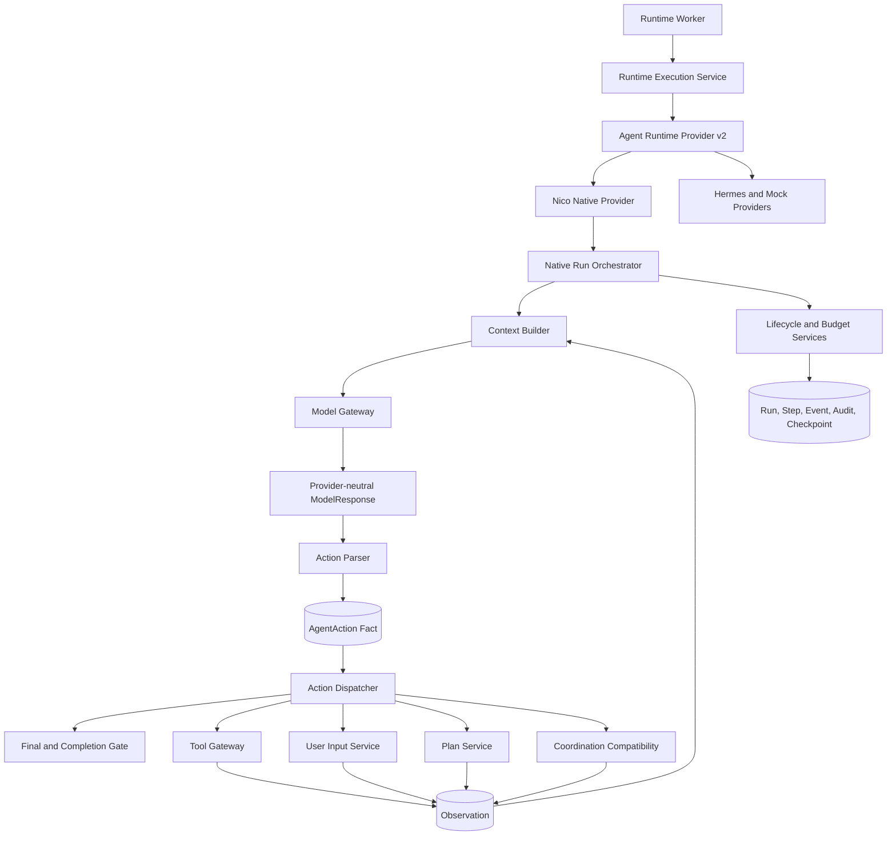
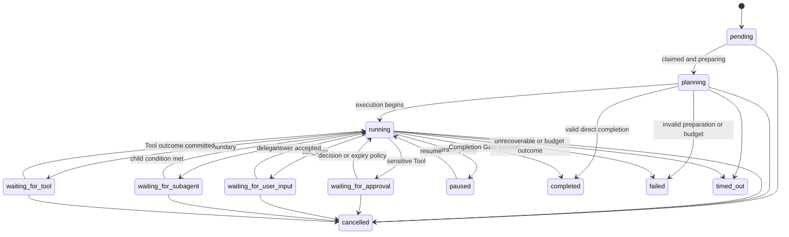
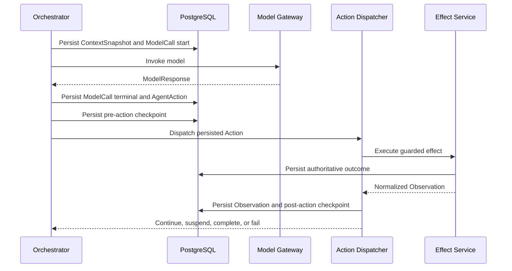

# Agent Runtime Execution Hardening - Plan

## Goal Capsule

- **Objective:** Incrementally harden the existing Nico Agent Runtime into a durable action-driven state machine without replacing the working Native Runtime, Tool Gateway, approval, planning, delegation, or conversation paths.
- **Authority order:** The origin requirements define intended behavior; current code and accepted ADRs define the implementation baseline; this plan resolves the delta and sequencing.
- **Execution profile:** One Goal invocation owns exactly one U-ID. It starts from the first incomplete dependency-ready unit, verifies that unit, records evidence and a handoff, then stops without entering the next unit.
- **Progress authority:** Git history, `docs/progress/goal-status.md`, evidence under `artifacts/goals/runtime-hardening-<phase-code>/`, and the latest phase handoff determine progress. This plan is not mutated to track completion.
- **Compatibility rule:** Existing Direct, ReAct, Plan-and-Execute, Web, Artifact, Delegation, Memory/Skill, CLI queue, and durable Tool approval behavior must remain usable throughout the migration.
- **Stop condition:** A Goal is complete only when its code, migration when applicable, focused tests, full regression gates, migration rehearsal, evidence manifest, documentation delta, and handoff are complete.
- **Blocked condition:** If implementation reveals a scope contradiction, unsafe migration, unverifiable side-effect recovery, or a requirement that would break an accepted ADR, stop that Goal and record the blocker instead of guessing.
- **Tail ownership:** Every Goal removes dead-end code created during that phase, updates the capability/status record honestly, and leaves the next Goal a bounded handoff that can be consumed without the preceding chat context.

---

## Product Contract

### Summary

This plan closes the remaining execution-control gaps in the current Runtime: centralized lifecycle authority, a persisted Agent Action protocol, durable user-input and plan-update actions, stronger Tool outcomes, enforceable budgets, structured context, a shared Completion Gate, and explicit crash-recovery semantics.
It preserves the already working runtime and delivers each capability as an independently verified Goal.

### Problem Frame

The origin requirements correctly identify the desired end state, but they predate substantial implementation already present in the repository.
Nico now has PostgreSQL-backed Run leasing, Runtime Provider protocol v2, OpenAI-compatible/Anthropic/Gemini model adapters, persistent ModelCall and ContextSnapshot facts, Direct/ReAct/Plan loops, versioned checkpoints, Tool Gateway policy enforcement, durable sensitive-tool approval, Plan revisions, Completion Evaluation, child delegation, Artifacts, and SSE delivery.

The remaining problem is architectural concentration and incomplete semantics rather than a missing Agent loop.
`runtime/native/loop.py` still interprets provider-neutral model responses directly, lifecycle writes are distributed across services and database functions, no first-class AgentAction or UserInputRequest fact exists, budget rules are spread across loop branches, context still relies on coarse truncation, and deterministic completion checks do not govern every execution mode.
Crash recovery is strong around leases and idempotent Tool calls but does not yet express every uncertain external-effect state demanded by the origin.

The implementation must therefore extract and strengthen boundaries around the working flow.
It must not recreate completed Goals G-L or use the origin document's earlier assumptions as evidence that a capability is absent.

### Requirements

#### Lifecycle and execution authority

- R1. Existing Runtime Provider v2, PostgreSQL authority, lease ownership, event sequencing, Tool Gateway, and frozen AgentVersion execution manifests must remain the governing boundaries. (see origin: `docs/brainstorms/2026-07-23-agent-runtime-execution-architecture-requirements.md`)
- R2. Runtime-controlled Run transitions must pass through one guarded lifecycle service, except named database claim/wake/reconcile procedures that enforce and test the same transition contract.
- R3. Every lifecycle transition must validate its source state, persist its reason and metadata, emit an Event, preserve terminal immutability, and define whether the Run remains claimable.
- R4. The coarse `RunStatus` and detailed `RuntimeLoopState` must have an explicit semantic mapping, including preparation, finalization, cancellation-in-progress, budget exhaustion, Tool/approval/user-input/subagent waits, and terminal outcomes.
- R5. Every nonterminal waiting state must have a durable wake condition, an idempotent resume command or reconciler, cancellation semantics, and automated recovery coverage.

#### Agent Action protocol

- R6. Model-provider wire formats must be normalized before the Runtime sees them; the Runtime loop may consume only provider-neutral ModelResponse and AgentAction contracts.
- R7. AgentAction must reserve `final`, `tool_call`, `ask_user`, `update_plan`, `wait`, and `delegate`; only handlers completed by the active U-ID may be advertised in the frozen execution manifest. `final`, `tool_call`, `ask_user`, and `update_plan` become executable in this plan, `wait` remains unadvertised and unsupported, and existing `delegate` behavior stays compatible. Existing Artifact behavior remains a compatibility handler reached through the current Tool/Runtime contract, not a seventh action kind.
- R8. Every raw redacted model response and every parsed AgentAction must be persisted and linked to its Run, RuntimeSession, RunStep, ContextSnapshot, and ModelCall. Multi-action responses require an immutable batch identity, ordinal, dispatch cursor and replay relation.
- R9. Ambiguous, invalid, or unsupported actions must produce stable structured errors and allow only a bounded corrective model retry when policy and budget permit.
- R10. The high-level orchestrator must dispatch AgentAction through narrow handlers and must not contain provider-specific fields, Tool policy decisions, approval decisions, or persistence queries.

#### Human input, plans, and tools

- R11. `ask_user` must create a durable UserInputRequest, suspend without holding a Worker lease, expose list/get/respond API and CLI interaction, preserve the authoritative answer in a protected payload or governed reference, and resume exactly once after a validated answer.
- R12. `update_plan` must create a new immutable Plan revision, preserve old revisions, validate dependencies, and associate execution PlanSteps with actual RunSteps. Plan metadata is advisory and may not change frozen Tool grants, permission mode, resource authority, or Run budgets.
- R13. All Tool effects must continue through the existing Tool Gateway; no Runtime action or compatibility adapter may execute a Tool directly.
- R14. Tool outcomes must distinguish execution lifecycle, business result, effect certainty and retryability, including success, partial success, validation denial, permission denial, business failure, timeout, transport failure, cancellation, and unknown side-effect state. Partial or unknown effects must block completion and automatic replay immediately, even before the shared Completion Gate is delivered.
- R15. Approval with changed arguments must preserve original and effective arguments, bind approval to Tool/version/policy/effective-argument hashes, rerun Schema/permission/scope/risk checks immediately before execution, reuse the logical action without duplicating approval requests, and retain a complete audit trail.

#### Budget, context, and completion

- R16. A centralized Budget Manager must enforce model calls, Tool calls, iterations, wall time, input/output/total tokens, cost, retry counts, consecutive errors, repeated actions, and repeated Plan updates before and after each effect boundary. Each consumption uses a stable source key and atomic reserve/settle semantics so crash recovery cannot omit, duplicate, or race a charge.
- R17. Repetition protection must first return a deterministic Observation that requires a strategy change, then terminate with a stable budget/error outcome after the configured threshold.
- R18. Context construction must implement immutable input, working context, recent trajectory, compressed history, and external references with priority levels that never silently trim platform safety or the current user goal. If mandatory context plus reserved output exceeds the provider window, the Runtime must fail deterministically before model invocation.
- R19. Large Tool, Artifact, child, and historical outputs must remain available as original persisted facts while model context receives bounded summaries and references; compression must never delete the audit trail. Every injected reference needs an authorized, bounded read path and an explicit stale/deleted-reference outcome.
- R20. Every ContextSnapshot must record source references, priority/truncation/compression decisions, builder/tokenizer/model-window revisions, token estimate, actual usage linkage, retention dependencies, and a content hash sufficient to explain and replay what the model saw.
- R21. A deterministic Completion Gate must govern final candidates from Native Direct, ReAct, and Plan-and-Execute and reject completion while required steps, actions, approvals, user input, unknown effects, declared Artifact/output obligations, output constraints, or budget facts remain unresolved. Candidate output must be buffered or explicitly labeled non-authoritative until the Gate passes.
- R22. A Completion Gate rejection may return structured corrective feedback to the model for a bounded number of attempts; an optional model verifier may run only when explicitly configured and must be a separately persisted, billed ModelCall.

#### Recovery, observability, and staged delivery

- R23. Recovery semantics must cover crashes before and after model invocation, action persistence, Tool execution, approval decisions, user-input answers, Plan revisions, and completion commit.
- R24. Read-only effects may be retried only under declared policy; write effects require an idempotency key or an authoritative reconciliation query. An unverifiable result becomes `unknown`, is never repeated, and terminates the Run with a stable `manual_intervention_required` failure rather than creating an unimplemented permanent wait.
- R25. Runtime Events and Audit records must carry applicable Run, Step, ModelCall, AgentAction, ToolCall/Execution, Approval, UserInputRequest, Worker, and trace identifiers without logging sensitive arguments.
- R26. Each future Goal invocation must implement and verify exactly one dependency-ready U-ID, save evidence, update the external progress ledger, write a handoff, and stop before the next U-ID. (see origin: `docs/brainstorms/2026-07-23-agent-runtime-execution-architecture-requirements.md`)
- R27. Every feature-bearing Goal must add focused unit and PostgreSQL integration coverage, preserve existing regression suites, and report actual results without representing Mock or fake-provider proof as credentialed external inference.

### Key Flows

- F1. Action-driven model round
  - **Trigger:** A dependency-ready Run enters a model boundary.
  - **Actors:** Worker, Native Runtime, Model Gateway, Action Parser, Action Dispatcher.
  - **Steps:** Build and persist context; persist ModelCall request/response; parse and persist AgentAction; dispatch through the appropriate handler; persist the resulting Observation or terminal candidate.
  - **Outcome:** The loop remains provider-neutral and can resume from committed action facts.
  - **Covered by:** R1-R10, R16-R20, R23-R25.

- F2. Durable user question
  - **Trigger:** The model emits `ask_user`.
  - **Actors:** Action Dispatcher, User Input service, API/CLI user, Worker.
  - **Steps:** Persist the request and checkpoint; release the lease; collect one revision-guarded answer; wake the Run; add the answer as untrusted Observation; resume from the same action boundary.
  - **Outcome:** A user can answer after CLI or Worker restart without duplicating the question or losing the Run.
  - **Covered by:** R4-R5, R7-R11, R23, R25.

- F3. Controlled Tool action
  - **Trigger:** The model emits `tool_call`.
  - **Actors:** Action Dispatcher, Tool Gateway, Approval service, Tool executor.
  - **Steps:** Resolve exact Tool version; normalize and validate arguments; apply authorization/risk policy; suspend for approval when necessary; execute with bounded retry/idempotency; persist normalized outcome; add a bounded Observation.
  - **Outcome:** Tool failure and uncertain side effects are deterministic Runtime facts, not model guesses.
  - **Covered by:** R10, R13-R17, R23-R25.

- F4. Final candidate correction
  - **Trigger:** The model emits `final`.
  - **Actors:** Action Dispatcher, Completion Gate, optional verifier.
  - **Steps:** Persist the candidate; evaluate deterministic completion facts; either commit completion, emit corrective feedback within budget, or fail with a stable reason.
  - **Outcome:** A plausible model answer cannot bypass unfinished system obligations.
  - **Covered by:** R16-R22, R25.

- F5. Phase-isolated Goal execution
  - **Trigger:** A Goal-mode executor resumes this plan.
  - **Actors:** Implementing agent, test infrastructure, reviewer.
  - **Steps:** Select the first incomplete dependency-ready U-ID; implement only that unit; run its focused and regression gates; save evidence and a handoff; stop.
  - **Outcome:** Later phases start from repository facts rather than compressed conversation memory.
  - **Covered by:** R26-R27.

### Acceptance Examples

- AE1. **Given** a current ReAct Agent using an OpenAI-compatible, Anthropic, or Gemini endpoint, **when** the model returns a Tool call then a final answer, **then** the same behavior completes through persisted provider-neutral AgentActions with no provider field parsed in the Runtime loop. Covers R6-R10 and F1.
- AE2. **Given** the model asks a question and both CLI and Worker exit, **when** the user answers after restarting the stack, **then** the same UserInputRequest is answered once and the Run resumes from its saved boundary. Covers R5, R11, R23 and F2.
- AE3. **Given** a medium-risk Tool call is approved with changed arguments, **when** execution resumes, **then** the effective arguments are revalidated, the original request stays auditable, and exactly one Tool effect is attempted. Covers R13-R15 and F3.
- AE4. **Given** a model repeats the same Tool and arguments after receiving the same error, **when** the repetition threshold is crossed, **then** the Runtime first emits a strategy-change Observation and later terminates without another effect. Covers R16-R17.
- AE5. **Given** a write Tool may have succeeded before its Worker died, **when** a new Worker takes over and no authoritative execution status can be proven, **then** the Tool action becomes unknown and is not automatically repeated. Covers R23-R24.
- AE6. **Given** a ReAct final candidate still has a pending user request, Tool approval, or promised Artifact, **when** the Completion Gate evaluates it, **then** the Run does not complete and receives bounded corrective feedback. Covers R21-R22 and F4.
- AE7. **Given** Runtime Hardening Goal A has passed, **when** the Goal executor writes its evidence and handoff, **then** it stops before Goal B even if budget and context remain. Covers R26-R27 and F5.

### Success Criteria

- Runtime loops consume persisted AgentAction facts rather than branching directly on vendor response shapes.
- Waiting for a Tool, approval, user input, or child result never occupies a Worker lease and always has a tested wake path.
- Every model, action, Tool effect, approval, answer, Plan revision, completion decision, budget rejection, and recovery decision is queryable from the Run.
- Existing Native Runtime and CLI behavior remains green after every Goal; no phase requires a flag-day migration.
- Context growth and action repetition terminate under explicit budgets while original facts remain auditable.
- A final response cannot mark the Run complete while deterministic obligations remain unresolved.
- Every phase can be resumed by reading its U-ID, cited requirements/KTDs, evidence, and handoff without reading prior chat history or the entire plan.

### Scope Boundaries

#### Included

- Native Runtime execution control, provider-neutral action parsing/dispatch, Tool outcome hardening, persistent user input, Plan updates, budgets, context, completion, recovery, observability, API/CLI parity, migrations, tests, and operational handoffs.
- Compatibility mappings for current Direct/ReAct/Plan, Web citation repair, Artifact storage, durable Tool approval, and existing child delegation.

#### Deferred to Follow-Up Work

- Executable general-purpose `wait` scheduling, external wake conditions, and an external-wait `RunStatus`; the action kind stays reserved and unadvertised until that complete lifecycle is planned.
- New external Runtime adapters, new model-provider protocols, cross-provider failover, and unrelated model-routing policy.
- A general workflow DSL, fixed Team product, or domain-specific roles.
- A default second-model verifier for all tasks; only the configured extension point belongs here.
- Production API authentication and authorization, except that new endpoints must preserve the current trusted-network boundary and must not widen it.

#### Explicit Non-Goals

- Rewriting the working Agent loop, Tool Gateway, Model Gateway, approval service, Planner, Coordination service, or conversation queue from scratch.
- Forcing every request into Planning or requiring every final answer to invoke a model verifier.
- Treating Prompt instructions as authority for state, permissions, risk, budget, retries, or completion.
- Retrying a write effect whose outcome is unknown and lacks idempotency or authoritative reconciliation.
- Storing hidden reasoning or unredacted Secrets in ModelCall, Action, Event, Audit, checkpoint, or CLI output.

---

## Planning Contract

### Current-State Audit

| Area | Current capability | Planning disposition |
| --- | --- | --- |
| Run creation and queue | Conversation Turn atomically creates Task/Run; PostgreSQL queue and lease claim are authoritative and queue-aware. | Retain; add lifecycle authority around mutations, not a new queue. |
| Runtime execution | Provider v2, suspension, heartbeat, event forwarding, Direct/ReAct/Plan modes, Artifacts and Coordination handlers exist. | Retain executor/provider boundaries; extract action orchestration from the Native loop. |
| Model abstraction | OpenAI-compatible, Anthropic Messages, and Gemini adapters normalize streams into `ModelResponse`; Model Gateway handles capability, rate limit, retry, timeout, usage and cost. | Treat `ModelResponse` as the wire-neutral input to Action Parser; do not make provider adapters write domain state. |
| State control | `RUN_TRANSITIONS` and `RUN_STEP_TRANSITIONS` exist, but runtime services and SQL reconcilers still assign statuses in multiple places. | Add one lifecycle application service and an explicit exception/contract for database claim and wake procedures. |
| Persistence | Run, RuntimeSession, RunStep, ContextSnapshot, ModelCall, Plan, PlanStep, ToolCall, Evaluation, Event and Audit are durable. | Add AgentAction and UserInputRequest facts; extend existing entities only where a query/recovery requirement needs it. |
| Checkpoint and recovery | Versioned ReAct/Plan checkpoints, stable Tool idempotency, lease takeover, stale-result rejection, approval and child wake-up are tested. | Preserve; add action-boundary reconciliation and explicit unknown-effect/completion recovery. |
| Tool Gateway | Exact version, Schema, authorization, Secret resolution, risk, durable approval, idempotency, timeout, retry, output validation, Event and Audit exist. | Incrementally add outcome taxonomy, effective arguments, changed-argument approval, resource-scope evidence and unknown effects. |
| Approval | Requested/approved/rejected/expired/cancelled with once/run scope, CLI interaction and wake-up exist. | Add approved-with-changes semantics; retain the current durable request and checkpoint model. |
| Budget | Iteration, Tool-call, token, Plan, reflection/replan and wall-time checks exist; tree budgets are persisted. | Centralize checks and add model-call, input/output token, cost, retry, consecutive-error and repetition protection. |
| Context | Frozen Conversation selection, Memory/Skill refs, ContextSnapshot hashing, history restoration and deterministic character truncation exist. | Replace coarse assembly/truncation with priority-aware ContextBuilder while preserving the existing Conversation summary contract. |
| Planning | Immutable Plan revisions, dependency validation, PlanStep linkage, Reflection/Replan and evaluations exist in Plan mode. | Expose a controlled `update_plan` Action through a Plan service; do not create a second Plan model. |
| Completion | Deterministic output/Schema checks and optional billed judge exist in Plan mode; Web citation repair has a bounded gate. | Generalize a deterministic Completion Gate across Direct/ReAct/Plan and include pending system facts. |
| CLI/API | Queue-aware chat, streaming, approvals, interruptions and persisted final Turn rendering exist. | Add user-input request query/answer/rendering; retain the thin HTTP/SSE client architecture. |
| Observability | Contiguous Runtime events are projected to specialized facts and safe public Event payloads. | Add Action/UserInput/Budget/Recovery identifiers and events; do not expose internal chain-of-thought or raw Secrets. |

### High-Level Technical Design

#### Component boundary

Runtime Provider v2 remains the outer execution boundary; AgentAction never leaks into Hermes or Mock Provider contracts.
Model providers inside `nico_native` remain responsible for wire parsing.
Action Parser is model-provider-neutral and responsible for Native Runtime intent.
Action Dispatcher invokes only narrow deterministic services; it does not own authorization, persistence sessions, or provider-specific parsing.

#### State mapping

`PREPARING` maps to coarse `planning` plus RuntimeSession `initializing`.
`COMPLETING` maps to RuntimeLoopState `finalizing`.
`CANCELLING` is represented by the existing cancel request plus a nonterminal lifecycle event until terminal cancellation commits.
`BUDGET_EXCEEDED` maps to `failed` with a stable budget error family unless a later API-version decision justifies a new public terminal status.

#### Persist-before-effect sequence

#### Goal dependency chain

Each node is a separate Goal invocation and landing boundary.
Later Goals may read earlier handoffs but may not absorb their successors.

### Key Technical Decisions

- KTD1. **One U-ID per Goal invocation.** A Goal stops after its selected unit is verified and handed off, even when later units are unblocked. (session-settled: user-directed — chosen over one long Runtime rewrite: context compression during a large run risks scope and architectural drift) Governs R26-R27.
- KTD2. **Keep the two-level state model.** `RunStatus` remains the public/queue lifecycle, while `RuntimeLoopState` carries preparing, observing, reflecting, and finalizing detail; only the implemented user-input wait is added to Run in this plan. Existing Tool, approval and subagent waits retain their established mappings, and general external wait stays deferred. Governs R2-R5.
- KTD3. **Parse AgentAction inside `nico_native`, above its Model Gateway.** Model-provider adapters continue converting vendor wire data to `ModelResponse`; one Native Runtime Action Parser converts that neutral response to AgentAction. “Provider-neutral” refers to model providers, not Runtime Provider v2, so Hermes and Mock contracts remain unchanged. Governs R1, R6-R10.
- KTD4. **Persist an immutable decision batch before dispatch.** A batch links one terminal ModelCall to ordered immutable Action intents under stable `(model_call_id, parse_revision, ordinal)` identity; dispatch attempts, outcomes and cursor are separate append-only facts/projections. ModelCall remains the owner of redacted raw output, and the decision commit atomically records the terminal call, complete batch, checkpoint and lifecycle/Event facts before effects begin. Governs R8-R9, R23-R25.
- KTD5. **Extract the loop through compatibility dispatch.** Direct/ReAct/Plan behavior moves behind the Action Dispatcher one branch at a time, with existing checkpoints and handler contracts retained until equivalent tests pass. No flag-day loop replacement is allowed. Governs R1, R7, R10.
- KTD6. **Model `ask_user` as a durable request, not a queued chat Turn.** ConversationTurn remains a user-initiated task; UserInputRequest is a Run-owned wake condition whose answer becomes an untrusted Observation. This preserves ADR-0012's separation of conversation and runtime session. Governs R5, R11.
- KTD7. **Reuse Plan and PlanStep as the only planning facts.** `update_plan` calls a Plan service that creates a validated revision and links it to RunSteps; it does not introduce another plan JSON lifecycle. Governs R12.
- KTD8. **Keep Tool Gateway as the single side-effect authority.** AgentAction dispatch creates immutable Tool intent only; the Gateway owns exact version, Schema, effective arguments, authorization, risk, approval, idempotency, dispatch attempts, retry, execution and outcome. Governs R13-R15.
- KTD9. **Preserve Tool intent and effective execution revisions separately.** Approval-with-changes creates one effective execution revision whose idempotency key binds Action identity, exact Tool version, policy version and effective-argument hash. It invalidates the prior grant, reruns every deterministic gate, and cannot change arguments after dispatch begins. Governs R14-R15.
- KTD10. **Use RunBudgetLedger as authorization and ModelCall/ToolCall as evidence.** Frozen limits and atomic source-keyed reserve/settle entries govern whether an effect may start; call facts provide metering evidence, and reconciliation repairs materialized balances without charging a source twice. Action fingerprints and consecutive-error state remain compact checkpoint data with persisted Action references. Governs R16-R17.
- KTD11. **Build context from typed priority buckets and governed references.** The existing Conversation summary, ContextSeed, ContextSnapshot, ToolCall, Artifact, Memory/Skill and child-result facts remain authoritative sources; ContextBuilder selects and compresses them without creating an unrecorded model call. It reserves output capacity and fails before invocation when mandatory input cannot fit, while snapshot references retain authorized bounded-read and lifecycle semantics. Governs R18-R20.
- KTD12. **Apply one deterministic Native Completion Gate, then commit through lifecycle authority.** The Gate persists candidate and verdict for Native Direct/ReAct/Plan; RuntimeExecutionService/Lifecycle Authority atomically projects Run, Task, ConversationTurn and Event terminal facts. Candidate tokens are buffered or labeled draft until acceptance, and a model judge remains optional, separate and billed. External Runtime Provider semantics are unchanged. Governs R21-R22.
- KTD13. **Unknown external effects fail closed with a stable terminal outcome.** Recovery retries only when the effect is read-only or its executor proves idempotency/reconciliation; otherwise it persists `unknown`, blocks any final candidate, and terminates the Run as `manual_intervention_required`. Reconciliation happens outside that Run until a complete operator-resolution lifecycle is separately planned. Governs R14, R21, R23-R24.
- KTD14. **Retain current Delegation and reserve general wait.** Existing `delegate_agent` behavior maps through the Action protocol without rebuilding Coordination. `wait` remains a recognized but unadvertised/unsupported protocol value; this plan adds no external-wait state, wake port or scheduler. Governs R7 and the Scope Boundaries.
- KTD15. **Keep domain facts authoritative over Observation projections.** ToolCall/attempt, UserInputRequest, Plan/PlanStep, Artifact and Coordination facts own their full results. AgentAction outcomes and model-facing Observations store only bounded projections or governed references, preventing divergent copies of the same result. Governs R8, R11-R15, R19-R20, R25.

### System-Wide Impact

- **Database:** New append-only Action and UserInput facts, lifecycle constraints, Tool effective arguments, outcome taxonomy, budget entries, and Context metadata require additive expand-migrate-contract migrations with FORCE RLS, same-tenant composite foreign keys and forward-compatible reads.
- **Concurrency:** Approval decisions, answers, cancellation, lease expiry, wake reconciliation, completion commit, and late Tool results can race; each unit must define lock order and stale-write behavior.
- **API/CLI:** User input adds a new interruptible prompt and resume surface. Existing queue preview, Tool approval and fixed composer behavior must remain distinct from Agent questions.
- **Security:** Model-issued actions remain untrusted intent. Authorization, risk, resource scope, budgets and completion are deterministic server decisions; authoritative answers and arguments use classified protected storage while public Event/Audit/log/evidence/CLI projections remain redacted.
- **Storage:** AgentAction and Observation payloads must be bounded. Large Tool or user content uses governed Artifact/source references rather than repeated JSON copies; retention and deletion rules must preserve or explicitly invalidate referenced recovery facts.
- **Operations:** Reclaimers and wake reconcilers need metrics for action age, waiting duration, unknown effects, repeated actions, budget exhaustion, recovery lag and completion corrections.
- **Compatibility:** Migrations must preserve old Run, RuntimeSession, checkpoint and ToolCall rows. Old events stay readable; new loops can resume supported old checkpoint schemas during an explicit compatibility window.

### Risks and Mitigations

| Risk | Impact | Mitigation |
| --- | --- | --- |
| State centralization conflicts with SQL wake procedures | Lost wake-up or an unclaimable Run | Define database procedures as explicit lifecycle ports, mirror allowed transitions, and cover every wake/cancel race in PostgreSQL integration tests. |
| Python and SQL lifecycle paths drift | Different claimability, revisions or terminal behavior for the same transition | Maintain one versioned transition contract, enumerate the writer allowlist, and run exhaustive parity tests across application and database ports. |
| Action extraction changes working ReAct behavior | Tool, Web, Artifact or Delegation regression | Characterize current branches before extraction and move final/tool/delegate compatibility through the dispatcher before adding new actions. |
| Approval argument changes break Tool idempotency | Duplicate or mis-audited write | Keep one logical action, store original/effective hashes, persist pre-effect checkpoint, and require executor idempotency or reconciliation. |
| Budget facts drift from ModelCall/ToolCall facts | Overrun or false failure | Reconcile counters from persisted facts, update atomically, and test partial/unknown usage without inventing cost. |
| Context compression removes a critical instruction | Unsafe or incorrect execution | Make P0/P1 non-trimmable, persist every selection decision, and retain original source facts outside the rendered snapshot. |
| Completion Gate creates correction loops | Cost growth or nontermination | Separate deterministic failure codes, cap corrections, count them in Budget Manager, and terminate with a stable outcome. |
| Recovery repeats an uncertain effect | External corruption | Introduce unknown status, require proof before replay, and add kill-point tests around every effect boundary. |
| Mixed-version migration changes persistent semantics | Old Worker rejects or misclaims new rows | Use expand-migrate-contract sequencing, test old application plus new schema, retain new evidence on code rollback, and use forward-fix rather than destructive downgrade for durable Runtime facts. |
| Context references expire or duplicate sensitive content | Non-replayable Runs or wider Secret/PII exposure | Freeze source hashes and retention dependencies, use protected references, verify authorized bounded reads, and define explicit redaction/deletion outcomes. |
| Nine phases increase coordination overhead | Slow delivery or stale handoffs | Keep a uniform evidence/handoff template and update the central progress ledger after every verified Goal. |

### Operational and Handoff Contract

Each Runtime Hardening Goal writes:

- evidence under `artifacts/goals/runtime-hardening-<phase-code>/<UTC timestamp>/`;
- a manifest containing commit, migration head, focused tests, regression results, migration rehearsal, and unresolved limitations;
- a phase handoff under `docs/handoffs/` covering delivered behavior, data/API changes, verification evidence, remaining risks, and the next dependency-ready U-ID;
- an updated row in `docs/progress/goal-status.md` using the repository's existing status vocabulary;
- documentation changes only for behavior actually verified in that phase.

For every schema Goal, the handoff also records the predecessor revision, additive/nullable defaults, bounded backfill strategy, integrity queries, constraint-tightening point, mixed-version window and code-rollback boundary.
Migrations `0027` through `0033` form one linear revision chain, never rewrite `0026`, and default to forward-fix for durable Runtime evidence rather than destructive down migration.
Each schema Goal rehearses upgrade from a representative `0026` snapshot, proves the previous application can safely ignore/read the expanded schema, and stops before the next Goal when the head, orphan, illegal-state, backfill or compatibility gate fails.

The implementation agent derives the active phase from git, the progress ledger and handoffs.
It must not mark a phase Verified solely because code exists, and it must not use missing external credentials to invalidate hermetic protocol/integration evidence.

---

## Implementation Units

### U1. Runtime Hardening Goal A - lifecycle authority

- **Goal:** Establish one guarded Run lifecycle authority and the explicit coarse/detailed state mapping without changing working queue behavior.
- **Requirements:** R1-R5, R23, R25-R27; F5; AE7; KTD1-KTD2.
- **Dependencies:** None. The baseline is migration `20260722_0026`, ADR-0002, and the current queue-aware claimer.
- **Files:** Modify `backend/src/nico_agent/domain/states.py`, `backend/src/nico_agent/runtime/service.py`, `backend/src/nico_agent/runtime/executor.py`, `backend/src/nico_agent/database.py`, `docs/state-machines.md`, `docs/runtime.md`, and `docs/progress/goal-status.md`; create `backend/src/nico_agent/runtime/lifecycle.py`, `backend/migrations/versions/20260723_0027_runtime_lifecycle_authority.py`, `backend/tests/unit/test_runtime_lifecycle.py`, `backend/tests/integration/test_runtime_lifecycle.py`, `scripts/verify-runtime-hardening-goal-a.sh`, and the Goal A handoff under `docs/handoffs/`. Treat `backend/migrations/versions/20260722_0026_chat_session_controls.py` as an immutable baseline reference; do not edit an applied migration.
- **Approach:**
  1. Inventory every Run/RuntimeSession/RunStep writer in Runtime services, Tool Gateway, approvals, Coordination and SQL, then make that allowlist an executable transition-contract fixture.
  2. Add a lifecycle primitive that accepts the caller's existing transaction and locked Run, validates transition plus lease/wake invariants, and commits state, revision, Event, Audit and claimability atomically without opening a nested transaction.
  3. Route application writes through that primitive; make database claim, approval wake, child wake and queue projection functions constrained ports of the same versioned contract.
  4. Add only the durable user-input waiting state as schema preparation; general external wait remains out of scope.
  5. Use expand-migrate-contract ordering: expand compatible schema/read mappings, deploy new writers, validate stored rows, then tighten constraints in a later compatible step. Preserve old rows, checkpoints and public responses, and treat application rollback as code-only forward compatibility.
- **Execution note:** Add characterization coverage for current claim, approval wake, child wake, pause and terminal projection before changing status writes.
- **Patterns to follow:** `RUN_TRANSITIONS`, `transition_state`, `claim_next_run`, Tool approval reconciler, Coordination waiter reconciler, revision guards, FORCE RLS migration tests.
- **Test scenarios:**
  1. A pending Run follows the existing claim path into planning/running and emits one transition event per committed state change.
  2. An illegal transition and any transition out of a terminal state are rejected without changing revision or Event count.
  3. Existing Tool, approval and subagent waits plus the reserved user-input wait are not ordinarily claimable; each implemented matching wake port makes its Run claimable once.
  4. Cancellation racing a wake decision leaves the Run cancelled and rejects the late wake.
  5. An expired Worker lease is reclaimed once, while a stale owner cannot transition or complete the Run.
  6. Existing Conversation queue head ordering and abnormal-head pause projection remain unchanged.
  7. Every application and SQL port produces identical allow/deny, revision, Event, claimability and cancel-versus-wake results for the full transition matrix.
  8. A representative `0026` snapshot upgrades additively; previous and new API/Worker binaries remain safe against the expanded schema, and code rollback does not delete new facts.
- **Verification:** Focused lifecycle tests, all existing unit/integration suites, representative-snapshot upgrade and forward-fix rehearsal, mixed-version queue/approval/coordination E2E, evidence manifest, status update and handoff pass before Goal A stops.

### U2. Runtime Hardening Goal B1 - Agent Action facts and parsing

- **Goal:** Introduce model-provider-neutral AgentAction contracts, decision-batch parsing and persistence without moving current effect handlers yet.
- **Requirements:** R1, R6-R9, R23, R25-R27; F1; AE1; KTD1, KTD3-KTD5, KTD14-KTD15.
- **Dependencies:** U1.
- **Files:** Modify `backend/src/nico_agent/models/contracts.py`, `backend/src/nico_agent/runtime/contracts.py`, `backend/src/nico_agent/runtime/native/loop.py`, `backend/src/nico_agent/runtime/native/checkpoint.py`, `backend/src/nico_agent/runtime/service.py`, `backend/src/nico_agent/domain/models.py`, `backend/src/nico_agent/domain/states.py`, `backend/src/nico_agent/model_api.py`, and `docs/runtime.md`; create `backend/src/nico_agent/runtime/actions.py`, `backend/src/nico_agent/runtime/native/action_parser.py`, `backend/migrations/versions/20260723_0028_agent_actions.py`, `backend/tests/unit/test_agent_actions.py`, `backend/tests/integration/test_agent_action_persistence.py`, `scripts/verify-runtime-hardening-goal-b1.sh`, and the Goal B1 handoff.
- **Approach:**
  1. Define frozen Action/batch contracts with schema/parse revisions, ordinals, stable errors and separate immutable intents versus append-only attempts/outcomes.
  2. Freeze advertised internal action schemas and handler capabilities in the Native execution manifest. Publish only currently executable `final`, `tool_call` and compatible `delegate`; reserve `ask_user`, `update_plan` and `wait` without advertising them.
  3. Parse terminal `ModelResponse` into one ordered batch. Reject final-plus-effect ambiguity; define ordered dispatch semantics for multiple provider Tool calls without starting effects in this unit.
  4. Atomically persist terminal ModelCall, the complete batch, pre-action checkpoint, lifecycle/Event facts and dispatch cursor before any future handler may run; link repair/replay without rewriting intent.
  5. Keep current loop handlers authoritative until U10 moves them through compatibility dispatch.
- **Execution note:** This unit ends at durable intent and parser compatibility; it must not claim Tool/Artifact/Delegation handler migration or centralized budget enforcement.
- **Patterns to follow:** Immutable ModelCall facts, `_pending_actions`, Runtime service event projection, `RuntimeToolIntent`, frozen execution manifests, checkpoint replay relations.
- **Test scenarios:**
  1. OpenAI-compatible, Anthropic and Gemini fixtures that describe equivalent final/Tool responses produce equivalent AgentActions.
  2. Existing ReAct Tool, Web, Artifact and parallel Delegation flows remain unchanged while their equivalent responses also produce deterministic, non-dispatched Action batches.
  3. Invalid Tool arguments, unknown action types, duplicate call IDs and ambiguous final/effect output create stable parse errors without effects.
  4. One configured corrective retry persists the invalid Action and its repair relation; exhaustion fails without another retry.
  5. A response with multiple Tool calls has stable batch/ordinal identity; crash before or after decision commit yields either no batch or one complete batch, never a partial batch.
  6. Cross-tenant Action reads fail, immutable intent fields cannot be rewritten, and previous application code safely ignores the new additive facts.
- **Verification:** Provider adapter contract tests, AgentAction unit/integration tests, Native Direct/ReAct/Plan, Web, Artifact and Delegation characterization regressions, migration rehearsal, evidence and handoff pass before Goal B1 stops.

### U10. Runtime Hardening Goal B2 - compatibility Action dispatch

- **Goal:** Move existing final, Tool, Artifact and Delegation branches behind the Action Dispatcher without changing their observable behavior.
- **Requirements:** R1, R6-R10, R13, R23, R25-R27; F1; AE1; KTD1, KTD3-KTD5, KTD8, KTD14-KTD15.
- **Dependencies:** U2.
- **Files:** Modify `backend/src/nico_agent/runtime/native/loop.py`, `backend/src/nico_agent/runtime/native/checkpoint.py`, `backend/src/nico_agent/runtime/service.py`, `backend/src/nico_agent/runtime/tools.py`, and `docs/runtime.md`; create `backend/src/nico_agent/runtime/native/action_dispatcher.py`, `backend/tests/unit/test_action_dispatcher.py`, `backend/tests/integration/test_agent_action_dispatch.py`, `scripts/verify-runtime-hardening-goal-b2.sh`, and the Goal B2 handoff.
- **Approach:**
  1. Dispatch only committed Actions and advance the persisted cursor after the authoritative domain outcome commits.
  2. Move final, Tool, Artifact and Delegation compatibility paths one at a time, retaining Tool Gateway, Artifact and Coordination ownership.
  3. Execute ordered multi-action batches sequentially by default; a handler may use existing parallel semantics only when its domain contract already proves stable per-action identity and recovery.
  4. On restart, skip completed ordinals, reconcile the current ordinal, and never execute later ordinals after a terminal/uncertain outcome.
  5. Continue using current bounded retry/budget behavior; centralized budget claims belong to U6.
- **Patterns to follow:** Current ReAct handlers, `RuntimeToolIntent`, Coordination/Artifact services, Tool idempotency, checkpoint replay relations.
- **Test scenarios:**
  1. Existing Direct final and ReAct Tool/Web/Artifact/Delegation flows produce unchanged authoritative results through persisted dispatch.
  2. A multi-Tool batch crashes after ordinal N and resumes at the first unresolved ordinal without repeating prior effects.
  3. Final cannot coexist with an effect batch, and a terminal or unknown result prevents later ordinal dispatch.
  4. Unsupported or unadvertised internal actions fail structurally and cannot fall through to ordinary Tool execution.
  5. Hermes and Mock Runtime Providers continue through Provider v2 without receiving Native AgentAction contracts.
  6. Old supported checkpoints resume through compatibility readers or fail explicitly without silent rewrite.
- **Verification:** Dispatcher unit/integration tests plus Native Direct/ReAct/Plan, Web, Artifact, Delegation and non-Native Provider regressions pass; evidence and handoff pass before Goal B2 stops.

### U3. Runtime Hardening Goal C - durable user input

- **Goal:** Make `ask_user` a complete persistent suspend/answer/resume capability across Runtime, API and CLI.
- **Requirements:** R2-R5, R7-R11, R23, R25-R27; F2; AE2; KTD1, KTD5-KTD6.
- **Dependencies:** U10.
- **Files:** Modify `backend/src/nico_agent/runtime/native/action_dispatcher.py`, `backend/src/nico_agent/runtime/native/checkpoint.py`, `backend/src/nico_agent/runtime/service.py`, `backend/src/nico_agent/runtime/executor.py`, `backend/src/nico_agent/domain/models.py`, `backend/src/nico_agent/domain/states.py`, `backend/src/nico_agent/api.py`, `backend/src/nico_agent/cli/client.py`, `backend/src/nico_agent/cli/chat_session.py`, `backend/src/nico_agent/cli/renderers.py`, and `docs/cli.md`; create `backend/src/nico_agent/user_inputs/contracts.py`, `backend/src/nico_agent/user_inputs/service.py`, `backend/src/nico_agent/user_inputs/api.py`, `backend/migrations/versions/20260723_0029_user_input_requests.py`, `backend/tests/unit/test_user_input_requests.py`, `backend/tests/integration/test_user_input_runtime.py`, `backend/tests/unit/test_cli_user_input.py`, `scripts/e2e-runtime-user-input.sh`, `scripts/verify-runtime-hardening-goal-c.sh`, and the Goal C handoff.
- **Approach:**
  1. Persist question, safe input schema, reason, expiry, status, protected authoritative answer payload/reference, redacted projection, hash, revision, source and wake identity. Enforce one active request per Run/action waiting point.
  2. Save the pre-action checkpoint, suspend to `waiting_for_user_input`, release the lease, and render the request as a distinct Agent question rather than a new Conversation Turn.
  3. Expose primitive list/get/respond surfaces with request ID, expected revision and idempotency contract. Atomically save/close the answer, append its fact and wake the Run, or make that protocol safely reconcilable after a crash.
  4. Resolve answer/cancel/expiry races under the Run lock, reject late or duplicate conflicting answers, and reconcile answered-but-still-waiting Runs.
  5. Define composer arbitration when an Agent question, Tool approval and queued Conversation Turn coexist: the active interrupt owns explicit answer mode, while deliberate queueing remains a distinct user action.
- **Patterns to follow:** ToolApprovalRequest lifecycle, approval API/CLI interrupt flow, suspension/wake transaction, Conversation thin-client boundary, safe Event payload projection.
- **Test scenarios:**
  1. A valid string, choice and structured answer each resume the same Action exactly once.
  2. CLI and Worker restart while waiting preserve the exact semantic answer through protected storage and allow later resume without exposing it in Event, Audit, logs, evidence or ordinary CLI output.
  3. Invalid schema, expired request, conflicting idempotency replay and cross-tenant answer are rejected without wake-up.
  4. Cancellation wins over a concurrent answer and a late answer cannot resurrect the Run.
  5. The answered value is available to the next model round as untrusted data but cannot change permissions or budgets.
  6. The CLI composer, queued user Turns, sensitive Tool approval and Agent question remain visually and behaviorally distinct.
  7. CLI/API double submit, answer-then-crash, lease takeover and answered-but-unwoken reconciliation resume exactly once.
- **Verification:** Unit, PostgreSQL integration and PTY E2E prove suspend/restart/answer/resume; existing chat queue and approval E2E remain green; migration, evidence and handoff pass before Goal C stops.

### U4. Runtime Hardening Goal D - controlled Plan updates

- **Goal:** Execute `update_plan` through the existing immutable Plan/PlanStep model without introducing a second planning lifecycle.
- **Requirements:** R7-R10, R12, R23, R25-R27; F1; KTD1, KTD5, KTD7.
- **Dependencies:** U3.
- **Files:** Modify `backend/src/nico_agent/runtime/native/action_parser.py`, `backend/src/nico_agent/runtime/native/action_dispatcher.py`, `backend/src/nico_agent/runtime/native/planner.py`, `backend/src/nico_agent/runtime/native/checkpoint.py`, `backend/src/nico_agent/runtime/service.py`, `backend/src/nico_agent/domain/models.py`, `backend/src/nico_agent/model_api.py`, and `docs/runtime.md`; create `backend/src/nico_agent/runtime/native/plan_service.py`, `backend/tests/unit/test_plan_actions.py`, `backend/tests/integration/test_plan_action_runtime.py`, `scripts/verify-runtime-hardening-goal-d.sh`, and the Goal D handoff.
- **Approach:**
  1. Parse Plan updates into a bounded action that cites the current revision and reason.
  2. Validate stable keys, dependencies, cycles and required completion criteria. Reject any attempt to change frozen Tool grants, permission mode, resource scope or Run budget; expected Tool metadata remains advisory.
  3. Supersede the previous Plan only after the new revision and PlanSteps commit; preserve prior Plan/Step output facts.
  4. Link the selected PlanStep to actual RunSteps and return a structured Observation describing the accepted revision or validation failure.
- **Execution note:** Characterize the existing planner/reflection/replan persistence before routing it through the shared Plan service.
- **Patterns to follow:** `parse_plan`, Plan revision uniqueness, Reflection replan, runtime event projections, expected revision conflicts.
- **Test scenarios:**
  1. A valid update creates the next revision, preserves the old Plan and continues from dependency-ready steps.
  2. Duplicate keys, cycles, unknown dependencies, stale revision and oversized Plan fail without superseding the active Plan.
  3. Adding a high-risk expected Tool neither grants authority nor opens an argument-free approval; any later concrete Tool action still passes the complete Gateway policy.
  4. Replaying the same update action returns the existing revision without duplicating PlanSteps.
  5. Crash after revision commit but before Observation resumes from the persisted revision.
  6. Existing Plan-and-Execute reflection and completion-correction revisions remain readable and executable.
- **Verification:** Plan parser/service tests, Plan runtime integration, existing Plan-mode regressions, migration-free schema compatibility check, evidence and handoff pass before Goal D stops.

### U5. Runtime Hardening Goal E1 - Tool outcome and uncertain-effect safety

- **Goal:** Complete normalized Tool execution/outcome facts and uncertain-effect safety while retaining the current Gateway and approval behavior.
- **Requirements:** R1, R10, R13-R14, R21, R23-R25, R27; F3; AE5; KTD1, KTD8, KTD13, KTD15.
- **Dependencies:** U4.
- **Files:** Modify `backend/src/nico_agent/tools/contracts.py`, `backend/src/nico_agent/tools/gateway.py`, `backend/src/nico_agent/tools/errors.py`, `backend/src/nico_agent/runtime/tools.py`, `backend/src/nico_agent/runtime/native/action_dispatcher.py`, `backend/src/nico_agent/domain/models.py`, `backend/src/nico_agent/domain/states.py`, and `docs/tool-gateway.md`; create `backend/migrations/versions/20260723_0030_tool_outcomes_and_effect_certainty.py`, `backend/tests/unit/test_tool_outcomes.py`, extend `backend/tests/integration/test_tool_gateway.py`, create `backend/tests/integration/test_tool_effect_recovery.py`, `scripts/verify-runtime-hardening-goal-e1.sh`, and the Goal E1 handoff.
- **Approach:**
  1. Separate dispatch lifecycle, business result, effect certainty and retryability; map existing Tool errors without weakening current retry policy.
  2. Persist a stable dispatch attempt and idempotency token before any executor call, then bind completion/reconciliation evidence to that attempt.
  3. Mark expired in-flight effects unknown when the executor cannot prove completion or safe replay; never convert uncertainty to automatic failure/retry.
  4. Add an immediate lifecycle/dispatcher completion veto: partial or unknown effects prevent later final dispatch and terminate unknown as `manual_intervention_required`. U8 later generalizes this check.
  5. Feed bounded normalized projections/references into Observation while keeping full authoritative Tool/attempt facts outside model context.
- **Execution note:** Start with failure-boundary and idempotency characterization tests because this unit changes persistent side-effect semantics.
- **Patterns to follow:** Current Tool Gateway authorization, stable idempotency, attempt history, pre-action checkpoint, late-result rejection and Audit redaction.
- **Test scenarios:**
  1. Success, partial success, validation/permission/business failure, timeout, transport failure, cancellation and unknown map to distinct outcomes.
  2. Crashes before send, after send, after response and before result commit leave one attempt with the only provable certainty.
  3. A killed read-only Tool retries only under policy; a killed write Tool becomes unknown unless reconciliation proves the prior result.
  4. A partial or unknown effect blocks a subsequent final action before U8 exists; unknown terminates with the stable manual-intervention error.
  5. Recovery and old application code never reinterpret unknown as retryable failed.
  6. Sensitive arguments and executor evidence remain bounded/redacted in API, Event, Audit and CLI output.
- **Verification:** Tool contract/Gateway/recovery tests, real PostgreSQL concurrency, sandbox and Web Tool regressions, representative migration/mixed-version rehearsal, evidence and handoff pass before Goal E1 stops.

### U11. Runtime Hardening Goal E2 - approval changes and effective execution

- **Goal:** Add approval-with-changes, effective execution revisions and resource-scope evidence without weakening Tool Gateway authority.
- **Requirements:** R1, R10, R13-R15, R23-R25, R27; F3; AE3; KTD1, KTD8-KTD9, KTD15.
- **Dependencies:** U5.
- **Files:** Modify `backend/src/nico_agent/tools/gateway.py`, `backend/src/nico_agent/tool_approvals/contracts.py`, `backend/src/nico_agent/tool_approvals/service.py`, `backend/src/nico_agent/tool_approvals/api.py`, `backend/src/nico_agent/runtime/native/action_dispatcher.py`, `backend/src/nico_agent/domain/models.py`, `backend/src/nico_agent/cli/renderers.py`, and `docs/tool-gateway.md`; create `backend/migrations/versions/20260723_0031_tool_approval_effective_revisions.py`, extend `backend/tests/unit/test_tool_approvals.py` and `backend/tests/integration/test_tool_gateway.py`, create `backend/tests/integration/test_tool_approval_changes.py`, `scripts/verify-runtime-hardening-goal-e2.sh`, and the Goal E2 handoff.
- **Approach:**
  1. Keep original Tool intent immutable; create one effective execution revision with bounded redacted original/effective values and hashes.
  2. Bind the approval grant and execution idempotency key to Action, exact Tool version, policy version and effective-argument hash.
  3. Invalidate the prior grant after changes and rerun Schema, Secret resolution, permission, resource scope and risk immediately before dispatch.
  4. Reject edits after dispatch begins and reject any changed argument that widens risk or authority beyond the approver's scope.
  5. Give legacy ToolCall rows explicit legacy/unknown effective-argument semantics rather than fabricating equality with original arguments.
- **Patterns to follow:** Durable ToolApprovalRequest lifecycle, Gateway policy order, stable idempotency, revision guards, approval wake-up and Audit redaction.
- **Test scenarios:**
  1. Approved changes execute the revalidated effective arguments exactly once while original intent remains auditable.
  2. Post-approval parameter, Secret resolution, Tool version or policy changes invalidate the approval hash before dispatch.
  3. Increased risk or out-of-scope resources are rejected without effect.
  4. Repeated decision/resume reuses one request and effective revision without duplicate execution.
  5. Arguments cannot change after the dispatch attempt begins.
  6. Legacy rows stay readable with explicit semantics; API/Event/Audit/CLI never expose protected arguments.
- **Verification:** Approval/Gateway unit and PostgreSQL integration/concurrency tests, CLI approval regression, representative migration/mixed-version rehearsal, evidence and handoff pass before Goal E2 stops.

### U6. Runtime Hardening Goal F - centralized budgets and loop protection

- **Goal:** Enforce all configured execution budgets and repeated-action protection through one deterministic Budget Manager.
- **Requirements:** R4, R9, R16-R17, R20-R25, R27; AE4; KTD1, KTD10.
- **Dependencies:** U11.
- **Files:** Modify `backend/src/nico_agent/runtime/contracts.py`, `backend/src/nico_agent/runtime/native/loop.py`, `backend/src/nico_agent/runtime/native/checkpoint.py`, `backend/src/nico_agent/runtime/service.py`, `backend/src/nico_agent/models/gateway.py`, `backend/src/nico_agent/tools/gateway.py`, `backend/src/nico_agent/domain/models.py`, `backend/src/nico_agent/model_api.py`, and `docs/runtime.md`; create `backend/src/nico_agent/runtime/budget.py`, `backend/migrations/versions/20260723_0032_runtime_budget_guards.py`, `backend/tests/unit/test_runtime_budget.py`, `backend/tests/integration/test_runtime_budget_ledger.py`, `scripts/verify-runtime-hardening-goal-f.sh`, and the Goal F handoff.
- **Approach:**
  1. Normalize frozen limits and expose source-keyed atomic reserve, settle and terminal reconciliation gates.
  2. Treat the RunBudgetLedger as execution authorization and ModelCall/ToolCall facts as metering evidence; reconciliation repairs balances without double charging.
  3. Fingerprint canonical Actions, Plan updates and error classes; emit one strategy-change Observation before terminal repetition enforcement.
  4. Preserve partial/unknown Token and cost truth instead of fabricating exact usage.
  5. Replace branch-local budget checks with the manager after equivalent tests exist.
  6. Define numeric precision, overflow behavior, unknown-usage policy and initialization for Runs created before this migration.
- **Patterns to follow:** Existing `_budget` limits, ModelCall usage/cost status, RunBudgetLedger constraints, delegation budget reservation, checkpoint hashes.
- **Test scenarios:**
  1. Each model-call, Tool-call, iteration, input/output/total Token, cost, retry, wall-time and consecutive-error limit blocks the next effect at the correct boundary.
  2. Partial or missing usage remains partial/unknown and applies the configured conservative policy.
  3. Identical Tool arguments, repeated Plan content and repeated unchanged errors first produce feedback, then terminate at threshold.
  4. Parallel child/direct consumption cannot overrun the shared ledger.
  5. Worker restart reconstructs counters from durable facts and does not reset the budget.
  6. Existing low-budget Web citation repair, Reflection and Replan behavior maps to the same manager without regression.
  7. Reserve-before-effect crashes, effect-before-settle crashes and dual-Worker threshold races charge each stable source at most once and cannot overrun the frozen limit.
- **Verification:** Focused property/boundary tests, PostgreSQL concurrent ledger tests, Direct/ReAct/Plan/Delegation regressions, representative migration/mixed-version rehearsal, evidence and handoff pass before Goal F stops.

### U7. Runtime Hardening Goal G - priority-aware Context Engine

- **Goal:** Replace coarse prompt assembly and tail cutting with a deterministic, source-aware, priority-bounded ContextBuilder.
- **Requirements:** R1, R18-R20, R23, R25-R27; F1; KTD1, KTD11.
- **Dependencies:** U6.
- **Files:** Modify `backend/src/nico_agent/runtime/native/context.py`, `backend/src/nico_agent/runtime/preparation.py`, `backend/src/nico_agent/runtime/service.py`, `backend/src/nico_agent/runtime/native/checkpoint.py`, `backend/src/nico_agent/domain/models.py`, `backend/src/nico_agent/conversations/context.py`, `backend/src/nico_agent/model_api.py`, and `docs/runtime.md`; create `backend/src/nico_agent/runtime/native/context_builder.py`, `backend/migrations/versions/20260723_0033_structured_context_engine.py`, `backend/tests/unit/test_native_context_builder.py`, `backend/tests/integration/test_context_snapshot_priority.py`, `scripts/verify-runtime-hardening-goal-g.sh`, and the Goal G handoff.
- **Approach:**
  1. Represent immutable input, working state, recent trajectory, compressed history and external references as typed source segments with P0-P5 priority.
  2. Reserve provider output capacity, allocate input Tokens deterministically, and fail before invocation if mandatory P0/P1/current obligations alone exceed the model window.
  3. Reuse Conversation summary and governed Memory/Skill facts; externalize large Tool/Artifact/child payloads and inject bounded summaries plus references that the Agent can resolve through an authorized bounded-read primitive.
  4. Persist selection, truncation, compression, source, retention dependency, builder/tokenizer/model-window revision and parent-snapshot metadata; keep any model-based summary as a separate billed ModelCall.
  5. Version the builder so old checkpoints can reproduce their prior ContextSnapshot.
- **Execution note:** Preserve existing Conversation context selection and Web citation source tracking through characterization tests before replacing Native assembly.
- **Patterns to follow:** ADR-0013, ContextSeed, ContextSnapshot, conversation compaction, `_tool_history` source refs, RuntimeKnowledgeUsage, Artifact metadata.
- **Test scenarios:**
  1. P0 safety and P1 current goal survive extreme budget pressure while P5 raw history is referenced or truncated.
  2. Current Plan, pending Action, latest error, approval/user answer and remaining budget appear in Working Context.
  3. Large Tool/Artifact/child outputs are stored once and represented by bounded summary/reference segments.
  4. Published Memory/Skill remain selectable and candidates/drafts remain excluded.
  5. Equivalent inputs create the same content hash; recovery uses the frozen snapshot rather than silently rebuilding with a new policy.
  6. Token estimate, actual ModelCall usage and truncation/compression records are queryable without exposing Secrets.
  7. Mandatory content larger than the provider window fails stably; authorized references support bounded reads, while stale/deleted/unauthorized references return explicit outcomes.
  8. Referenced results remain retained through the recovery/audit window, and redaction/deletion produces an explainable non-replayable state rather than silent prompt drift.
- **Verification:** Context unit/property tests, Conversation/Memory/Skill/Web/Artifact integration regressions, representative migration/mixed-version rehearsal, evidence and handoff pass before Goal G stops.

### U8. Runtime Hardening Goal H - shared Completion Gate

- **Goal:** Require deterministic completion validation for final actions in Direct, ReAct and Plan-and-Execute.
- **Requirements:** R4, R9, R16-R22, R23, R25-R27; F4; AE6; KTD1, KTD12.
- **Dependencies:** U7.
- **Files:** Modify `backend/src/nico_agent/runtime/native/completion.py`, `backend/src/nico_agent/runtime/native/action_dispatcher.py`, `backend/src/nico_agent/runtime/native/loop.py`, `backend/src/nico_agent/runtime/service.py`, `backend/src/nico_agent/domain/models.py`, `backend/src/nico_agent/domain/states.py`, `backend/src/nico_agent/model_api.py`, and `docs/runtime.md`; create `backend/src/nico_agent/runtime/completion_gate.py`, `backend/tests/unit/test_completion_gate.py`, `backend/tests/integration/test_runtime_completion_gate.py`, `scripts/verify-runtime-hardening-goal-h.sh`, and the Goal H handoff.
- **Approach:**
  1. Persist every final candidate as an Action before evaluating database-authoritative obligations.
  2. Check required Plan steps, pending Actions, approvals, user input, unknown Tool effects, declared Artifact/output obligations, output Schema and budget facts.
  3. Return structured corrective Observation within the correction budget; otherwise commit completion or a stable failure.
  4. Keep the existing optional judge as a separate policy-controlled ModelCall after deterministic checks.
  5. Buffer candidate tokens or publish them only as explicitly non-authoritative draft events; only the Lifecycle Authority/RuntimeExecutionService may atomically commit final Run, Task, ConversationTurn and Event projections.
  6. Make finalization recovery idempotent so candidate/evaluation/Run completion cannot diverge.
- **Patterns to follow:** Existing `evaluate_completion`, RuntimeEvaluation append-only facts, Plan completion correction, bounded Web citation repair, Run terminal projection.
- **Test scenarios:**
  1. Direct and ReAct valid final candidates complete through the same Gate as Plan mode.
  2. Pending PlanStep, Tool action, approval, UserInputRequest, unknown effect or promised Artifact blocks completion with the correct feedback.
  3. Invalid output Schema and missing required fields allow only the configured number of corrections.
  4. Optional judge runs only after deterministic checks, records its own usage and cannot override a failed hard constraint.
  5. Crash after evaluation but before Run terminal commit reuses the persisted candidate/evaluation.
  6. ConversationTurn, SSE and CLI authoritative-answer rendering receive only the accepted candidate; a rejected draft cannot masquerade as Nico's final output.
- **Verification:** Gate unit/integration tests and Direct/ReAct/Plan/Conversation/Web regressions pass; evidence and handoff are complete before Goal H stops.

### U9. Runtime Hardening Goal I1 - recovery and crash matrix

- **Goal:** Close the database-authoritative recovery scheduler and crash matrix after all execution boundaries exist.
- **Requirements:** R1-R5, R8, R11-R25, R27; F1-F4; AE1-AE6; KTD1-KTD15.
- **Dependencies:** U8.
- **Files:** Modify `backend/src/nico_agent/database.py`, `backend/src/nico_agent/runtime/executor.py`, `backend/src/nico_agent/runtime/service.py`, `backend/src/nico_agent/runtime/native/checkpoint.py`, `backend/src/nico_agent/worker.py`, `scripts/test-integration.sh`, `docs/runtime.md`, `docs/state-machines.md`, `docs/testing.md`, and `docs/progress/goal-status.md`; create `backend/src/nico_agent/runtime/recovery.py`, `backend/tests/integration/test_runtime_crash_matrix.py`, `scripts/verify-runtime-hardening-goal-i1.sh`, and the Goal I1 handoff.
- **Approach:**
  1. Add a database-authoritative recovery scanner/reconciler for expired leases, incomplete Action boundaries, waiting conditions, unknown effects and finalization gaps.
  2. Define recovery decisions for every persisted boundary and emit explicit recovery Events with replay relations.
  3. Add fault-injection barriers around model start/finish, Action persist/dispatch, Tool start/finish, approval/answer wake, Plan revision and completion commit.
  4. Preserve old checkpoint schemas through tested readers or explicit incompatible-state failure; document the compatibility window.
  5. Expose safe recovery state through existing Runtime progress contracts, leaving broad operational documentation and full-stack closure to U12.
- **Execution note:** Treat fault injection as the primary proof; a happy-path full suite is necessary but cannot substantiate crash recovery.
- **Patterns to follow:** Existing expired-lease takeover, ToolApproval/Coordination reconcilers, stale-result rejection, checkpoint integrity, evidence manifests and Goal handoffs.
- **Test scenarios:**
  1. Worker crashes before request, during model stream, after ModelCall terminal, after Action persistence and before dispatch.
  2. Worker crashes before Tool execution, during read/write execution, after executor success and before Observation.
  3. Worker crashes after approval/answer decision and before wake or before resumed dispatch.
  4. Worker crashes after Plan revision or CompletionEvaluation and before checkpoint/terminal projection.
  5. Two Workers race takeover but only one owns each Run/effect; stale results are audited and rejected.
  6. Old supported Run/checkpoint rows resume or fail with an explicit compatibility error; no row is silently rewritten.
  7. An unknown non-idempotent effect terminates with `manual_intervention_required`; no recovery pass makes it claimable or retryable.
- **Verification:** The fault-injected crash matrix, focused unit/integration gates, supported-checkpoint compatibility, Secret scan, evidence manifest and handoff pass before Goal I1 stops.

### U12. Runtime Hardening Goal I2 - operational compatibility and closure

- **Goal:** Complete observability, public compatibility, documentation, migration proof and full-stack evidence without changing the proven recovery semantics.
- **Requirements:** R1-R27; F1-F5; AE1-AE7; KTD1-KTD15.
- **Dependencies:** U9.
- **Files:** Modify `backend/src/nico_agent/model_api.py`, `backend/src/nico_agent/cli/renderers.py`, `scripts/test-integration.sh`, `docs/architecture.md`, `docs/runtime.md`, `docs/domain-model.md`, `docs/state-machines.md`, `docs/security.md`, `docs/testing.md`, `docs/troubleshooting.md`, `docs/progress/feature-matrix.md`, and `docs/progress/goal-status.md`; create `scripts/e2e-runtime-hardening.sh`, `scripts/verify-runtime-hardening-goal-i2.sh`, and the Goal I2 handoff.
- **Approach:**
  1. Consolidate metrics for action age, waits, dispatch uncertainty, repetition, budget exhaustion, recovery lag and completion corrections.
  2. Verify safe API/SSE/CLI progress and error projections, including draft-versus-authoritative output and manual-intervention failures.
  3. Rehearse the complete linear migration chain from representative `0026` data, verify one migration head and run all integrity queries.
  4. Run full-stack compatibility across Native and non-Native providers, queueing, Web, approval, user input, Delegation, Artifact and Memory/Skill.
  5. Update architecture, state, security, operations and feature documentation only from recorded evidence.
- **Patterns to follow:** Existing Runtime Event projection, CLI renderer contracts, migration integration harness, feature matrix vocabulary, evidence manifests and Goal handoffs.
- **Test scenarios:**
  1. Public Runtime events expose stable identifiers and safe progress without hidden reasoning, Secrets or protected payloads.
  2. CLI chat distinguishes queued Turn, Agent question, Tool approval, draft output and authoritative final output.
  3. A representative `0026` dataset upgrades through one `0033` head with no orphans, illegal states or missing backfills.
  4. Previous application plus expanded schema and current application plus migrated data satisfy the documented compatibility window.
  5. Full CLI chat, Web, approvals, user input, Direct/ReAct/Plan, Delegation, Artifact, Memory/Skill and Conversation queue E2E remain green.
  6. Runbooks explain forward-fix, unknown-effect diagnosis, code rollback and evidence locations without claiming unverified external inference.
- **Verification:** All repository lint/unit/integration/E2E gates, representative migration rehearsal, docs checks, Secret scan, metrics/API/CLI checks, evidence manifest and final handoff pass. Goal I2 stops with credentialed external-model gaps stated honestly.

---

## Verification Contract

| Gate | Command or method | Applies to | Done signal |
| --- | --- | --- | --- |
| Backend lint | `.venv/bin/ruff check backend` | U1-U12 | Zero lint errors. |
| Backend format | `.venv/bin/ruff format --check backend` | U1-U12 | No formatting drift. |
| Focused unit | `.venv/bin/pytest -q <unit test paths named by the active U-ID>` | Each U-ID | Every enumerated unit scenario for the active unit passes. |
| Full unit regression | `scripts/test.sh` | U1-U12 | Existing and new unit suite passes with actual counts recorded. |
| PostgreSQL integration | `scripts/test-integration.sh` | U1-U12 | Integration suite, upgrade chain, integrity queries and mixed-version/code-rollback checks pass; the script targets the current pre-phase revision rather than a stale hard-coded head. |
| Goal verifier | `scripts/verify-runtime-hardening-goal-<phase-code>.sh` | Matching U-ID | Timestamped evidence directory contains PASS summary, manifest, test output and commit/migration metadata. |
| Phase E2E | Phase-specific scripts named by U3 and U12 plus affected existing E2E scripts | U3, U5, U11, U9, U12 and any phase changing public behavior | Real API/Worker/CLI stack proves the affected lifecycle and existing flows. |
| Migration safety | Representative `0026` snapshot upgrade, single-head check and mixed-version rehearsal | U1-U3, U5-U7, U11 and any later schema unit | Old rows remain readable; new constraints/RLS hold; forward-fix and code-rollback boundaries are documented. |
| Concurrency and recovery | PostgreSQL race tests and Worker kill-point injection | U1-U3, U5-U6, U8-U9, U11 | One owner/effect, no lost wake-up, no duplicate verified side effect, explicit unknown outcome where proof is unavailable. |
| Security | Cross-tenant negatives, permission/risk checks, canary Secret scan of API/Event/Audit/log/evidence | U2-U12 | No cross-tenant access or Secret exposure; model intent cannot widen deterministic authority. |
| Documentation | `python scripts/check-docs.py` plus capability matrix review | U1-U12 | Docs describe only verified behavior and all links/feature claims are consistent. |
| Handoff boundary | Evidence manifest, `docs/progress/goal-status.md` row and phase handoff review | U1-U12 | The active Goal is independently resumable and the executor has not entered the next U-ID. |

Tests using fake providers or executors prove protocol and deterministic state.
Credentialed external inference, when credentials are available, is recorded separately and never replaces hermetic recovery or policy evidence.

---

## Definition of Done

### Per Goal

- The Goal implements only its selected U-ID and satisfies every cited requirement, flow, acceptance example and KTD.
- Focused tests cover every enumerated scenario, and affected existing tests are strengthened rather than duplicated.
- Full lint, format, unit and applicable integration/E2E gates pass with actual counts and failures recorded.
- Migrations use additive compatibility, same-tenant composite keys, minimum-role grants and FORCE RLS where applicable; upgrade-chain, integrity, mixed-version, code-rollback and forward-fix proof is saved. Durable-fact migrations do not require a destructive downgrade.
- Public Event/API/CLI payloads are bounded and redacted; no hidden reasoning, Secret, lease token or unapproved raw argument is exposed.
- Abandoned implementation paths and debug scaffolding from the Goal are removed before completion.
- Evidence, progress ledger, documentation delta and handoff are committed.
- The Goal stops before modifying files solely owned by the next U-ID.

### Global

- U1-U12 are completed in the plan's dependency order through separate Goal invocations with independent evidence and handoffs; numeric U-ID order is not execution order because U10-U12 are later splits of existing units.
- Runtime state changes are guarded, observable and recoverable; every implemented waiting state has a durable wake/cancel path.
- Every terminal model response produces a persisted provider-neutral AgentAction before any dispatch or completion.
- `final`, `tool_call`, `ask_user` and `update_plan` execute through deterministic handlers; `delegate` remains compatible and `wait` stays reserved, unadvertised and unsupported.
- Tool results, changed approvals and uncertain effects are represented truthfully and never cause an unsafe replay.
- Budget Manager prevents overrun and repeated ineffective behavior across Worker restart.
- ContextBuilder preserves authority and auditability under bounded Token budgets.
- Completion Gate governs Direct, ReAct and Plan-and-Execute and cannot be bypassed by a plausible model response.
- The crash matrix proves recovery at every named model/action/Tool/human/plan/completion boundary without dual Run ownership.
- Existing CLI chat, queue, Web, approval, Artifact, Delegation, Memory/Skill and Runtime provider compatibility remain green.
- Final documentation, feature matrix and operational runbook match verified repository behavior; unverified credentialed capabilities remain labeled as such.

---

## Appendix

### Requirement Trace to Origin

| Origin section | Plan owner |
| --- | --- |
| Current implementation audit | Product Contract / Problem Frame and Planning Contract / Current-State Audit |
| Incremental, deterministic and persistent principles | R1-R5, R13, R16, R23-R24 and KTD1-KTD2, KTD8, KTD13 |
| Run state machine | R2-R5, KTD2, U1 |
| Unified Agent Action protocol and loop | R6-R10, KTD3-KTD5, U2, U10, U3-U4 |
| Tool Gateway and approval | R13-R15, KTD8-KTD9, U5, U11 |
| Budget and loop protection | R16-R17, KTD10, U6 |
| Context construction | R18-R20, KTD11, U7 |
| Plan mechanism | R12, KTD7, U4 |
| Completion Gate | R21-R22, KTD12, U8 |
| Persistence and crash recovery | R8, R11-R12, R14-R25, U1-U12 |
| Observability and audit | R25, System-Wide Impact, U1-U12 |
| Test matrix and staged order | R26-R27, Implementation Units, Verification Contract |
| Required deliverables and prohibitions | Scope Boundaries, Operational and Handoff Contract, Definition of Done |

### Sources and Existing Patterns

- `docs/plans/2026-07-18-001-nico-native-runtime-architecture-migration-plan.md` established and delivered Provider v2, Native Direct/ReAct/Plan, persistent ModelCall/Context/Plan, recovery, Delegation, Artifacts and Memory/Skill integration.
- `docs/decisions/ADR-0002-authoritative-storage-and-execution.md` keeps PostgreSQL authoritative and Redis non-authoritative.
- `docs/decisions/ADR-0003-runtime-provider-boundary.md` keeps provider capability negotiation and ORM isolation.
- `docs/decisions/ADR-0009-tool-gateway-and-sandbox-boundary.md` makes Tool Gateway the only execution boundary.
- `docs/decisions/ADR-0012-conversation-is-not-runtime-session.md` separates user Conversation from Run-owned RuntimeSession.
- `docs/decisions/ADR-0013-bounded-conversation-context.md` keeps complete Turn facts while selecting bounded server-side context.
- `docs/decisions/ADR-0015-durable-tool-approval.md` defines durable approval, lease release and checkpoint resume.
- `backend/src/nico_agent/runtime/native/loop.py`, `backend/src/nico_agent/runtime/service.py`, `backend/src/nico_agent/runtime/executor.py`, `backend/src/nico_agent/tools/gateway.py`, `backend/src/nico_agent/domain/models.py`, and `backend/src/nico_agent/domain/states.py` are the current execution baseline.
- `backend/tests/unit/test_native_react_loop.py`, `backend/tests/unit/test_native_plan_loop.py`, `backend/tests/integration/test_native_react_runtime.py`, `backend/tests/integration/test_native_plan_runtime.py`, `backend/tests/integration/test_runtime_leasing.py`, and `backend/tests/integration/test_tool_gateway.py` provide the primary characterization patterns.
