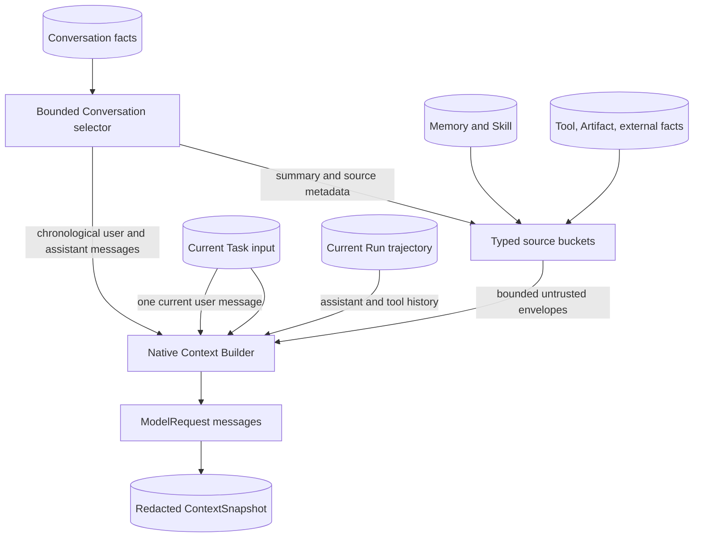
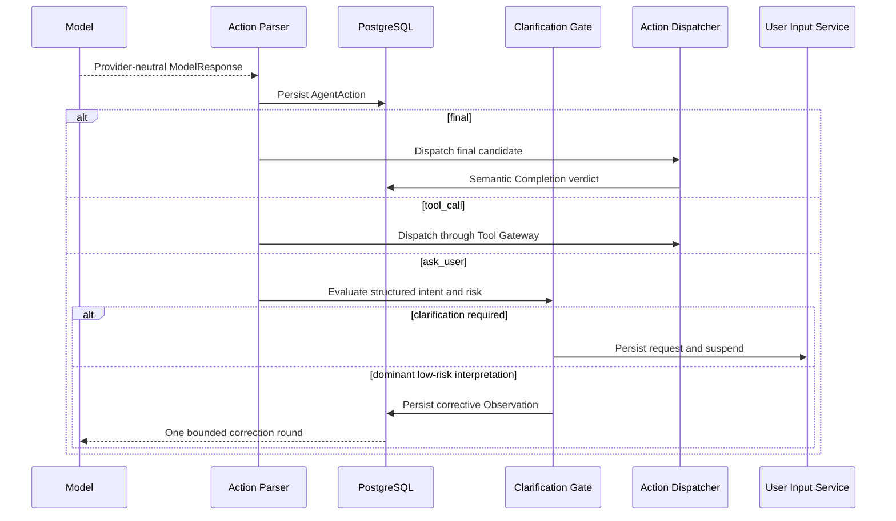
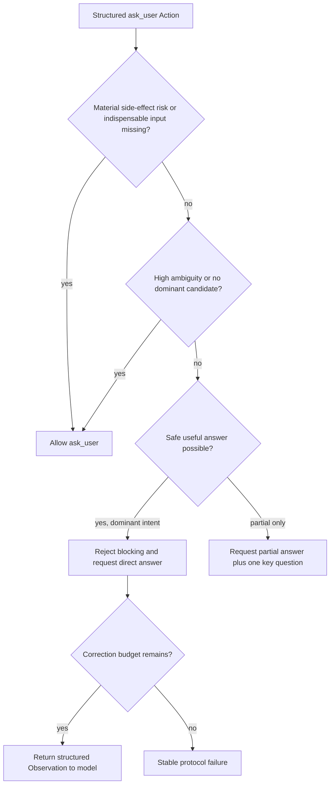

# Conversation Continuity and Clarification Runtime - Plan

## Goal Capsule

- **Objective:** Make Nico preserve conversational roles, infer dominant low-risk intent from incomplete wording, and distinguish a real final answer from a request for user input without rewriting the working Runtime.
- **Authority order:** The origin defines continuity and clarification behavior; this plan owns its focused Goal boundaries; `docs/plans/2026-07-23-001-refactor-agent-runtime-execution-hardening-plan.md` owns the general lifecycle, AgentAction, context, budget, recovery, and Completion Gate architecture; accepted ADRs and current code define the implementation baseline.
- **Execution profile:** One Goal invocation owns exactly one U-ID. It scans headings first, reads this capsule, the active unit, its cited R/F/AE/KTD entries, the Verification Contract, and the Definition of Done, then stops after evidence and handoff without reading or entering later units.
- **Progress authority:** Git history, `docs/progress/goal-status.md`, evidence under `artifacts/goals/conversation-continuity-<phase-code>/`, the latest phase handoff, and the parent Runtime Hardening handoff determine progress. This plan is not mutated to record completion.
- **Compatibility rule:** Existing Native Direct, ReAct, Plan-and-Execute, Web, Artifact, Delegation, Memory/Skill, Conversation queue, Tool Gateway, approval, Mock, and Hermes behavior must remain usable after every Goal.
- **Stop condition:** A Goal completes only after its focused behavior, tests, applicable migration proof, redacted evidence, documentation delta, progress update, and handoff are complete.
- **Blocked condition:** Stop instead of guessing when the active unit would change product scope, contradict an accepted ADR, advertise a handler before its lifecycle is complete, require unsafe migration renumbering, or weaken high-risk confirmation.
- **Tail ownership:** Every Goal removes abandoned scaffolding, records actual verification results, identifies the next dependency-ready unit, and leaves enough repository evidence to resume without the preceding chat context.

---

## Product Contract

### Summary

This companion plan covers the full continuity and clarification requirements while reusing the existing Runtime Hardening architecture.
It splits the work into independently verified Goals so message construction can be corrected before Action, waiting, clarification, completion, and evaluation capabilities are layered on.

### Problem Frame

The current Runtime stores complete Conversation facts, freezes selected context, and persists rendered model messages, but the model-facing representation loses conversational semantics.
`backend/src/nico_agent/conversations/context.py` serializes recent user/assistant turns inside `untrusted_context`; `backend/src/nico_agent/runtime/service.py` merges them into `ContextSeed.untrusted_context`; and `backend/src/nico_agent/runtime/native/context.py` renders the task plus all untrusted context inside one user envelope.
For a Conversation Turn, the same current message is also present inside `task_input` and the `task:input` seed, so incomplete wording can be repeated while the prior assistant answer is not represented as an assistant message.

The Native loop currently treats provider-neutral `tool_calls` as effects and any other non-empty text as a final result.
Runtime Hardening Goal A has reserved `waiting_for_user_input`, but no executable `ask_user` Action, Clarification Gate, or semantic final validation exists yet.
The reported response is therefore a product symptom of both context-shape loss and a protocol that cannot distinguish answering from asking.

The implementation must verify these preliminary findings through the real request path before changing behavior.
It must preserve the existing security rule that user, conversation, memory, file, Web, and Tool content cannot grant authority even when a message retains its standard role.

### Requirements

#### Audit and conversation fidelity

- R1. The first Goal must capture the actual redacted model request for the reported Conversation path and classify confirmed root causes, possible secondary factors, non-causes, modules to change, and reusable modules. (see origin: `docs/brainstorms/2026-07-23-conversation-continuity-clarification-requirements.md`)
- R2. Recent completed Conversation Turns must reach Native model requests as chronological `user` and `assistant` messages rather than as serialized turn JSON inside the same external-data envelope.
- R3. The current user input must have one primary model-message location; audit copies may remain in PostgreSQL and snapshots but must not repeat the full text in rendered prompt content.
- R4. Conversation messages, working context, retrieved Memory/Skill, Tool observations, Artifact references, and external untrusted data must remain distinguishable sources in the rendered snapshot.
- R5. Message role and content trust are independent: preserving `user` or `assistant` role must never allow message content to override platform policy, authorization, risk, budgets, or Tool Gateway checks.

#### Intent and prompt policy

- R6. Stable Native system guidance must tell the model to use recent Conversation context when input contains typos, mixed language, truncation, omitted subjects or objects, or context-dependent references.
- R7. A dominant low-risk and reversible interpretation must be answered directly, with a brief assumption statement when useful; incomplete syntax alone must not force clarification.
- R8. Multiple similarly plausible interpretations, missing indispensable parameters, or materially different answers may produce a clarification request.
- R9. Delete, write, payment, fund, permission, security, external-send, or other material side effects must require confirmation when the target or intent is not explicit.
- R10. When safe useful content can be supplied before a decision is required, the model should answer that portion and ask only the one blocking question.

#### Provider-neutral Agent Action and user input

- R11. Native model responses must normalize into provider-neutral `final`, `tool_call`, and `ask_user` AgentActions before dispatch; Provider wire fields must not enter policy or Work Loop decisions.
- R12. `ask_user` must carry a bounded question, reason, candidate intents, ambiguity, risk, missing information, and the interpreted-intent confidence data needed by deterministic policy.
- R13. Final Actions must carry intent-resolution and completion metadata sufficient to distinguish an answer from output whose purpose is to wait for the user.
- R14. AgentAction parsing and dispatch must not classify natural-language output through locale-specific phrases or keyword matching.
- R15. An allowed `ask_user` must persist one durable UserInputRequest, enter `waiting_for_user_input`, release the Worker lease, accept one revision-guarded answer, wake once, and return the answer as untrusted Observation data.

#### Clarification and completion policy

- R16. Every proposed `ask_user` must pass a deterministic Clarification Gate that considers candidate dominance, ambiguity, missing mandatory information, authoritative Tool/action risk, and whether a safe partial answer is possible.
- R17. The Clarification Gate must reject unnecessary blocking when one candidate is dominant, risk is low, no indispensable parameter is missing, and recent Conversation context supplies the referent.
- R18. A rejected `ask_user` must return a structured corrective Observation to the model; Runtime policy must not synthesize the business answer itself.
- R19. Clarification correction and semantic-final correction must be bounded, budgeted, persisted, and incapable of forming an infinite model loop.
- R20. A Final Action with `answeredUserIntent=false` and `requiresUserResponse=true` must not complete the Run; it must enter structured correction or a valid `ask_user` path.

#### Verification and staged delivery

- R21. The reported timestamp conversation, low-risk omissions, pronoun continuation, minor typos, genuine ambiguity, and ambiguous high-risk deletion must have automated regression coverage.
- R22. Tests must assert the final rendered messages, Action type, waiting state, correction count, and completion result rather than relying only on answer text.
- R23. A reusable provider-neutral continuity evaluation set must record direct-answer rate, unnecessary-clarification rate, wrong-intent rate, unsafe high-risk action rate, extra model calls, Token delta, and latency delta.
- R24. Every Goal invocation must implement one dependency-ready U-ID, run its focused and regression gates, record actual results, update the external progress ledger, write a handoff, and stop before the next unit.

### Key Flows

- F1. Redacted request audit
  - **Trigger:** Goal A replays the reported Conversation through the real preparation and Native request path.
  - **Actors:** Conversation service, Runtime preparation, Context selector, Native context builder, fake/capture Model Provider.
  - **Steps:** Persist prior and current Turns; capture the final `ModelRequest.messages`; redact content outside the bounded fixture; compare sources, roles, duplication, and completion behavior with persisted facts.
  - **Outcome:** The audit records verified causes and reusable seams before production behavior changes.
  - **Covered by:** R1, R21-R22.

- F2. Role-preserving context construction
  - **Trigger:** A new Conversation Turn is prepared for Native execution.
  - **Actors:** Conversation selector, Runtime service, Context builder, ContextSnapshot persistence.
  - **Steps:** Select bounded summary and recent Turns; keep external context in typed untrusted sources; render prior `user`/`assistant` messages; render the current user message once; append only current-Run trajectory after it.
  - **Outcome:** The model sees a standard conversational sequence while the snapshot retains source, trust, truncation, and hash evidence.
  - **Covered by:** R2-R5.

- F3. Dominant low-risk interpretation
  - **Trigger:** The current input is incomplete but recent Conversation context makes one interpretation dominant.
  - **Actors:** Model, Action Parser, Clarification Gate, Action Dispatcher.
  - **Steps:** The model resolves candidates and risk; it emits `final` directly or proposes `ask_user`; the Gate rejects unnecessary blocking; one corrective round produces a direct answer with an optional assumption statement.
  - **Outcome:** The Run completes without entering `waiting_for_user_input`.
  - **Covered by:** R6-R10, R11-R14, R16-R20.

- F4. Necessary clarification
  - **Trigger:** Interpretations are similarly plausible, a required parameter is absent, or the unresolved target carries material side-effect risk.
  - **Actors:** Clarification Gate, UserInput service, API/CLI user, Worker.
  - **Steps:** The Gate allows `ask_user`; the request and checkpoint persist; the lease is released; one valid answer is stored and wakes the Run; the answer becomes an untrusted Observation for the next model round.
  - **Outcome:** The Run resumes once from `waiting_for_user_input` without losing or duplicating the question.
  - **Covered by:** R8-R9, R11-R12, R15-R19.

- F5. Semantic-final correction
  - **Trigger:** The model labels a response as `final` while structured completion metadata says the intent was not answered and a user response is required.
  - **Actors:** Action Parser, Completion Gate, model correction loop.
  - **Steps:** Persist the candidate; reject completion with structured feedback; allow one budgeted correction; commit a valid final, dispatch a valid `ask_user`, or terminate with a stable protocol failure.
  - **Outcome:** A natural-language clarification cannot masquerade as an authoritative final answer.
  - **Covered by:** R13-R14, R19-R20.

### Acceptance Examples

- AE1. **Given** the prior assistant said the date came from a platform timestamp, **when** the user writes `你平台是怎么提供de`, **then** the Run answers how the platform supplies the timestamp, may state that interpretation briefly, and does not enter `waiting_for_user_input`. Covers R2-R8, R16-R22 and F2-F3.
- AE2. **Given** two database options were introduced and the second is SQLite, **when** the user asks `第二种呢`, **then** the Agent answers about SQLite without asking the user to restate the object. Covers R2, R6-R8 and F3.
- AE3. **Given** Docker and containerd were compared, **when** the user asks `那个更适合 Mac`, **then** the Agent uses the comparison context, answers the likely comparison, and states an assumption only if needed. Covers R2, R6-R8 and F3.
- AE4. **Given** the user writes `kubernetes 怎么重启 depoly`, **when** no competing referent exists, **then** the Agent interprets `depoly` as deployment and answers directly. Covers R6-R8 and F3.
- AE5. **Given** several equally plausible objects exist, **when** the user says `帮我处理一下那个`, **then** the Runtime accepts a structured `ask_user` and enters `waiting_for_user_input`. Covers R8, R11-R12, R15-R16 and F4.
- AE6. **Given** file, database, and Run objects are all plausible, **when** the user says `把刚才那个删了`, **then** the Runtime requires the exact target and performs no delete before confirmation. Covers R9, R15-R16 and F4.
- AE7. **Given** one second item is more plausible but uncertainty remains low-risk, **when** the user asks `刚才第二个怎么配`, **then** the Agent answers the likely item and briefly states its interpretation instead of blocking. Covers R7-R8, R16-R18 and F3.
- AE8. **Given** the model proposes an unnecessary `ask_user` for the timestamp case, **when** the Clarification Gate evaluates it, **then** the Gate persists rejection, returns one corrective Observation, and the next Action is a direct final. Covers R16-R19 and F3.
- AE9. **Given** the model repeats the rejected `ask_user` or invalid Final after its correction budget is exhausted, **when** the loop evaluates it again, **then** the Run terminates with a stable error and makes no further model call. Covers R19 and F3-F5.
- AE10. **Given** a Conversation contains prior Turns, current input, Memory, a Tool observation, and external data, **when** the request is rendered, **then** prior Turns retain roles, current input occurs once, and every non-conversation source remains distinguishable and untrusted. Covers R2-R5, R22 and F2.
- AE11. **Given** the continuity evaluation set is run against a configured DeepSeek endpoint or another provider, **when** results are recorded, **then** metrics and redacted case outcomes are comparable without provider-specific Runtime policy or invented credentialed claims. Covers R23-R24.

### Success Criteria

- The reported timestamp case completes with an answer to the dominant intent and no unnecessary user-input wait.
- Final model messages preserve recent Conversation roles and contain the current user text once.
- Runtime policy distinguishes `final`, `tool_call`, and `ask_user` structurally across supported Native model adapters.
- High-risk ambiguous actions cannot execute before explicit target confirmation.
- Clarification and semantic-final corrections are bounded, observable, and restart-safe.
- Existing Runtime, Tool, Conversation, Web, Artifact, Delegation, Memory/Skill, CLI, Mock, and Hermes regressions remain green after each Goal.
- A future Goal session can resume from one active U-ID, evidence directory, and handoff without reading the full origin or earlier conversation.

### Scope Boundaries

#### Included

- Native Runtime Conversation message construction, continuity Prompt policy, provider-neutral Action metadata, durable user input, Clarification Gate, focused Completion Gate semantics, tests, evaluation fixtures, metrics, evidence, and operational handoffs.
- The minimum focused slices of parent RH-B1, RH-B2, RH-C, RH-G, and RH-H needed to deliver the behavior.

#### Deferred to Follow-Up Work

- The parent plan's full priority Context Engine, centralized Budget Manager, Tool outcome taxonomy, approval argument revisions, Plan update Action, full obligation-aware Completion Gate, crash matrix, and operational closure remain owned by their parent U-IDs.
- A separate lightweight Intent Resolver model call remains deferred unless the evaluation set shows the single-call Action metadata and deterministic Gate are insufficient.
- Threshold calibration beyond the initial policy defaults remains evaluation-driven follow-up rather than an unbounded tuning exercise inside an implementation Goal.

#### Explicit Non-Goals

- Rewriting the Work Loop, Model Gateway, Tool Gateway, Conversation service, Runtime Provider v2, or existing approval and delegation lifecycles.
- Treating every incomplete input as answerable or treating every incomplete input as a mandatory clarification.
- Detecting questions through phrases such as `请补充`, `你是想问`, or equivalent keyword lists.
- Hard-coding the timestamp example's answer or having Runtime policy generate domain answers.
- Adding an extra intent-model call to every request.
- Claiming the parent RH-G or RH-H units complete from the focused context and semantic-final slices in this plan.

---

## Planning Contract

### Current-State Grounding

| Area | Verified planning baseline | Disposition |
| --- | --- | --- |
| Conversation facts | `ConversationTurn` stores the original user input and assistant output; ADR-0013 requires bounded summary plus recent Turns. | Preserve authoritative rows and bounded selection. |
| Context selection | `select_conversation_context` returns summary, recent turns, and Artifact references inside `untrusted_context`. | Split recent Conversation messages from external/source envelopes. |
| Current input | Conversation task creation stores the message in `Task.input`; Runtime preparation also injects full `task:input`, and Native context serializes both task input and the seed. | Render the current text once while retaining audit references. |
| Native messages | `build_native_context` and `build_phase_context` emit system plus a user JSON envelope; loop trajectory history is appended afterward. | Preserve trajectory order but insert standard Conversation roles and current user before current-Run trajectory. |
| Final detection | Direct and ReAct branches accept non-empty text with no Tool call as final. | Migrate through AgentAction and semantic completion metadata. |
| User-input lifecycle | Goal A reserved `waiting_for_user_input`; no UserInputRequest handler is advertised. | Reuse lifecycle authority and approval-style suspend/wake patterns. |
| Provider abstraction | OpenAI-compatible, Anthropic, and Gemini adapters already normalize wire responses to `ModelResponse`. | Parse AgentAction above Model Gateway; keep vendor fields out of Runtime policy. |
| Parent plan | RH-B1/B2/C/G/H already define general Action, dispatch, user input, context, and completion architecture. | Use the mapping below and do not create a competing architecture. |

These findings orient the plan but do not replace U1's executable audit of the actual request.
Product Contract preservation: origin meaning unchanged; the companion plan narrows execution units without reducing scope.

### Key Technical Decisions

- KTD1. **Use a focused companion plan with explicit parent-unit mapping.** This plan is the Goal-mode entry point for continuity behavior; the parent plan remains authoritative for general Runtime architecture. (session-settled: user-directed — chosen over expanding the already large parent plan or creating an unrelated standalone plan: a companion keeps each Goal readable without creating a second architecture.) Governs R24.
- KTD2. **One U-ID is one Goal invocation and landing boundary.** Even when the next dependency is ready, the executor records evidence and handoff and stops so context compression cannot blend phases. Governs R24.
- KTD3. **Audit through the executable request path before behavior changes.** U1 adds a redacted capture harness and records observed messages, not conclusions inferred only from file names or design docs. Governs R1, R21-R22.
- KTD4. **Represent role, source, and trust as separate dimensions.** Recent Turn payloads become typed Conversation messages, while summary, Memory/Skill, Tool, Artifact, and external content stay typed source segments; neither shape grants authority. Governs R2, R4-R5.
- KTD5. **Place the current user message once and last within conversational input.** Non-conversation context precedes selected Turn history, the current `user` message follows that history, and current-Run assistant/tool trajectory follows only when the loop has already produced it. Governs R2-R4.
- KTD6. **Extend the parent AgentAction migration rather than introducing a clarification-only protocol.** U4-U6 split RH-B1/B2 into smaller contract, persistence, and compatibility-dispatch Goals; parent RH-B1 is satisfied only after U4-U5 and RH-B2 only after U6. Governs R11-R14.
- KTD7. **Use structured metadata and authoritative risk facts for Clarification policy.** Initial deterministic defaults reject blocking only when risk is low, no indispensable information is missing, the top candidate confidence is at least 0.75, and its margin over the next candidate is at least 0.25; high ambiguity, material Tool/action risk, or absent required parameters allows `ask_user`. Thresholds are versioned policy, not language heuristics. Governs R12, R14, R16-R17.
- KTD8. **Allow one correction per rejected clarification and one per invalid semantic final.** Both consume the existing model-call/iteration budgets, persist their source Action and Observation, and terminate with a stable protocol failure after exhaustion. Runtime never fabricates the missing business answer. Governs R18-R20.
- KTD9. **Deliver Prompt policy before Action enforcement but advertise only executable actions.** U3 can improve low-risk interpretation immediately; U4 defines all Action variants without changing the live response contract; U6 may activate a final-only envelope in shadow mode; and `ask_user` is added to the live Action Schema only in U9, after U7-U8 have completed persistence, wait, answer, wake, and user interaction and the Clarification Gate can evaluate every proposed request. Governs R6-R12, R15-R18.
- KTD10. **Keep an always-on secondary Intent Resolver out of the first delivery.** The primary model emits intent metadata in the same call; the evaluation Goal decides whether a targeted resolver for suspected incomplete input merits a later plan. Governs R6-R8, R23.
- KTD11. **Bootstrap, but do not overclaim, the shared Completion Gate.** U10 implements the semantic floor for answered intent and required user response; the parent RH-H unit later extends the same gate with Plan, Tool, approval, Artifact, budget, and other database obligations. Governs R13, R19-R20.
- KTD12. **Reuse durable approval and lifecycle patterns for user input without conflating the domains.** UserInputRequest has its own contract and storage, but follows the proven persist/checkpoint/suspend/release/answer/wake discipline. Governs R15.
- KTD13. **Allocate migrations from the live head and never reuse stale parent numbers.** The current head is `20260723_0029`; the planned Action and UserInput migrations are `20260723_0030` and `20260723_0031` unless an earlier Goal finds the head has advanced, in which case it selects the next linear revisions and records the deviation in its handoff. Governs R11, R15, R24.
- KTD14. **Separate hermetic protocol proof from credentialed provider quality.** Fake-provider and PostgreSQL tests can make a unit Verified; DeepSeek or other external inference results are recorded separately and never fabricated when credentials are absent. Governs R23-R24.
- KTD15. **Use one capability-filtered, provider-neutral JSON Action envelope for non-Tool responses.** The live Schema contains only Actions whose complete dispatcher path is enabled: `final` can enter shadow mode in U6, while `ask_user` is added atomically with the Clarification Gate in U9. Native requests pass that same active Schema through `response_format` when the endpoint supports it and require the equivalent JSON text contract through Prompt guidance otherwise; ordinary provider Tool calls continue to normalize as `tool_call`. Plain-text final remains a compatibility input through U9, and U10 enables strict enforcement for Native Direct/ReAct/Plan only after correction and failure behavior are complete. Governs R11-R14, R16-R20.

### Parent Plan Mapping

| Parent unit | Companion owner | Completion rule |
| --- | --- | --- |
| RH-B1 / parent U2 Agent Action facts | U4, U5 | Parent unit is complete only after both companion units pass their own evidence gates. |
| RH-B2 / parent U10 compatibility dispatch | U6 | Parent unit is complete when U6 passes without Native or non-Native provider regression. |
| RH-C / parent U3 durable user input | U7, U8 | Parent unit is complete only after backend lifecycle and API/CLI interaction both pass. |
| RH-G / parent U7 Context Engine | U2, U3 are a focused prerequisite slice | Parent unit remains open; its later priority, Token, compression, reference, and migration scope must preserve these continuity tests. |
| RH-H / parent U8 Completion Gate | U10 is a focused semantic floor | Parent unit remains open until every deterministic obligation and recovery condition in the parent plan is implemented. |

### High-Level Technical Design

#### Context source and message order

The authoritative conversation rows and external facts remain unchanged.
The rendered order is platform system constraints, bounded non-conversation source envelopes, selected Conversation role messages, the current user message, then any current-Run trajectory required for a later model round.

#### Agent Action and clarification sequence

#### Clarification policy

#### Goal dependency chain

```mermaid
flowchart LR
    A[CC-A Audit] --> B[CC-B Message fidelity]
    B --> C[CC-C Prompt policy]
    C --> D[CC-D Action contract]
    D --> E[CC-E Action persistence]
    E --> F[CC-F Compatibility dispatch]
    F --> G[CC-G User input backend]
    G --> H[CC-H API and CLI]
    H --> I[CC-I Clarification Gate]
    I --> J[CC-J Completion semantics]
    J --> K[CC-K Evaluation and closure]
```

### Risks and Mitigations

| Risk | Impact | Mitigation |
| --- | --- | --- |
| Companion and parent plans drift | Two conflicting execution authorities | Use KTD1 and the explicit mapping; update both progress projections only at mapped completion boundaries. |
| Standard roles are mistaken for trusted content | Prompt injection gains perceived authority | Keep trust/source metadata separate and retain system/Tool Gateway authority tests. |
| Current input remains duplicated in a less obvious envelope | Truncation is still overemphasized | Assert normalized content occurrence across final rendered messages, not only top-level field count. |
| Assistant output cannot be normalized safely | Conversation history becomes malformed | Define bounded text extraction and explicit unsupported-content fallback in U2; preserve original row and hash. |
| Provider action capabilities differ | One provider bypasses `ask_user` or final metadata | Normalize above `ModelResponse`, test all adapters with equivalent fixtures, and advertise only supported executable action contracts. |
| Model confidence is poorly calibrated | Gate rejects a necessary clarification | Apply deterministic risk and missing-information overrides, version thresholds, record decisions, and calibrate from U11 metrics. |
| Gate correction loops increase cost | Latency and Token use grow without better answers | Use KTD8's per-gate cap and existing budget accounting; terminate deterministically after exhaustion. |
| Early semantic Completion Gate is mistaken for full RH-H | Unfinished obligations can still pass | Name and test the focused semantic floor; keep parent RH-H explicitly open in progress and documentation. |
| Waiting lifecycle races with answer or cancellation | Lost wake-up or resurrected Run | Reuse lifecycle authority, revision guards, idempotency, Run locks, and approval race tests. |
| Credentialed DeepSeek proof is unavailable | Quality claims exceed evidence | Keep hermetic verification authoritative and record credentialed evaluation as an honest external gap. |

### System-Wide Impact

- **Database and recovery:** AgentAction and UserInputRequest add durable facts and new resume boundaries. Their migrations, idempotency, RLS, retention, and crash behavior must align with the parent lifecycle and action contracts.
- **Model adapters:** Providers keep their existing wire parsers. Native Action semantics consume normalized `ModelResponse`, with `response_format` used only as an optional enforcement aid rather than a provider-specific policy branch.
- **API and CLI:** A new Agent-question interrupt must remain distinct from queued Conversation Turns and Tool approvals. Final Action buffering may delay authoritative answer display, so progress events must remain truthful without exposing an unvalidated JSON candidate.
- **Security and privacy:** Role fidelity increases semantic influence but never authority. Candidate intents, questions, answers, external context, and evaluation records require bounded redaction and tenant isolation.
- **Observability:** Operators need Action type, Gate decision, correction relation, waiting duration, model-call count, Token usage, and stable failure reason without raw prompt or protected answer content.
- **Performance:** Normal requests stay single-call. Only rejected clarification or semantic-final candidates add a bounded correction call, and U11 measures the resulting latency and Token deltas.
- **Compatibility:** Legacy plain-text final responses remain supported until U10 enables the strict envelope for Native Direct/ReAct/Plan execution. The active Action Schema never advertises `ask_user` before U9 installs its deterministic Gate. Mock and Hermes remain outside Native Action semantics, and parent RH-G/H retain their broader compatibility obligations.

### Operational and Handoff Contract

Each Goal writes:

- a timestamped evidence directory under `artifacts/goals/conversation-continuity-<phase-code>/`;
- a manifest containing commit, migration head, focused tests, regressions, redaction checks, and unresolved limitations;
- a handoff under `docs/handoffs/` naming delivered behavior, changed contracts, actual results, remaining risks, parent-unit projection, and next dependency-ready U-ID;
- one `docs/progress/goal-status.md` update using the existing status vocabulary;
- documentation claims limited to behavior verified in that Goal.

Schema Goals record predecessor and new revision, additive defaults, RLS and composite-key checks, upgrade/reapply proof, mixed-version behavior, and code-rollback boundaries.
Every verifier rejects missing evidence, a dirty unaccounted-for diff, leaked credentials, entry into the next unit, and claims unsupported by recorded commands.

---

## Implementation Units

| U-ID | Goal | Primary files | Depends on |
| --- | --- | --- | --- |
| U1 | CC-A executable audit | Conversation/context/runtime capture tests and audit doc | RH-A verified |
| U2 | CC-B message fidelity | Conversation selector, Runtime contracts/service, Native context | U1 |
| U3 | CC-C continuity Prompt policy | Native prompt/context modules | U2 |
| U4 | CC-D AgentAction contract and parser | Runtime Action DTOs and parser | U3 |
| U5 | CC-E durable Action facts | Domain models, Runtime persistence, migration | U4 |
| U6 | CC-F compatibility dispatch | Native loop, checkpoint, dispatcher | U5 |
| U7 | CC-G durable user-input backend | UserInput service, lifecycle integration, migration | U6 |
| U8 | CC-H user-input API and CLI | API, CLI client/session/renderers, E2E | U7 |
| U9 | CC-I Clarification Gate | Clarification policy, dispatcher, correction loop | U8 |
| U10 | CC-J semantic Completion Gate | Completion Gate, Native modes, persistence | U9 |
| U11 | CC-K evaluation and closure | Evaluation fixture/harness, verification, docs | U10 |

### U1. CC-A - executable model-request audit

- **Goal:** Capture the real reported Conversation request and publish an evidence-backed root-cause audit without changing Runtime behavior.
- **Requirements:** R1, R21-R22, R24; F1; KTD2-KTD3.
- **Dependencies:** Parent RH-A is Verified; use `docs/handoffs/2026-07-23-runtime-hardening-goal-a-handoff.md` as the lifecycle baseline.
- **Files:** Create `docs/audits/2026-07-23-conversation-continuity-runtime-audit.md`, `backend/tests/unit/test_conversation_model_messages.py`, `backend/tests/integration/test_conversation_model_request_audit.py`, `scripts/verify-conversation-continuity-goal-a.sh`, and `docs/handoffs/2026-07-23-conversation-continuity-goal-a-handoff.md`; modify `docs/progress/goal-status.md`.
- **Approach:**
  1. Drive prior user/assistant Turn plus current incomplete input through Conversation creation, context selection, Runtime preparation, Native context construction, and a capture Model Provider.
  2. Record only redacted roles, sources, hashes, bounded fixture content, and occurrence counts; never persist credentials or unrelated user data.
  3. Classify confirmed causes, secondary factors, non-causes, modules to change, and reusable patterns, including the exact final/no-Tool completion branch.
  4. Leave all production modules unchanged in this Goal.
- **Execution note:** Treat the capture test and persisted snapshot as evidence; do not promote the preliminary planning observations to final audit conclusions without reproducing them.
- **Patterns to follow:** `backend/tests/unit/test_native_direct_runtime.py`, `backend/tests/integration/test_native_runtime_persistence.py`, `ContextSnapshot.rendered_messages`, and existing fake Model Provider request capture.
- **Test scenarios:**
  1. The timestamp fixture captures the final ordered messages and identifies whether prior Turns retain their roles.
  2. The current input occurrence count covers nested JSON and normalized text, not only exact top-level message equality.
  3. Conversation, Memory/Skill, Tool, and external source labels remain visible in the redacted projection.
  4. A non-empty clarification-like text response with no Tool call follows the current final path and never enters a user-input wait.
  5. The audit output contains no credential reference value, API key, Token, unrelated personal data, or unbounded prompt body.
- **Verification:** The focused audit unit test and PostgreSQL request-path integration test, docs validation, Secret scan, evidence manifest, progress row, and handoff pass; U1 stops without editing production Runtime code.

### U2. CC-B - role-preserving Conversation messages and input deduplication

- **Goal:** Render bounded prior Turns as standard role messages and the current user input once while retaining source and trust auditability.
- **Requirements:** R2-R5, R21-R22, R24; F2; AE1-AE3, AE10; KTD2, KTD4-KTD5.
- **Dependencies:** U1.
- **Files:** Modify `backend/src/nico_agent/conversations/contracts.py`, `backend/src/nico_agent/conversations/context.py`, `backend/src/nico_agent/runtime/contracts.py`, `backend/src/nico_agent/runtime/service.py`, `backend/src/nico_agent/runtime/native/context.py`, `backend/tests/unit/test_conversation_context.py`, `backend/tests/unit/test_runtime_preparation.py`, `backend/tests/unit/test_conversation_model_messages.py`, `backend/tests/integration/test_native_runtime_persistence.py`, `docs/runtime.md`, and `docs/progress/goal-status.md`; create `scripts/verify-conversation-continuity-goal-b.sh` and `docs/handoffs/2026-07-23-conversation-continuity-goal-b-handoff.md`.
- **Approach:**
  1. Add a typed bounded Conversation-message projection with role, content, source reference, and separate trust/source metadata.
  2. Keep Conversation summary and Artifact references in typed untrusted source buckets; do not promote them to historical assistant/user messages.
  3. For Conversation tasks, render `Task.input.message` as the sole current `user` content and exclude its duplicate full text from the non-conversation envelope while retaining task/reference metadata.
  4. Preserve chronological prior messages before the current user and preserve current-Run assistant/tool trajectory after it on later rounds.
  5. Version snapshot metadata and keep recovery deterministic for already frozen contexts.
- **Execution note:** Start by changing the U1 capture assertions to the desired contract, then make the smallest production change that passes them.
- **Patterns to follow:** ADR-0013, `_select_recent_turns`, `ContextSeed`, `ModelMessage`, deterministic content hashing, and snapshot replay checks.
- **Test scenarios:**
  1. Covers AE10. Two prior Turns render as user, assistant, user, assistant in chronological order before the current user.
  2. Covers AE1. The exact current incomplete text appears once across normalized rendered message content.
  3. A non-Conversation task still receives one usable user message without requiring Conversation metadata.
  4. Conversation summary, Memory/Skill, Artifact reference, Tool observation, and external data remain labeled sources and do not impersonate Conversation roles.
  5. An assistant output with structured content is bounded and normalized deterministically while the original persisted output remains unchanged.
  6. Equivalent facts produce the same content hash; recovery reuses the frozen snapshot rather than rebuilding with a changed selector.
  7. Prompt-injection text in a prior user or assistant message cannot widen Tool grants, approval mode, risk, or budgets.
- **Verification:** Focused context/message unit tests, PostgreSQL snapshot integration, existing Conversation/Memory/Skill/Native mode regressions, docs, evidence, and handoff pass before U2 stops.

### U3. CC-C - incomplete-input and continuity Prompt policy

- **Goal:** Add stable model guidance that answers dominant low-risk intent and reserves clarification for genuine ambiguity, indispensable missing data, or material risk.
- **Requirements:** R6-R10, R21-R22, R24; F3-F4; AE1-AE7; KTD2, KTD7, KTD9-KTD10.
- **Dependencies:** U2.
- **Files:** Modify `backend/src/nico_agent/runtime/native/context.py`, `backend/tests/unit/test_runtime_preparation.py`, `backend/tests/unit/test_native_direct_runtime.py`, `backend/tests/unit/test_native_react_loop.py`, `backend/tests/unit/test_native_plan_loop.py`, `docs/runtime.md`, and `docs/progress/goal-status.md`; create `backend/src/nico_agent/runtime/native/prompts.py`, `backend/tests/unit/test_native_continuity_prompt.py`, `scripts/verify-conversation-continuity-goal-c.sh`, and `docs/handoffs/2026-07-23-conversation-continuity-goal-c-handoff.md`.
- **Approach:**
  1. Centralize the continuity rule in the stable Native system guidance shared by Direct, ReAct, and Plan phases.
  2. State the dominant-low-risk, partial-answer, genuine-ambiguity, indispensable-parameter, and high-risk confirmation rules from R6-R10 without embedding the timestamp answer.
  3. Keep authorization and risk authority in Runtime and Tool Gateway; Prompt text guides model behavior but never overrides deterministic gates.
  4. Do not advertise `ask_user` as executable until U9 can enable it together with the completed U7-U8 lifecycle and the deterministic Clarification Gate.
- **Patterns to follow:** Existing run-time and approval-policy system instructions in `backend/src/nico_agent/runtime/native/context.py`.
- **Test scenarios:**
  1. Direct, ReAct, planner, plan-step, reflection, and correction contexts contain the same continuity policy exactly once.
  2. The policy distinguishes incomplete form from ambiguous intent and explicitly prefers direct low-risk answers.
  3. The policy requires confirmation for ambiguous destructive or externally visible side effects.
  4. The policy permits a brief assumption statement and safe partial answer but forbids long low-probability option lists when one intent dominates.
  5. No system instruction contains hard-coded timestamp-case content, language-specific clarification detection, or permission-widening text.
- **Verification:** Prompt contract tests plus existing Native Direct/ReAct/Plan tests, full unit regression, docs, evidence, and handoff pass; credentialed behavior remains U11 evidence rather than a U3 claim.

### U4. CC-D - provider-neutral AgentAction contract and parser

- **Goal:** Define and parse `final`, `tool_call`, and `ask_user` Actions in memory without moving effect handlers or changing persistence yet.
- **Requirements:** R11-R14, R19-R22, R24; F3-F5; AE5-AE10; KTD2, KTD6-KTD9.
- **Dependencies:** U3.
- **Files:** Modify `backend/src/nico_agent/models/contracts.py`, `backend/src/nico_agent/runtime/contracts.py`, `backend/src/nico_agent/runtime/native/loop.py`, `backend/tests/unit/test_model_provider_adapters.py`, `backend/tests/unit/test_native_direct_runtime.py`, `backend/tests/unit/test_native_react_loop.py`, and `docs/progress/goal-status.md`; create `backend/src/nico_agent/runtime/actions.py`, `backend/src/nico_agent/runtime/native/action_parser.py`, `backend/tests/unit/test_agent_actions.py`, `scripts/verify-conversation-continuity-goal-d.sh`, and `docs/handoffs/2026-07-23-conversation-continuity-goal-d-handoff.md`.
- **Approach:**
  1. Define immutable Action DTOs with bounded intent-resolution and completion metadata while preserving existing Tool call identity and arguments.
  2. Parse provider Tool calls as ToolCallActions and non-Tool response text through KTD15's JSON Action envelope; adapter-specific response bodies remain inside model providers.
  3. Define capability-filtered Action Schema variants and characterize `response_format` support without attaching the Schema to live Native requests in this Goal.
  4. Convert legacy plain non-empty text into a compatibility FinalAction during the shadow migration window.
  5. Return stable structural errors for ambiguous final/effect mixtures, invalid metadata, unsupported action kinds, and duplicate call identities.
  6. Keep existing loop branches authoritative until U6.
- **Execution note:** This Goal ends at pure contracts/parser plus compatibility characterization; it must not add tables, dispatch `ask_user`, or claim parent RH-B1 complete.
- **Patterns to follow:** `ModelResponse`, `ModelToolCall`, `_pending_actions`, Pydantic frozen DTOs, and provider adapter equivalence tests.
- **Test scenarios:**
  1. Equivalent OpenAI-compatible, Anthropic, and Gemini final fixtures produce equivalent FinalActions.
  2. Equivalent Tool fixtures produce the same ordered ToolCallAction identities and arguments.
  3. A valid AskUserAction requires a question, reason, candidates, ambiguity, risk, and missing-information projection.
  4. Final completion metadata rejects contradictory combinations such as answered intent plus a required blocking response.
  5. Final plus effect, unknown type, duplicate call ID, malformed confidence, and oversized fields fail structurally without effects.
  6. Structured-output-capable and plain-JSON provider fixtures produce the same AgentAction.
  7. Clarification-like natural-language text is never classified by phrase or keyword.
  8. Existing Direct/ReAct/Plan/Web/Artifact/Delegation behavior remains unchanged because dispatch has not moved.
- **Verification:** Action/parser and adapter contract tests plus existing Native mode regressions, docs, evidence, and handoff pass before U4 stops.

### U5. CC-E - durable AgentAction facts and repair relations

- **Goal:** Persist complete immutable Action batches and bounded repair relations before dispatch while retaining current handler behavior.
- **Requirements:** R11-R14, R18-R20, R22, R24; F3-F5; AE8-AE10; KTD2, KTD6, KTD8, KTD13.
- **Dependencies:** U4.
- **Files:** Modify `backend/src/nico_agent/domain/models.py`, `backend/src/nico_agent/domain/states.py`, `backend/src/nico_agent/runtime/native/loop.py`, `backend/src/nico_agent/runtime/native/checkpoint.py`, `backend/src/nico_agent/runtime/service.py`, `backend/src/nico_agent/model_api.py`, `backend/tests/unit/test_agent_actions.py`, `docs/domain-model.md`, `docs/runtime.md`, and `docs/progress/goal-status.md`; create `backend/migrations/versions/20260723_0030_agent_actions.py`, `backend/tests/integration/test_agent_action_persistence.py`, `scripts/verify-conversation-continuity-goal-e.sh`, and `docs/handoffs/2026-07-23-conversation-continuity-goal-e-handoff.md`.
- **Approach:**
  1. Persist one immutable Action batch linked to the terminal ModelCall, RuntimeSession, RunStep, and ContextSnapshot before any Action effect.
  2. Store ordered Action identity, redacted intent, dispatch cursor, parse revision, outcome/Observation references, and repair/replay relation without duplicating authoritative Tool or user-input payloads.
  3. Commit either the complete batch or none; preserve redacted raw response ownership on ModelCall.
  4. Expose safe tenant-scoped read projections and enforce immutable intent fields, FORCE RLS, and same-tenant composite references.
  5. Keep dispatch in compatibility mode until U6.
- **Execution note:** Allocate the migration from the live head per KTD13 and update the planned filename plus all references together if `0030` is no longer available.
- **Patterns to follow:** ModelCall persistence, ToolCall identity, Runtime event projection, migration/RLS tests, and parent RH-B1.
- **Test scenarios:**
  1. Final, Tool, and AskUser Actions persist with the same deterministic identity on retry.
  2. A multi-action response commits all ordinals atomically or none when failure is injected.
  3. Crash after ModelCall terminal but before Action commit creates one repair relation without a partial batch or duplicate billing.
  4. Cross-tenant reads fail; intent and source linkage cannot be rewritten after commit.
  5. Public projections omit raw prompts, protected answer content, credentials, and unbounded arguments.
  6. The previous application safely ignores the additive tables and current application reads pre-migration Runs.
- **Verification:** Focused unit/PostgreSQL tests, migration upgrade/reapply and mixed-version proof, Native mode regressions, Secret scan, docs, evidence, and handoff pass; U5 may project parent RH-B1 complete only when U4 evidence is also valid.

### U6. CC-F - compatibility Action dispatch

- **Goal:** Move existing final, Tool, Artifact, and Delegation branches behind one dispatcher without changing observable behavior.
- **Requirements:** R11-R14, R19-R22, R24; F3-F5; AE8-AE10; KTD2, KTD6, KTD8-KTD9.
- **Dependencies:** U5.
- **Files:** Modify `backend/src/nico_agent/runtime/native/context.py`, `backend/src/nico_agent/runtime/native/prompts.py`, `backend/src/nico_agent/runtime/native/loop.py`, `backend/src/nico_agent/runtime/native/checkpoint.py`, `backend/src/nico_agent/runtime/service.py`, `backend/src/nico_agent/runtime/tools.py`, `backend/tests/unit/test_agent_actions.py`, `backend/tests/unit/test_native_continuity_prompt.py`, `backend/tests/unit/test_native_direct_runtime.py`, `backend/tests/unit/test_native_react_loop.py`, `backend/tests/unit/test_native_plan_loop.py`, `docs/runtime.md`, and `docs/progress/goal-status.md`; create `backend/src/nico_agent/runtime/native/action_dispatcher.py`, `backend/tests/unit/test_action_dispatcher.py`, `backend/tests/integration/test_agent_action_dispatch.py`, `scripts/verify-conversation-continuity-goal-f.sh`, and `docs/handoffs/2026-07-23-conversation-continuity-goal-f-handoff.md`.
- **Approach:**
  1. Dispatch only committed Actions and advance the persisted cursor after the authoritative domain outcome commits.
  2. Move final, Tool, Artifact, and Delegation compatibility paths one at a time while retaining their existing service authority.
  3. Resume at the first unresolved ordinal and never repeat a committed or uncertain effect.
  4. Activate the provider-neutral envelope only for `final` in shadow mode, preserving plain-text compatibility and keeping `ask_user` out of the live Schema.
  5. Recognize but reject an unadvertised `ask_user` returned outside the live contract until its complete handler and Gate are enabled.
  6. Retain current budget behavior; centralized budget ownership remains in the parent plan.
- **Patterns to follow:** Current Native loop handlers, Tool Gateway, Coordination/Artifact handlers, checkpoint replay, and parent RH-B2.
- **Test scenarios:**
  1. Direct final and ReAct/Plan Tool paths produce unchanged outputs and durable dispatch outcomes.
  2. Web citation, Artifact storage, and Delegation resume remain compatible through the dispatcher.
  3. A crash after ordinal N resumes at the first unresolved ordinal without repeating prior effects.
  4. A terminal or unknown outcome prevents later ordinal dispatch.
  5. The live Action Schema exposes `final` but not `ask_user`; an out-of-contract AskUserAction fails structurally and does not enter `waiting_for_user_input`.
  6. Structured final and legacy plain-text final produce the same authoritative content during shadow mode.
  7. Mock and Hermes Provider v2 behavior remains outside Native AgentAction parsing and dispatch.
- **Verification:** Dispatcher unit/PostgreSQL tests, Native Direct/ReAct/Plan/Web/Artifact/Delegation and non-Native provider regressions, docs, evidence, and handoff pass; U6 may project parent RH-B2 complete.

### U7. CC-G - durable UserInputRequest backend

- **Goal:** Implement the persistent `ask_user` suspend, answer, wake, and resume backend without adding CLI interaction yet.
- **Requirements:** R11-R12, R15-R19, R21-R22, R24; F4; AE5-AE6, AE8-AE9; KTD2, KTD7-KTD9, KTD12-KTD13.
- **Dependencies:** U6.
- **Files:** Modify `backend/src/nico_agent/runtime/native/action_dispatcher.py`, `backend/src/nico_agent/runtime/native/checkpoint.py`, `backend/src/nico_agent/runtime/service.py`, `backend/src/nico_agent/runtime/executor.py`, `backend/src/nico_agent/domain/models.py`, `backend/src/nico_agent/domain/states.py`, `backend/tests/unit/test_runtime_lifecycle.py`, `backend/tests/integration/test_runtime_lifecycle.py`, `docs/runtime.md`, `docs/state-machines.md`, and `docs/progress/goal-status.md`; create `backend/src/nico_agent/user_inputs/__init__.py`, `backend/src/nico_agent/user_inputs/contracts.py`, `backend/src/nico_agent/user_inputs/service.py`, `backend/migrations/versions/20260723_0031_user_input_requests.py`, `backend/tests/unit/test_user_input_requests.py`, `backend/tests/integration/test_user_input_runtime.py`, `scripts/verify-conversation-continuity-goal-g.sh`, and `docs/handoffs/2026-07-23-conversation-continuity-goal-g-handoff.md`.
- **Approach:**
  1. Persist one active request per Run/Action boundary with bounded question, reason, input schema, expiry, status, redacted projection, protected answer payload/reference, hash, revision, and wake identity.
  2. Save the pre-action checkpoint, transition through lifecycle authority to `waiting_for_user_input`, release the lease, and make the handler capability-ready without adding `ask_user` to the live model Schema before U9.
  3. Validate an answer under the Run lock, commit it once, append an untrusted Observation, and wake the Run through an idempotent port.
  4. Resolve answer, expiry, cancellation, duplicate submission, and wake-reconciliation races without resurrecting a terminal Run.
  5. Keep UserInputRequest distinct from ConversationTurn and ToolApprovalRequest.
- **Execution note:** Allocate the migration from the live head per KTD13; do not edit applied migrations or reuse a revision taken by another Goal.
- **Patterns to follow:** Runtime lifecycle authority, ToolApprovalRequest service, approval suspend/wake/reconcile flow, revision guards, and FORCE RLS.
- **Test scenarios:**
  1. String, choice, and structured answers each resume the same Action exactly once.
  2. Worker restart while waiting preserves request identity, releases the lease, and resumes after a later valid answer.
  3. Invalid schema, expired request, cross-tenant answer, and conflicting idempotency replay do not wake the Run.
  4. Cancellation wins over a concurrent answer and a late answer cannot resurrect the Run.
  5. Answer-then-crash and answered-but-unwoken reconciliation wake once without duplicating the next model call.
  6. Protected answer content does not appear in ordinary Event, Audit, log, evidence, or public projection.
  7. High-risk ambiguous deletion creates a request and performs no Tool effect before answer.
- **Verification:** User-input unit/PostgreSQL lifecycle and concurrency tests, migration/mixed-version proof, existing approval/queue regressions, Secret scan, docs, evidence, and handoff pass before U7 stops.

### U8. CC-H - UserInput API and CLI interaction

- **Goal:** Expose durable Agent questions through tenant-safe API and a restart-safe CLI interaction distinct from Conversation turns and Tool approvals.
- **Requirements:** R15, R21-R22, R24; F4; AE5-AE6; KTD2, KTD9, KTD12.
- **Dependencies:** U7.
- **Files:** Modify `backend/src/nico_agent/api.py`, `backend/src/nico_agent/cli/client.py`, `backend/src/nico_agent/cli/chat_session.py`, `backend/src/nico_agent/cli/renderers.py`, `backend/tests/unit/test_cli_chat.py`, `backend/tests/unit/test_cli_client.py`, `docs/cli.md`, `docs/runtime.md`, and `docs/progress/goal-status.md`; create `backend/src/nico_agent/user_inputs/api.py`, `backend/tests/unit/test_cli_user_input.py`, `backend/tests/integration/test_user_input_api.py`, `scripts/e2e-runtime-user-input.sh`, `scripts/verify-conversation-continuity-goal-h.sh`, and `docs/handoffs/2026-07-23-conversation-continuity-goal-h-handoff.md`.
- **Approach:**
  1. Add tenant-scoped list/get/respond surfaces with request ID, expected revision, answer schema, and idempotency contract.
  2. Render an Agent question as an explicit interrupt state; do not create a queued Conversation Turn from its answer.
  3. Arbitrate Agent question, Tool approval, queued Turn, and normal composer modes so each has one visible and behavioral owner.
  4. Restore the pending question after CLI or Worker restart and use the same backend respond contract for interactive and explicit commands.
  5. Keep public payloads bounded and redacted.
  6. Exercise the handler with explicit Action fixtures in tests, but keep `ask_user` out of the live model Schema until U9 installs the Clarification Gate.
- **Patterns to follow:** Tool approval API/CLI, Conversation queue controls, SSE resume, thin CLI client, and PTY E2E fixtures.
- **Test scenarios:**
  1. CLI and API submit the same revision-guarded answer and duplicate identical replay returns the original outcome.
  2. CLI restart discovers and renders the still-pending question before accepting ordinary composer input.
  3. Agent question, Tool approval, queued Turn, and normal chat input remain distinguishable and cannot answer one another accidentally.
  4. Cross-tenant reads/responds, stale revisions, malformed answers, and expired requests return stable errors without leaking protected content.
  5. PTY E2E proves ask, Worker stop, CLI stop, restart, answer, resume, and one final authoritative response.
- **Verification:** API/CLI unit and PostgreSQL tests, PTY/Compose user-input E2E, existing chat/approval regressions, docs, evidence, and handoff pass; U8 may project parent RH-C complete only when U7 evidence is valid.

### U9. CC-I - deterministic Clarification Gate and bounded correction

- **Goal:** Decide whether a proposed `ask_user` may block and correct unnecessary clarification once without Runtime-generated domain answers.
- **Requirements:** R12, R14, R16-R19, R21-R24; F3-F4; AE1-AE9; KTD2, KTD7-KTD8, KTD10.
- **Dependencies:** U8.
- **Files:** Modify `backend/src/nico_agent/runtime/native/context.py`, `backend/src/nico_agent/runtime/native/prompts.py`, `backend/src/nico_agent/runtime/native/action_dispatcher.py`, `backend/src/nico_agent/runtime/native/loop.py`, `backend/src/nico_agent/runtime/native/checkpoint.py`, `backend/src/nico_agent/runtime/service.py`, `backend/tests/unit/test_agent_actions.py`, `backend/tests/unit/test_native_continuity_prompt.py`, `backend/tests/integration/test_user_input_runtime.py`, `docs/runtime.md`, `docs/testing.md`, and `docs/progress/goal-status.md`; create `backend/src/nico_agent/runtime/clarification.py`, `backend/tests/unit/test_clarification_gate.py`, `backend/tests/integration/test_clarification_runtime.py`, `scripts/verify-conversation-continuity-goal-i.sh`, and `docs/handoffs/2026-07-23-conversation-continuity-goal-i-handoff.md`.
- **Approach:**
  1. Evaluate structured candidates and missing information against KTD7 thresholds plus authoritative Tool/action risk and current pending obligations.
  2. Return `allow_ask_user`, `answer_with_assumption`, or `continue_with_partial_answer` as a persisted bounded decision linked to the source Action.
  3. For rejection, append a structured corrective Observation containing the model's dominant interpreted intent and deterministic policy reason; do not compose the answer.
  4. Permit one correction per KTD8, persist the correction relation, and fail stably after exhaustion.
  5. Version policy thresholds and decision reasons for later evaluation.
  6. Add `ask_user` to the active Action Schema only after the Gate, durable handler, and API/CLI response path are enabled in the same deployable state.
- **Patterns to follow:** Web citation repair's bounded extra call, Action repair relations, lifecycle/event persistence, and existing budget/iteration counters.
- **Test scenarios:**
  1. Covers AE1 and AE8. The timestamp case rejects `ask_user`, makes one correction call, returns final, and never waits.
  2. Covers AE2-AE4 and AE7. Dominant low-risk omissions, pronouns, and typos produce direct or assumption-marked answers.
  3. Covers AE5. Equal candidates with no dominant margin allow one UserInputRequest.
  4. Covers AE6. Material deletion risk overrides a high-confidence but non-explicit target and requires confirmation.
  5. Missing indispensable parameters allow clarification; optional detail does not block a safe partial answer.
  6. Continuous rejected AskUserActions exhaust one correction and terminate without another call or infinite loop.
  7. No decision path searches natural-language output for clarification phrases.
  8. Crash after rejection persistence resumes the same correction relation without duplicate model billing.
  9. Capability fixtures prove `ask_user` is absent before Gate activation and present only when the Gate and UserInput handler are both enabled.
- **Verification:** Clarification unit/property and PostgreSQL recovery tests, reported-case integration, high-risk negative tests, existing user-input/Tool regressions, docs, evidence, and handoff pass before U9 stops.

### U10. CC-J - semantic Completion Gate floor

- **Goal:** Prevent a FinalAction that did not answer the resolved intent and still requires user input from completing Direct, ReAct, or Plan execution.
- **Requirements:** R13-R14, R19-R22, R24; F5; AE1, AE8-AE10; KTD2, KTD8, KTD11.
- **Dependencies:** U9.
- **Files:** Modify `backend/src/nico_agent/runtime/native/completion.py`, `backend/src/nico_agent/runtime/native/action_dispatcher.py`, `backend/src/nico_agent/runtime/native/loop.py`, `backend/src/nico_agent/runtime/service.py`, `backend/src/nico_agent/model_api.py`, `backend/tests/unit/test_native_direct_runtime.py`, `backend/tests/unit/test_native_react_loop.py`, `backend/tests/unit/test_native_plan_loop.py`, `docs/runtime.md`, `docs/testing.md`, and `docs/progress/goal-status.md`; create `backend/src/nico_agent/runtime/completion_gate.py`, `backend/tests/unit/test_completion_gate.py`, `backend/tests/integration/test_runtime_completion_gate.py`, `scripts/verify-conversation-continuity-goal-j.sh`, and `docs/handoffs/2026-07-23-conversation-continuity-goal-j-handoff.md`.
- **Approach:**
  1. Persist each FinalAction candidate and evaluate its intent/completion metadata before authoritative Run completion.
  2. Reject `answeredUserIntent=false` with `requiresUserResponse=true`, contradictory metadata, or an unresolved UserInputRequest.
  3. Return one structured correction per KTD8, then accept a valid final, dispatch a valid AskUserAction, or fail stably.
  4. End the plain-text compatibility window for Native Direct/ReAct/Plan execution only after JSON-envelope correction succeeds across supported endpoint capability fixtures; incompatible endpoints fail with a stable protocol error rather than bypassing metadata.
  5. Buffer or label Action-envelope text as non-authoritative until parsing and Gate acceptance, then publish only the validated final content.
  6. Apply the same semantic floor to Direct, ReAct, and Plan outputs while retaining the existing Plan acceptance evaluator and optional judge.
  7. Expose the gate as the extension point for parent RH-H without claiming its remaining obligation checks complete.
- **Patterns to follow:** Existing `evaluate_completion`, RuntimeEvaluation persistence, bounded Web citation repair, and parent RH-H design.
- **Test scenarios:**
  1. A valid answered FinalAction completes Direct, ReAct, and Plan through the same semantic check.
  2. A pseudo Final requiring user response cannot complete and receives one correction.
  3. A corrected AskUserAction enters the normal Clarification Gate rather than being rewritten from answer text.
  4. Repeated invalid FinalActions stop after the configured correction and expose a stable protocol failure.
  5. A pending UserInputRequest blocks final completion even if the candidate claims completion.
  6. Crash after verdict but before Run completion reuses the persisted candidate/verdict without duplicate correction.
  7. Existing Plan required-field/schema evaluation and optional judge accounting remain unchanged.
  8. Endpoint fixtures with and without structured-output support both obey KTD15; malformed JSON receives one correction and cannot fall back to an unstructured pseudo final after enforcement.
- **Verification:** Shared gate unit/PostgreSQL tests and Direct/ReAct/Plan/Conversation/Web regressions, docs, evidence, and handoff pass; parent RH-H remains explicitly open.

### U11. CC-K - continuity evaluation, provider comparison, and closure

- **Goal:** Establish reusable quality metrics, run hermetic and available credentialed provider evaluations, and close the companion track with honest evidence.
- **Requirements:** R21-R24; F1-F5; AE1-AE11; KTD2, KTD10, KTD14.
- **Dependencies:** U10.
- **Files:** Modify `docs/runtime.md`, `docs/testing.md`, `docs/progress/feature-matrix.md`, `docs/progress/goal-status.md`, and `scripts/test-integration.sh`; create `backend/evals/conversation_continuity_cases.json`, `backend/tests/unit/test_conversation_continuity_eval.py`, `backend/tests/integration/test_conversation_continuity_e2e.py`, `scripts/eval-conversation-continuity.py`, `scripts/e2e-conversation-continuity.sh`, `scripts/verify-conversation-continuity-goal-k.sh`, and `docs/handoffs/2026-07-23-conversation-continuity-goal-k-handoff.md`.
- **Approach:**
  1. Encode the origin's continuity examples with conversation, expected intent, ask/answer expectation, assumption expectation, risk, and accepted-answer requirements.
  2. Derive direct-answer, false-clarification, wrong-intent, unsafe-action, extra-call, Token, and latency metrics from structured Actions, decisions, calls, and usage facts.
  3. Run the same harness against fake providers for hermetic protocol proof and any configured DeepSeek/other endpoint for quality evidence without provider-specific Runtime branches.
  4. Compare the baseline and final policy revisions; retain redacted per-case results and aggregate metrics.
  5. Decide from evidence whether a targeted Intent Resolver needs a separate follow-up plan; do not add it inside U11.
  6. Run full affected regressions and publish only verified feature/documentation claims.
- **Patterns to follow:** Model endpoint configuration, fake provider fixtures, RuntimeEvaluation/ModelCall usage facts, existing Goal evidence manifests, and credentialed-proof language in `docs/progress/goal-status.md`.
- **Test scenarios:**
  1. The reported timestamp, database option, pronoun, typo, genuine ambiguity, high-risk delete, medium-confidence low-risk, correction rejection, and infinite-loop cases all meet their structured expectations.
  2. High-risk ambiguous cases record zero Tool effects before explicit confirmation.
  3. Metric denominators, failed cases, missing usage, partial usage, and timeouts are reported rather than silently excluded.
  4. The same fixture set can target DeepSeek or another configured Native model endpoint without code changes.
  5. Missing external credentials produce an explicit skipped/unverified record and never a fabricated pass.
  6. Full Runtime, Conversation, Tool, Web, Artifact, Delegation, Memory/Skill, approval, CLI, Mock, and Hermes regressions remain green.
- **Verification:** Evaluation fixture/harness tests, hermetic E2E, available credentialed run, full repository format/lint/unit/integration/E2E gates, migration-chain proof, docs/Secret checks, evidence manifest, final progress update, and handoff pass.

---

## Verification Contract

| Gate | Command or evidence | Applies to | Done signal |
| --- | --- | --- | --- |
| Diff hygiene | `git diff --check` | U1-U11 | No whitespace errors or unrelated generated changes. |
| Focused Python quality | `.venv/bin/ruff check <active files>` and `.venv/bin/ruff format --check <active files>` | U1-U11 | Active Python files pass without modifying applied migrations. |
| Focused unit tests | `.venv/bin/pytest -q <unit paths named by active U-ID>` | U1-U11 | Every unit scenario has a passing assertion with actual counts recorded. |
| Full local regression | `scripts/test.sh` | U2-U11 | Backend unit, frontend test, and frontend build gates pass. |
| PostgreSQL integration | `scripts/test-integration.sh` | U1-U2, U5-U11 | Real dependency suite and migration chain pass against the live head. |
| Goal verifier | `scripts/verify-conversation-continuity-goal-<phase-code>.sh` | Matching U-ID | Timestamped evidence contains PASS summary, environment, commands, results, manifest, and limitations. |
| Message contract | Captured `ModelRequest.messages` plus `ContextSnapshot.rendered_messages` | U1-U3 | Roles, source separation, current-input occurrence count, ordering, truncation, and hash match the active contract. |
| Action contract | Provider fixtures plus persisted Action batches | U4-U6 | Equivalent provider responses normalize identically and persist before dispatch. |
| User-input lifecycle | PostgreSQL race/restart tests and `scripts/e2e-runtime-user-input.sh` | U7-U9 | Ask, suspend, lease release, answer, wake, correction, cancel, and recovery are exactly-once. |
| Completion semantics | Direct/ReAct/Plan integration | U10-U11 | Pseudo finals do not complete; valid finals remain compatible. |
| Continuity evaluation | `scripts/eval-conversation-continuity.py` | U11 | Structured aggregate and redacted per-case results include every fixture and required metric. |
| Security | Cross-tenant negatives and canary Secret scan of logs, API, Event, Audit, ContextSnapshot, and evidence | U1-U11 | No protected prompt, answer, credential, or Tool argument leakage. |
| Documentation | `python scripts/check-docs.py` | U1-U11 | Links and publication-surface checks pass; claims match verified behavior. |
| Handoff boundary | Evidence manifest, progress row, parent projection, and phase handoff | U1-U11 | Active Goal is independently resumable and no later U-ID was entered. |

Fake providers prove deterministic protocol and lifecycle behavior.
Credentialed model runs measure provider quality when credentials exist and never replace hermetic safety, recovery, or persistence evidence.

---

## Definition of Done

### Per Goal

- The Goal implements only its selected U-ID and satisfies every cited requirement, flow, acceptance example, and KTD.
- The executor scans the plan headings, reads only the active unit and cited contract sections, and does not load unrelated units unless a cited dependency requires them.
- Focused tests cover every enumerated scenario; affected existing tests are strengthened rather than replaced by weaker duplicates.
- Format, lint, unit, applicable PostgreSQL/integration/E2E, docs, and Secret gates pass with actual counts and failures recorded.
- Schema work uses the live migration head, additive compatibility, same-tenant references, minimum grants, FORCE RLS, upgrade/reapply proof, and an explicit mixed-version/code-rollback boundary.
- Public Action, Event, API, CLI, log, snapshot, and evidence projections are bounded and redacted.
- Abandoned experiments, compatibility shims no longer needed by the active unit, debug output, and dead-end scaffolding are removed.
- Evidence, progress ledger, verified documentation delta, parent-unit projection, and a standalone handoff are complete.
- The Goal stops before modifying files solely owned by the next U-ID.

### Global

- U1-U11 complete in dependency order through separate Goal invocations with independent evidence and handoffs.
- The origin remains the product-behavior authority and its full text remains preserved at the `origin` path with the recorded source hash.
- Recent Conversation user/assistant messages retain role order, current input is rendered once, and all non-conversation context stays source-separated and non-authoritative.
- Incomplete wording no longer implies ambiguous intent or mandatory clarification.
- Native Runtime structurally distinguishes `final`, `tool_call`, and `ask_user` without natural-language keyword classification.
- Necessary `ask_user` requests survive Worker/CLI restart and resume exactly once; unnecessary requests receive one bounded correction.
- High-risk ambiguous actions cannot execute before explicit target confirmation.
- A pseudo Final that requires a user response cannot complete Direct, ReAct, or Plan execution.
- Clarification and Completion corrections are persisted, budgeted, crash-safe, and bounded against infinite loops.
- Parent RH-B1/B2/C projections are updated only after their mapped companion units pass; parent RH-G/H remain open for their broader contracts.
- The reusable evaluation set reports all required quality, cost, and latency metrics across hermetic and available credentialed providers without hiding failures or inventing evidence.
- Existing Runtime modes, Conversation queue, Tool Gateway, approval, Web, Artifact, Delegation, Memory/Skill, CLI, Mock, and Hermes compatibility remain green.

---

## Appendix

### Requirement Trace to Origin

| Origin section | Plan owner |
| --- | --- |
| Problem judgment and mandatory audit | R1, U1 |
| Incomplete input versus ambiguous intent | R6-R10, U3, U9 |
| Standard Conversation roles and source separation | R2-R5, U2 |
| Current input deduplication | R3, U1-U2 |
| Structured AskUser Action | R11-R15, U4-U8 |
| Final versus AskUser | R13-R14, R20, U4, U10 |
| Clarification Gate and correction | R16-R19, U9 |
| Optional Intent Resolver | KTD10, Scope Boundaries, U11 |
| Completion Gate | R19-R20, KTD11, U10 |
| State and persistence | R15, R18-R20, U5-U10 |
| Required regression cases | R21-R23, AE1-AE11, U1-U11 |
| Staged order and prohibitions | KTD2, Implementation Units, Definition of Done |
| Final audit/change/flow/test/example deliverables | U1, U11, handoff and evidence contracts |

### Sources and Existing Patterns

- `docs/brainstorms/2026-07-23-conversation-continuity-clarification-requirements.md` is the preserved product and delivery source.
- `docs/plans/2026-07-23-001-refactor-agent-runtime-execution-hardening-plan.md` owns the parent Action, context, lifecycle, budget, recovery, and Completion architecture.
- `docs/handoffs/2026-07-23-runtime-hardening-goal-a-handoff.md` proves the lifecycle authority and reserved user-input state baseline.
- `docs/decisions/ADR-0012-conversation-is-not-runtime-session.md` keeps a Conversation Turn separate from a Run-owned user-input request.
- `docs/decisions/ADR-0013-bounded-conversation-context.md` preserves complete Turn facts while selecting summary plus recent bounded context.
- `backend/src/nico_agent/conversations/service.py`, `backend/src/nico_agent/conversations/context.py`, `backend/src/nico_agent/runtime/preparation.py`, `backend/src/nico_agent/runtime/service.py`, `backend/src/nico_agent/runtime/native/context.py`, and `backend/src/nico_agent/runtime/native/loop.py` are the current request and completion path.
- `backend/tests/unit/test_runtime_preparation.py`, `backend/tests/unit/test_native_direct_runtime.py`, `backend/tests/unit/test_native_react_loop.py`, `backend/tests/unit/test_native_plan_loop.py`, and `backend/tests/integration/test_native_runtime_persistence.py` provide the primary characterization patterns.
