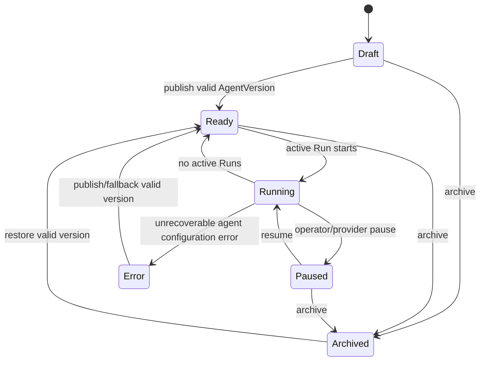
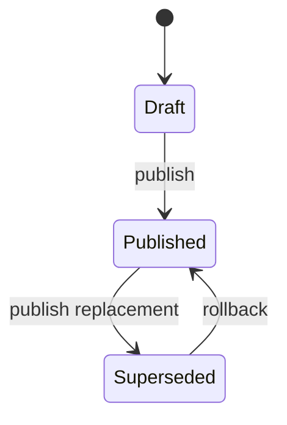
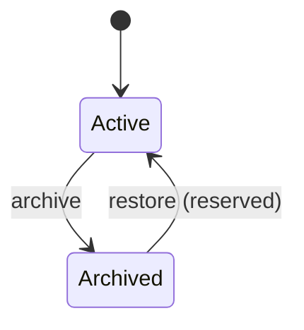
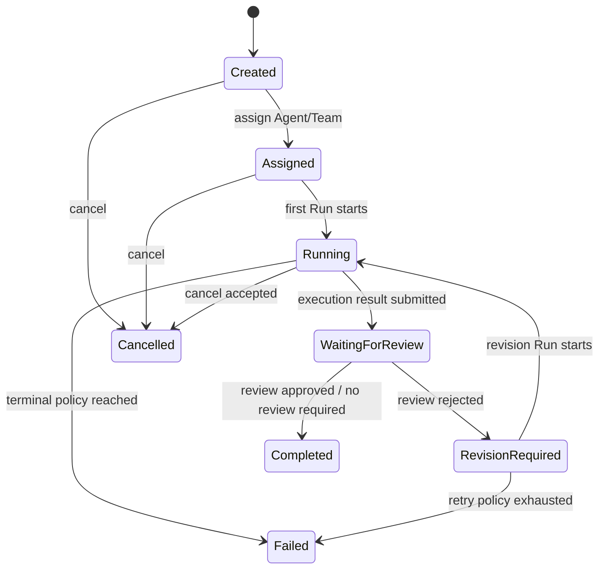
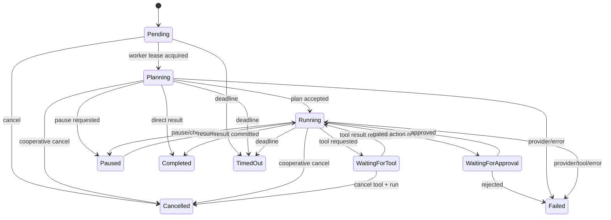
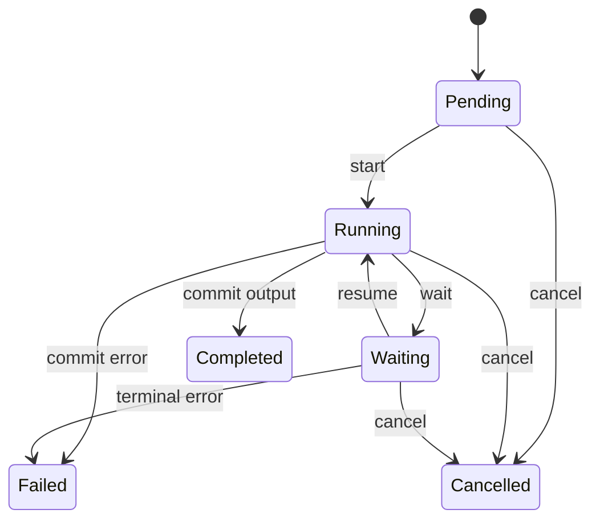
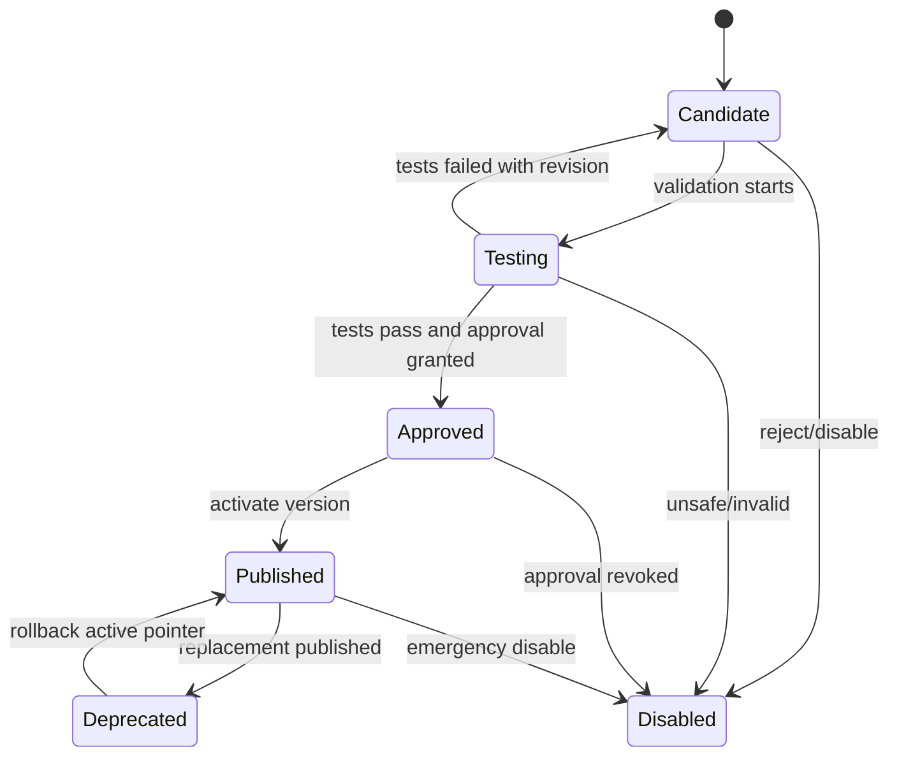

# 状态机基线

状态值在领域枚举中定义，API 不接受未知字符串。每次转换必须校验触发者、前置条件和租户权限，并在同一事务追加 Event 与 AuditRecord。

## Agent

Agent 的 Running 是派生/协调状态，不授权调用工具；Run 和 Tool Policy 才是执行权限来源。

## AgentVersion

发布后的配置行不提供修改 API；回滚重新激活既有不可变版本。

## Project

Goal C API 实现创建、读取、更新与归档；恢复转换已在领域规则中保留，尚未开放路由。

## Task

## Run

所有终态不可逆。Failed/TimedOut 的 Retry 创建新的 Pending Run，不把旧 Run 改回 Running；Cancelled 同时终止 Task，不可重试。

## RunStep

Completed、Failed、Cancelled 都是不可逆终态。RunStep 的状态、输出/错误、时间戳、Event 和 AuditRecord 在同一事务提交。

## Skill

## 审批

`Requested -> Approved | Rejected | Cancelled | Expired`。终态不可变；重新申请创建新 Approval。

## 共同转换规则

- 客户端提交 `expected_revision` 防止并发覆盖。
- 转换函数返回领域 Event；Repository 负责与状态原子持久化。
- 非法转换返回稳定错误码 `INVALID_STATE_TRANSITION`，不得静默修正。
- 运行中 Worker 失联不立即改变 Run；租约过期后由恢复器决定重新领取或 Failed。
- 状态机变更必须同步更新本文件、迁移、API Schema、SDK 和测试。
