# 状态机

状态值在领域枚举中定义，API 不接受未知字符串。每次转换必须校验触发者、前置条件和租户权限，并在同一事务追加 Event 与 AuditRecord。

## Agent

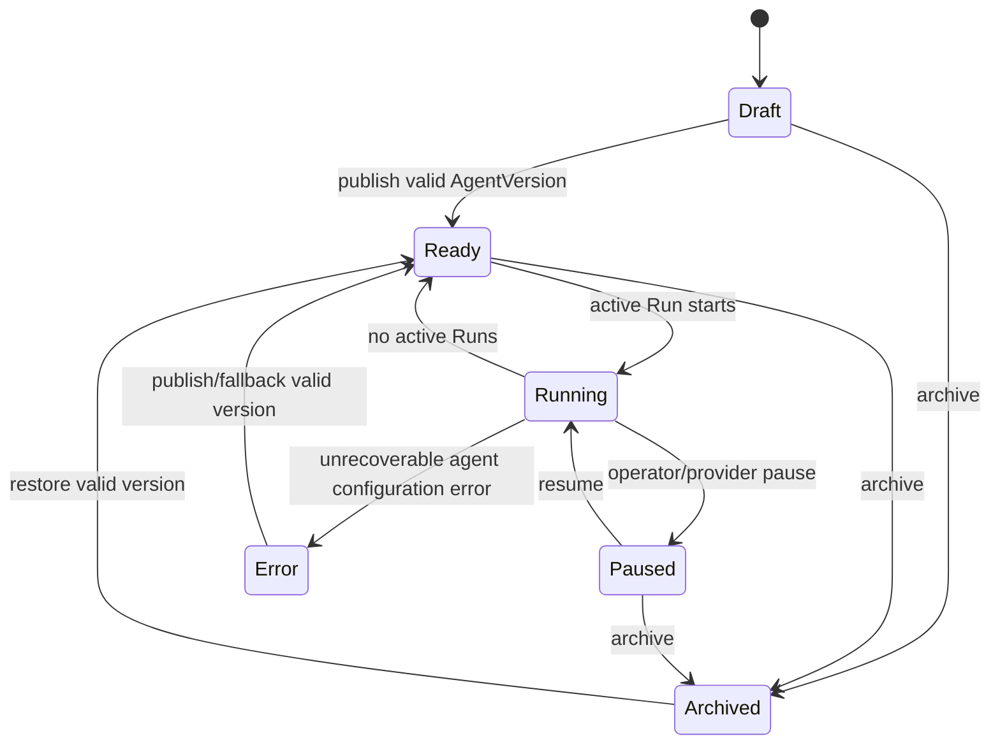

Agent 的 Running 是派生/协调状态，不授权调用工具；Run 和 Tool Policy 才是执行权限来源。

## AgentVersion

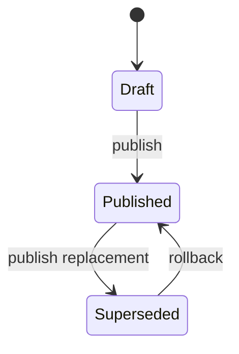

发布后的配置行不提供修改 API；回滚重新激活既有不可变版本。

## Project

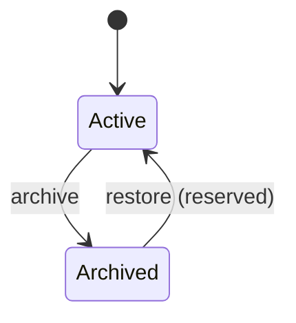

API 实现创建、读取、更新与归档。`Archived -> Active` 已由领域规则保留，但当前没有 Project 恢复路由。

## Conversation 与 ConversationTurn

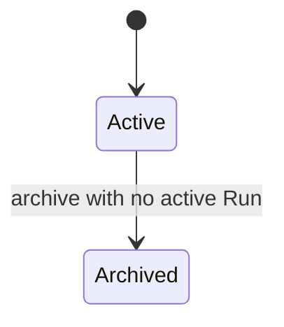

Conversation 归档后不可重新激活，也不能创建新 Turn；历史仍可读取。Conversation 创建时固定一个 Published AgentVersion。该版本之后变为 Superseded 仍可供旧会话执行，但 Agent 必须保持 Ready；不得静默切换到当前版本。

ConversationTurn 是 Run 状态的持久化投影，不是独立的执行状态机：

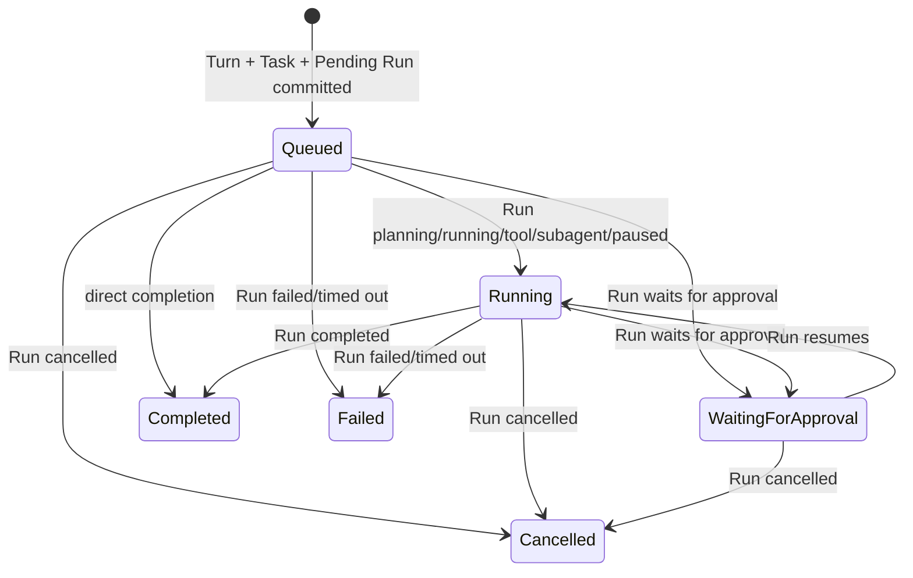

Run 是权威事实。数据库投影在同一事务把终态 output、usage、error 和 artifact refs 写入 Turn；取消调用统一 Run 树取消服务。Failed/TimedOut 的最新 Turn 可用 Run ID + revision 创建新 attempt，Turn 原子切换到该 Run 并保持冻结 AgentVersion；Cancelled 不可重试。一个 Conversation 同时只允许一个非终态 Run，Turn、Task、首次 Run 与相关 Event/Audit 在一个事务提交。

## Task

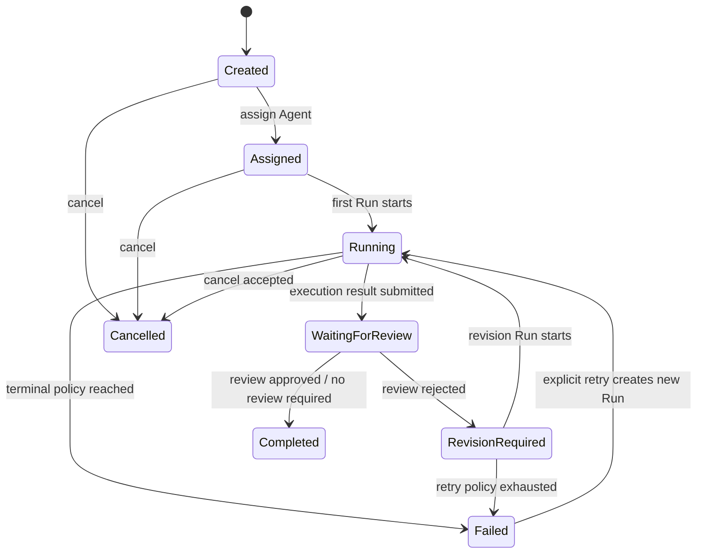

## Run

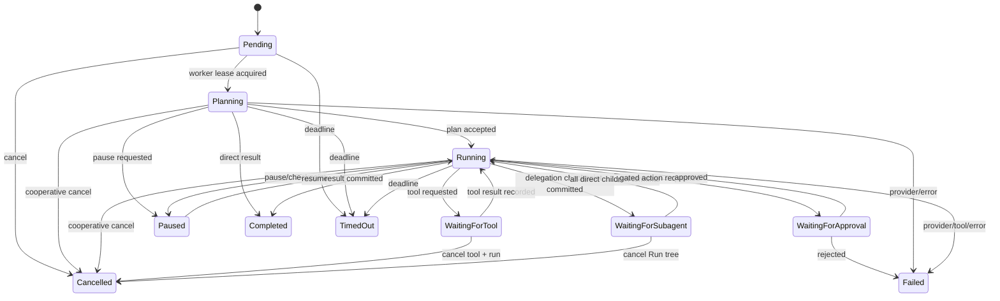

所有终态不可逆。Failed/TimedOut 的 Retry 创建新的 Pending Run，不把旧 Run 改回 Running；Cancelled 同时终止 Task，不可重试。

## RunStep

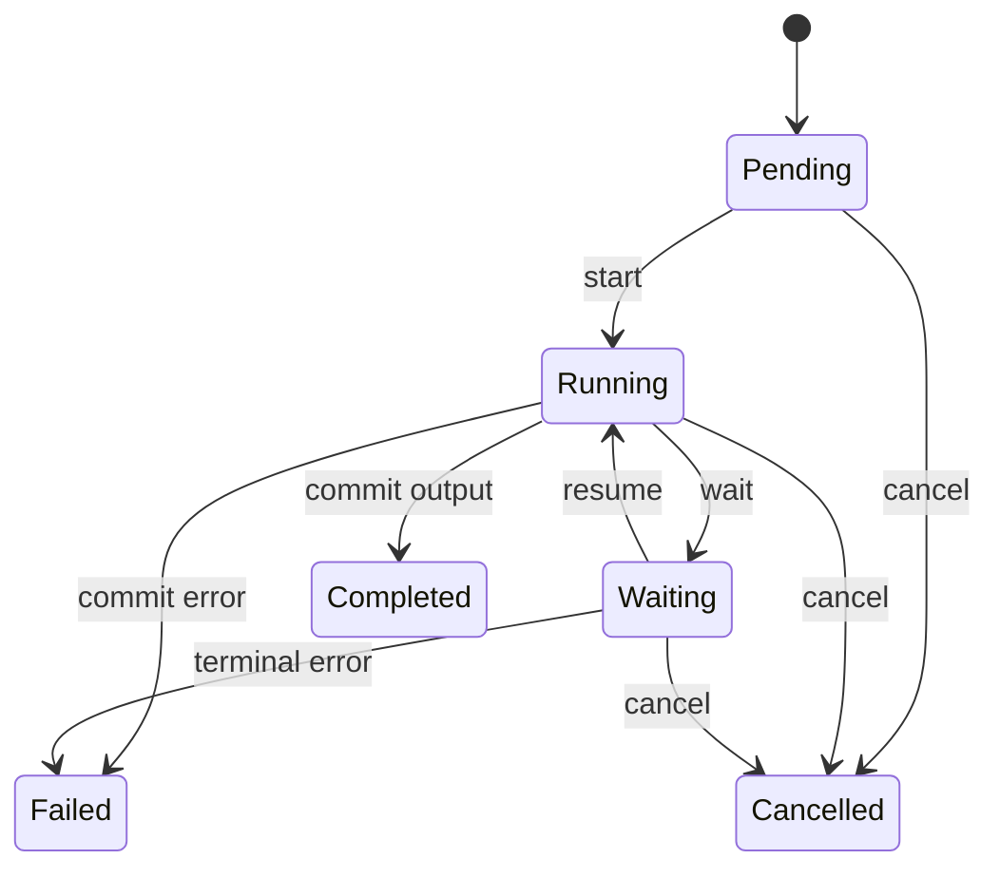

Completed、Failed、Cancelled 都是不可逆终态。RunStep 的状态、输出/错误、时间戳、Event 和 AuditRecord 在同一事务提交。

## Plan 与 PlanStep

Plan revision 使用 `Active -> Superseded | Completed | Failed`。目标、步骤、依赖、revision、来源 ModelCall 和 content hash 在创建后不可修改；需要修正时必须追加下一 revision。Superseded、Completed、Failed 都是不可逆终态。

PlanStep 使用 `Pending -> Running -> Completed`，验证失败时本次 RunStep 终结为 Failed，而 PlanStep 在 Reflection 决定前保留可恢复执行状态；若 Plan 被 Replan/Supersede，未完成 PlanStep 终结为 Failed。PlanStep 定义不可修改，已终结步骤不可覆盖。Reflection 和 Completion 不复用 Growth 域的 Evaluation，而是追加独立、不可修改的 RuntimeEvaluation。

## Delegation、Message 与 Artifact

Delegation 使用 `Proposed -> Accepted -> Running -> Completed|Failed|Cancelled`；也可从 Proposed 进入 Rejected/Cancelled。目标、父子 Run、预算、策略、权限快照和幂等指纹创建后不可改写，任何终态不可修改或删除。

AgentMessage 使用 `Queued -> Delivered -> Acknowledged`。Result 在 Child 终结事务中入队，Parent 恢复读取后确认；Cancel/SystemNotice 可直接 Delivered。消息正文有界，大内容只保留 Artifact 引用。

Artifact 使用 `Uploading -> Available|Failed`。Available 必须同时具备 SHA-256、size 和私有 object key，终态元数据不可改写。SharedArtifactLink 首版只允许 Child 向直接 Parent 授予 Active 链接；下载时再次校验状态、到期时间与 Run 可见性。

## Skill

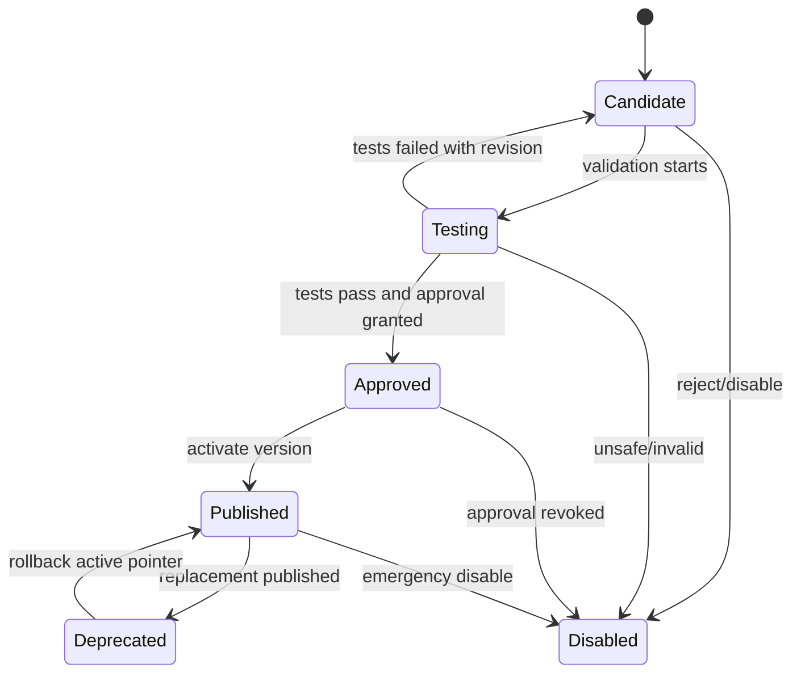

SkillVersion 使用更严格的不可变版本状态：

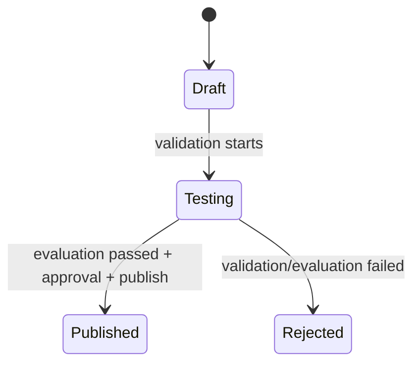

Rejected 的修订创建新 Draft 版本；Published 行不可更新。Skill 的 `Approved` 表示已有绑定 content hash 的通过 Evaluation 和 Approval，但尚未激活。灰度 deployment 不改变 SkillVersion 状态；推广或回滚只切换 active pointer/退役 deployment。

## Memory

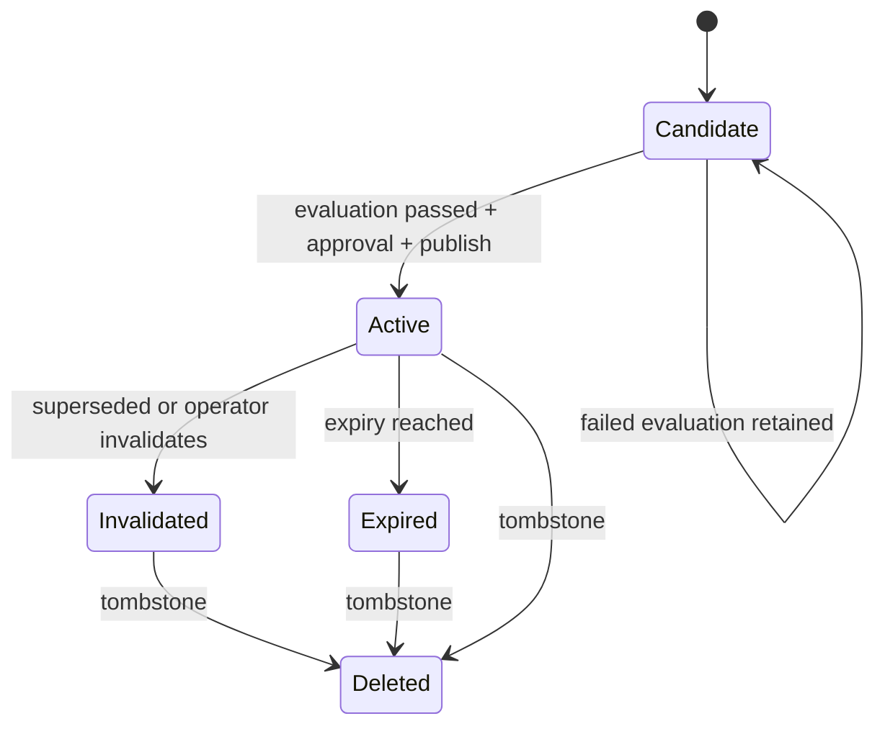

Candidate 不进入正式召回。内容修订创建同一 logical key 的新 Candidate 版本；Active/Invalidated/Expired/Deleted 的内容与来源不可改写。工作记忆必须有过期时间。`team` 是保留的枚举值，但 Nico core 不实现 Team 归属，因此该 scope 失败关闭。

## 成长发布审批

`Requested -> Approved | Rejected | Cancelled | Expired`。终态不可变；重新申请创建新 Approval。

## 工具执行审批

ToolApprovalRequest 与 Memory/Skill 的成长发布 Approval 是不同聚合：

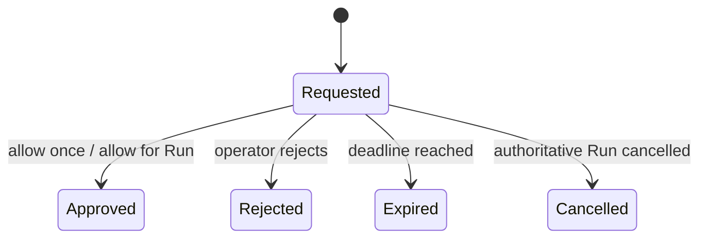

Approved 必须保存 `once` 或 `run` scope；其余终态 scope 为 `none`。终态行不可再次修改，决定使用 revision 和幂等键。requested 对应 Pending ToolCall、Waiting RunStep 与 `waiting_for_approval` Run；终态决定唤醒 Run，Worker 从已保存 checkpoint 恢复。

## 共同转换规则

- 客户端提交 `expected_revision` 防止并发覆盖。
- 转换函数返回领域 Event；Repository 负责与状态原子持久化。
- 非法转换返回稳定错误码 `INVALID_STATE_TRANSITION`，不得静默修正。
- 运行中 Worker 失联不立即改变 Run；租约过期后，新 Worker 只有在 Provider 声明 resume 且持久化 RuntimeSession 可用时恢复，否则稳定转为 Failed。
- 首次领取时按 AgentVersion 显式 Provider 选择执行器；历史数据才使用有弃用期的 legacy resolver，并写入 Event/Audit telemetry。
- 恢复时以 RuntimeSession 中的 Provider/version/protocol 为权威事实；Adapter 未启用、缺失或不兼容时失败关闭，不得切换到 Nico Native。
- 状态机变更必须同步更新本文件、迁移、API Schema 和测试。
